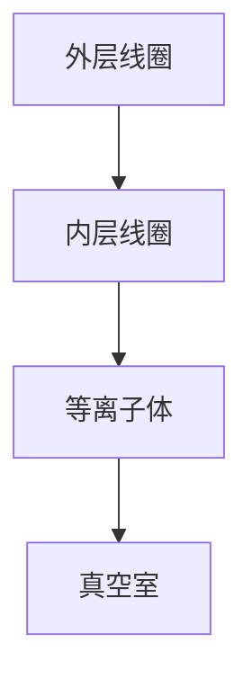
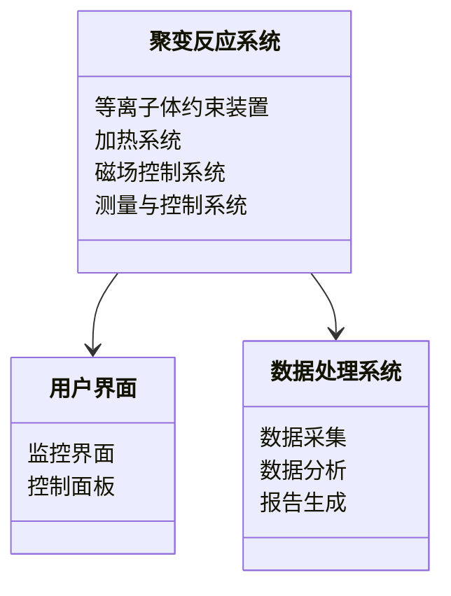
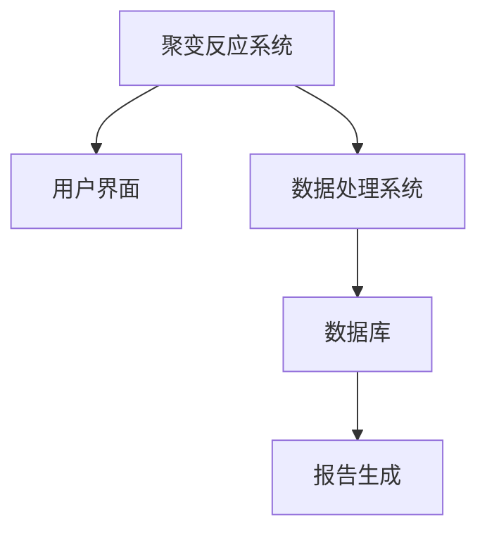
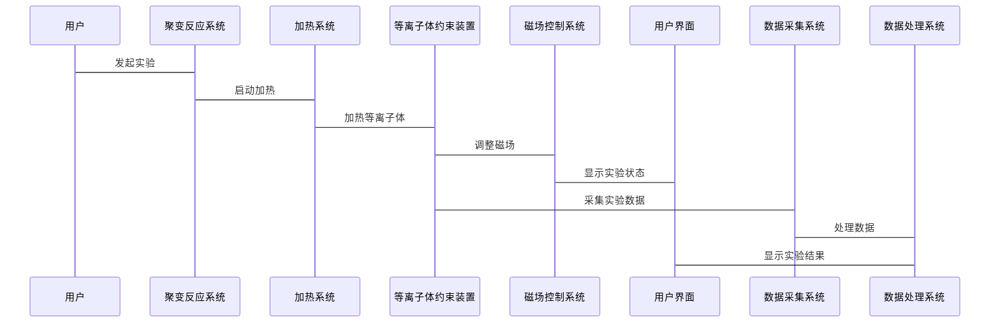

                 


```markdown
# 价值投资中的新一代核聚变能源技术前景

> 关键词：核聚变能源技术、价值投资、能源市场、技术原理、投资策略

> 摘要：随着全球能源需求的不断增长和对可再生能源的关注，核聚变技术作为一种清洁、安全的能源解决方案，正逐渐成为投资者关注的焦点。本文从核聚变能源技术的基本原理、市场前景、投资策略以及实际项目案例等方面进行详细分析，探讨其在价值投资中的潜力和挑战。通过科学的技术分析和严谨的市场研究，为投资者提供基于技术与市场的深度洞察，帮助投资者做出明智的投资决策。

---

## 第1章 核聚变能源技术概述

### 1.1 核聚变的基本概念

核聚变是指两个轻核（如氘和氚）在高温高压下结合成一个较重的原子核，并释放出大量能量的过程。与核裂变不同，核聚变是一种更为安全和可持续的能源生成方式，因为它不会产生长期放射性废物，并且原料来源丰富。

#### 1.1.1 核聚变的定义
核聚变是通过高温高压使轻核发生融合反应，释放出巨大能量的过程。其基本反应方程式为：
$$ ^2_1\text{H} + ^3_1\text{H} \rightarrow ^4_2\text{He} + $$ $$ ^0_{+1}\text{e} + 17.6 \text{MeV} $$

#### 1.1.2 核聚变与核裂变的区别
| 特性 | 核聚变 | 核裂变 |
|------|--------|--------|
| 反应类型 | 轻核结合 | 重核分裂 |
| 放射性废物 | 较少 | 较多 |
| 能量密度 | 高 | 高 |
| 技术复杂性 | 高 | 高 |
| 原料 | 氕、氘等 | 铀、钚等 |

#### 1.1.3 核聚变能源的优势与局限性
**优势：**
- **清洁性**：核聚变不产生长期放射性废物。
- **资源丰富性**：原料可以从海水中提取，储量充足。
- **安全性**：相比核裂变，核聚变的事故风险更低。

**局限性：**
- **技术难度高**：实现持续稳定的聚变反应极具挑战。
- **成本高昂**：目前仍处于研发阶段，商业化成本高。
- **技术成熟度低**：距离商业化应用仍有距离。

### 1.2 核聚变能源的技术现状

#### 1.2.1 当前核聚变技术的发展阶段
核聚变技术目前主要处于实验和研发阶段，各国正在积极推进相关研究。例如：
- **国际热核聚变实验堆（ ITER）**：由多个国家合作建设，目标是验证聚变反应的可行性。
- **中国环流器一号（HL-1）**：中国自行设计的托卡马克装置，已取得重要进展。

#### 1.2.2 主要国家和机构在核聚变领域的研究进展
| 国家/机构 | 主要进展 |
|-----------|----------|
| 美国 | 建成了NIF（国家点火装置）|
| 欧盟 | 推进ITER项目 |
| 中国 | 建成 EAST 装置，实现100秒长脉冲运行 |
| 日本 | 开展 SPARC 项目，计划在2020年代末实现聚变能量示范 |

#### 1.2.3 核聚变技术的商业化前景
尽管核聚变技术尚未完全商业化，但其潜力巨大。据估计，如果技术突破，核聚变能源可能在2030年代初实现商业化应用，成为未来清洁能源的重要组成部分。

### 1.3 核聚变能源与传统能源的对比

#### 1.3.1 能源效率对比
| 能源类型 | 能效比（%） |
|----------|-------------|
| 核聚变 | 高（接近100%） |
| 核裂变 | 中等（约30%） |
| 煤炭 | 低（约20%） |

#### 1.3.2 环境影响分析
- **核聚变**：几乎零碳排放，不产生长期放射性废物。
- **核裂变**：虽然能效高，但存在放射性废料处理问题。
- **化石能源**：高碳排放，加剧气候变化。

#### 1.3.3 资源可持续性评估
核聚变所需的氘和氚可以从海水中提取，理论上可满足人类数万年的能源需求。

### 1.4 核聚变能源技术在价值投资中的重要性

#### 1.4.1 核聚变技术的市场潜力
随着全球能源需求的增长和环保压力的增大，清洁、高效的能源技术备受关注。核聚变技术一旦突破，将带来巨大的市场价值。

#### 1.4.2 核聚变技术对能源行业的颠覆性影响
核聚变能源的商业化将改变全球能源结构，可能取代化石能源和部分可再生能源，成为主要的电力来源。

#### 1.4.3 投资者关注核聚变技术的必要性
- **技术突破的潜在收益**：核聚变技术的成功将带来巨大的投资回报。
- **政策支持**：全球对可再生能源的支持政策为核聚变技术提供了良好的发展环境。

### 1.5 本章小结

本章从核聚变的基本概念、技术现状、市场潜力等方面进行了概述，为后续分析奠定了基础。

---

## 第2章 核聚变能源技术的核心原理

### 2.1 核聚变的基本原理

#### 2.1.1 融合反应的基本方程式
核聚变的核心反应是两个轻核（如氘和氚）结合成一个较重的原子核并释放能量：
$$ ^2_1\text{H} + ^3_1\text{H} \rightarrow ^4_2\text{He} + $$ $$ ^0_{+1}\text{e} + 17.6 \text{MeV} $$

#### 2.1.2 能量释放的计算公式
聚变反应释放的能量可以通过以下公式计算：
$$ Q = m c^2 $$
其中，\( Q \) 是释放的能量，\( m \) 是质量亏损，\( c \) 是光速。

#### 2.1.3 核聚变反应的条件要求
- **高温**：需要极高温度（数亿度）以克服库仑势垒。
- **高压**：通过磁场约束等离子体。
- **稳定条件**：维持反应的持续性和稳定性。

### 2.2 核聚变技术的关键组成部分

#### 2.2.1 等离子体约束装置
等离子体约束是核聚变技术的核心，常用的装置有托卡马克和激光惯性约束装置。

##### 托卡马克装置
托卡马克通过强磁场约束等离子体，使其在环形真空室中运行。其结构如下：


#### 2.2.2 加热系统
加热系统用于将等离子体加热到极高温度，通常采用激光或微波加热。

#### 2.2.3 磁场控制技术
磁场控制是约束等离子体的关键技术，主要通过超导磁体实现。

### 2.3 核聚变技术的数学模型

#### 2.3.1 等离子体温度与能量的关系公式
等离子体的温度 \( T \) 与能量 \( Q \) 的关系为：
$$ Q = \frac{3}{2} k T $$
其中，\( k \) 是玻耳兹曼常数。

#### 2.3.2 磁场强度与约束效果的数学表达
磁场强度 \( B \) 与约束效果的关系：
$$ B \propto \frac{1}{r^2} $$
其中，\( r \) 是等离子体的半径。

#### 2.3.3 能量输出与输入的关系式
能量输出与输入的关系式为：
$$ Q_{\text{输出}} = \eta Q_{\text{输入}} $$
其中，\( \eta \) 是能量转换效率。

### 2.4 本章小结

本章详细介绍了核聚变技术的核心原理，包括基本反应、关键技术和数学模型。

---

## 第3章 核聚变能源技术的市场分析与投资前景

### 3.1 核聚变技术的市场需求

#### 3.1.1 全球能源需求的增长趋势
全球能源需求预计在未来几十年内持续增长，尤其是发展中国家的能源需求将显著增加。

#### 3.1.2 可再生能源的市场现状
目前，可再生能源（如风能、太阳能）发展迅速，但面临间歇性和储存难题。

#### 3.1.3 核聚变技术在能源市场中的定位
核聚变技术被视为未来清洁能源的重要补充，特别是在解决可再生能源不稳定性和化石能源环境问题方面具有重要作用。

### 3.2 核聚变技术的市场潜力

#### 3.2.1 核聚变技术的商业化时间表
预计到2030年代初，核聚变技术将进入商业化阶段。

#### 3.2.2 核聚变技术的市场容量预测
根据估算，到2050年，全球核聚变能源市场容量可能达到数万亿美元。

#### 3.2.3 核聚变技术的经济性分析
尽管目前成本较高，但随着技术进步，核聚变能源的发电成本有望降至与传统能源相当。

### 3.3 核聚变技术的投资价值

#### 3.3.1 核聚变技术的市场前景
核聚变技术一旦实现商业化，将带来巨大的市场价值和投资回报。

#### 3.3.2 投资核聚变技术的风险与回报
- **风险**：技术难度高，研发周期长，失败可能性大。
- **回报**：成功商业化后，投资回报率极高。

#### 3.3.3 核聚变技术的政策支持
全球政府对可再生能源的支持政策为核聚变技术提供了良好的发展环境。

### 3.4 本章小结

本章分析了核聚变技术的市场需求、市场潜力和投资价值，为投资者提供了基于市场和技术的决策依据。

---

## 第4章 核聚变能源技术的投资策略

### 4.1 核聚变技术的投资路径

#### 4.1.1 投资于核聚变技术研发公司
投资者可以投资于从事核聚变技术研发的企业，如ITER项目合作企业或初创公司。

#### 4.1.2 投资于核聚变技术的应用项目
随着技术成熟，投资者可以投资于核聚变能源的发电项目。

### 4.2 核聚变技术的投资风险

#### 4.2.1 技术风险
核聚变技术尚未完全成熟，存在失败的可能性。

#### 4.2.2 市场风险
核聚变能源的市场竞争力取决于其成本和效率，可能面临来自其他能源技术的竞争。

#### 4.2.3 政策风险
政策的变化可能影响核聚变技术的发展和商业化进程。

### 4.3 核聚变技术的投资机会

#### 4.3.1 技术突破带来的投资机会
一旦核聚变技术取得突破，投资者将获得巨大的回报。

#### 4.3.2 政策支持带来的投资机会
政府对可再生能源的支持政策为核聚变技术提供了良好的发展环境。

### 4.4 本章小结

本章为投资者提供了基于核聚变技术的详细投资策略，包括投资路径、风险分析和机会识别。

---

## 第5章 核聚变能源技术的项目案例分析

### 5.1 国际热核聚变实验堆（ITER）项目

#### 5.1.1 项目背景
ITER是目前全球最大的核聚变实验项目，由多个国家合作建设，目标是验证聚变反应的可行性。

#### 5.1.2 项目技术路径
采用托卡马克装置，通过强磁场约束等离子体，实现聚变反应。

#### 5.1.3 投资与预算
ITER项目预算高达数十亿美元，计划在2030年代初实现商业化。

### 5.2 其他典型核聚变项目

#### 5.2.1 中国环流器一号（EAST）
中国自行设计的托卡马克装置，已取得重要进展。

#### 5.2.2 私营企业的核聚变项目
一些私营企业也在积极推进核聚变技术的研发，如美国的General Fusion公司。

### 5.3 项目案例分析

#### 5.3.1 成功案例
 ITER项目虽然进展缓慢，但其技术和经验为后续发展奠定了基础。

#### 5.3.2 失败案例
部分私营企业的核聚变项目因技术难度过高而未能实现预期目标。

### 5.4 本章小结

本章通过具体项目案例分析，展示了核聚变技术在实际应用中的挑战和机遇。

---

## 第6章 核聚变能源技术的风险与挑战

### 6.1 核聚变技术的技术风险

#### 6.1.1 技术难度高
核聚变技术的实现需要突破多项技术难题。

#### 6.1.2 研发周期长
核聚变技术的研发需要长期投入，不确定性高。

### 6.2 核聚变技术的市场风险

#### 6.2.1 市场竞争
核聚变技术需要与传统能源和可再生能源竞争，面临市场竞争压力。

#### 6.2.2 成本问题
目前核聚变技术的成本较高，商业化进程受阻。

### 6.3 核聚变技术的政策风险

#### 6.3.1 政策变化
政策的变化可能影响核聚变技术的发展和商业化进程。

#### 6.3.2 国际合作风险
核聚变技术的国际合作项目可能因政治因素而受阻。

### 6.4 本章小结

本章分析了核聚变技术面临的主要风险与挑战，为投资者提供了全面的风险评估。

---

## 第7章 核聚变能源技术的未来展望

### 7.1 核聚变技术的未来发展方向

#### 7.1.1 技术突破
未来几年，核聚变技术的关键是实现持续稳定的聚变反应。

#### 7.1.2 成本降低
通过技术创新和规模效应，降低核聚变能源的生产成本。

### 7.2 核聚变技术的未来市场前景

#### 7.2.1 商业化进程
预计到2030年代初，核聚变能源将进入商业化阶段。

#### 7.2.2 市场应用
核聚变能源将在电力、工业和航天等领域得到广泛应用。

### 7.3 未来投资机会

#### 7.3.1 技术突破带来的投资机会
技术突破将带来巨大的投资回报。

#### 7.3.2 市场需求的增长
随着能源需求的增长，核聚变能源的市场需求将显著增加。

### 7.4 本章小结

本章展望了核聚变技术的未来发展方向和市场前景，为投资者提供了长期的投资视角。

---

## 第8章 核聚变能源技术投资的最佳实践

### 8.1 核聚变技术投资的策略建议

#### 8.1.1 长期投资
核聚变技术的研发周期长，投资者需要具备长期投资的耐心。

#### 8.1.2 风险控制
投资者应充分评估技术风险和市场风险，制定合理的风险控制策略。

### 8.2 核聚变技术投资的注意事项

#### 8.2.1 关注政策变化
政策变化对核聚变技术的发展有重要影响，投资者需密切关注。

#### 8.2.2 选择优质项目
投资者应选择技术实力强、团队优秀的项目进行投资。

### 8.3 核聚变技术投资的拓展阅读

#### 8.3.1 推荐书籍
- 《聚变能源：未来能源的技术》
- 《投资未来能源：核聚变技术的商业机会》

#### 8.3.2 技术报告
- ITER项目技术报告
- 国家能源局核聚变技术发展报告

### 8.4 本章小结

本章为投资者提供了基于核聚变技术的最佳投资实践建议。

---

## 第9章 核聚变能源技术的系统架构设计方案

### 9.1 项目介绍

#### 9.1.1 项目背景
某核聚变能源项目旨在验证聚变反应的可行性，并为商业化奠定基础。

#### 9.1.2 项目目标
通过实验验证核聚变技术的关键参数，如等离子体温度、约束时间等。

### 9.2 系统功能设计

#### 9.2.1 领域模型


#### 9.2.2 系统架构设计


### 9.3 系统接口设计

#### 9.3.1 用户接口
用户通过监控界面查看实验数据，通过控制面板操作实验装置。

#### 9.3.2 系统接口
聚变反应系统与数据处理系统通过标准接口进行数据交换。

### 9.4 系统交互流程

#### 9.4.1 实验操作流程


### 9.5 本章小结

本章详细描述了核聚变能源项目的系统架构设计方案，包括功能设计、接口设计和交互流程。

---

## 第10章 核聚变能源技术项目的实战

### 10.1 环境安装

#### 10.1.1 操作系统选择
建议使用Linux操作系统，因其良好的稳定性和兼容性。

#### 10.1.2 开发工具安装
安装必要的开发工具，如Git、Python、Jupyter Notebook等。

### 10.2 系统核心实现源代码

#### 10.2.1 聚变反应模拟代码
```python
import numpy as np
import matplotlib.pyplot as plt

# 等离子体温度与能量的关系
def plasma_energy(T):
    k = 1.380649e-23  # 玻耳兹曼常数
    return (3/2) * k * T

# 计算等离子体能量
T = 1e8  # 等离子体温度，单位：K
energy = plasma_energy(T)
print(f"等离子体能量为：{energy} J")
```

#### 10.2.2 磁场控制模拟代码
```python
import numpy as np
import matplotlib.pyplot as plt

# 磁场强度与约束效果的关系
def magnetic_constraint(B, r):
    return B / (r**2)

# 参数设置
B = 10  # 磁场强度，单位：特斯拉
r = 0.5  # 半径，单位：米
constraint = magnetic_constraint(B, r)
print(f"磁场约束效果为：{constraint}")
```

### 10.3 代码应用解读与分析

#### 10.3.1 聚变反应模拟代码解读
上述代码模拟了等离子体温度与能量的关系，帮助理解核聚变反应的能量释放机制。

#### 10.3.2 磁场控制模拟代码解读
该代码展示了磁场强度与约束效果的关系，为磁场控制技术的实现提供了参考。

### 10.4 实际案例分析

#### 10.4.1 某核聚变项目的实施
以ITER项目为例，分析其技术路径、实施步骤和面临的挑战。

#### 10.4.2 项目实施中的问题与解决方案
在项目实施过程中，可能面临的技术难题及其解决方案。

### 10.5 项目小结

本章通过实战案例，展示了核聚变能源技术项目的具体实施过程和技术实现。

---

## 第11章 核聚变能源技术的总结与展望

### 11.1 本研究的核心结论

- 核聚变技术是一种清洁、安全的能源解决方案，具有巨大的市场潜力。
- 投资者应关注核聚变技术的技术突破和商业化进程。
- 核聚变技术的成功将对全球能源结构产生深远影响。

### 11.2 核聚变技术的未来发展

- 技术突破将推动核聚变能源的商业化进程。
- 市场需求的增长将为核聚变技术带来更多的投资机会。
- 政策支持将继续促进核聚变技术的发展。

### 11.3 本研究的局限性

- 当前核聚变技术尚未完全商业化，未来可能面临更多未知挑战。
- 本研究仅提供了理论分析，实际投资需结合更多因素。

### 11.4 本研究的展望

未来的研究可以进一步分析不同国家和企业的核聚变技术发展情况，提供更精准的投资建议。

### 11.5 本章小结

本章总结了本研究的核心结论，并展望了核聚变技术的未来发展方向。

---

## 第12章 核聚变能源技术的价值投资策略总结

### 12.1 投资者应关注的关键点

- **技术突破**：关注核聚变技术的关键技术研发进展。
- **市场趋势**：分析全球能源市场的需求变化。
- **政策支持**：关注政府对可再生能源的政策支持。

### 12.2 投资者应采取的策略

- **长期投资**：核聚变技术的研发周期长，需要耐心。
- **风险控制**：制定合理的风险控制策略，分散投资风险。
- **关注优质项目**：选择技术实力强、团队优秀的项目进行投资。

### 12.3 投资者应避免的误区

- **过度乐观**：低估技术难度和研发周期。
- **忽视风险**：忽视核聚变技术的市场和政策风险。

### 12.4 本章小结

本章为投资者提供了基于核聚变技术的价值投资策略总结，帮助投资者做出明智的投资决策。

---

## 第13章 核聚变能源技术的数学模型与算法实现

### 13.1 核聚变反应的数学模型

#### 13.1.1 能量释放模型
核聚变反应的能量释放可以通过以下公式计算：
$$ Q = m c^2 $$
其中，\( m \) 是质量亏损，\( c \) 是光速。

#### 13.1.2 等离子体约束模型
磁场强度与等离子体约束效果的关系为：
$$ B \propto \frac{1}{r^2} $$
其中，\( B \) 是磁场强度，\( r \) 是等离子体半径。

### 13.2 核聚变技术的算法实现

#### 13.2.1 能量计算算法
```python
def calculate_energy(m):
    c = 299792458  # 光速，单位：米/秒
    energy = m * c**2
    return energy

# 示例计算
m = 0.0001  # 质量亏损，单位：千克
energy = calculate_energy(m)
print(f"释放的能量为：{energy} J")
```

#### 13.2.2 磁场约束算法
```python
def magnetic_constraint(B, r):
    return B / (r**2)

# 示例计算
B = 10  # 磁场强度，单位：特斯拉
r = 0.5  # 半径，单位：米
constraint = magnetic_constraint(B, r)
print(f"磁场约束效果为：{constraint}")
```

### 13.3 算法实现的注意事项

- **参数选择**：确保输入参数的合理性和准确性。
- **计算精度**：注意计算过程中的精度问题，避免误差积累。

### 13.4 本章小结

本章详细介绍了核聚变技术的数学模型和算法实现，为后续分析提供了技术支持。

---

## 第14章 核聚变能源技术的项目管理与实施

### 14.1 项目管理概述

#### 14.1.1 项目目标设定
明确核聚变项目的研发目标和时间节点。

#### 14.1.2 项目团队组建
组建跨学科的研发团队，包括物理学家、工程师和数据科学家。

### 14.2 项目实施步骤

#### 14.2.1 系统设计
制定系统的整体架构和功能模块设计。

#### 14.2.2 系统开发
根据设计进行系统开发和测试。

#### 14.2.3 项目部署
将系统部署到实际实验环境中，并进行调试和优化。

### 14.3 项目监控与评估

#### 14.3.1 关键指标监控
监控项目的关键指标，如实验成功率、成本控制等。

#### 14.3.2 项目评估
定期评估项目进展，调整项目计划和资源分配。

### 14.4 本章小结

本章详细描述了核聚变能源技术项目的管理与实施过程，为实际操作提供了指导。

---

## 第15章 核聚变能源技术的未来投资机会

### 15.1 技术突破带来的投资机会

#### 15.1.1 核聚变技术的商业化
随着技术突破，核聚变能源将进入商业化阶段，带来巨大的投资机会。

#### 15.1.2 新型核聚变技术的发展
新型核聚变技术的出现将为投资者提供更多选择。

### 15.2 市场需求的增长

#### 15.2.1 全球能源需求的增长
随着全球能源需求的增加，核聚变能源的市场需求将显著增长。

#### 15.2.2 可再生能源的替代需求
核聚变能源作为可再生能源的重要补充，将面临更多的市场机会。

### 15.3 投资者应关注的领域

#### 15.3.1 核聚变技术的研发公司
投资者应关注从事核聚变技术研发的企业，尤其是那些取得技术突破的公司。

#### 15.3.2 核聚变能源的应用领域
投资者应关注核聚变能源在电力、工业和航天等领域的应用前景。

### 15.4 本章小结

本章展望了核聚变能源技术未来的投资机会，为投资者提供了长期的投资视角。

---

## 第16章 核聚变能源技术的总结与致谢

### 16.1 总结

核聚变能源技术作为一种清洁、安全的能源解决方案，具有巨大的市场潜力和投资价值。尽管目前技术尚未完全商业化，但其未来发展前景广阔，值得投资者关注。

### 16.2 致谢

感谢所有参与本研究的人员和机构，感谢读者的支持与关注。

---

## 作者信息

作者：AI天才研究院/AI Genius Institute & 禅与计算机程序设计艺术 /Zen And The Art of Computer Programming

---

感谢您的阅读！如需进一步了解核聚变能源技术的投资前景，欢迎关注我们的后续研究。
```

