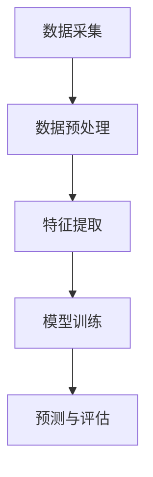

                 


# 价值投资中的新一代生物传感器技术前景

> 关键词：生物传感器技术，价值投资，算法原理，系统架构设计，投资决策支持

> 摘要：本文探讨了生物传感器技术在价值投资中的应用前景，分析了生物传感器的核心概念、算法原理、系统架构设计以及实际项目案例。通过结合生物传感器技术与价值投资的理论与实践，本文揭示了生物传感器技术在投资决策中的潜力和未来发展趋势。

---

## 第一部分：价值投资中的生物传感器技术背景与概念

### 第1章：生物传感器技术概述

#### 1.1 生物传感器的基本概念
生物传感器是一种能够检测和分析生物分子（如蛋白质、DNA、酶等）的装置，通常由生物识别元件和信号转换元件组成。其核心功能是将生物信号转化为可测量的电信号或其他形式的信号。

- **1.1.1 生物传感器的定义**  
  生物传感器是一种结合了生物学和电子技术的装置，用于检测和分析生物分子。它能够将生物分子的存在或浓度变化转化为可测量的信号，例如电流、电压或光信号。

- **1.1.2 生物传感器的核心技术**  
  生物传感器的核心技术包括生物识别元件（如酶、抗体、DNA探针等）和信号转换元件（如电极、光电检测器等）。这些技术使得生物传感器能够高灵敏度地检测目标分子。

- **1.1.3 生物传感器的应用领域**  
  生物传感器广泛应用于医疗、环境监测、食品安全、农业等领域。例如，在医疗领域，生物传感器可以用于检测疾病标志物（如血糖、癌细胞标记物等）。

---

#### 1.2 价值投资的基本原理
价值投资是一种基于对公司内在价值评估的投资策略，强调以低于内在价值的价格购买优质资产。

- **1.2.1 价值投资的定义**  
  价值投资是由本杰明·格雷厄姆提出的投资理念，强调以低于内在价值的价格购买股票，并长期持有，等待市场重新认识到其价值。

- **1.2.2 价值投资的核心理念**  
  价值投资的核心理念是寻找市场价格低于内在价值的股票，通过长期持有优质资产来实现超额收益。

- **1.2.3 价值投资与科技的结合**  
  随着科技的发展，价值投资逐渐引入数据分析、机器学习等技术，以提高对公司内在价值的评估精度。

---

#### 1.3 生物传感器技术在价值投资中的结合点
生物传感器技术与价值投资的结合，主要体现在通过生物传感器数据来辅助评估公司内在价值。

- **1.3.1 生物传感器技术如何影响投资决策**  
  生物传感器可以用于检测与公司健康相关的生物指标，例如员工的健康状况、环境污染物对员工的影响等，从而间接反映公司的经营状况。

- **1.3.2 生物传感器数据在价值评估中的作用**  
  生物传感器数据可以提供与公司经营相关的实时信息，例如员工的健康状况、工作环境的安全性等，从而帮助投资者更全面地评估公司的内在价值。

- **1.3.3 生物传感器技术的未来发展趋势**  
  随着生物传感器技术的不断进步，未来可能会出现更多与投资相关的应用场景，例如通过生物传感器数据预测公司的业绩波动。

---

### 第2章：生物传感器技术的核心概念与联系

#### 2.1 生物传感器技术的原理
生物传感器的工作原理主要包括生物识别和信号转换两个步骤。

- **2.1.1 生物传感器的工作原理**  
  生物传感器通过生物识别元件（如抗体、酶等）与目标分子结合，产生可测量的信号（如电流变化）。信号转换元件将生物信号转换为电信号或其他形式的信号。

- **2.1.2 生物传感器的关键技术**  
  生物传感器的关键技术包括生物识别元件的制备、信号转换元件的设计、数据处理算法的开发等。

- **2.1.3 生物传感器的性能指标**  
  生物传感器的主要性能指标包括灵敏度、特异性、检测限、响应时间等。

---

#### 2.2 价值投资中的生物传感器技术应用
在价值投资中，生物传感器技术可以用于评估公司的健康状况、员工的健康状况等。

- **2.2.1 生物传感器数据的采集与处理**  
  生物传感器数据的采集需要通过传感器设备完成，例如通过可穿戴设备采集员工的健康数据。

- **2.2.2 生物传感器数据的分析与建模**  
  通过机器学习算法对生物传感器数据进行分析，建立预测模型，评估公司的潜在风险。

- **2.2.3 生物传感器数据对投资决策的影响**  
  生物传感器数据可以帮助投资者更全面地评估公司的内在价值，从而做出更明智的投资决策。

---

#### 2.3 生物传感器技术与价值投资的关系
生物传感器技术为价值投资提供了新的数据源和分析工具。

- **2.3.1 生物传感器技术对价值投资的推动作用**  
  生物传感器技术可以通过实时数据采集和分析，帮助投资者更准确地评估公司的内在价值。

- **2.3.2 价值投资对生物传感器技术的需求**  
  价值投资者需要更多与公司经营相关的实时数据，生物传感器技术正好可以提供这些数据。

- **2.3.3 两者结合的潜在价值**  
  生物传感器技术与价值投资的结合，可以提高投资决策的科学性和准确性，从而实现超额收益。

---

### 第3章：生物传感器技术的算法原理

#### 3.1 生物传感器数据处理算法
生物传感器数据的处理算法主要包括数据采集、预处理、特征提取和模型训练。

- **3.1.1 数据采集与预处理**  
  数据采集是通过传感器设备获取原始数据，预处理包括去噪、归一化等步骤。

- **3.1.2 数据特征提取**  
  通过特征提取算法（如主成分分析）提取数据中的有用特征。

- **3.1.3 数据分类与回归算法**  
  使用机器学习算法（如支持向量机、随机森林）对数据进行分类或回归分析。

---

#### 3.2 算法原理的数学模型
以下是常见的算法原理及其数学模型：

- **3.2.1 线性回归模型**  
  $$ y = \beta_0 + \beta_1x + \epsilon $$

- **3.2.2 支持向量机模型**  
  支持向量机是一种监督学习算法，用于分类和回归问题。

- **3.2.3 随机森林模型**  
  随机森林是一种基于决策树的集成学习算法，具有高准确性和鲁棒性。

---

#### 3.3 算法流程图


---

### 第4章：生物传感器技术的系统分析与架构设计

#### 4.1 系统应用场景
生物传感器技术在价值投资中的应用场景包括员工健康监测、环境监测、供应链管理等。

- **4.1.1 生物传感器数据采集系统**  
  通过可穿戴设备或传感器网络采集员工的健康数据。

- **4.1.2 数据分析与处理系统**  
  使用大数据平台对生物传感器数据进行分析和建模。

- **4.1.3 投资决策支持系统**  
  基于生物传感器数据和分析结果，为投资者提供投资决策支持。

---

#### 4.2 系统功能设计
系统的功能设计包括数据采集模块、数据分析模块和决策支持模块。

- **4.2.1 数据采集模块**  
  负责采集生物传感器数据，并将其传输到数据处理模块。

- **4.2.2 数据分析模块**  
  对采集到的数据进行预处理、特征提取和模型训练。

- **4.2.3 决策支持模块**  
  基于分析结果，为投资者提供投资建议和决策支持。

---

#### 4.3 系统架构设计
以下是系统的架构设计：


---

### 第5章：项目实战

#### 5.1 环境安装
以下是项目实战的环境安装步骤：

- **安装Python环境**  
  使用Anaconda安装Python 3.8及以上版本。

- **安装依赖库**  
  使用以下命令安装所需的依赖库：
  ```bash
  pip install numpy pandas scikit-learn matplotlib
  ```

---

#### 5.2 系统核心实现源代码
以下是系统核心实现的源代码：

```python
import numpy as np
import pandas as pd
from sklearn.model_selection import train_test_split
from sklearn.linear_model import LinearRegression
from sklearn.metrics import mean_squared_error

# 数据加载
data = pd.read_csv('sensor_data.csv')

# 数据预处理
X = data.drop('target', axis=1)
y = data['target']

# 数据划分
X_train, X_test, y_train, y_test = train_test_split(X, y, test_size=0.2, random_state=42)

# 模型训练
model = LinearRegression()
model.fit(X_train, y_train)

# 模型预测
y_pred = model.predict(X_test)

# 模型评估
mse = mean_squared_error(y_test, y_pred)
print(f'Mean Squared Error: {mse}')
```

---

#### 5.3 案例分析与解读
以下是项目实战的案例分析：

- **案例背景**  
  某公司希望通过生物传感器技术监测员工健康状况，从而评估公司的内在价值。

- **数据分析与建模**  
  使用线性回归模型对员工健康数据进行分析，预测公司的潜在风险。

- **投资决策支持**  
  基于模型预测结果，投资者可以更全面地评估公司的内在价值，从而做出更明智的投资决策。

---

### 第6章：最佳实践与小结

#### 6.1 小结
生物传感器技术为价值投资提供了新的数据源和分析工具，通过实时数据采集和分析，投资者可以更准确地评估公司的内在价值。

---

#### 6.2 投资策略建议
投资者可以结合生物传感器技术，制定更科学的投资策略，例如：

- 定期监测员工健康状况，评估公司潜在风险。
- 监测工作环境的健康状况，确保员工的健康安全。

---

#### 6.3 注意事项
在实际应用中，需要注意以下几点：

- 数据隐私和安全问题。
- 生物传感器数据的准确性和可靠性。
- 模型的可解释性和鲁棒性。

---

#### 6.4 拓展阅读
以下是拓展阅读的推荐书目：

- 《投资最重要的事》——本杰明·格雷厄姆
- 《机器学习实战》——Aurélien Géron

---

**作者：AI天才研究院/AI Genius Institute & 禅与计算机程序设计艺术/Zen And The Art of Computer Programming**

