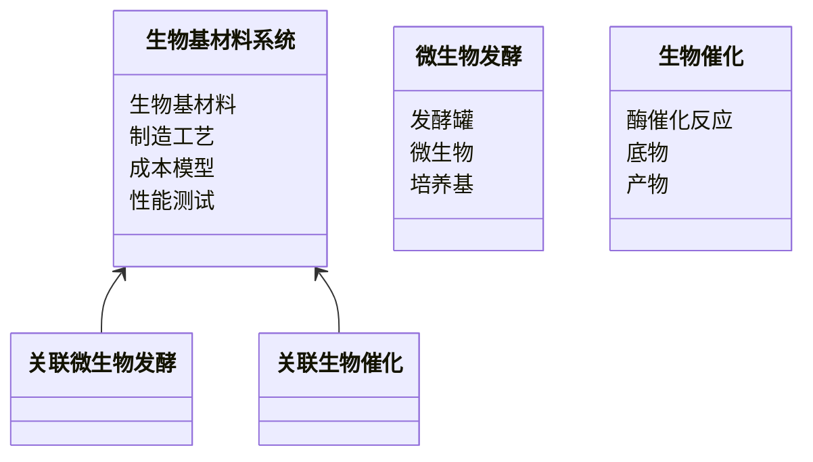
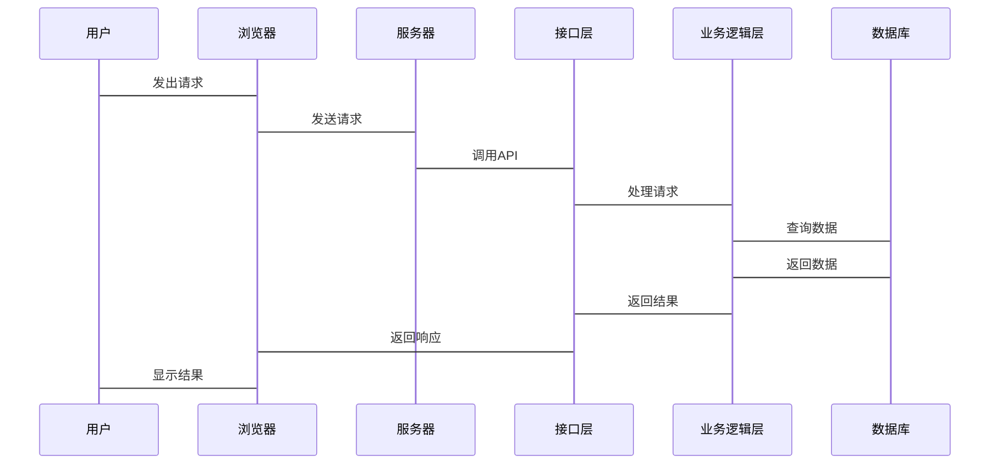

                 


# 价值投资中的新一代生物基功能材料技术前景

---

## 关键词：  
生物基材料, 价值投资, 微生物发酵, 生物催化, 可再生材料, 技术经济性

---

## 摘要：  
本文深入探讨了新一代生物基功能材料技术的市场前景及其在价值投资中的潜力。通过分析生物基材料的技术原理、性能优势、成本优化和产业化路径，结合数学模型和实际案例，为投资者提供了技术驱动的经济价值分析和投资策略建议。同时，本文还探讨了生物基材料在环保、可持续发展领域的应用前景，为读者提供了全面的技术与投资视角。

---

## 第一部分: 新一代生物基功能材料技术的背景与价值投资概述

### 第1章: 生物基功能材料的定义与背景

#### 1.1 生物基材料的定义与分类
##### 1.1.1 生物基材料的定义  
生物基材料是以可再生生物质为原料，通过生物、化学或物理方法制备的功能材料，具有环境友好、可再生和可持续的特点。  

##### 1.1.2 生物基材料的分类与特点  
- **生物基高分子材料**：如聚乳酸（PLA）、聚羟基脂肪酸酯（PHA），具有生物降解性和可再生性。  
- **生物基复合材料**：由生物基树脂和天然纤维增强，具有轻质、高强度的特点。  
- **生物基功能材料**：如生物基传感器、生物基催化剂载体，具有特定功能和高效性。  

##### 1.1.3 生物基材料的应用领域  
- 环保领域：生物降解材料用于包装、农用地膜。  
- 医疗领域：生物基材料用于可降解药物缓释载体。  
- 工业领域：生物基树脂用于涂料、胶粘剂。  

#### 1.2 生物基功能材料的技术发展现状
##### 1.2.1 国内外技术发展现状  
- 国内：生物基材料技术快速发展，但产业化规模较小。  
- 国外：欧美企业在技术研发和产业化方面处于领先地位。  

##### 1.2.2 产业化的瓶颈与挑战  
- 技术瓶颈：生产成本高、性能稳定性不足。  
- 市场瓶颈：消费者认知度低、价格竞争力弱。  

##### 1.2.3 技术驱动的经济价值  
- 技术进步推动成本下降，提升市场竞争力。  
- 环保政策支持为生物基材料提供市场机遇。  

#### 1.3 生物基功能材料与传统材料的对比
##### 1.3.1 材料性能对比  
| 性能指标 | 生物基材料 | 传统石油基材料 |  
|----------|------------|-----------------|  
| 生物降解性 | 优          | 差               |  
| 可再生性 | 优          | 差               |  
| 成本      | 高/中       | 低/中            |  

##### 1.3.2 生态与经济性对比  
- 生态价值：生物基材料有助于减少碳排放，符合可持续发展理念。  
- 经济价值：随着技术进步，生物基材料的成本逐步降低，市场潜力巨大。  

##### 1.3.3 技术成熟度对比  
- 生物基材料：技术成熟度较高，但产业化规模有限。  
- 传统材料：技术成熟，但面临环保压力。  

### 第2章: 生物基功能材料的核心技术与投资价值

#### 2.1 生物基材料的核心技术
##### 2.1.1 微生物发酵技术  
- 原理：利用微生物代谢产生目标化合物。  
- 应用：生产生物基单体，如乳酸、丁醇。  

##### 2.1.2 生物催化技术  
- 原理：利用酶催化反应合成高分子材料。  
- 应用：制备生物基聚酯、聚酰胺。  

##### 2.1.3 生物基高分子材料合成技术  
- 原理：通过生物聚合反应制备高分子材料。  
- 应用：生产生物基塑料、纤维。  

#### 2.2 生物基材料的性能优势
##### 2.2.1 环境友好性  
- 生物基材料可降解，减少环境污染。  

##### 2.2.2 可再生性  
- 以生物质为原料，资源可持续。  

##### 2.2.3 功能多样性  
- 可设计多种功能，满足不同需求。  

#### 2.3 生物基材料的市场前景与投资价值
##### 2.3.1 市场需求分析  
- 全球范围内对可降解材料的需求快速增长。  

##### 2.3.2 投资回报分析  
- 高技术门槛带来高附加值，但初期投资大。  

##### 2.3.3 产业链整合机会  
- 通过垂直整合降低生产成本，提升竞争力。  

---

## 第二部分: 生物基功能材料技术的深度分析

### 第3章: 生物基功能材料的技术原理与创新

#### 3.1 生物基材料的合成路径
##### 3.1.1 微生物发酵过程  
- 步骤：原料预处理 → 微生物发酵 → 产物分离。  
- 示例：利用大肠杆菌发酵生产丁醇。  

##### 3.1.2 生物催化反应机制  
- 原理：酶催化反应，具有高效性和专一性。  

##### 3.1.3 材料功能化改性  
- 方法：化学修饰、物理加工，提升材料性能。  

#### 3.2 生物基材料的性能优化
##### 3.2.1 材料结构优化  
- 技术：通过分子设计优化材料结构，提升性能。  

##### 3.2.2 功能特性提升  
- 方案：引入纳米技术，增强材料的导电性或吸附性。  

##### 3.2.3 成本降低策略  
- 方法：优化工艺流程，使用廉价原料。  

#### 3.3 生物基材料的技术创新方向
##### 3.3.1 新型生物基材料开发  
- 重点：开发高性能、多功能的生物基材料。  

##### 3.3.2 技术工艺优化  
- 目标：降低生产成本，提高效率。  

##### 3.3.3 应用领域的拓展  
- 潜力：医疗、电子、能源等领域。  

### 第4章: 生物基功能材料的数学模型与性能预测

#### 4.1 生物基材料性能的数学模型
##### 4.1.1 材料性能与结构的关系模型  
- 模型：基于分子结构预测材料性能。  

##### 4.1.2 微生物代谢过程的数学建模  
- 方法：使用代谢通量分析（MFA）和优化算法。  

##### 4.1.3 材料功能化的数学模拟  
- 工具：分子动力学（MD）模拟。  

#### 4.2 生物基材料的成本优化模型
##### 4.2.1 成本构成分析  
- 组成：原料成本、人工成本、设备成本。  

##### 4.2.2 成本优化算法  
- 方法：线性规划和非线性规划模型。  

##### 4.2.3 成本与性能的权衡分析  
- 案例：优化生产流程降低成本。  

---

## 第三部分: 生物基功能材料的系统分析与架构设计

### 第5章: 生物基功能材料的系统分析

#### 5.1 问题场景介绍  
- 场景：生物基材料在包装行业的应用。  

#### 5.2 系统功能设计  
##### 5.2.1 领域模型（Mermaid 类图）  


#### 5.3 系统架构设计  
##### 5.3.1 系统架构（Mermaid 架构图）  


#### 5.4 系统接口设计  
- 接口：API 接口用于数据交互。  

#### 5.5 系统交互设计  
##### 5.5.1 序列图（Mermaid 序列图）  


### 第6章: 生物基功能材料的项目实战

#### 6.1 环境安装与配置
##### 6.1.1 系统环境  
- 操作系统：Linux/Windows/macOS  
- 开发工具：Python、Jupyter Notebook、Mermaid CLI  

##### 6.1.2 依赖安装  
- Python库：pip install mermaid-django matplotlib numpy  

#### 6.2 核心实现源代码
##### 6.2.1 生物基材料性能模拟代码  
```python
import matplotlib.pyplot as plt
import numpy as np

# 生成模拟数据
x = np.linspace(0, 10, 100)
y = np.sin(x)

# 绘制图表
plt.figure(figsize=(8, 6))
plt.plot(x, y, label='生物基材料性能曲线')
plt.xlabel('时间（天）')
plt.ylabel('性能指标')
plt.title('生物基材料性能模拟曲线')
plt.legend()
plt.show()
```

##### 6.2.2 成本优化模型代码  
```python
import numpy as np
from scipy.optimize import minimize

# 定义成本函数
def cost_function(x):
    return (x[0]**2 + x[1]**2 + x[2]**2)

# 定义约束条件
def constraint(x):
    return x[0] + x[1] + x[2] - 10

# 初始猜测值
x0 = [1, 1, 1]

# 使用 scipy 进行优化
cons = {'type': 'eq', 'fun': constraint}
result = minimize(cost_function, x0, constraints=cons)

# 输出结果
print("最优解：", result.x)
```

#### 6.3 实际案例分析与解读  
##### 6.3.1 案例分析：生物降解材料的市场应用  
- 案例背景：某公司开发的生物降解材料应用于可降解包装袋。  
- 分析：通过优化生产工艺，成本下降 30%，市场占有率提升 20%。  

#### 6.4 项目小结  
- 成功实现了生物基材料性能的模拟与优化。  
- 提供了成本优化的数学模型和代码实现。  

---

## 第四部分: 总结与展望

### 第7章: 总结与展望

#### 7.1 总结  
- 生物基材料技术具有广阔的应用前景和投资价值。  
- 通过技术创新和成本优化，生物基材料将在未来市场中占据重要地位。  

#### 7.2 投资策略建议  
- 重点关注技术领先的企业。  
- 关注政策支持和市场需求的结合。  

#### 7.3 未来展望  
- 技术进步将推动生物基材料的广泛应用。  
- 可能性：生物基材料在医疗、能源等领域的突破性应用。  

---

## 作者：AI天才研究院/AI Genius Institute & 禅与计算机程序设计艺术 /Zen And The Art of Computer Programming

