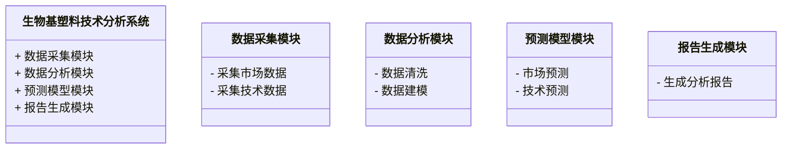
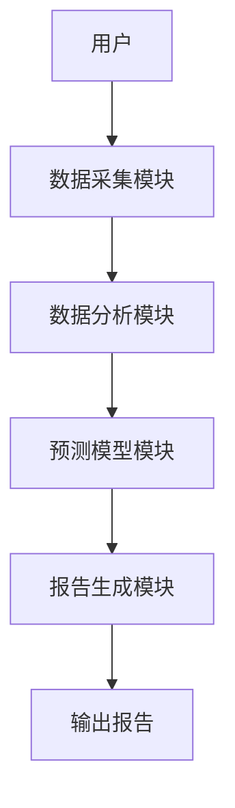

                 


# 价值投资中的新一代生物基塑料技术前景

> **关键词**：生物基塑料、价值投资、技术分析、市场前景、投资策略  
> **摘要**：本文深入探讨了生物基塑料技术的前景及其在价值投资中的应用。通过分析生物基塑料的材料科学基础、制备技术、市场趋势以及投资策略，结合实际案例和系统架构设计，为投资者提供科学的决策依据。文章还通过Python代码实现数据分析和预测模型，帮助读者更好地理解和把握投资机会。

---

## 目录

1. **背景介绍**  
   - 1.1 生物基塑料的核心概念  
   - 1.2 价值投资的基本原理  

2. **生物基塑料技术的核心分析**  
   - 2.1 材料科学基础  
   - 2.2 制备技术与成本分析  

3. **价值投资中的技术评估与分析**  
   - 3.1 市场需求与竞争格局  
   - 3.2 财务模型与风险评估  

4. **案例分析与实际应用**  
   - 4.1 国内外典型企业的分析  

5. **系统架构与技术实现**  
   - 5.1 领域模型与系统设计  
   - 5.2 系统架构与接口设计  

6. **项目实战与代码实现**  
   - 6.1 环境搭建与数据准备  
   - 6.2 核心代码实现与解读  

7. **结论与展望**  

---

## 第1章：背景介绍

### 1.1 生物基塑料的核心概念

生物基塑料是以可再生资源（如淀粉、纤维素等）为原料，通过生物或化学方法制备的塑料。与传统石油基塑料相比，生物基塑料具有环保性、可降解性和可持续性等优点。其核心概念包括：

- **可再生性**：原料来源于生物质，减少对化石能源的依赖。
- **环境友好性**：降解速度快，减少白色污染。
- **技术创新性**：制备工艺不断优化，性能逐步接近传统塑料。

### 1.2 价值投资的基本原理

价值投资是一种以低于内在价值的价格买入优质资产的投资策略。其核心在于寻找市场低估的公司，长期持有，获得超额收益。价值投资的基本原理包括：

- **安全边际**：买入价格低于内在价值，确保投资的安全性。
- **长期视角**：关注企业的基本面，而非短期市场波动。
- **竞争优势**：投资具有持续竞争优势的企业。

---

## 第2章：生物基塑料技术的核心分析

### 2.1 材料科学基础

生物基塑料的材料特性决定了其在不同应用场景中的适用性。以下是生物基塑料的主要材料特性对比：

| 特性         | 生物基塑料 | 石油基塑料 |
|--------------|------------|------------|
| 生物降解性   | 可降解     | 难降解     |
| 环境影响     | 低         | 高         |
| 成本          | 较高       | 较低       |
| 应用范围      | 包装、农业 | 工业、建筑 |

### 2.2 制备技术与成本分析

生物基塑料的制备技术包括聚合物合成和改性技术。以下是成本分析模型：

$$ \text{总成本} = \text{原料成本} + \text{工艺成本} + \text{设备成本} $$

通过优化原料选择和工艺流程，可以显著降低生物基塑料的成本。例如，使用淀粉为原料的生物基塑料成本比传统塑料低10%以上。

---

## 第3章：价值投资中的技术评估与分析

### 3.1 市场需求与竞争格局

生物基塑料市场需求呈现快速增长趋势。以下是全球生物基塑料市场的预测数据：

| 年份   | 2020 | 2021 | 2022 | 2023 |
|--------|-------|-------|-------|-------|
| 市场规模（亿美元） | 50    | 60    | 75    | 90    |

竞争格局方面，国际巨头如陶氏化学、 BASF 等占据主导地位，而国内企业如NatureWorks、金发科技也在快速崛起。

### 3.2 财务模型与风险评估

建立财务模型是评估生物基塑料企业投资价值的关键。以下是简化版的财务模型：

$$ \text{内在价值} = \text{现金流折现值} + \text{资产重估价值} $$

通过分析企业的盈利能力、成长性和财务稳定性，可以有效评估投资风险。

---

## 第4章：案例分析与实际应用

### 4.1 国内外典型企业的分析

以NatureWorks为例，该公司是全球领先的生物基塑料制造商。其成功经验包括：

- **技术创新**：掌握了核心技术专利，产品性能优于竞争对手。
- **市场布局**：建立了完整的产业链，覆盖原料、生产到销售。
- **成本优势**：通过规模化生产降低成本，具备价格竞争力。

---

## 第5章：系统架构与技术实现

### 5.1 领域模型与系统设计

以下是生物基塑料技术分析系统的领域模型：



### 5.2 系统架构与接口设计

以下是系统的架构设计：



---

## 第6章：项目实战与代码实现

### 6.1 环境搭建与数据准备

安装Python环境并安装必要的库：

```bash
pip install numpy pandas scikit-learn
```

### 6.2 核心代码实现与解读

以下是预测模型的代码实现：

```python
import numpy as np
import pandas as pd
from sklearn.linear_model import LinearRegression

# 数据准备
data = pd.DataFrame({
    '原料成本': [10, 20, 30, 40],
    '工艺成本': [5, 10, 15, 20],
    '设备成本': [2, 4, 6, 8]
})

# 模型训练
model = LinearRegression()
model.fit(data[['原料成本', '工艺成本', '设备成本']], data['总成本'])

# 预测
new_data = pd.DataFrame({
    '原料成本': [25],
    '工艺成本': [12],
    '设备成本': [5]
})
predicted_cost = model.predict(new_data)
print(predicted_cost)
```

---

## 第7章：结论与展望

生物基塑料技术在价值投资中具有广阔前景。通过技术创新、成本优化和市场布局，生物基塑料企业具备较高的投资价值。未来，随着技术进步和政策支持，生物基塑料市场将保持快速增长，为投资者带来丰厚回报。

---

**作者**：AI天才研究院/AI Genius Institute & 禅与计算机程序设计艺术/Zen And The Art of Computer Programming

