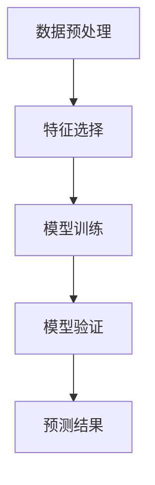
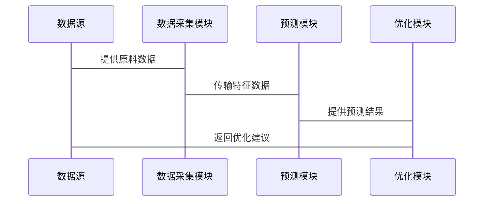

                 


# 价值投资中的新一代生物燃料技术前景

> 关键词：生物燃料技术，价值投资，新一代技术，能源转型，可持续发展，投资分析

> 摘要：本文深入分析了生物燃料技术的最新进展及其在价值投资中的潜力。通过结合技术背景、数学模型、系统架构和实际案例，探讨了生物燃料技术的核心概念、算法原理、系统设计和投资策略。文章旨在为投资者提供基于技术分析的决策支持，揭示生物燃料技术在能源转型中的重要地位和投资机会。

---

# 第一部分: 生物燃料技术的背景与重要性

## 第1章: 生物燃料技术的背景与重要性

### 1.1 生物燃料的定义与分类

#### 1.1.1 生物燃料的定义
生物燃料是指通过生物过程（如发酵、催化反应等）生产的可再生能源，主要来源于有机物质，如植物、动物脂肪和微生物等。生物燃料可以替代传统的化石燃料，减少碳排放，推动可持续能源发展。

#### 1.1.2 生物燃料的主要分类
生物燃料主要分为第一代、第二代和第三代：
- **第一代生物燃料**：主要来源于粮食作物（如玉米、甘蔗）加工得到的乙醇和生物柴油。
- **第二代生物燃料**：来源于非食用生物质（如秸秆、林业残渣）通过酶解和发酵等技术制备的纤维素乙醇。
- **第三代生物燃料**：来源于海藻、微生物等高产生物体，通过生物工程技术优化生产的燃料。

#### 1.1.3 生物燃料与传统能源的对比
| 特性 | 生物燃料 | 石油燃料 |
|------|----------|-----------|
| 可再生性 | 可再生 | 不可再生 |
| 碳中和性 | 减少碳排放 | 高碳排放 |
| 能源效率 | 较低 | 较高 |
| 资源依赖性 | 依赖生物质供应 | 依赖化石能源储备 |

### 1.2 生物燃料技术的发展历程

#### 1.2.1 生物燃料技术的历史演变
- **早期阶段**：20世纪初，生物柴油和乙醇开始作为燃料试验。
- **快速发展阶段**：20世纪70年代石油危机后，生物燃料技术得到广泛关注和投资。
- **技术创新阶段**：21世纪以来，第二代和第三代生物燃料技术逐步成熟。

#### 1.2.2 当前生物燃料技术的现状
- 全球范围内，生物燃料产量稳步增长，尤其是在巴西、美国和欧洲地区。
- 技术创新集中在提高转化效率、降低成本和优化原料利用。

#### 1.2.3 生物燃料技术的未来趋势
- 向第三代技术（如海藻基燃料）转型，减少对粮食作物的依赖。
- 结合人工智能和大数据优化生产过程和预测市场趋势。

### 1.3 生物燃料技术的经济与环境价值

#### 1.3.1 生物燃料的经济优势
- 降低能源价格波动风险。
- 创造新的经济增长点，带动相关产业发展。
- 提供就业机会，特别是在农村地区。

#### 1.3.2 生物燃料的环境效益
- 减少温室气体排放，缓解气候变化。
- 减少空气污染，改善环境质量。
- 促进资源循环利用，减少浪费。

#### 1.3.3 生物燃料技术对能源结构的影响
- 逐步减少对化石燃料的依赖，推动能源结构转型。
- 为可再生能源体系提供重要补充。

---

# 第二部分: 生物燃料技术的核心概念与原理

## 第2章: 生物燃料技术的核心概念与原理

### 2.1 生物燃料技术的核心概念

#### 2.1.1 生物燃料的生产过程
- **原料选择**：选择适合的生物质原料，如玉米 stalks、algae 等。
- **预处理**：将原料转化为适合发酵或催化反应的形式。
- **主发酵/催化过程**：通过微生物或化学反应将原料转化为燃料。
- **后处理**：精炼和提纯燃料产品。

#### 2.1.2 生物燃料的关键技术特征
- **原料多样性**：能够利用多种生物质资源。
- **生产灵活性**：可以根据市场需求快速调整产量。
- **环境友好性**：减少污染，降低碳排放。

#### 2.1.3 生物燃料技术的创新点
- **基因工程技术**：通过改造微生物提高燃料产量。
- **高效催化剂**：开发新型催化剂以降低反应能耗。
- **智能控制系统**：利用人工智能优化生产过程。

### 2.2 生物燃料技术的关键原理

#### 2.2.1 生物燃料合成的化学原理
- **发酵反应**：例如，乙醇发酵（C6H12O6 → 2C2H5OH + 2CO2）。
- **催化反应**：例如，酯交换反应（甘油酯 + 甲醇 → 甲酯 + 甘油）。

#### 2.2.2 生物燃料燃烧的物理原理
- **燃烧效率**：燃料的热值和燃烧速度直接影响能量输出。
- **气体交换**：燃烧过程中氧气的需求和二氧化碳的释放。

#### 2.2.3 生物燃料的能量转换效率分析
- **能量输入与输出**：从生物质到燃料的能量转化效率。
- **㶲分析**：㶲效率（exergy efficiency）是衡量能量转换效率的重要指标。

### 2.3 生物燃料技术与其他能源技术的对比

#### 2.3.1 生物燃料与化石燃料的对比
- **碳排放**：生物燃料是碳中和的，而化石燃料是高碳排放的。
- **资源可持续性**：生物燃料可以无限再生，化石燃料是有限的。

#### 2.3.2 生物燃料与可再生能源的对比
- **稳定性**：生物燃料比风能和太阳能更具稳定性。
- **储存与运输**：生物燃料更易于储存和运输。

#### 2.3.3 生物燃料技术的优缺点分析
- **优点**：可再生、环保、技术成熟。
- **缺点**：成本较高、技术壁垒高、原料供应不稳定。

---

# 第三部分: 生物燃料技术的数学模型与算法原理

## 第3章: 生物燃料技术的数学模型与算法原理

### 3.1 生物燃料技术的数学模型

#### 3.1.1 生物燃料合成的热力学模型
- **热力学平衡**：通过热力学方程预测反应的转化率。
- **㶲分析模型**：计算能量转换过程中的㶲损失。

#### 3.1.2 生物燃料燃烧的流体力学模型
- **流动模型**：通过CFD（计算流体动力学）模拟燃烧过程。
- **传热模型**：分析热量传递对燃烧效率的影响。

#### 3.1.3 生物燃料效率的优化模型
- **线性回归模型**：预测燃料产率与原料特性的关系。
- **非线性优化模型**：通过遗传算法优化生产参数。

### 3.2 生物燃料技术的算法原理

#### 3.2.1 机器学习预测模型
- **数据预处理**：对原料特性、生产条件等数据进行标准化处理。
- **特征选择**：通过特征重要性分析筛选关键影响因素。
- **模型训练**：使用随机森林或XGBoost算法训练预测模型。
- **模型验证**：通过交叉验证评估模型的准确性和稳定性。

#### 3.2.2 算法流程图


#### 3.2.3 数学公式与示例
- **线性回归模型**：$$ y = \beta_0 + \beta_1x + \epsilon $$
  - 其中，y 是燃料产率，x 是原料含糖量，$$ \beta_0 $$ 和 $$ \beta_1 $$ 是回归系数。
- **随机森林模型**：通过投票机制预测燃料效率。

### 3.3 系统分析与架构设计方案

#### 3.3.1 系统功能设计
- **数据采集模块**：收集原料特性、生产条件等数据。
- **特征提取模块**：提取关键特征用于模型训练。
- **预测模块**：利用机器学习模型预测燃料效率和成本。
- **优化模块**：根据预测结果优化生产参数。

#### 3.3.2 系统架构设计


#### 3.3.3 系统接口设计
- **输入接口**：接收原料数据和生产参数。
- **输出接口**：提供预测结果和优化建议。

#### 3.3.4 系统交互流程


---

# 第四部分: 价值投资中的生物燃料技术分析

## 第4章: 价值投资中的生物燃料技术分析

### 4.1 价值投资的核心概念

#### 4.1.1 价值投资的定义
- 价值投资是寻找被市场低估的优质资产，通过长期持有实现收益。

#### 4.1.2 价值投资的核心要素
- **基本面分析**：分析公司的财务状况、盈利能力、成长性。
- **市场估值**：比较市盈率、市净率等指标，寻找低估机会。
- **长期视角**：关注公司的长期价值，而非短期波动。

### 4.2 生物燃料技术的市场分析

#### 4.2.1 全球生物燃料市场现状
- **市场规模**：全球生物燃料市场年增长率超过10%。
- **区域分布**：美国、欧洲和巴西是主要市场。
- **竞争格局**：行业内主要企业包括BP、壳牌、Total等。

#### 4.2.2 技术创新与市场机会
- **技术创新**：第三代生物燃料技术的突破带来新的投资机会。
- **政策支持**：各国政府通过补贴和税收优惠推动生物燃料发展。
- **市场需求**：环保法规趋严，推动生物燃料需求增长。

### 4.3 生物燃料技术的投资策略

#### 4.3.1 技术评估
- **技术成熟度**：评估技术的商业化可行性。
- **成本分析**：比较不同技术的成本和效率。
- **技术壁垒**：分析技术的专利保护和竞争优势。

#### 4.3.2 市场评估
- **市场规模**：预测未来市场需求和增长潜力。
- **竞争分析**：评估行业内主要竞争对手的优势和劣势。
- **政策环境**：分析政府政策对市场的影响。

#### 4.3.3 财务评估
- **盈利能力**：评估企业的净利润率和ROE。
- **财务风险**：分析企业的债务结构和现金流状况。
- **估值分析**：比较市盈率、市净率等指标，判断是否低估。

### 4.4 生物燃料技术的风险管理

#### 4.4.1 技术风险
- **技术失败风险**：技术创新可能失败，导致投资损失。
- **技术替代风险**：新技术可能替代现有技术，影响投资收益。

#### 4.4.2 市场风险
- **市场需求波动风险**：能源价格波动可能影响生物燃料需求。
- **政策风险**：政府政策变化可能影响市场环境。

#### 4.4.3 财务风险
- **成本超支风险**：项目成本超支可能导致财务亏损。
- **流动性风险**：资金链断裂可能导致投资失败。

---

# 第五部分: 生物燃料技术的项目实战与案例分析

## 第5章: 生物燃料技术的项目实战与案例分析

### 5.1 项目背景与目标

#### 5.1.1 项目背景
- 选择一家专注于第三代生物燃料技术的公司进行分析。
- 分析其技术优势、市场地位和财务状况。

#### 5.1.2 项目目标
- 通过技术分析和财务分析，评估该公司的投资价值。
- 提出投资建议，指导投资者进行决策。

### 5.2 项目环境与数据收集

#### 5.2.1 环境配置
- **数据来源**：公司财务报表、行业报告、专利信息。
- **工具选择**：使用Python和机器学习库（如scikit-learn、XGBoost）进行分析。
- **数据格式**：结构化数据，包括财务指标、技术参数、市场数据等。

### 5.3 项目核心实现

#### 5.3.1 数据预处理
```python
import pandas as pd
import numpy as np

# 加载数据
data = pd.read_csv('biomass_data.csv')

# 删除缺失值
data = data.dropna()

# 标准化处理
from sklearn.preprocessing import StandardScaler
scaler = StandardScaler()
scaled_data = scaler.fit_transform(data)
```

#### 5.3.2 特征选择
```python
from sklearn.ensemble import RandomForestRegressor
from sklearn.inspection import permutation_importances

# 训练随机森林模型
model = RandomForestRegressor()
model.fit(scaled_data, target)

# 计算特征重要性
importances = permutation_importances(model, scaled_data, target)
importances = importances.mean(axis=1)
importances = pd.DataFrame({'feature': features, 'importance': importances})
importances = importances.sort_values('importance', ascending=False)
```

#### 5.3.3 模型实现
```python
from xgboost import XGBRegressor
import joblib

# 训练XGBoost模型
model = XGBRegressor()
model.fit(scaled_data, target)

# 保存模型
joblib.dump(model, 'fuel_efficiency_model.pkl')
```

#### 5.3.4 结果分析
- **模型准确率**：评估模型的预测精度。
- **特征重要性**：识别对燃料效率影响最大的因素。
- **投资回报率**：预测投资回报率，指导投资决策。

### 5.4 案例分析与解读

#### 5.4.1 案例背景
- 分析某生物燃料企业的技术优势和市场地位。
- 评估其财务状况和成长潜力。

#### 5.4.2 数据分析
- 使用机器学习模型预测燃料效率和成本。
- 通过财务指标评估企业的盈利能力。

#### 5.4.3 投资建议
- 基于技术分析和财务分析，提出投资建议。
- 评估投资风险，制定风险管理策略。

### 5.5 项目总结与经验分享

#### 5.5.1 项目总结
- 总结项目实施过程中的关键点和成果。
- 提出改进建议，优化分析流程。

#### 5.5.2 经验分享
- 强调技术分析的重要性，结合财务分析制定投资策略。
- 提醒投资者关注行业动态和政策变化，及时调整投资策略。

---

# 第六部分: 总结与展望

## 第6章: 总结与展望

### 6.1 本文总结
- 生物燃料技术具有广阔的发展前景和投资潜力。
- 技术创新和政策支持是推动行业发展的关键因素。
- 通过技术分析和财务分析，可以帮助投资者做出明智的投资决策。

### 6.2 未来展望
- **技术创新**：第三代生物燃料技术将进一步突破，降低成本和提高效率。
- **市场扩展**：生物燃料将在全球范围内得到更广泛的应用。
- **政策支持**：各国政府将继续出台支持政策，推动生物燃料产业发展。

---

# 作者：AI天才研究院/AI Genius Institute & 禅与计算机程序设计艺术 /Zen And The Art of Computer Programming

