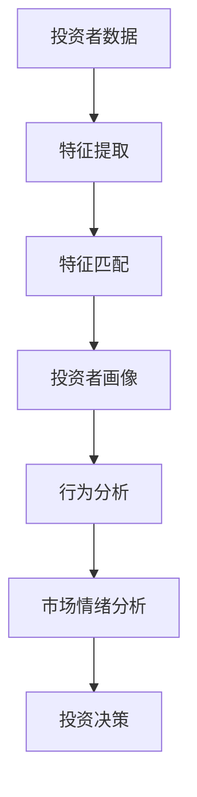

                 


# 价值投资中的新一代生物识别技术前景

> 关键词：价值投资，生物识别，机器学习，数据驱动，人工智能

> 摘要：生物识别技术在金融领域的应用前景广阔，特别是在价值投资中，投资者行为分析、风险评估和市场情绪分析等方面具有重要价值。本文将详细探讨生物识别技术的核心算法、数学模型，以及其在价值投资中的系统架构设计和实战应用，分析其对投资决策的影响。

---

## 第一部分：背景介绍

### 第1章：生物识别技术的定义与背景

#### 1.1 生物识别技术的定义
生物识别技术是一种通过分析和验证人类的生理特征或行为特征来识别人的方法。常见的生理特征包括人脸、指纹、虹膜等，行为特征则包括步态、声音等。这些特征具有唯一性和稳定性，使其成为身份验证的重要手段。

**核心概念对比表：**

| 特征类型 | 生理特征 | 行为特征 |
|----------|----------|----------|
| 示例     | 人脸识别、指纹识别 | 行为分析、声音识别 |
| 优势     | 稳定性高，易于验证 | 独特性强，难以伪造 |
| 应用场景 | 身份验证、门禁系统 | 安全监控、行为分析 |

#### 1.2 生物识别技术的发展历程
生物识别技术的发展经历了从简单的特征提取到复杂的深度学习模型的过程。早期的技术主要依赖于特征提取和匹配算法，而现代技术则结合了人工智能和大数据分析，显著提高了识别的准确性和效率。

#### 1.3 生物识别技术在金融领域的应用
在金融领域，生物识别技术主要用于身份验证和风险管理。例如，通过人脸识别技术验证投资者身份，通过行为分析评估投资者的心理状态和投资偏好。

---

### 第2章：生物识别技术在价值投资中的潜在价值

#### 2.1 价值投资的核心概念
价值投资是一种通过分析企业的基本面来判断其内在价值的投资策略。投资者需要关注企业的财务数据、市场地位、管理团队等因素，以做出投资决策。

#### 2.2 生物识别技术如何赋能价值投资
生物识别技术可以通过分析投资者的行为特征和心理状态，帮助投资者更好地理解市场情绪和投资偏好。例如，通过分析投资者的面部表情和语气，可以判断其情绪状态，从而辅助投资决策。

#### 2.3 生物识别技术在价值投资中的应用案例
案例：某投资机构利用人脸识别技术分析投资者的面部表情，结合市场数据进行投资决策。结果表明，通过分析投资者的情绪状态，可以在市场波动中做出更准确的投资决策。

---

## 第二部分：生物识别技术的核心原理

### 第3章：生物识别技术的核心算法

#### 3.1 人脸识别算法
人脸识别算法主要包括特征提取、匹配和识别三个步骤。特征提取是通过提取人脸的关键特征点，如眼睛、鼻子、嘴巴等，来表示人脸的特征。匹配则是将提取的特征与数据库中的特征进行比对，识别出匹配的个体。

**基于深度学习的人脸识别模型：**

使用卷积神经网络（CNN）进行特征提取，通过训练大量的人脸图像，模型可以自动学习到人脸的关键特征。常用的模型包括FaceNet和ResNet。

**数学模型：**

$$ \text{FaceNet} = f_{\theta}(x) \rightarrow \text{嵌入向量} $$

其中，$x$ 是输入的图像，$f_{\theta}$ 是模型的参数。

#### 3.2 模糊匹配算法
模糊匹配算法是一种基于概率的匹配方法，适用于特征相似但不完全匹配的情况。例如，当投资者的行为特征与预期特征存在部分差异时，可以通过模糊匹配算法进行调整，以提高匹配的准确性。

**模糊匹配的数学模型：**

$$ \text{匹配概率} = \sum_{i=1}^{n} w_i \cdot f_i(x) $$

其中，$w_i$ 是特征 $i$ 的权重，$f_i(x)$ 是特征 $i$ 的匹配函数。

---

### 第4章：生物识别技术的数学模型

#### 4.1 人脸识别的特征提取
特征提取是人脸识别的关键步骤，常用的特征提取方法包括主成分分析（PCA）和线性判别分析（LDA）。

**主成分分析（PCA）：**

$$ \text{PCA} = \argmin_{W} \frac{1}{n}\sum_{i=1}^{n}(x_i^T W - y_i)^2 $$

其中，$W$ 是特征提取矩阵，$x_i$ 是输入样本，$y_i$ 是目标输出。

**线性判别分析（LDA）：**

$$ \text{LDA} = \argmin_{W} \sum_{i=1}^{c}\sum_{j=1}^{n_i} (x_j^T W - y_i)^2 $$

其中，$c$ 是类别数，$n_i$ 是类别 $i$ 的样本数。

#### 4.2 模糊匹配算法
模糊匹配算法是一种基于概率的匹配方法，适用于特征相似但不完全匹配的情况。例如，当投资者的行为特征与预期特征存在部分差异时，可以通过模糊匹配算法进行调整，以提高匹配的准确性。

**模糊匹配的数学模型：**

$$ \text{匹配概率} = \sum_{i=1}^{n} w_i \cdot f_i(x) $$

其中，$w_i$ 是特征 $i$ 的权重，$f_i(x)$ 是特征 $i$ 的匹配函数。

---

## 第三部分：生物识别技术在价值投资中的应用

### 第5章：投资者画像与行为分析

#### 5.1 投资者画像的构建
投资者画像是通过分析投资者的行为特征和心理状态，构建出投资者的综合画像。例如，通过分析投资者的面部表情、语调和行为习惯，可以判断其情绪状态和投资偏好。

**投资者画像的构建步骤：**

1. 数据采集：收集投资者的面部表情、声音特征、行为习惯等数据。
2. 特征提取：提取投资者的生理特征和行为特征。
3. 特征匹配：将提取的特征与数据库中的特征进行匹配，构建投资者画像。

#### 5.2 投资者行为分析
投资者行为分析是通过分析投资者的行为特征，预测其未来的投资行为。例如，通过分析投资者的交易频率、交易金额和交易时间，可以预测其未来的投资行为。

**投资者行为分析的步骤：**

1. 数据采集：收集投资者的交易数据、市场数据等。
2. 特征提取：提取投资者的交易特征、市场特征等。
3. 行为预测：通过机器学习算法预测投资者的未来行为。

---

### 第6章：风险评估与市场情绪分析

#### 6.1 风险评估
风险评估是通过分析投资者的行为特征和市场数据，评估投资的风险。例如，通过分析投资者的面部表情和交易数据，可以评估其投资风险。

**风险评估的步骤：**

1. 数据采集：收集投资者的面部表情、交易数据等。
2. 特征提取：提取投资者的生理特征和交易特征。
3. 风险评估：通过机器学习算法评估投资风险。

#### 6.2 市场情绪分析
市场情绪分析是通过分析投资者的行为特征和市场数据，预测市场的未来走势。例如，通过分析投资者的面部表情和交易数据，可以预测市场的未来走势。

**市场情绪分析的步骤：**

1. 数据采集：收集投资者的面部表情、交易数据等。
2. 特征提取：提取投资者的生理特征和交易特征。
3. 情绪预测：通过机器学习算法预测市场情绪。

---

## 第四部分：系统设计与实战

### 第7章：系统设计与实战

#### 7.1 系统设计
系统设计包括功能设计、架构设计、接口设计和交互设计。例如，设计一个基于生物识别技术的价值投资系统，功能包括投资者画像、行为分析、风险评估和市场情绪分析。

**系统架构图：**



#### 7.2 实战项目
实战项目是通过实际案例展示生物识别技术在价值投资中的应用。例如，设计一个基于Python的人脸识别投资者画像系统，分析投资者的行为特征和心理状态，辅助投资决策。

**核心代码实现：**

```python
import cv2
import numpy as np

# 加载预训练的人脸检测模型
face_cascade = cv2.CascadeClassifier('haarcascade_frontalface_default.xml')

# 捕捉视频流
cap = cv2.VideoCapture(0)

while True:
    ret, frame = cap.read()
    gray = cv2.cvtColor(frame, cv2.COLOR_BGR2GRAY)
    faces = face_cascade.detectMultiScale(gray, 1.3, 5)
    
    for (x, y, w, h) in faces:
        cv2.rectangle(frame, (x, y), (x + w, y + h), (255, 0, 0), 2)
        roi_gray = gray[y:y + h, x:x + w]
        roi_color = frame[y:y + h, x:x + w]
        
        # 提取面部表情特征
        # 这里可以添加更多的特征提取代码
        
    cv2.imshow('frame', frame)
    if cv2.waitKey(1) & 0xFF == ord('q'):
        break

cap.release()
cv2.destroyAllWindows()
```

---

## 结论

生物识别技术在价值投资中的应用前景广阔，通过分析投资者的行为特征和心理状态，可以辅助投资者做出更明智的投资决策。然而，生物识别技术的应用也面临一些挑战，如数据隐私和模型泛化能力等。未来，随着人工智能和大数据技术的不断发展，生物识别技术将在价值投资中发挥更大的作用。

---

**作者：AI天才研究院/AI Genius Institute & 禅与计算机程序设计艺术 /Zen And The Art of Computer Programming**

