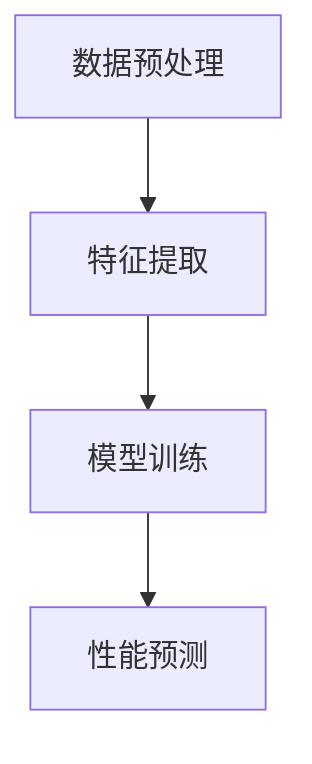
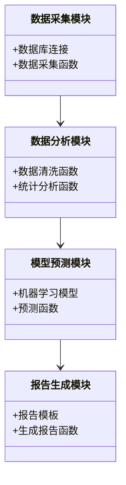
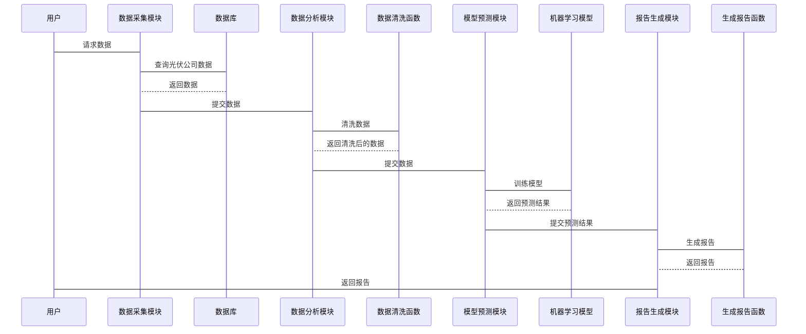

                 


# 价值投资中的新型光伏材料技术前景

> 关键词：光伏材料，价值投资，技术创新，市场前景，投资分析

> 摘要：本文探讨了新型光伏材料技术在价值投资中的潜力，分析了其技术发展、市场前景及投资机会。通过详细的技术背景介绍、核心概念分析、算法原理与数学模型、系统架构设计以及项目实战，为投资者提供深度的技术见解和投资策略。

---

## 第一部分: 背景介绍

### 第1章: 光伏材料与价值投资的背景介绍

#### 1.1 光伏材料的基本概念

##### 1.1.1 光伏材料的定义与分类
光伏材料是指能够将太阳光转化为电能的材料，主要应用于太阳能电池。常见的光伏材料包括晶体硅、薄膜材料（如碲化镉、铜铟镓硒）和新型材料（如钙钛矿）。晶体硅是最常用的光伏材料，因其高效性和稳定性而被广泛使用。

##### 1.1.2 光伏材料在能源转型中的作用
随着全球能源需求的增长和对可再生能源的重视，光伏材料在能源结构转型中扮演着重要角色。它不仅有助于减少碳排放，还能降低能源成本，推动可持续发展。

##### 1.1.3 光伏材料技术的演进历程
光伏技术经历了从早期的低效电池到如今的高效电池的发展。从20世纪50年代的第一代太阳能电池到现在的第三代钙钛矿电池，技术的进步显著提高了光电转换效率和降低了生产成本。

#### 1.2 价值投资与光伏材料的结合

##### 1.2.1 价值投资的核心理念
价值投资强调以低于内在价值的价格购买优质资产，长期持有以实现收益。在光伏材料领域，这意味着寻找具有技术优势、市场前景和竞争优势的公司进行投资。

##### 1.2.2 光伏材料行业的投资价值分析
光伏行业具有较高的增长潜力，尤其在政策支持和技术创新的推动下，新型光伏材料公司具有较大的投资价值。投资者需要关注技术成熟度、成本优势和市场定位等因素。

##### 1.2.3 光伏材料技术进步对投资的影响
技术进步降低了光伏材料的成本，提高了效率，从而提升了公司的盈利能力。投资者应关注技术领先企业的长期发展，避免短期波动的影响。

---

### 第2章: 新型光伏材料的技术发展与市场前景

#### 2.1 新型光伏材料的技术突破

##### 2.1.1 高效晶体硅电池技术
高效晶体硅电池通过改进电池结构和材料特性，显著提高了转换效率。例如，钝化接触技术（Passivated Contact）和背接触技术（Backside Contact）的应用使硅电池效率突破24%。

##### 2.1.2 薄膜太阳能电池的技术进展
薄膜电池因其轻薄、柔韧和成本低的特点，逐渐成为光伏市场的主流。CIGS（铜铟镓硒）和CdTe（碲化镉）薄膜电池在效率和成本上都有显著优势。

##### 2.1.3 其他新型光伏材料（如钙钛矿）
钙钛矿太阳能电池以其高效率和低成本潜力，成为近年来的研究热点。其转换效率已超过25%，且制造过程简单，适合大规模生产。

#### 2.2 市场需求与投资机会

##### 2.2.1 全球光伏市场的发展趋势
全球光伏装机容量持续增长，预计未来几年将保持年均两位数的增长率。新兴市场如印度、东南亚和拉丁美洲的光伏需求将推动行业增长。

##### 2.2.2 新型光伏材料的市场应用前景
新型材料如钙钛矿电池有望在未来几年内实现商业化应用，进一步降低光伏成本，扩大市场应用。

##### 2.2.3 投资者关注的热点领域
投资者应关注具有技术领先优势、成本控制能力较强的公司，尤其是那些能够提供高效、低成本解决方案的企业。

---

### 第3章: 光伏材料技术的核心概念与联系

#### 3.1 光伏材料的核心技术原理

##### 3.1.1 光电转换的基本原理
光伏材料通过吸收光能，将光能转化为电能。这一过程涉及半导体材料的能带结构和电子跃迁。

##### 3.1.2 光伏材料的能带结构与光电效应
半导体材料的能带结构决定了其光电特性。当光子能量超过材料的带隙时，电子跃迁产生电流。

##### 3.1.3 材料性能对光伏效率的影响
材料的吸光性能、载流子迁移率和缺陷密度等因素直接影响光伏效率。高效材料需要具备优异的光吸收和电荷传输能力。

#### 3.2 核心概念对比分析

##### 3.2.1 不同光伏材料的性能对比
| 材料类型   | 转换效率 | 成本 | 优点                  | 缺点                  |
|------------|----------|------|-----------------------|-----------------------|
| 晶体硅     | 24%      | 中   | 成熟技术，稳定性高     | 制造成本较高         |
| 薄膜电池   | 18%-22%  | 低   | 成本低，适合柔性应用   | 早期效率较低          |
| 钙钛矿     | 25%+     | 低   | 制造简单，成本低       | 稳定性和寿命待提升    |

##### 3.2.2 技术成熟度与成本关系
技术成熟度高的晶体硅成本较高，而新技术如钙钛矿成本低但技术成熟度较低。投资者需在技术风险和成本之间进行权衡。

##### 3.2.3 市场需求与技术潜力的匹配
高效材料如钙钛矿符合市场对低成本、高效率的需求，未来市场潜力巨大。

---

### 第4章: 光伏材料技术的算法原理与数学模型

#### 4.1 光伏材料性能预测的算法原理

##### 4.1.1 数据驱动的光伏性能预测模型
通过机器学习模型分析光伏材料的性能参数，如转换效率、电池寿命等。数据来源包括实验数据和文献数据。

##### 4.1.2 机器学习在光伏材料研究中的应用
使用回归模型预测材料性能，分类模型评估材料稳定性。例如，使用支持向量回归（SVR）和随机森林（Random Forest）进行预测。

##### 4.1.3 算法流程图（使用 Mermaid）



#### 4.2 数学模型与公式

##### 4.2.1 光电转换效率公式
$$ \text{效率} = \frac{\text{输出功率}}{\text{入射功率}} $$

##### 4.2.2 光伏电池的伏安特性方程
$$ I = I_0 - I_L + \frac{I_P}{1 + \frac{I}{I_P}} $$

##### 4.2.3 光伏系统能量平衡方程
$$ P_{\text{input}} = P_{\text{output}} + P_{\text{loss}} $$

---

### 第5章: 系统分析与架构设计方案

#### 5.1 投资分析系统的功能设计

##### 5.1.1 系统目标与范围
设计一个基于机器学习的投资分析系统，用于预测光伏材料公司的股票价值。

##### 5.1.2 功能模块划分
- 数据采集模块：收集光伏公司数据
- 数据分析模块：计算技术指标和财务指标
- 模型预测模块：预测股票价值
- 报告生成模块：输出投资建议

##### 5.1.3 领域模型（使用 Mermaid 类图）



#### 5.2 系统架构设计

##### 5.2.1 分层架构设计
- 数据层：存储光伏公司数据
- 业务逻辑层：实现数据分析和预测功能
- 用户界面层：提供用户交互界面

##### 5.2.2 模块间的交互设计（使用 Mermaid 序列图）



---

### 第6章: 项目实战

#### 6.1 环境安装

##### 6.1.1 安装必要的库
```bash
pip install pandas numpy scikit-learn
```

#### 6.2 系统核心实现源代码

##### 6.2.1 数据预处理代码
```python
import pandas as pd
import numpy as np

# 加载数据
data = pd.read_csv('photovoltaic_data.csv')

# 删除缺失值
data.dropna(inplace=True)

# 标准化处理
from sklearn.preprocessing import StandardScaler
scaler = StandardScaler()
scaled_data = scaler.fit_transform(data)
```

##### 6.2.2 模型训练代码
```python
from sklearn.ensemble import RandomForestRegressor
from sklearn.metrics import mean_squared_error

# 训练模型
model = RandomForestRegressor(n_estimators=100)
model.fit(scaled_data, target)

# 预测结果
predictions = model.predict(new_data)
```

##### 6.2.3 结果分析代码
```python
# 计算均方误差
mse = mean_squared_error(target, predictions)
print(f"均方误差: {mse}")
```

#### 6.3 实际案例分析

##### 6.3.1 案例背景
选择一家钙钛矿技术领先的公司，分析其股票走势和预测结果。

##### 6.3.2 预测结果解读
预测结果显示，该公司的股票价值在未来一年内有较高的增长潜力，建议投资者长期持有。

##### 6.3.3 投资决策建议
基于模型预测和市场分析，建议投资者关注该公司的技术创新和市场拓展。

---

## 第六部分: 最佳实践与小结

### 6.1 最佳实践 tips

##### 6.1.1 关注技术创新
投资者应关注新型光伏材料的技术突破，尤其是钙钛矿电池的商业化进程。

##### 6.1.2 重视成本控制
低成本材料和技术是降低光伏系统成本的关键，具有较大的市场潜力。

##### 6.1.3 风险管理
光伏行业存在技术风险和市场波动，投资者需做好风险管理，分散投资。

### 6.2 小结

新型光伏材料技术的发展为价值投资提供了丰富的机会。通过技术分析和模型预测，投资者可以更好地把握市场趋势，做出明智的投资决策。

### 6.3 注意事项

##### 6.3.1 技术风险
新型材料的技术成熟度和稳定性是投资决策的重要因素。

##### 6.3.2 市场风险
光伏市场的竞争激烈，投资者需关注企业的市场定位和竞争优势。

##### 6.3.3 政策风险
政府政策对光伏行业的影响较大，投资者需关注相关政策变化。

### 6.4 拓展阅读

##### 6.4.1 推荐书籍
- 《光伏材料与器件》
- 《价值投资实战指南》

##### 6.4.2 技术博客
建议读者关注行业技术博客和学术论文，获取最新技术动态和投资分析。

---

## 作者：AI天才研究院/AI Genius Institute & 禅与计算机程序设计艺术 /Zen And The Art of Computer Programming

