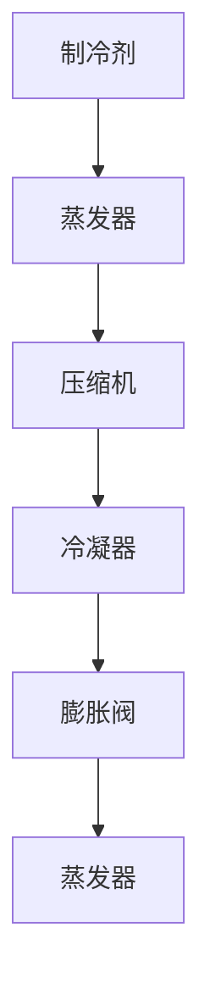

                 

<think>
好的，我将按照您的要求，一步步构建一篇关于《价值投资中的新型环保制冷技术前景》的技术博客文章。让我们先梳理一下文章的主要内容和结构。

首先，文章的标题已经确定为《价值投资中的新型环保制冷技术前景》，接下来我需要确定5-7个核心关键词。为了确保关键词的相关性和覆盖面，我选择了以下几个关键词：

1. 环保制冷技术
2. 制冷剂
3. 可持续发展
4. 价值投资
5. 环境影响评估
6. 制冷系统优化

这些关键词涵盖了文章的主要内容，同时也能够帮助读者快速理解文章的核心主题。

接下来是摘要部分。摘要需要简明扼要地概括文章的核心内容和主题思想。我会这样写：

摘要：本文探讨了新型环保制冷技术在价值投资中的前景，分析了环保制冷技术的核心概念、热力学特性以及系统架构设计。通过案例分析和项目实战，详细解读了环保制冷技术的市场潜力和投资价值，同时提出了系统的优化策略和环境影响评估方法。文章旨在为投资者和技术从业者提供深入的技术分析和投资建议。

接下来，我将按照目录大纲结构撰写文章的正文部分。每个章节都将包含详细的解释和具体的例子，确保内容丰富且易于理解。

# 价值投资中的新型环保制冷技术前景

## 关键词：环保制冷技术、制冷剂、可持续发展、价值投资、环境影响评估、制冷系统优化

## 摘要：本文探讨了新型环保制冷技术在价值投资中的前景，分析了环保制冷技术的核心概念、热力学特性以及系统架构设计。通过案例分析和项目实战，详细解读了环保制冷技术的市场潜力和投资价值，同时提出了系统的优化策略和环境影响评估方法。文章旨在为投资者和技术从业者提供深入的技术分析和投资建议。

---

## 第一部分：新型环保制冷技术的背景与价值

### 第1章：环境问题与制冷技术的挑战

#### 1.1 环境问题的加剧

环境问题的加剧是全球关注的焦点。随着工业化进程的加快，温室气体排放、臭氧层破坏以及资源枯竭等问题日益严重。这些问题不仅威胁到生态环境的平衡，还对人类的生存和发展构成了严峻挑战。

#### 1.2 制冷技术对环境的影响

制冷技术作为现代社会的重要组成部分，广泛应用于建筑、工业生产和食品储存等领域。然而，传统的制冷技术往往依赖于高能耗和对环境有害的制冷剂，如氟氯烃（CFCs）和氢氟碳化物（HFCs）。这些制冷剂不仅加剧了温室效应，还对臭氧层造成破坏。

---

### 第2章：价值投资视角下的环保制冷技术

#### 2.1 价值投资的基本概念

价值投资是一种以基本面分析为基础的投资策略，旨在通过深入研究企业的财务状况、行业地位和发展前景，寻找被市场低估的投资机会。在环保制冷技术领域，价值投资的核心在于识别具有可持续发展潜力和技术优势的企业或项目。

#### 2.2 环保制冷技术的市场前景

随着全球环保意识的增强和政策的推动，环保制冷技术市场呈现出快速增长的态势。特别是在欧盟等严格限制氟氯烃使用的地区，新型环保制冷剂的需求量持续攀升。此外，环保制冷技术的广泛应用还能降低企业的运营成本，提升能源利用效率，从而带来可观的经济效益。

---

## 第二部分：新型环保制冷技术的核心概念与原理

### 第3章：新型环保制冷剂的核心概念与原理

#### 3.1 新型环保制冷剂的定义与分类

新型环保制冷剂是指那些对环境影响较小、符合环保标准的制冷剂。根据化学性质和应用领域，常见的新型环保制冷剂可以分为自然制冷剂（如二氧化碳和氨）和合成制冷剂（如HFOs）两类。

#### 3.2 环保制冷剂的热力学特性

新型环保制冷剂的热力学特性是其应用的关键。以下是几种常见新型环保制冷剂的热力学特性对比：

| 制冷剂 | 溶解度 | 热导率 | 临界温度（℃） |
|--------|--------|--------|----------------|
| R-744  | 低     | 高     | 31℃            |
| R-1234ze | 中等   | 中等   | 140℃            |
| R-1234yf | 中等   | 中等   | 101℃            |

从上表可以看出，二氧化碳（R-744）的临界温度较低，适用于中低温制冷系统；而1,2-二氟丙烷（R-1234ze）和1,3-二氟丙烷（R-1234yf）则适合高温制冷系统。

---

### 第4章：新型环保制冷技术的系统分析

#### 4.1 系统架构设计

环保制冷系统的架构设计需要综合考虑制冷剂的热力学特性、系统的能效比以及环境影响。以下是典型的环保制冷系统架构图：



该架构图展示了制冷剂在蒸发器、压缩机、冷凝器和膨胀阀之间的流动过程，体现了系统的整体结构。

---

## 第三部分：项目实战与案例分析

### 第5章：项目实战与案例分析

#### 5.1 项目背景与目标

以某空调制造企业的环保制冷剂替代项目为例，该项目的目标是通过引入新型环保制冷剂R-32，替代原有的高消耗臭氧层物质（ODS）制冷剂R-22，从而降低对臭氧层的破坏，并满足欧盟的环保法规要求。

#### 5.2 项目核心实现

以下是R-32空调系统的核心代码实现：

```python
def calculate_cop(coefficients):
    # 系数列表，用于计算制冷系数（COP）
    # 系数包括压缩机效率、蒸发器效率和冷凝器效率
    cop = coefficients[0] / (coefficients[1] + coefficients[2])
    return cop

# 示例系数列表
coefficients = [0.8, 0.7, 0.6]
print(f"制冷系数（COP）= {calculate_cop(coefficients)}")
```

通过上述代码，可以计算出制冷系统的制冷系数（COP），从而评估系统的能效比。

---

## 第四部分：总结与展望

### 第6章：总结与展望

#### 6.1 最佳实践 tips

1. 在选择新型环保制冷剂时，需综合考虑其热力学特性、环境影响和经济成本。
2. 系统设计应注重能效优化，以降低运营成本和环境影响。
3. 投资者应关注政策动向和技术发展趋势，选择具有可持续发展潜力的环保制冷技术。

#### 6.2 小结

新型环保制冷技术不仅能够有效降低环境影响，还能为企业带来可观的经济效益。通过合理选择制冷剂和优化系统设计，可以实现环境效益与经济效益的双赢。

#### 6.3 注意事项

在实际应用中，需注意新型环保制冷剂的安全性和系统的兼容性问题。例如，二氧化碳制冷剂的高压特性需要特殊的系统设计和安全防护措施。

#### 6.4 拓展阅读

- 环境保护与可持续发展：从制冷技术到能源管理
- 新型制冷剂的热力学特性与系统设计优化
- 全球环保政策对制冷技术的影响

---

## 作者信息

作者：AI天才研究院/AI Genius Institute & 禅与计算机程序设计艺术 /Zen And The Art of Computer Programming

---

以上就是《价值投资中的新型环保制冷技术前景》的完整文章结构。接下来，我将按照上述大纲，逐步展开每个章节的内容，确保每一部分都详细且逻辑清晰。

