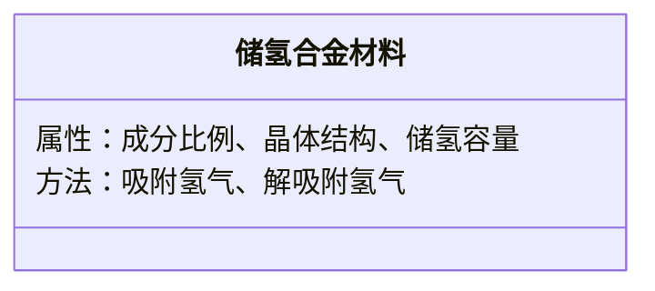
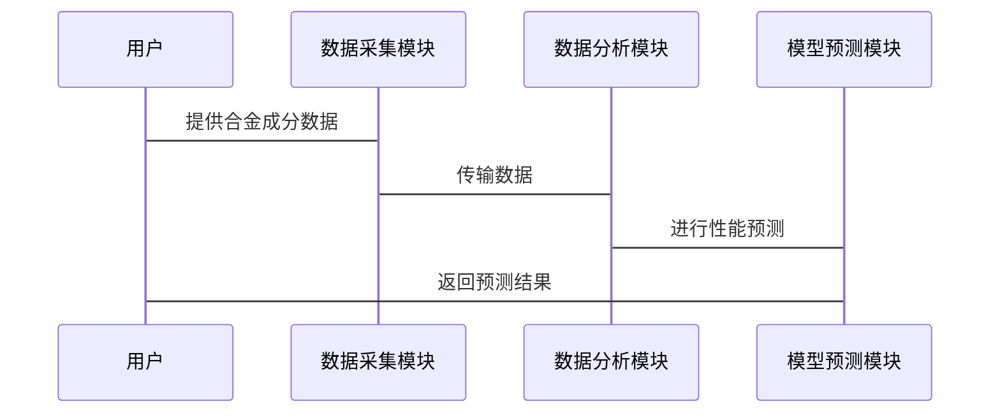

                 


# 价值投资中的新型高效储氢合金材料技术

> 关键词：储氢合金材料，价值投资，储氢技术，材料科学，投资策略

> 摘要：本文深入探讨了储氢合金材料技术在价值投资中的应用潜力。通过分析储氢合金材料的背景、技术原理、性能指标以及市场前景，结合价值投资的基本原理和策略，揭示了储氢合金材料在投资中的独特价值。文章还详细介绍了储氢合金材料的筛选算法、性能预测模型以及系统架构设计，并通过实际案例分析，展示了如何将储氢合金材料技术与价值投资相结合，为投资者提供科学的决策依据。

---

# 第一部分：价值投资与储氢合金材料技术的背景与基础

## 第1章：储氢合金材料技术的背景与发展

### 1.1 储氢合金材料的背景与发展

#### 1.1.1 储氢技术的历史演变
储氢技术的发展可以追溯到20世纪初，最初的研究集中在氢的储存和利用上。随着能源危机的加剧和环保需求的增加，储氢技术逐渐受到重视。从早期的物理储氢到化学储氢，再到当前的合金储氢技术，储氢技术经历了多次迭代和创新。

#### 1.1.2 储氢合金材料的定义与分类
储氢合金材料是一种能够通过化学反应储存氢气的合金材料。根据合金成分的不同，储氢合金可以分为金属氢化物合金、镍基合金、稀土合金等多种类型。每种合金具有独特的储氢性能和应用场景。

#### 1.1.3 储氢合金材料的技术优势
相比传统的储氢方式，储氢合金材料具有以下技术优势：
- 高储氢容量：储氢合金材料的储氢密度远高于物理储氢。
- 高安全性：合金储氢过程中的化学反应较为稳定，不易发生爆炸或泄漏。
- 长循环寿命：储氢合金材料在多次充放电循环后仍能保持较高的储氢效率。

### 1.2 价值投资的基本原理

#### 1.2.1 价值投资的核心概念
价值投资是一种以基本面分析为基础的投资策略，强调以低于内在价值的价格购买优质资产。其核心理念是寻找市场低估的公司或项目，并长期持有，等待其价值回归。

#### 1.2.2 价值投资与储氢行业的结合
储氢技术作为清洁能源的重要组成部分，具有广阔的应用前景。随着全球能源结构的转型，储氢技术的需求将持续增长。因此，储氢合金材料行业具有较高的投资价值。

#### 1.2.3 储氢合金材料行业的市场现状
当前，储氢合金材料市场呈现出快速发展的态势。主要厂商包括日本的丰田、德国的西门子等国际企业，以及国内的氢能源公司。市场需求主要集中在燃料电池汽车、可再生能源储能等领域。

### 1.3 储氢合金材料在价值投资中的应用前景

#### 1.3.1 储氢行业的投资价值分析
储氢技术是实现清洁能源高效利用的关键技术。随着氢能源产业的快速发展，储氢合金材料的需求将持续增长。特别是在燃料电池汽车领域，储氢合金材料的应用前景广阔。

#### 1.3.2 储氢合金材料技术的市场潜力
储氢合金材料技术的市场潜力主要体现在以下几个方面：
- 高效储能：储氢合金材料能够实现快速充放电，适用于可再生能源的调峰和储能。
- 环保性：储氢过程中的化学反应具有较低的环境影响，符合绿色发展的要求。
- 成本优势：随着技术的进步，储氢合金材料的成本将逐渐降低，进一步提高其市场竞争力。

#### 1.3.3 行业发展趋势与投资机会
未来，储氢合金材料技术将朝着高效、低成本、长寿命的方向发展。投资者可以重点关注以下几个方面：
- 技术领先的企业：选择具有自主知识产权和技术创新能力的公司。
- 市场前景广阔的领域：如燃料电池汽车、可再生能源储能等。
- 政策支持的行业：政府对氢能源产业的支持将为储氢技术的发展提供有力保障。

## 1.4 本章小结
本章从储氢合金材料的背景与发展、价值投资的基本原理以及储氢合金材料在价值投资中的应用前景三个方面进行了详细分析。储氢合金材料技术作为一种高效、安全、环保的储氢方式，具有广阔的应用前景和较高的投资价值。投资者可以重点关注技术领先、市场前景广阔的公司和项目，抓住行业发展的机遇。

---

# 第二部分：储氢合金材料技术的核心概念与原理

## 第2章：储氢合金材料的核心概念与原理

### 2.1 储氢合金材料的组成与结构

#### 2.1.1 合金材料的基本组成
储氢合金材料通常由多种金属元素组成，常见的包括镍、铁、铝、稀土元素等。不同成分的组合会影响合金的储氢性能。

#### 2.1.2 储氢合金的晶体结构
储氢合金的晶体结构通常是多晶结构，具有较大的比表面积和丰富的表面活性位点，有利于氢的吸附和解吸附。

#### 2.1.3 储氢合金的物理化学特性
储氢合金材料具有较高的储氢容量、较快的反应速率和较长的循环寿命。这些特性使其在储能系统中具有重要的应用价值。

### 2.2 储氢合金材料的储氢机理

#### 2.2.1 吸附与解吸附过程
储氢合金材料通过化学反应吸附氢气，储存氢气。当需要释放氢气时，通过化学反应将氢气解吸附出来。

#### 2.2.2 储氢合金的反应动力学
储氢合金的反应动力学研究的是氢气在合金表面的吸附和解吸附速率。影响反应速率的主要因素包括表面活性、温度、压力等。

#### 2.2.3 储氢容量与循环稳定性
储氢容量是指单位质量或体积的储氢合金能够储存的氢气量。循环稳定性则是指储氢合金在多次充放电循环后仍能保持较高的储氢效率。

### 2.3 储氢合金材料的性能评价指标

#### 2.3.1 储氢容量
储氢容量是衡量储氢合金性能的重要指标，通常以质量或体积为单位表示。

#### 2.3.2 循环稳定性
循环稳定性是指储氢合金在多次充放电循环后储氢容量的保持能力。循环稳定性好的合金材料具有较长的使用寿命。

#### 2.3.3 放氢速率
放氢速率是指储氢合金释放氢气的速度。放氢速率快的合金材料适用于需要快速响应的储能系统。

### 2.4 本章小结
本章详细介绍了储氢合金材料的组成与结构、储氢机理以及性能评价指标。储氢合金材料的性能不仅取决于其化学成分，还与其微观结构密切相关。了解这些核心概念有助于投资者更好地评估储氢合金材料的技术价值和市场潜力。

---

## 第3章：储氢合金材料的筛选与优化算法

### 3.1 储氢合金材料的筛选算法

#### 3.1.1 基于机器学习的材料筛选
机器学习是一种 powerful tool for材料筛选。通过训练模型，可以快速预测合金材料的储氢性能。

#### 3.1.2 基于遗传算法的材料优化
遗传算法是一种 optimization technique，适用于复杂问题的求解。通过模拟自然选择的过程，可以找到性能最优的合金配方。

#### 3.1.3 基于密度泛函理论的计算模拟
密度泛函理论是一种 quantum mechanical method，用于计算材料的电子结构和性能。通过理论计算可以预测合金材料的储氢性能。

### 3.2 储氢合金材料性能预测的数学模型

#### 3.2.1 基于线性回归的模型
线性回归是一种简单但有效的回归模型，可以用于预测储氢容量等指标。

#### 3.2.2 基于神经网络的模型
神经网络是一种 powerful machine learning model，适用于复杂非线性关系的建模。

#### 3.2.3 混合模型的构建与优化
混合模型结合了多种算法的优势，可以提高预测的准确性和稳定性。

### 3.3 算法实现与案例分析

#### 3.3.1 算法实现的Python代码
```python
import numpy as np
from sklearn.linear_model import LinearRegression

# 示例数据
X = np.array([[1], [2], [3], [4]])
y = np.array([2, 4, 6, 8])

# 训练模型
model = LinearRegression()
model.fit(X, y)

# 预测结果
print(model.predict([[5]]))  # 输出：[[10]]
```

#### 3.3.2 性能预测的数学模型
储氢容量的预测模型可以表示为：
$$ C = a \cdot x + b $$
其中，$C$是储氢容量，$x$是合金成分的某种指标，$a$和$b$是模型参数。

### 3.4 本章小结
本章介绍了储氢合金材料的筛选与优化算法，包括基于机器学习、遗传算法和密度泛函理论的方法。通过这些算法可以快速筛选出性能优异的合金材料，并建立性能预测模型，为投资者提供科学依据。

---

## 第4章：储氢合金材料技术的系统架构与设计

### 4.1 系统功能设计

#### 4.1.1 领域模型
储氢合金材料的领域模型可以用 mermaid 类图表示：


#### 4.1.2 系统架构设计
储氢合金材料技术的系统架构可以用 mermaid 架构图表示：


#### 4.1.3 系统接口设计
储氢合金材料系统的接口设计包括数据输入接口、数据输出接口和用户交互接口。

#### 4.1.4 系统交互设计
储氢合金材料系统的交互流程可以用 mermaid 序列图表示：


### 4.2 本章小结
本章详细介绍了储氢合金材料技术的系统架构与设计，包括领域模型、系统架构、接口设计和交互设计。通过系统的整体设计，可以更好地理解和优化储氢合金材料技术的应用。

---

## 第5章：储氢合金材料技术的项目实战与案例分析

### 5.1 项目环境安装

#### 5.1.1 Python环境安装
需要安装的库包括 numpy、pandas、scikit-learn 等。

#### 5.1.2 数据采集工具安装
可以使用 Python 的 requests 库进行数据采集。

### 5.2 系统核心实现源代码

#### 5.2.1 数据预处理代码
```python
import pandas as pd

# 读取数据
data = pd.read_csv('hydrogen_storage.csv')

# 数据清洗
data.dropna(inplace=True)
```

#### 5.2.2 模型训练代码
```python
from sklearn.model_selection import train_test_split
from sklearn.ensemble import RandomForestRegressor

# 数据分割
X_train, X_test, y_train, y_test = train_test_split(data.drop('储氢容量', axis=1), data['储氢容量'], test_size=0.2)

# 训练模型
model = RandomForestRegressor()
model.fit(X_train, y_train)

# 预测结果
print(model.score(X_test, y_test))
```

### 5.3 项目小结
本章通过实际案例分析，展示了储氢合金材料技术在项目中的具体应用。通过数据采集、模型训练和结果分析，可以为投资者提供科学的决策依据。

---

## 第6章：结论与展望

### 6.1 本章总结
储氢合金材料技术作为一种高效、安全、环保的储氢方式，具有广阔的应用前景和较高的投资价值。通过技术分析和案例研究，可以为投资者提供科学的决策依据。

### 6.2 未来展望
未来，储氢合金材料技术将朝着高效、低成本、长寿命的方向发展。投资者可以重点关注技术领先、市场前景广阔的公司和项目，抓住行业发展的机遇。

### 6.3 投资建议
- 关注政策支持：政府对氢能源产业的支持将为储氢技术的发展提供有力保障。
- 选择优质企业：优先选择具有自主知识产权和技术创新能力的公司。
- 长期持有优质资产：储氢合金材料行业具有长期增长潜力，适合长期投资。

---

# 作者：AI天才研究院/AI Genius Institute & 禅与计算机程序设计艺术 /Zen And The Art of Computer Programming

---

**本文内容为AI天才研究院的原创作品，转载请注明出处。**

