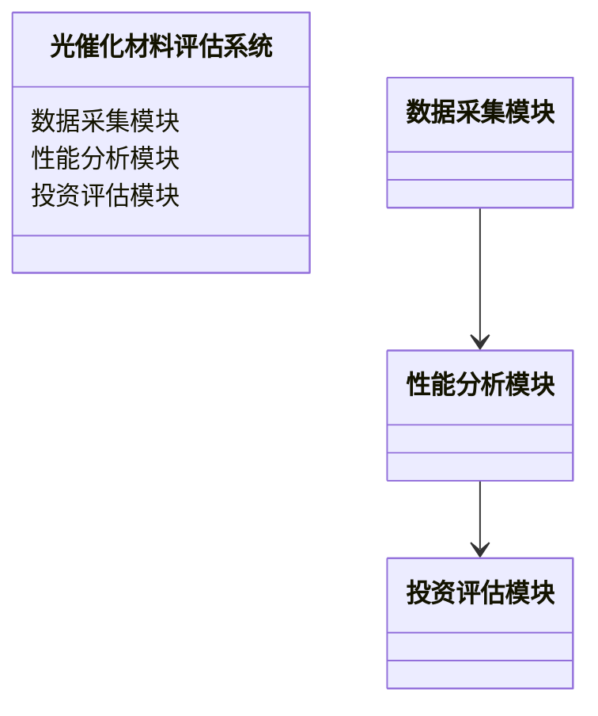

                 


# 价值投资中的新型高效光催化材料技术

---

## 关键词

光催化材料，价值投资，高效光催化，投资分析，技术评估，市场潜力

---

## 摘要

本文深入探讨了新型高效光催化材料技术在价值投资中的应用。首先，我们介绍了光催化材料的基本概念、分类及其在投资中的重要性。接着，我们分析了光催化材料的核心原理，包括其组成、结构和性能，以及影响效率的关键因素。然后，我们详细讲解了光催化材料的数学模型和算法原理，包括量子产率的计算和表面活性位点的分析。通过构建系统模型和架构设计，我们展示了如何评估光催化材料的投资价值。最后，我们通过实际案例分析了光催化材料的市场潜力，并总结了最佳投资策略和注意事项。

---

# 第一部分: 光催化材料与价值投资的背景

## 第1章: 光催化材料的基本概念

### 1.1 光催化材料的定义与分类

光催化材料是指在光的作用下能够引发化学反应的材料。它们通常具有纳米级结构和特定的能带结构，以提高光吸收和电子跃迁效率。光催化材料主要分为半导体材料、金属氧化物和有机光敏材料等类别。其主要应用领域包括水净化、太阳能转换和污染物降解等。

### 1.2 价值投资的基本原理

价值投资是一种投资策略，强调以低于内在价值的价格购买优质资产。其核心理念是通过深入分析企业的基本面，寻找被市场低估的投资机会。在科技领域，价值投资尤其关注那些具有创新技术和良好市场前景的公司。

---

## 第2章: 新型高效光催化材料技术的背景

### 2.1 光催化技术的发展历程

光催化技术起源于20世纪70年代，最初用于水的净化处理。随着纳米技术的发展，光催化材料的结构和性能得到了显著提升，尤其是在提高光吸收效率和电子转移速率方面。

### 2.2 高效光催化材料的特性

高效光催化材料具有高量子产率、优异的催化活性和良好的稳定性。其制备方法包括溶胶-凝胶法、水热合成法和化学气相沉积法等。

### 2.3 光催化材料在投资中的应用前景

光催化材料的市场需求潜力巨大，尤其是在环保和能源领域。投资者可以通过分析光催化材料的市场定位、技术壁垒和商业化路径来评估其投资价值。

---

# 第二部分: 光催化材料的核心概念与联系

## 第3章: 光催化材料的核心原理

### 3.1 光催化材料的基本原理

光催化材料通过吸收光能，激发电子从价带跃迁到导带，从而引发化学反应。其能带结构和表面活性位点是影响光催化效率的关键因素。

### 3.2 光催化材料的关键属性

光催化材料的吸收光谱特性决定了其对不同波长光的响应能力。催化活性和稳定性是衡量其性能的重要指标。

### 3.3 光催化材料的结构优化

通过纳米结构设计和表面修饰，可以提高光催化材料的表面积和电子转移效率。复合材料的协同效应也显著提升了其催化性能。

---

## 第4章: 光催化材料的核心概念与联系

### 4.1 光催化材料的核心概念

光催化材料的组成、功能和性能指标是其在投资中的核心考量因素。其技术创新和市场需求直接影响其投资价值。

### 4.2 光催化材料与价值投资的关系

光催化材料的技术进步推动了其在环保和能源领域的广泛应用，为投资者提供了新的投资机会。市场需求和商业化路径是评估其投资潜力的关键因素。

---

## 第5章: 光催化材料的核心原理与数学模型

### 5.1 光催化反应的数学模型

光催化反应的量子产率（QY）可以通过公式计算：

$$ QY = \frac{\text{产物的摩尔数}}{\text{入射光子的摩尔数}} $$

光催化材料的能带结构可以用以下公式描述：

$$ E_g = E_c - E_v $$

其中，$E_g$ 是禁带宽度，$E_c$ 是导带能量，$E_v$ 是价带能量。

---

# 第三部分: 系统分析与架构设计

## 第6章: 系统分析与架构设计

### 6.1 系统功能设计

光催化材料评估系统包括数据采集、性能分析和投资评估三个功能模块。其领域模型可以用以下mermaid类图表示：



### 6.2 系统架构设计

系统架构采用分层设计，包括数据层、业务逻辑层和用户界面层。其架构可以用以下mermaid图表示：


---

## 第7章: 项目实战

### 7.1 环境安装

安装Python和必要的科学计算库，如NumPy和Matplotlib。

### 7.2 核心代码实现

以下是光催化材料性能评估的Python代码示例：

```python
import numpy as np
import matplotlib.pyplot as plt

def calculate_quantum_yield(photochemical_yield):
    return photochemical_yield * 100

def plot_spectra(wavelengths, intensities):
    plt.plot(wavelengths, intensities)
    plt.xlabel('Wavelength (nm)')
    plt.ylabel('Intensity')
    plt.show()

# 示例数据
wavelengths = np.arange(300, 500, 10)
intensities = np.random.rand(len(wavelengths)) * 50
photochemical_yield = 0.8

# 计算量子产率
qy = calculate_quantum_yield(photochemical_yield)
print(f"Quantum Yield: {qy}%")

# 绘制吸收光谱
plot_spectra(wavelengths, intensities)
```

### 7.3 案例分析

以某新型光催化材料为例，分析其市场定位、技术壁垒和商业化路径，评估其投资价值。

---

## 第四部分: 最佳实践

## 第8章: 最佳实践

### 8.1 投资策略

投资者应关注光催化材料的技术创新、市场需求和商业化潜力，选择具有竞争优势的企业进行投资。

### 8.2 注意事项

避免盲目跟风，注重长期价值，关注政策支持和行业趋势。

### 8.3 拓展阅读

推荐阅读《光催化材料的理论与应用》和《价值投资实战》等书籍，以深入了解相关领域的知识。

---

## 作者

作者：AI天才研究院/AI Genius Institute & 禅与计算机程序设计艺术 /Zen And The Art of Computer Programming

