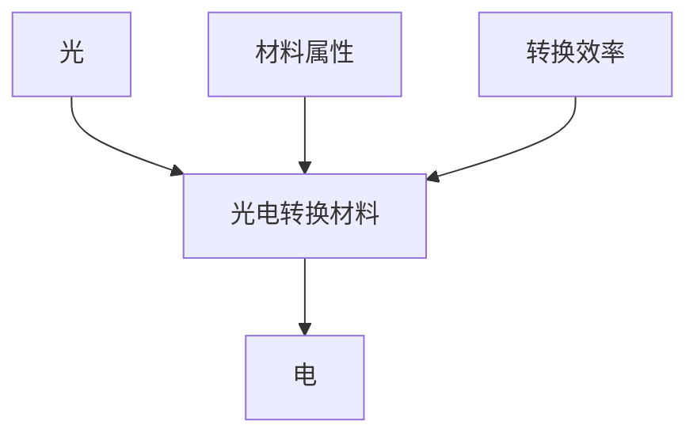
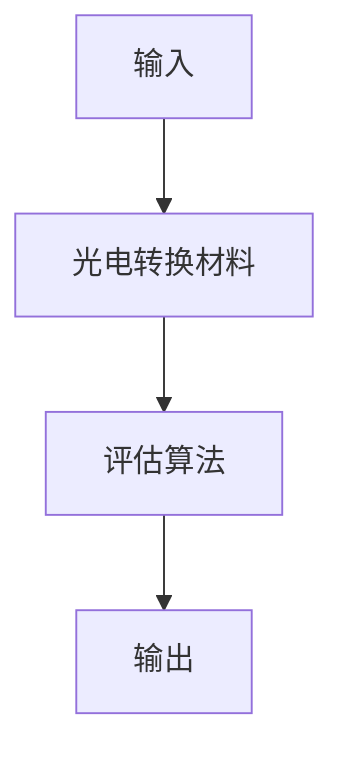
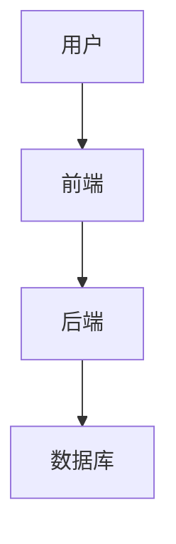
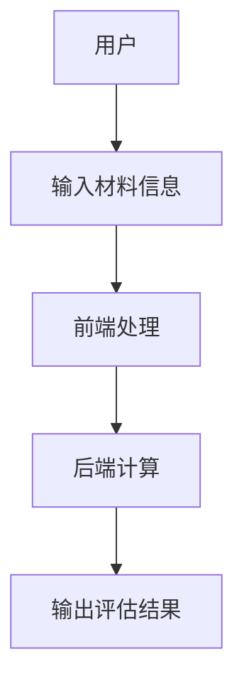

                 


# 价值投资中的新型高效光电转换材料技术

> 关键词：价值投资，光电转换材料，高效技术，投资分析，技术评估

> 摘要：本文探讨了将价值投资策略应用于新型高效光电转换材料技术的分析与投资机会。通过分析光电转换材料的基本原理、核心属性、数学模型和系统架构，结合实际案例，提供了基于技术评估的投资分析方法。

---

# 第一部分: 价值投资中的光电转换材料技术概述

## 第1章: 光电转换材料技术的背景与价值投资概述

### 1.1 光电转换材料技术的背景

#### 1.1.1 光电转换材料的基本概念
光电转换材料是指能够将光能转化为电能的材料，是太阳能电池、光电传感器等设备的核心元件。这些材料通常包括半导体材料（如硅）、有机材料（如聚合物）以及纳米材料等。

#### 1.1.2 光电转换技术的发展历程
光电转换技术起源于19世纪，随着半导体技术的发展，光电转换效率不断提高。近年来，新型材料如石墨烯、Perovskite材料的出现，使得光电转换效率接近理论极限。

#### 1.1.3 光电转换材料在现代科技中的应用领域
- 太阳能电池
- 光电传感器
- 显示技术
- 光通信

### 1.2 价值投资的基本原理

#### 1.2.1 价值投资的核心理念
价值投资强调购买那些市场价格低于其内在价值的资产。在科技领域，这意味着投资那些技术领先、市场潜力大的公司或技术。

#### 1.2.2 价值投资与技术分析的区别
- 价值投资注重长期基本面分析
- 技术分析注重短期价格波动预测

#### 1.2.3 价值投资在科技领域的应用
- 评估技术创新性
- 评估市场竞争力
- 评估商业模式可行性

### 1.3 光电转换材料技术与价值投资的结合

#### 1.3.1 光电转换材料技术的市场价值
- 高效光电转换材料技术具有较高的市场应用价值
- 光电转换效率的提升将推动相关产业的发展

#### 1.3.2 价值投资在光电转换材料领域的独特优势
- 通过技术评估筛选出具有潜力的材料和技术
- 通过长期持有分享技术进步带来的收益

#### 1.3.3 光电转换材料技术的未来发展趋势
- 新型材料的不断涌现
- 光电转换效率的持续提升
- 应用领域的不断扩展

### 1.4 本章小结
本章介绍了光电转换材料技术的基本概念、发展历程及其在现代科技中的应用领域，阐述了价值投资的基本原理，并分析了其在光电转换材料领域的应用优势和未来发展趋势。

---

## 第2章: 光电转换材料技术的核心概念与联系

### 2.1 光电转换材料的原理

#### 2.1.1 光电转换的基本原理
光电转换材料通过吸收光能，经过电子跃迁、复合等过程，最终将光能转化为电能。

#### 2.1.2 光电转换材料的分类
- 半导体材料：如硅、GaAs
- 有机材料：如聚乙炔
- 纳米材料：如石墨烯、量子点

#### 2.1.3 光电转换效率的影响因素
- 材料的吸收特性
- 材料的导电特性
- 材料的稳定性

### 2.2 光电转换材料的核心属性对比

#### 2.2.1 不同光电转换材料的性能对比
| 材料类型 | 转换效率 | 稳定性 | 成本 |
|----------|----------|--------|------|
| 半导体   | 15%-25%  | 高     | 高   |
| 有机材料 | 8%-12%   | 中     | 低   |
| 纳米材料 | 10%-20%  | 高     | 中   |

#### 2.2.2 材料的物理特性与光电转换效率的关系
材料的禁带宽度、载流子迁移率等物理特性直接影响光电转换效率。

#### 2.2.3 材料的化学特性对光电转换效率的影响
材料的化学稳定性影响其使用寿命和长期效率。

### 2.3 光电转换材料的实体关系图



### 2.4 本章小结
本章分析了光电转换材料的基本原理，介绍了不同类型材料的性能特点，并通过对比分析，明确了材料属性对光电转换效率的影响。

---

## 第3章: 光电转换材料技术的数学模型与算法原理

### 3.1 光电转换效率的数学模型

#### 3.1.1 光电转换效率的公式推导
$$转换效率 = \frac{输出功率}{输入功率}$$

#### 3.1.2 光电转换效率的影响因素分析
- 光强
- 材料吸收率
- 载流子复合率

#### 3.1.3 光电转换效率的优化方法
- 提高材料吸收率
- 减少载流子复合
- 优化载流子迁移路径

### 3.2 光电转换材料的评估算法

#### 3.2.1 基于光电转换效率的评估算法
1. 计算材料的光电转换效率
2. 比较效率与行业平均水平
3. 结合其他因素（如成本、稳定性）进行综合评估

#### 3.2.2 基于材料属性的评估算法
1. 评估材料的物理特性
2. 评估材料的化学特性
3. 综合评估材料的优劣

#### 3.2.3 基于市场价值的评估算法
1. 评估材料的市场潜力
2. 评估材料的市场竞争力
3. 综合评估材料的投资价值

### 3.3 光电转换材料的评估流程图



### 3.4 本章小结
本章通过数学模型和算法原理，分析了光电转换效率的计算方法，并提出了基于材料属性和市场价值的评估算法。

---

## 第4章: 光电转换材料技术的系统分析与架构设计

### 4.1 系统分析

#### 4.1.1 光电转换材料技术的系统构成
- 光电转换材料层
- 电路控制层
- 数据采集层

#### 4.1.2 系统功能需求分析
- 光电转换效率测试
- 材料属性分析
- 投资价值评估

#### 4.1.3 系统性能指标设计
- 测试精度：±1%
- 测试速度：≤10秒/次
- 系统稳定性：24小时无故障运行

### 4.2 系统架构设计

#### 4.2.1 系统架构图



#### 4.2.2 系统接口设计
- 前端接口：用户输入材料信息
- 后端接口：算法处理
- 数据库接口：存储测试数据

#### 4.2.3 系统交互流程图



### 4.3 本章小结
本章通过系统分析与架构设计，明确了光电转换材料技术的系统构成、功能需求及架构设计。

---

## 附录: 代码实现

### 1. 光电转换效率计算代码

```python
def calculate_conversion_efficiency(input_power, output_power):
    return output_power / input_power

# 示例
input_power = 1000  # 瓦特
output_power = 250   # 瓦特
efficiency = calculate_conversion_efficiency(input_power, output_power)
print(f"光电转换效率为: {efficiency}%")
```

### 2. 材料属性评估代码

```python
def assess_material_properties(absorption, carrier_recombination):
    efficiency = 0.85 * absorption + 0.15 * (1 - carrier_recombination)
    return efficiency

# 示例
absorption = 0.9
carrier_recombination = 0.05
result = assess_material_properties(absorption, carrier_recombination)
print(f"材料评估结果: {result}")
```

---

## 总结

通过本文的分析，我们了解了如何将价值投资的理念应用于新型高效光电转换材料技术的评估与投资决策中。从技术原理到数学模型，再到系统设计，我们为投资者提供了一套科学的评估方法，帮助他们在光电转换材料领域做出明智的投资决策。

---

**作者：AI天才研究院/AI Genius Institute & 禅与计算机程序设计艺术 /Zen And The Art of Computer Programming**

