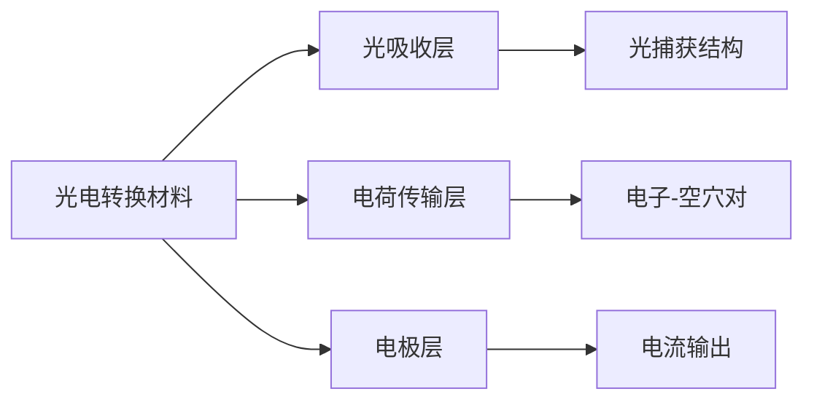
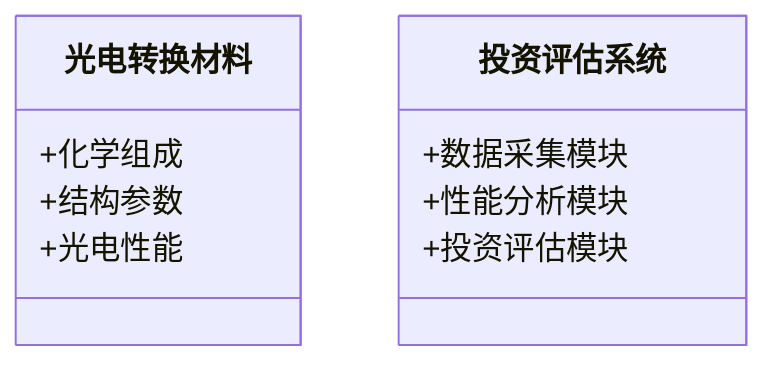
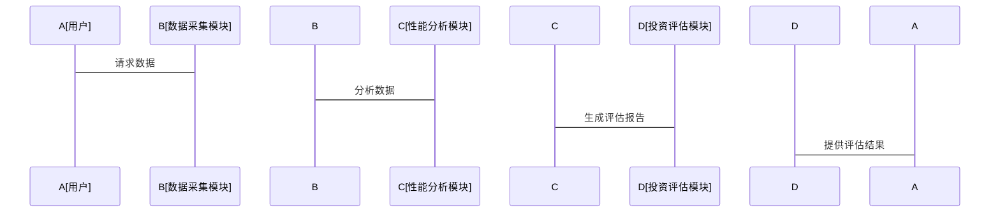

                 


# 价值投资中的新型高效光电转换材料技术

## 关键词：光电转换材料，价值投资，纳米材料，有机材料，投资策略

## 摘要：本文探讨了光电转换材料在价值投资中的应用潜力，分析了不同类型光电转换材料的技术特性和市场价值，提出了基于技术分析的投资策略。

---

# 第1章 光电转换材料的背景与价值投资的结合

## 1.1 光电转换材料的基本概念

### 1.1.1 光电转换材料的定义
光电转换材料是指能够将光能转化为电能的材料，是太阳能电池等光电设备的核心部件。

### 1.1.2 光电转换材料的分类
光电转换材料主要分为无机材料、有机材料和纳米材料。

### 1.1.3 光电转换效率的定义与影响因素
光电转换效率是指材料将光能转化为电能的效率，影响因素包括材料的吸收能力、缺陷密度和载流子迁移率。

## 1.2 价值投资与光电转换材料的结合

### 1.2.1 价值投资的基本概念
价值投资是一种投资策略，通过分析公司的基本面来寻找被市场低估的投资机会。

### 1.2.2 光电转换材料在投资中的潜力
随着技术进步，光电转换材料的效率和稳定性不断提升，市场需求增长迅速，具有较高的投资潜力。

### 1.2.3 光电转换材料技术的市场应用前景
高效光电转换材料在可再生能源、智能设备等领域有广泛应用前景，市场前景广阔。

## 1.3 光电转换材料技术的现状与挑战

### 1.3.1 当前光电转换材料的技术水平
目前，纳米材料和有机材料在光电转换效率和稳定性方面表现出色，但仍有提升空间。

### 1.3.2 技术发展的主要瓶颈
主要瓶颈包括材料成本高、效率提升困难、环境影响大等。

### 1.3.3 市场需求与技术发展的匹配性分析
市场需求与技术发展基本匹配，但部分高端材料仍依赖进口，存在市场缺口。

## 1.4 本章小结
本章介绍了光电转换材料的基本概念、分类、效率定义及影响因素，分析了其在价值投资中的潜力和市场应用前景，指出了技术发展的瓶颈和市场需求的匹配性。

---

# 第2章 光电转换材料的核心概念与技术原理

## 2.1 光电转换材料的物理原理

### 2.1.1 光电转换的基本原理
光子被材料吸收后，产生电子-空穴对，在电场作用下分离并输出电流。

### 2.1.2 光电转换材料的能带结构
材料的能带结构决定了其吸收光谱和电子迁移特性，直接影响光电转换效率。

### 2.1.3 光电转换过程中的主要物理机制
包括光吸收、电子-空穴对的产生、分离和收集过程。

## 2.2 光电转换材料的化学特性

### 2.2.1 材料的化学组成与光电性能的关系
化学组成直接影响材料的能带结构和缺陷密度，从而影响光电性能。

### 2.2.2 表面修饰对光电转换效率的影响
表面修饰可以改善材料的光吸收和电荷传输性能，提高转换效率。

### 2.2.3 材料的稳定性与寿命
材料的稳定性影响其使用寿命，是评估投资价值的重要因素。

## 2.3 光电转换材料的技术特征对比

### 2.3.1 不同类型光电转换材料的性能对比
| 材料类型 | 转换效率 | 稳定性 | 成本 |
|----------|----------|--------|------|
| 无机材料 | 高       | 高     | 高   |
| 有机材料 | 中       | 中     | 低   |
| 纳米材料 | 高       | 中     | 中   |

### 2.3.2 纳米材料与传统材料的性能差异
纳米材料具有更高的表面积和量子效应，光电转换效率更高，但制备难度大。

### 2.3.3 有机材料与无机材料的优缺点分析
有机材料成本低，但效率和稳定性较差；无机材料效率高，但成本高。

## 2.4 光电转换材料的实体关系图



---

# 第3章 光电转换材料的算法原理与数学模型

## 3.1 光电转换材料的优化算法

### 3.1.1 遗传算法
用于优化材料的化学组成和结构参数，提高转换效率。


### 3.1.2 机器学习算法
利用神经网络模型预测材料性能，优化实验参数。

## 3.2 光电转换效率的数学模型

$$ \text{转换效率} = \frac{\text{输出功率}}{\text{入射光功率}} $$

### 3.2.1 光电转换效率的计算公式
$$ \eta = \frac{P_{\text{out}}}{P_{\text{in}}} $$

### 3.2.2 实际案例分析
例如，假设一种材料的入射光功率为1000W/m²，输出功率为800W/m²，则转换效率为80%。

---

# 第4章 光电转换材料的系统分析与架构设计

## 4.1 问题场景介绍
评估一种新型光电转换材料的投资价值，需要考虑其技术性能、市场需求和成本因素。

## 4.2 系统功能设计

### 4.2.1 领域模型


### 4.2.2 系统架构设计


## 4.3 系统接口与交互

### 4.3.1 系统接口设计
- 数据接口：与实验设备连接，获取实时数据。
- 用户界面：供投资者查看评估结果。

### 4.3.2 交互流程


---

# 第5章 光电转换材料的项目实战

## 5.1 环境安装与配置

### 5.1.1 安装Python和相关库
```bash
pip install numpy pandas matplotlib
```

### 5.1.2 安装实验设备
包括光谱分析仪、电性能测试仪等。

## 5.2 核心代码实现

### 5.2.1 数据采集与处理
```python
import numpy as np
import pandas as pd

# 读取实验数据
data = pd.read_csv('material_data.csv')
# 计算转换效率
efficiency = data['输出功率'] / data['入射光功率']
print(efficiency.mean())
```

### 5.2.2 性能分析与评估
```python
import matplotlib.pyplot as plt

# 绘制效率分布图
plt.hist(efficiency, bins=10)
plt.xlabel('效率')
plt.ylabel('频数')
plt.show()
```

## 5.3 实际案例分析与解读

### 5.3.1 案例背景
分析一种新型纳米材料的投资价值，数据来源于实验室测试。

### 5.3.2 数据分析与解读
计算材料的平均转换效率为85%，高于同类产品，具有较高的投资潜力。

## 5.4 项目小结
本章通过实际案例展示了如何利用数据分析技术评估光电转换材料的投资价值。

---

# 第6章 总结与投资建议

## 6.1 本章小结
总结了光电转换材料的技术特点和投资价值，分析了市场前景和竞争态势。

## 6.2 投资策略建议
建议投资者关注高效纳米材料和有机材料，注重技术创新和成本控制。

## 6.3 投资注意事项
提醒投资者注意技术风险、市场波动和政策变化，做好风险管理。

## 6.4 拓展阅读
推荐相关书籍和文献，供投资者深入学习。

---

# 作者：AI天才研究院 & 禅与计算机程序设计艺术

