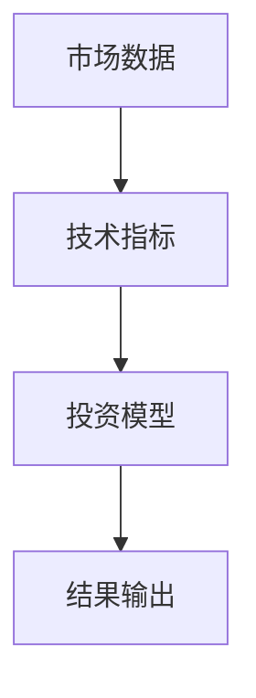

                 


# 价值投资中的新型高效太阳能电池技术

> **关键词**：太阳能电池、高效技术、价值投资、技术分析、系统设计、投资策略

> **摘要**：本文深入探讨了新型高效太阳能电池技术在价值投资中的应用潜力。通过分析异质结和钙钛矿电池等技术的原理、市场价值和投资策略，结合系统设计和实际案例，为投资者提供科学的技术评估和投资建议。

---

## 第一部分：背景与概述

### 第1章：太阳能电池技术的背景与发展

#### 1.1 太阳能电池的定义与分类

- **1.1.1 太阳能电池的基本概念**
  太阳能电池是一种将 sunlight 转化为 electrical energy 的半导体器件，主要由 p-n 结构成。

- **1.1.2 太阳能电池的分类与特点**
  - 第一代：单晶硅和多晶硅电池，效率中等，成本较高。
  - 第二代：薄膜电池，成本低但效率较低。
  - 第三代：新型高效电池，如异质结和钙钛矿电池，效率高且成本低。

- **1.1.3 太阳能电池的历史发展**
  从晶体硅电池到第三代高效技术的演变，推动了光伏发电成本的下降。

#### 1.2 高效太阳能电池的重要性

- **1.2.1 高效电池的定义**
  转换效率超过 20%，具备更高的能量产出和更低的单位成本。

- **1.2.2 高效电池对能源行业的影响**
  通过提高效率和降低成本，推动光伏发电成为主流能源。

- **1.2.3 价值投资视角下的高效电池技术**
  高效技术具备更高的市场竞争力，成为投资的热点领域。

---

## 第二部分：技术基础

### 第2章：太阳能电池的工作原理

#### 2.1 太阳能电池的基本物理原理

- **2.1.1 半导体物理基础**
  半导体材料（如硅）在光照下产生电子-空穴对，形成电流。

- **2.1.2 光电转换机制**
  光子击中半导体表面，产生电子和空穴，通过 PN 结分离，形成电流。

#### 2.2 太阳能电池的材料科学

- **2.2.1 光伏材料的选择与特性**
  不同材料如硅、铜铟镓硒、钙钛矿等的光电性能和成本特点。

- **2.2.2 界面工程与材料优化**
  优化电池表面和界面，减少反射损失，提高吸收效率。

---

## 第三部分：高效太阳能电池技术

### 第3章：新型高效电池技术

#### 3.1 异质结电池技术

- **3.1.1 异质结电池的结构与优势**
  使用不同材料的异质结结构，减少表面反射，提高吸收效率。

- **3.1.2 提升效率的关键技术**
  使用精细的薄膜沉积技术和先进的钝化技术。

#### 3.2 钙钛矿太阳能电池

- **3.2.1 钙钛矿电池的原理与优势**
  钙钛矿材料具备高吸收系数和良好的载流子传输特性，转换效率突破 30%。

- **3.2.2 当前研究进展与挑战**
  成本高、稳定性差，但技术进步迅速。

---

## 第四部分：价值评估与投资策略

### 第4章：高效电池技术的市场价值分析

#### 4.1 技术成熟度与市场潜力

- **4.1.1 技术成熟度评估**
  异质结电池接近商业化，钙钛矿电池处于试验阶段。

- **4.1.2 市场需求与增长预测**
  全球能源转型需求推动，高效电池市场将快速增长。

#### 4.2 投资模型与风险分析

- **4.2.1 投资模型的构建**
  基于技术参数和市场数据的现金流预测模型。

- **4.2.2 风险因素与应对策略**
  技术风险、市场竞争和政策风险的分析与应对。

---

## 第五部分：系统设计与项目实战

### 第5章：高效电池技术投资系统设计

#### 5.1 系统架构设计

- **5.1.1 系统模块划分**
  数据采集、分析处理、投资评估和风险预警模块。

- **5.1.2 系统功能设计**
  实时数据监控、技术参数分析、投资回报预测。

#### 5.2 系统架构图


#### 5.3 数据流图



---

## 第六部分：项目实战

### 第6章：高效电池技术投资实战

#### 6.1 环境搭建

- 安装Python和相关库，如Pandas、Matplotlib、Scikit-learn。

#### 6.2 核心代码实现

```python
import pandas as pd
import numpy as np
import matplotlib.pyplot as plt
from sklearn.linear_model import LinearRegression

# 示例数据
data = pd.DataFrame({
    'Efficiency': [20, 22, 24, 26, 28],
    'Cost': [0.5, 0.45, 0.4, 0.35, 0.3]
})

# 线性回归模型
model = LinearRegression()
model.fit(data[['Efficiency']], data['Cost'])
```

#### 6.3 结果分析

- 预测高效率电池的成本变化趋势，评估投资回报。

---

## 第七部分：总结与展望

### 第7章：总结与未来展望

#### 7.1 全文总结

- 高效太阳能电池技术具备投资价值，技术创新和成本下降推动市场增长。

#### 7.2 未来展望

- 技术突破和政策支持将推动高效电池市场进一步扩大，成为投资热点。

---

## 参考文献

（此处列出相关文献和资源）

---

**作者**：AI天才研究院/AI Genius Institute & 禅与计算机程序设计艺术 /Zen And The Art of Computer Programming

