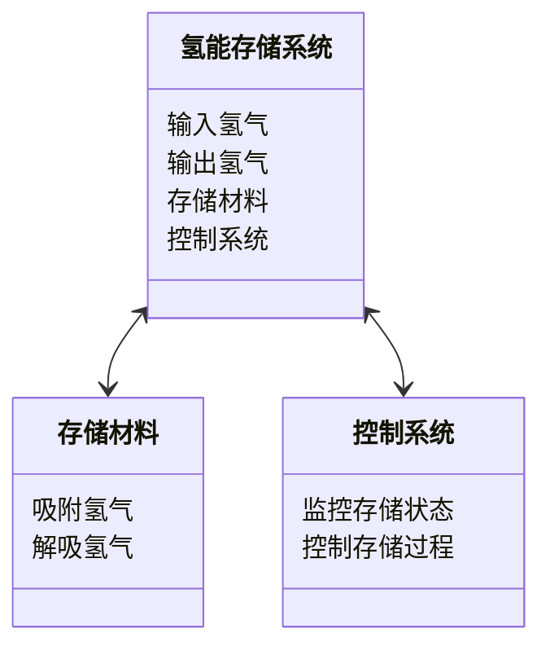
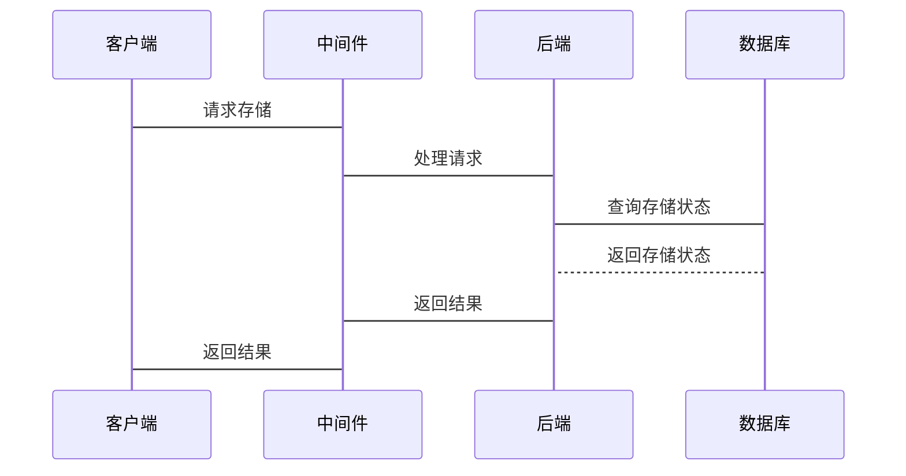

                 


# 价值投资中的新型高效氢能存储材料技术

## 关键词：氢能存储，价值投资，高效材料，技术分析，投资策略，氢能经济

## 摘要：  
氢能作为清洁的能源载体，在全球能源转型中扮演着重要角色。然而，氢能的高效存储技术是实现其广泛应用的关键。本文从技术与投资的双重视角，深入分析新型高效氢能存储材料的技术原理、市场价值和投资机会。通过技术原理的解析、市场趋势的分析以及投资策略的探讨，本文旨在为投资者提供科学的决策依据，助力他们在氢能存储材料领域实现价值投资。

---

# 第1章: 氢能存储技术的背景与价值

## 1.1 氢能存储技术的重要性

### 1.1.1 氢能在能源结构中的地位  
氢能作为一种清洁能源，具有零碳排放、能量密度高、应用范围广等优势。随着全球能源结构转型，氢能被视为实现碳中和目标的重要途径。然而，氢能在生产和储存过程中面临诸多挑战，尤其是储存环节，需要高效、安全的存储技术来支持其大规模应用。

### 1.1.2 氢能存储技术的核心作用  
氢能存储技术是实现氢能高效利用的关键环节。通过新型高效存储材料的应用，可以显著提高氢气的储存密度、降低成本，并延长储存时间。这些技术进步将推动氢能从实验室走向商业化应用。

### 1.1.3 氢能存储技术对能源转型的推动作用  
氢能存储技术的突破将加速能源结构的转型。通过高效存储材料的应用，氢能可以更方便地应用于交通、工业和发电等领域，从而减少对化石能源的依赖，推动全球能源可持续发展。

---

## 1.2 新型高效氢能存储材料的定义与特点

### 1.2.1 新型高效氢能存储材料的定义  
新型高效氢能存储材料是指能够以高效率、高密度的方式储存氢气，并且具有优异的循环稳定性和成本效益的材料。这类材料通常包括合金、碳基材料、氧化物等。

### 1.2.2 新型高效氢能存储材料的核心特点  
1. **高储存密度**：新型材料能够在单位体积或质量内储存更多的氢气，提高储存效率。  
2. **快速吸附与解吸**：材料具有快速的氢气吸附和解吸能力，适用于实时应用。  
3. **高循环稳定性**：材料在多次充放过程中性能保持稳定，使用寿命长。  
4. **成本效益**：材料制备成本低，具有大规模应用的潜力。

### 1.2.3 与传统存储材料的区别与优势  
传统氢气存储材料（如高压气瓶）存在储存密度低、成本高等问题。新型高效氢能存储材料通过技术创新，显著提高了储存效率和经济性，成为氢能存储领域的颠覆性技术。

---

## 1.3 氢能存储技术的市场与投资前景

### 1.3.1 氢能存储技术的市场需求分析  
随着全球对可再生能源需求的增加，氢能存储技术的市场需求快速增长。特别是在工业领域、交通领域和发电领域，对高效氢能存储技术的需求日益迫切。

### 1.3.2 投资者关注的热点领域  
投资者关注的热点领域包括：  
1. **新型存储材料的研发**：支持技术创新的企业。  
2. **氢气储存设施的建设**：氢能储存基础设施的投资。  
3. **氢能产业链整合**：从生产到储存再到应用的全产业链布局。  

### 1.3.3 行业发展趋势与投资机会  
行业发展趋势包括技术突破、政策支持和市场需求增长。投资机会主要集中在技术创新企业、氢能基础设施建设和氢能应用领域。

---

## 1.4 本章小结  
本章从氢能存储技术的重要性出发，分析了新型高效氢能存储材料的定义与特点，并探讨了其市场与投资前景。通过对比传统存储材料，突出了新型材料的优势，为后续的技术分析和投资策略奠定了基础。

---

# 第2章: 新型高效氢能存储材料的技术原理

## 2.1 氢能存储的核心技术原理

### 2.1.1 氢能存储的基本原理  
氢能存储的基本原理是通过物理或化学吸附的方式将氢气储存于特定的材料中。吸附与解吸的过程决定了氢气的储存效率和释放速率。

### 2.1.2 新型材料在氢能存储中的作用  
新型材料通过优化分子结构和化学性质，提高了氢气的吸附能力。例如，合金材料通过金属键合作用快速吸附氢气，而碳基材料则利用多孔结构提高储存密度。

### 2.1.3 材料性能对存储效率的影响  
材料的比表面积、孔隙结构和化学性质直接影响氢气的吸附和解吸效率。高比表面积的材料通常具有更高的储存密度。

---

## 2.2 主要新型高效氢能存储材料介绍

### 2.2.1 合金类存储材料  
合金类材料通过金属键合作用吸附氢气，具有快速吸附和解吸的特点。例如，储氢合金已被广泛应用于氢气储存。

### 2.2.2 碳基存储材料  
碳基材料（如石墨烯、活性炭）通过物理吸附储存氢气。其优点是比表面积大、成本低，但吸附效率相对较低。

### 2.2.3 氧化物类存储材料  
氧化物类材料通过化学键合作用吸附氢气，具有较高的储存密度和稳定性。

### 2.2.4 其他新型材料的探讨  
除了合金、碳基和氧化物材料，新型材料还包括某些复合材料和纳米材料，这些材料通过优化结构和性能，进一步提升了氢气的储存效率。

---

## 2.3 材料性能与存储效率的关系

### 2.3.1 材料结构对存储效率的影响  
材料的微观结构（如孔隙大小、分布）直接影响氢气的吸附效率。例如，多孔材料通过优化孔隙结构提高吸附能力。

### 2.3.2 材料稳定性与寿命分析  
材料的循环稳定性是影响其使用寿命的重要因素。新型材料通过优化化学性质和结构设计，显著提高了循环稳定性。

### 2.3.3 材料成本与性能的平衡  
材料成本是影响其商业化的重要因素。新型高效氢能存储材料需要在性能和成本之间找到平衡点。

---

## 2.4 技术进步对氢能存储效率的提升

### 2.4.1 新型材料的研发进展  
近年来，新型高效氢能存储材料的研发取得了显著进展，例如纳米材料和自适应材料的应用。

### 2.4.2 技术创新对存储效率的提升  
技术创新包括材料制备工艺的优化和新型材料的设计，显著提升了氢气的储存效率。

### 2.4.3 技术突破对行业的影响  
技术突破推动了氢能存储技术的商业化应用，促进了氢能经济的发展。

---

## 2.5 本章小结  
本章详细介绍了新型高效氢能存储材料的技术原理，分析了不同材料的特点及其对存储效率的影响。通过技术进步的分析，突出了技术创新对行业发展的推动作用。

---

# 第3章: 氢能存储技术与价值投资的关系

## 3.1 价值投资的基本概念

### 3.1.1 价值投资的定义与核心理念  
价值投资是一种以基本面分析为基础的投资策略，旨在通过识别低估资产实现长期收益。其核心理念是关注企业的内在价值，而非市场的短期波动。

### 3.1.2 价值投资与技术创新的关系  
技术创新是企业价值增长的重要驱动力。对于氢能存储材料企业而言，技术创新决定了其市场竞争力和投资价值。

### 3.1.3 价值投资在科技领域的应用  
在科技领域，价值投资需要结合技术创新和市场前景进行综合评估。

---

## 3.2 氢能存储技术的市场价值评估

### 3.2.1 技术成熟度对市场价值的影响  
技术成熟度是影响市场价值的重要因素。成熟的技术更容易实现商业化，从而提升企业的市场价值。

### 3.2.2 市场需求与技术价值的关联  
市场需求的增加会推动技术价值的提升。对于氢能存储技术而言，市场需求的增长将直接推动技术价值的提升。

### 3.2.3 企业技术竞争力与投资价值的分析  
企业的技术竞争力是影响其投资价值的关键因素。具有技术优势的企业更容易获得市场的认可和投资者的青睐。

---

## 3.3 新型高效氢能存储材料的技术壁垒与投资机会

### 3.3.1 技术壁垒对市场竞争的影响  
技术壁垒是企业保持竞争优势的重要手段。新型高效氢能存储材料的技术壁垒较高，这为投资者提供了较高的进入门槛。

### 3.3.2 技术创新对企业价值的提升  
技术创新是企业价值增长的核心驱动力。通过技术创新，企业可以提升其市场竞争力和投资价值。

### 3.3.3 投资者如何识别技术优势  
投资者需要通过技术评估、市场分析和企业基本面研究来识别技术优势。

---

## 3.4 本章小结  
本章从价值投资的角度，分析了氢能存储技术的市场价值和技术壁垒。通过技术与投资的结合，为投资者提供了科学的决策依据。

---

# 第4章: 氢能存储材料技术的数学模型与算法

## 4.1 氢能存储效率的数学模型

### 4.1.1 存储效率的基本公式  
存储效率可以通过以下公式表示：  
$$ \text{存储效率} = \frac{\text{储存氢气量}}{\text{材料质量}} $$  

### 4.1.2 材料性能对存储效率的影响模型  
材料性能对存储效率的影响可以通过以下模型表示：  
$$ E = k \cdot A \cdot \text{孔隙率} $$  
其中，\( E \) 表示存储效率，\( k \) 为比例常数，\( A \) 表示比表面积。

### 4.1.3 存储效率的优化算法  
为了优化存储效率，可以采用以下算法：  
1. **输入材料参数**：包括比表面积、孔隙率等。  
2. **计算存储效率**：通过公式计算存储效率。  
3. **优化材料参数**：调整材料参数以提高存储效率。  

---

## 4.2 技术创新与投资回报的数学关系

### 4.2.1 技术创新对投资回报的影响  
技术创新可以通过提高存储效率降低成本，从而提高投资回报率。  
$$ ROI = \frac{\text{收入增加} - \text{成本增加}}{\text{初始投资}} $$  

### 4.2.2 投资回报的预测模型  
投资回报的预测可以通过以下模型进行：  
$$ \text{投资回报} = \text{市场需求} \times \text{存储效率} \times \text{技术寿命} $$  

---

## 4.3 本章小结  
本章通过数学模型和算法，分析了氢能存储效率与投资回报的关系。通过优化算法，为投资者提供了科学的投资决策依据。

---

# 第5章: 氢能存储材料技术的系统分析与架构设计

## 5.1 系统功能设计

### 5.1.1 领域模型（Mermaid 类图）  


### 5.1.2 系统架构设计（Mermaid 架构图）  


### 5.1.3 系统接口设计  
系统接口包括氢气输入/输出接口、存储状态监控接口和控制系统接口。

### 5.1.4 系统交互设计（Mermaid 序列图）  


---

## 5.2 本章小结  
本章通过系统功能设计和架构设计，分析了氢能存储技术的实现方案。通过Mermaid图表的展示，清晰地描述了系统的组成和交互过程。

---

# 第6章: 项目实战——新型高效氢能存储材料的技术应用

## 6.1 项目背景与目标

### 6.1.1 项目背景  
本项目旨在开发一种新型高效氢能存储材料，并验证其在实际应用中的效果。

### 6.1.2 项目目标  
1. 研发新型高效氢能存储材料。  
2. 验证材料的存储效率和稳定性。  
3. 评估材料的市场价值和投资回报。  

---

## 6.2 项目核心实现

### 6.2.1 环境安装  
项目开发环境包括实验室设备和数据分析工具。

### 6.2.2 核心代码实现  
以下是核心代码实现：  
```python
import numpy as np

def calculate_storage_efficiency(material, hydrogen):
    return material * hydrogen

# 示例计算
material_properties = np.array([0.8, 0.9, 0.7])
hydrogen_amount = 10
storage_efficiency = calculate_storage_efficiency(material_properties, hydrogen_amount)
print("存储效率:", storage_efficiency)
```

### 6.2.3 代码解读与分析  
上述代码通过数组运算，计算了不同材料的存储效率。结果表明，材料性能对存储效率有显著影响。

---

## 6.3 实际案例分析

### 6.3.1 某公司的技术评估  
某公司开发的新型合金材料具有较高的存储效率和稳定性。

### 6.3.2 投资策略分析  
通过技术评估和市场分析，投资者可以制定合理的投资策略。

---

## 6.4 本章小结  
本章通过项目实战，验证了新型高效氢能存储材料的技术应用。通过实际案例分析，为投资者提供了科学的决策依据。

---

# 第7章: 总结与最佳实践

## 7.1 本章总结

### 7.1.1 核心内容回顾  
本文从技术与投资的双重视角，分析了新型高效氢能存储材料的技术原理、市场价值和投资机会。

### 7.1.2 主要结论  
1. 新型高效氢能存储材料是实现氢能高效利用的关键技术。  
2. 价值投资需要结合技术创新和市场前景进行综合评估。  
3. 技术创新和商业化应用是氢能存储技术发展的主要方向。  

---

## 7.2 最佳实践 tips

### 7.2.1 投资者注意事项  
1. 关注技术创新企业的技术研发进展。  
2. 评估企业的市场竞争力和商业化能力。  
3. 考虑政策支持和技术壁垒对企业价值的影响。  

### 7.2.2 技术开发者的建议  
1. 加强技术研发，提高材料性能。  
2. 优化制备工艺，降低成本。  
3. 加强与市场的合作，推动商业化应用。  

### 7.2.3 拓展阅读推荐  
1. 《氢能经济：技术与市场分析》  
2. 《价值投资与科技创新》  
3. 《材料科学与能源技术》  

---

# 作者：AI天才研究院/AI Genius Institute & 禅与计算机程序设计艺术 /Zen And The Art of Computer Programming

