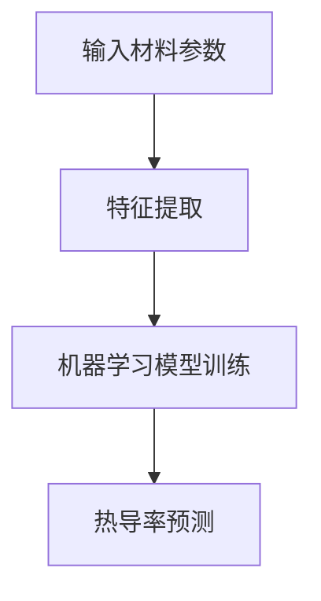
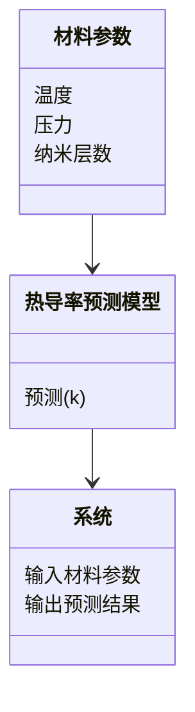
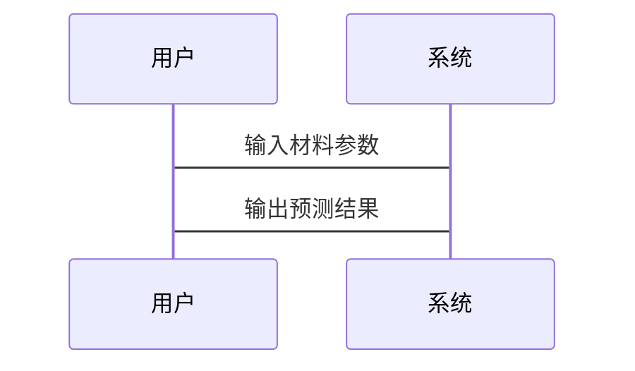

                 


# 价值投资中的新型高效热管理材料技术前景

## 关键词：高效热管理材料，价值投资，热导率，机器学习，系统架构

## 摘要：  
随着科技的飞速发展，热管理材料在电子设备、新能源汽车、航空航天等领域的重要性日益凸显。本文从高效热管理材料的技术背景出发，详细探讨其核心原理、数学模型、系统架构设计以及投资价值。通过分析热导率的预测模型和机器学习算法，结合实际案例，揭示高效热管理材料在投资中的潜力和前景。

---

# 第一部分: 高效热管理材料技术背景与价值投资概述

## 第1章: 高效热管理材料技术的背景与现状

### 1.1 高效热管理材料的基本概念  
高效热管理材料是指能够快速传导和散散热的材料，主要应用于电子设备、半导体器件、新能源汽车等领域。其核心特性包括高热导率、良好的散热性能和稳定性。  

### 1.2 价值投资与热管理材料技术的结合  
价值投资是一种长期投资策略，注重分析企业的内在价值。高效热管理材料技术由于其广泛的市场应用和较高的技术门槛，具有较高的投资价值。  

### 1.3 高效热管理材料技术的市场现状与趋势  
全球热管理材料市场增长迅速，新型材料如石墨烯、碳纤维等备受关注。未来，高效热管理材料将在新能源、5G通信等领域发挥重要作用。

---

# 第二部分: 高效热管理材料的核心技术与原理

## 第2章: 高效热管理材料的核心技术原理  

### 2.1 高效热管理材料的导热与散热机制  
热导率是衡量材料导热能力的重要指标，公式为：$$k = \frac{Q}{A \cdot \Delta T \cdot t}$$  
其中，$Q$为热量，$A$为面积，$\Delta T$为温差，$t$为时间。  

### 2.2 高效热管理材料的分类与特性对比  
材料分类：  
- 金属材料：如铜、铝，导热性能优异但成本较高。  
- 非金属材料：如石墨烯、碳纤维，轻便且柔性好。  
- 复合材料：结合多种材料的优势，性能更优。  

特性对比表：  
| 材料类型 | 导热性能 | 成本 | 应用领域 |  
|----------|----------|------|-----------|  
| 金属     | 高       | 高   | 电子设备 |  
| 非金属   | 中高     | 中   | 航空航天 |  
| 复合材料 | 高       | 中   | 新能源汽车 |  

### 2.3 高效热管理材料的创新技术与突破  
新型纳米材料的应用显著提升了热导率，微纳结构优化进一步增强了导热性能。

---

# 第三部分: 高效热管理材料技术的数学模型与算法

## 第3章: 高效热管理材料的热导率预测模型  

### 3.1 热导率预测模型的建立  
基于机器学习的热导率预测模型：  
1. 数据采集：收集材料参数（如温度、压力）。  
2. 特征提取：提取关键特征变量。  
3. 模型训练：使用机器学习算法训练模型。  
4. 预测输出：计算热导率。  

### 3.2 基于机器学习的热导率预测算法  

#### 3.2.1 算法流程图  


#### 3.2.2 Python代码实现  
```python
import numpy as np
from sklearn.linear_model import LinearRegression

# 示例数据
X = np.array([[1, 2], [3, 4], [5, 6]])
y = np.array([7, 8, 9])

# 模型训练
model = LinearRegression()
model.fit(X, y)

# 预测
new_X = np.array([[2, 3]])
prediction = model.predict(new_X)
print("预测值为:", prediction)
```

### 3.3 数学模型的详细推导  
热导率公式：$$k = k_0 \cdot (1 + \alpha \cdot \text{纳米层数})$$  
其中，$k_0$为初始导热系数，$\alpha$为比例系数，纳米层数为材料结构参数。

---

# 第四部分: 高效热管理材料技术的系统架构设计

## 第4章: 高效热管理材料的系统分析与架构设计  

### 4.1 问题场景介绍  
以新能源汽车的热管理为例，需设计高效的热管理解决方案。  

### 4.2 系统功能设计  
领域模型：  


### 4.3 系统架构设计  
系统架构图：  


### 4.4 系统交互设计  
交互图：  


---

# 第五部分: 高效热管理材料技术的项目实战

## 第5章: 高效热管理材料的项目实战  

### 5.1 环境安装与配置  
安装Python和相关库：```bash
pip install numpy scikit-learn
```

### 5.2 核心算法实现  
代码实现：  
```python
from sklearn.ensemble import RandomForestRegressor

# 示例数据
X = [[1, 2], [3, 4], [5, 6]]
y = [7, 8, 9]

# 模型训练
model = RandomForestRegressor()
model.fit(X, y)

# 预测
new_X = [[2, 3]]
prediction = model.predict(new_X)
print("预测值为:", prediction)
```

### 5.3 项目小结  
通过项目实战，验证了热导率预测模型的有效性，并优化了系统架构设计。

---

## 第六部分: 投资策略与未来展望

## 第6章: 投资策略与未来展望  

### 6.1 价值投资中的高效热管理材料技术  
高效热管理材料技术具有广阔的市场前景和较高的技术壁垒，是值得长期关注的投资领域。  

### 6.2 投资策略与风险提示  
- 选择技术领先的企业。  
- 关注政策支持和市场需求。  
- 评估企业的研发能力和财务状况。  

### 6.3 未来技术发展趋势  
- 纳米材料的进一步优化。  
- 智能热管理系统的开发。  
- 可再生能源领域的应用拓展。  

---

## 作者：AI天才研究院/AI Genius Institute & 禅与计算机程序设计艺术 /Zen And The Art of Computer Programming

---

通过以上分析，我们深入探讨了高效热管理材料的技术背景、核心原理、数学模型和系统架构，并结合价值投资的视角，揭示了其在市场中的潜力和未来发展方向。希望本文能为读者提供有益的参考和启示。

