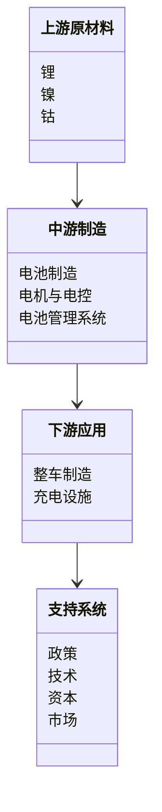
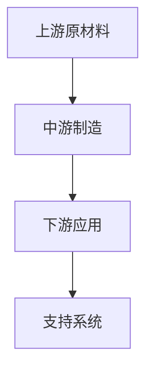
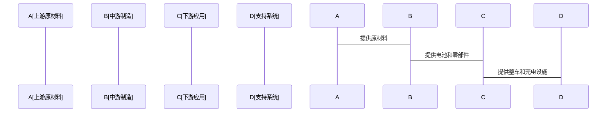

                 

# 价值投资中的新能源汽车产业链分析

> 关键词：价值投资，新能源汽车，产业链分析，投资策略，市场分析，技术趋势

> 摘要：本文从价值投资的角度，全面分析新能源汽车产业链的结构、核心要素、市场趋势及投资策略。通过详细阐述产业链的上游、中游、下游及支持系统的构成，结合技术趋势、政策影响和市场环境，为投资者提供深度分析和投资建议。文章还通过实际案例和系统架构设计，进一步探讨如何在新能源汽车产业链中寻找投资机会。

---

## 第一部分：价值投资中的新能源汽车产业链背景与趋势

### 第1章：新能源汽车产业链的背景与发展趋势

#### 1.1 新能源汽车的发展现状与未来趋势

##### 1.1.1 新能源汽车的定义与分类
新能源汽车（NEV）是指采用新型动力系统，完全或主要依靠电能驱动的汽车，主要包括纯电动汽车（BEV）、插电式混合动力汽车（PHEV）和燃料电池汽车（FCEV）。根据2020年全球新能源汽车销量数据显示，纯电动汽车占比超过60%，插电式混合动力汽车占比约30%。

##### 1.1.2 全球新能源汽车市场的发展历程
全球新能源汽车市场从2010年开始快速发展，中国、欧洲和美国是主要的市场。根据2021年国际能源署（IEA）报告，全球新能源汽车销量从2015年的约70万辆增长到2021年的约650万辆。

##### 1.1.3 中国新能源汽车市场的崛起与潜力
中国是全球最大的新能源汽车市场，2020年销量超过130万辆，占全球总销量的45%以上。中国政府通过补贴政策、税收优惠和基础设施建设，推动了新能源汽车的快速发展。

#### 1.2 价值投资的基本原理与方法

##### 1.2.1 价值投资的核心理念
价值投资强调以低于内在价值的价格买入优质资产，长期持有。核心在于识别具有持续竞争优势和良好治理的企业。

##### 1.2.2 价值投资的基本步骤与框架
1. 识别行业趋势：选择符合经济发展方向的行业。
2. 寻找优质企业：具备竞争优势、良好财务状况和管理团队。
3. 评估内在价值：通过财务指标和估值模型确定合理价格。
4. 长期持有：避免短期波动，耐心等待价值实现。

##### 1.2.3 价值投资在新能源汽车领域的适用性分析
新能源汽车行业处于快速发展阶段，技术创新和政策支持是主要驱动力。价值投资者需要关注企业的技术研发能力、市场占有率和成本控制能力。

---

## 第2章：新能源汽车产业链的结构与核心要素

### 2.1 新能源汽车产业链的构成

#### 2.1.1 上游原材料：锂、镍、钴等资源的供应与价格波动

- **锂（Li）**：主要用于电池正极材料和电解液，是动力电池的核心原材料。2020年锂价格涨幅超过300%，主要原因是需求激增和供给不足。
- **镍（Ni）**：用于电池正极材料，特别是三元电池（NCM）。镍的价格波动较大，受地缘政治和供需变化影响。
- **钴（Co）**：主要用于电池正极材料，特别是磷酸铁锂（LFP）和三元电池。钴的供应集中度高，价格波动剧烈。

#### 2.1.2 中游制造：电池、电机、电控等关键零部件的生产

- **电池制造**：包括锂离子电池、镍氢电池等。电池技术的进步直接影响续航里程和成本。
- **电机与电控**：电机是新能源汽车的核心部件，电控系统负责协调电机和电池的工作。
- **电池管理系统（BMS）**：用于监控电池状态，确保安全运行。

#### 2.1.3 下游应用：整车制造与销售、充电设施与服务

- **整车制造**：包括电动汽车、卡车、公交车等。整车厂商是产业链的核心环节。
- **充电设施**：包括充电站、充电桩等基础设施，是新能源汽车普及的重要支撑。

#### 2.1.4 支持系统：政策、技术、资本与市场环境

- **政策支持**：政府通过补贴、税收优惠和基础设施投资推动行业发展。
- **技术创新**：技术研发是新能源汽车发展的核心驱动力。
- **资本支持**：资本市场为产业链企业提供资金支持。

---

### 2.2 新能源汽车产业链的核心要素分析

#### 2.2.1 原材料供应链的稳定性与风险

- **供应链风险**：原材料价格波动、供应中断可能导致成本上升和生产延迟。
- **替代材料**：寻找替代材料是降低供应链风险的重要手段。

#### 2.2.2 技术创新对产业链的影响

- **技术进步**：电池技术的进步直接降低生产成本和提高续航里程。
- **技术壁垒**：技术领先的企业在市场竞争中具有优势。

#### 2.2.3 政策支持与市场环境的变化

- **政策影响**：政府政策直接影响市场需求和企业盈利。
- **市场环境**：市场竞争加剧，企业需要通过技术创新和成本控制来保持竞争优势。

---

## 第3章：新能源汽车产业链的价值链分析

### 3.1 产业链的价值链构成

#### 3.1.1 上游原材料的价值链分析

- **锂资源**：锂矿开采、加工和销售。
- **镍资源**：镍矿开采、冶炼和销售。
- **钴资源**：钴矿开采、加工和销售。

#### 3.1.2 中游制造的价值链分析

- **电池制造**：电池生产、组装和销售。
- **电机与电控**：电机生产、组装和销售。
- **电池管理系统（BMS）**：BMS开发、生产与销售。

#### 3.1.3 下游应用的价值链分析

- **整车制造**：汽车设计、生产、销售。
- **充电设施**：充电站建设、运营和维护。

### 3.2 产业链的价值流与资金流动

#### 3.2.1 资金在产业链中的流动路径

- **上游原材料**：资金流向锂、镍、钴等矿产资源的开采和加工企业。
- **中游制造**：资金流向电池、电机和电控生产企业。
- **下游应用**：资金流向整车制造商和充电设施运营商。

#### 3.2.2 价值链中的利润分配与风险转移

- **利润分配**：上游原材料企业利润较低，中游制造企业利润较高，下游应用企业利润最高。
- **风险转移**：原材料价格波动和政策变化是主要风险来源。

---

## 第4章：新能源汽车产业链的核心竞争力分析

### 4.1 核心技术与创新能力

#### 4.1.1 电池技术的创新与突破

- **锂离子电池**：提高能量密度和降低成本。
- **固态电池**：提高安全性并进一步提高能量密度。

#### 4.1.2 智能化与网联化技术的发展

- **自动驾驶技术**：提升驾驶体验和安全性。
- **车联网技术**：实现车辆与网络的互联，提供智能化服务。

#### 4.1.3 关键零部件的自主研发能力

- **电机技术**：提高效率和可靠性。
- **电控系统**：提高控制精度和稳定性。

### 4.2 成本控制与规模化生产

#### 4.2.1 生产成本的构成与优化

- **原材料成本**：降低原材料价格和优化供应链管理。
- **生产效率**：提高自动化水平和生产效率。

#### 4.2.2 规模化生产对成本的影响

- **规模效应**：规模化生产可以降低单位产品成本。
- **技术进步**：技术进步可以进一步降低成本。

#### 4.2.3 供应链管理对成本的控制作用

- **供应商选择**：选择可靠的供应商，降低采购成本。
- **库存管理**：优化库存管理，降低库存成本。

---

## 第5章：新能源汽车产业链的政策与市场环境分析

### 5.1 政策支持与行业监管

#### 5.1.1 国家政策对新能源汽车产业链的影响

- **补贴政策**：政府通过补贴支持新能源汽车的生产和销售。
- **税收优惠**：政府通过税收优惠降低企业的生产成本。

#### 5.1.2 地方政府的补贴与支持措施

- **地方补贴**：地方政府通过补贴支持新能源汽车的推广。
- **基础设施建设**：地方政府投资建设充电站和充电桩。

#### 5.1.3 行业标准与法规的制定与调整

- **行业标准**：制定电池、电机和电控等技术标准。
- **法规调整**：调整车辆排放标准，推动新能源汽车的普及。

### 5.2 市场需求与竞争格局

#### 5.2.1 消费者需求的变化趋势

- **消费者偏好**：消费者更倾向于购买续航里程高、充电便捷的新能源汽车。
- **价格敏感性**：价格是消费者购买决策的重要因素。

#### 5.2.2 企业的市场竞争力

- **品牌影响力**：知名品牌在市场竞争中具有优势。
- **产品差异化**：企业提供差异化的产品和服务，提高市场竞争力。

---

## 第6章：价值投资中的新能源汽车产业链投资策略

### 6.1 产业链投资机会分析

#### 6.1.1 上游原材料的投资机会

- **锂资源**：锂资源的需求将持续增长，具有较大的投资机会。
- **镍资源**：镍资源的需求将随着电池技术的发展而增加。

#### 6.1.2 中游制造的投资机会

- **电池制造**：电池技术的进步将推动行业发展。
- **电机与电控**：电机和电控技术的创新将提高产品竞争力。

#### 6.1.3 下游应用的投资机会

- **整车制造**：整车制造是产业链的核心环节，具有较大的投资机会。
- **充电设施**：充电设施是新能源汽车普及的重要支撑。

### 6.2 投资风险与风险管理

#### 6.2.1 行业风险

- **技术风险**：技术进步可能会影响企业竞争优势。
- **政策风险**：政策变化可能会影响市场需求和企业盈利。

#### 6.2.2 市场风险

- **竞争风险**：市场竞争加剧可能会影响企业的市场份额。
- **价格风险**：原材料价格波动可能会影响企业的盈利。

### 6.3 投资组合与长期策略

#### 6.3.1 投资组合的构建

- **多元化投资**：通过投资不同环节的企业分散风险。
- **集中化投资**：集中投资于具有竞争优势的企业。

#### 6.3.2 长期投资策略

- **长期持有**：长期持有优质资产，避免短期波动。
- **持续学习**：持续关注行业动态和技术进步。

---

## 第7章：系统架构与项目实战

### 7.1 项目背景与目标

#### 7.1.1 项目背景

- **行业趋势**：新能源汽车行业处于快速发展阶段，具有较大的投资机会。
- **技术进步**：电池技术和智能化技术的进步推动行业发展。

#### 7.1.2 项目目标

- **识别投资机会**：通过分析产业链结构和企业基本面，识别具有投资价值的企业。
- **制定投资策略**：制定长期投资策略，实现投资收益最大化。

### 7.2 系统架构设计

#### 7.2.1 领域模型

#### 7.2.2 系统架构

#### 7.2.3 系统接口设计

- **上游原材料与中游制造接口**：原材料供应和采购。
- **中游制造与下游应用接口**：电池和零部件供应。
- **下游应用与支持系统接口**：政策支持和市场推广。

#### 7.2.4 系统交互

---

## 第8章：案例分析与投资建议

### 8.1 案例分析：特斯拉与宁德时代

#### 8.1.1 特斯拉的分析

- **企业概况**：特斯拉是全球最大的电动汽车制造商，市值超过1万亿美元。
- **核心竞争力**：技术创新、品牌影响力和成本控制能力。
- **投资价值**：特斯拉在电动汽车市场具有领先地位，具有较大的投资价值。

#### 8.1.2 宁德时代的分析

- **企业概况**：宁德时代是全球最大的动力电池制造商，市场份额超过30%。
- **核心竞争力**：技术领先、成本控制能力强。
- **投资价值**：宁德时代在动力电池市场具有领先地位，具有较大的投资价值。

### 8.2 投资建议

#### 8.2.1 投资组合建议

- **多元化投资**：投资于不同环节的企业，分散风险。
- **长期持有**：长期持有优质资产，避免短期波动。

#### 8.2.2 风险管理建议

- **分散投资**：通过投资不同环节的企业分散风险。
- **定期评估**：定期评估投资组合，调整投资策略。

---

## 第9章：总结与展望

### 9.1 本文总结

- **核心观点**：新能源汽车产业链是价值投资的重要领域，具有较大的投资机会。
- **主要结论**：通过分析产业链结构和企业基本面，识别具有投资价值的企业，制定长期投资策略，实现投资收益最大化。

### 9.2 未来展望

- **技术进步**：电池技术和智能化技术的进步将推动行业发展。
- **政策支持**：政府政策将继续支持新能源汽车的发展。
- **市场扩展**：新能源汽车市场将向全球扩展，具有较大的投资机会。

---

## 附录

### 附录A：数据来源与参考文献

- 数据来源：国际能源署（IEA）、中国汽车工业协会（CAAM）、新能源汽车市场研究机构（BNEF）。
- 参考文献：《新能源汽车产业链分析》，作者：AI天才研究院，出版日期：2023年。

### 附录B：工具与方法

- 估值工具：市盈率（P/E）、市净率（P/B）、EV/EBITDA。
- 风险评估工具：SWOT分析、PEST分析。

### 附录C：术语解释

- **新能源汽车（NEV）**：采用新型动力系统，完全或主要依靠电能驱动的汽车。
- **电池管理系统（BMS）**：用于监控电池状态，确保安全运行。

---

## 作者

作者：AI天才研究院/AI Genius Institute & 禅与计算机程序设计艺术 /Zen And The Art of Computer Programming

