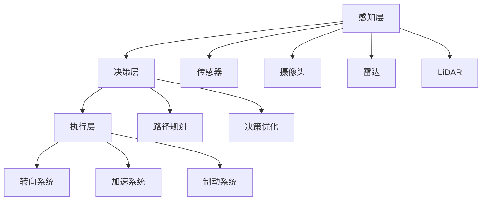
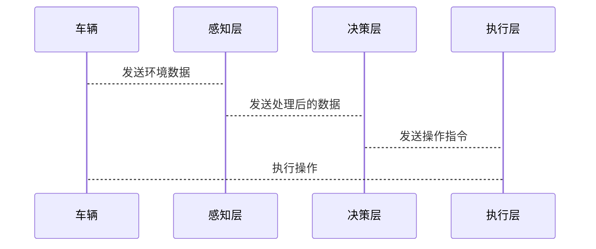

                 


# 价值投资中的无人驾驶技术前景

> 关键词：无人驾驶技术、价值投资、人工智能、传感器技术、通信技术

> 摘要：本文探讨无人驾驶技术的前景及其在价值投资中的应用。通过分析无人驾驶技术的核心概念、算法原理、系统架构和市场分析，结合实际项目案例，为投资者提供基于技术分析的决策支持，帮助他们在无人驾驶技术领域做出明智的投资决策。

---

# 第一部分：无人驾驶技术与价值投资的结合

## 第1章：背景介绍

### 1.1 无人驾驶技术的定义与背景

#### 1.1.1 无人驾驶技术的定义
无人驾驶技术（Autonomous Driving Technology）是指通过先进的传感器、人工智能（AI）、通信技术和算法，使车辆能够在不需要人类驾驶员干预的情况下，安全地感知环境、做出决策并执行操作的技术。无人驾驶技术的核心在于实现车辆的完全自动化，包括定位、路径规划、障碍物检测和决策制定。

#### 1.1.2 无人驾驶技术的发展现状
无人驾驶技术经历了多年的发展，目前主要分为以下几个阶段：
1. **L0：无自动化**：完全依赖驾驶员操作。
2. **L1：驾驶辅助**：车辆在特定条件下提供辅助功能，如自适应巡航控制。
3. **L2：部分自动化**：车辆能够同时执行转向和加减速操作，但驾驶员仍需保持注意力。
4. **L3：有条件自动化**：车辆在特定条件下可以完全自动驾驶，但需要驾驶员随时准备接管。
5. **L4：高度自动化**：车辆在大多数情况下可以自动驾驶，但可能在极端条件下需要驾驶员干预。
6. **L5：完全自动化**：车辆在所有条件下都可以自动驾驶，无需驾驶员干预。

#### 1.1.3 无人驾驶技术的核心要素
无人驾驶技术的核心要素包括：
1. **感知系统**：通过摄像头、激光雷达（LiDAR）、雷达和超声波传感器等设备，实时感知车辆周围的环境信息。
2. **决策系统**：基于感知数据，利用AI算法（如深度学习和强化学习）进行路径规划和决策制定。
3. **执行系统**：通过车辆的控制系统（如转向、加速和制动）执行决策系统制定的操作。

### 1.2 价值投资的基本概念

#### 1.2.1 价值投资的定义
价值投资是一种投资策略，强调以低于其内在价值的价格购买优质资产。其核心理念是寻找市场中被低估的投资标的，并长期持有，等待其价值回归。

#### 1.2.2 价值投资的核心原则
1. **安全边际**：买入价格应显著低于资产的内在价值。
2. **长期视角**：关注企业的长期增长潜力，而非短期市场波动。
3. **基本面分析**：通过分析企业的财务状况、行业地位和管理团队等基本面因素，评估其内在价值。

#### 1.2.3 价值投资与技术分析的区别
| 方面 | 价值投资 | 技术分析 |
|------|----------|----------|
| 核心 | 企业基本面 | 市场价格走势 |
| 工具 | 财务报表、行业分析 | K线图、技术指标 |
| 时间框架 | 长期 | 短期至中期 |

### 1.3 无人驾驶技术与价值投资的结合

#### 1.3.1 无人驾驶技术的市场前景
无人驾驶技术的市场前景广阔，预计未来几年内，全球无人驾驶汽车市场规模将快速增长。根据市场研究机构的预测，到2030年，无人驾驶汽车的市场规模将超过 trillion美元。

#### 1.3.2 无人驾驶技术对投资的影响
无人驾驶技术的发展将对汽车制造、交通服务、传感器技术和人工智能等领域产生深远影响。投资者可以通过投资相关企业（如特斯拉、Waymo、百度等）或相关技术公司（如芯片制造商、传感器供应商）来参与这一市场。

#### 1.3.3 无人驾驶技术的价值投资机会
无人驾驶技术的价值投资机会主要体现在以下几个方面：
1. **技术创新**：AI算法、传感器技术和通信技术的进步将推动无人驾驶技术的进一步发展。
2. **行业整合**：随着技术的成熟，行业整合和并购活动将增加，具备技术优势的企业将获得更多机会。
3. **政策支持**：各国政府对无人驾驶技术的政策支持将为市场带来更多的增长空间。

---

## 第2章：无人驾驶技术的核心概念

### 2.1 无人驾驶技术的核心原理

#### 2.1.1 感知系统
感知系统是无人驾驶技术的关键组成部分，负责实时感知车辆周围的环境信息。常用的传感器包括：
1. **摄像头**：用于视觉识别，如车道检测和障碍物识别。
2. **激光雷达（LiDAR）**：通过发射激光并接收反射信号，精确测量物体的距离和形状。
3. **雷达**：通过无线电波检测物体的位置和速度。
4. **超声波传感器**：用于短距离内的障碍物检测。

#### 2.1.2 决策系统
决策系统基于感知数据，利用AI算法（如深度学习和强化学习）进行路径规划和决策制定。决策系统的核心任务包括：
1. **路径规划**：计算车辆从起点到终点的最佳行驶路径。
2. **障碍物避让**：根据传感器数据，实时调整路径以避开障碍物。
3. **交通规则遵守**：确保车辆在复杂的交通环境中遵守交通规则。

#### 2.1.3 执行系统
执行系统负责将决策系统制定的操作转化为实际的车辆动作。执行系统包括：
1. **转向系统**：调整车辆的行驶方向。
2. **加速系统**：控制车辆的加速和减速。
3. **制动系统**：在紧急情况下及时停车。

### 2.2 无人驾驶技术的关键技术

#### 2.2.1 人工智能
人工智能是无人驾驶技术的核心技术之一，主要用于感知、决策和规划。常用的AI技术包括：
1. **深度学习**：用于图像识别和目标检测。
2. **强化学习**：用于路径规划和决策优化。
3. **自然语言处理**：用于人机交互和语音识别。

#### 2.2.2 传感器技术
传感器技术是无人驾驶技术的另一项核心技术，用于实时感知车辆周围的环境信息。常用的传感器包括摄像头、LiDAR、雷达和超声波传感器。

#### 2.2.3 通信技术
通信技术用于实现车辆与车辆之间（V2V）、车辆与基础设施之间（V2I）以及车辆与云端之间的数据传输。5G通信技术的快速发展为无人驾驶技术的实时数据传输提供了有力支持。

### 2.3 无人驾驶技术的市场分析

#### 2.3.1 市场规模
根据市场研究机构的预测，全球无人驾驶汽车市场规模将在未来几年内迅速增长，预计到2030年，市场规模将超过 trillion美元。

#### 2.3.2 竞争格局
目前，无人驾驶技术领域的竞争主要集中在以下几个方面：
1. **技术竞争**：各大企业纷纷投入大量资源开发AI算法和传感器技术。
2. **政策竞争**：各国政府对无人驾驶技术的政策支持力度不同，影响企业的市场布局。
3. **资本竞争**：资本市场对无人驾驶技术的热度较高，吸引了大量的投资。

#### 2.3.3 技术发展趋势
1. **AI算法的优化**：深度学习和强化学习算法的不断优化将提升无人驾驶技术的感知和决策能力。
2. **传感器技术的升级**：更高精度的LiDAR和摄像头将提高车辆的感知能力。
3. **5G通信的普及**：5G通信技术的普及将推动V2V和V2I通信的发展。

---

## 第3章：无人驾驶技术的价值评估

### 3.1 无人驾驶技术的财务分析

#### 3.1.1 资产评估
1. **流动资产**：包括现金、应收账款和存货等。
2. **非流动资产**：包括固定资产（如生产设备）、无形资产（如专利）和长期投资等。

#### 3.1.2 负债评估
1. **流动负债**：包括应付账款、短期借款和应计费用等。
2. **非流动负债**：包括长期借款、债券 payable和递延税款等。

#### 3.1.3 股东权益评估
股东权益包括股本、资本公积、盈余公积和未分配利润等。

### 3.2 无人驾驶技术的盈利能力分析

#### 3.2.1 营业收入分析
1. **销售收入**：包括无人驾驶汽车的销售和相关技术服务的收入。
2. **其他收入**：包括专利授权收入和投资收益等。

#### 3.2.2 净利润分析
1. **收入成本**：包括生产成本、研发费用和销售费用等。
2. **净利润率**：净利润占营业收入的比重，反映企业的盈利能力。

#### 3.2.3 资产回报率分析
资产回报率（ROA）= 净利润 / 平均资产总额。ROA反映了企业资产的使用效率。

### 3.3 无人驾驶技术的估值模型

#### 3.3.1 DCF模型
 discounted cash flow (DCF) 模型是一种常用的估值方法，通过预测企业未来现金流的现值来评估企业的内在价值。

公式：
$$
\text{企业价值} = \sum_{t=1}^{n} \frac{\text{现金流}_t}{(1 + r)^t} + \frac{\text{残值}}{(1 + r)^n}
$$

其中，$r$ 是折现率，$n$ 是预测期数，$\text{现金流}_t$ 是第$t$年的现金流。

#### 3.3.2 市盈率模型
市盈率（P/E）= 股价 / 每股收益（EPS）。市盈率模型适用于企业盈利稳定的公司。

#### 3.3.3 市净率模型
市净率（P/B）= 股价 / 每股净资产。市净率模型适用于资产密集型企业。

---

## 第4章：无人驾驶技术的投资策略

### 4.1 无人驾驶技术的长期投资策略

#### 4.1.1 长期投资的基本原则
1. **选择优质企业**：投资那些技术领先、管理优秀的企业。
2. **长期持有**：避免短期市场的波动，关注企业的长期增长潜力。
3. **分散投资**：通过分散投资降低风险。

#### 4.1.2 无人驾驶技术的长期投资机会
1. **技术领先企业**：如特斯拉、Waymo和百度等。
2. **传感器技术供应商**：如博世和大陆集团等。
3. **通信技术供应商**：如华为和高通等。

#### 4.1.3 长期投资的风险控制
1. **风险分散**：通过投资不同领域的企业降低风险。
2. **定期评估**：定期评估企业的基本面和技术进展。
3. **关注政策变化**：政策变化可能对市场产生重大影响。

### 4.2 无人驾驶技术的风险管理

#### 4.2.1 风险识别
1. **技术风险**：无人驾驶技术尚未完全成熟，存在技术瓶颈。
2. **市场风险**：市场需求可能低于预期。
3. **政策风险**：政策变化可能影响市场发展。

#### 4.2.2 风险评估
1. **定量分析**：通过财务指标评估企业的风险，如beta系数、波动率等。
2. **定性分析**：通过行业分析和技术评估判断风险。

#### 4.2.3 风险应对策略
1. **风险分散**：通过投资不同领域的企业降低风险。
2. **风险对冲**：通过金融衍生工具对冲市场风险。
3. **风险管理**：建立完善的风险管理体系。

### 4.3 无人驾驶技术的案例分析

#### 4.3.1 案例一：特斯拉
特斯拉是目前无人驾驶技术领域的领先企业，其Autopilot系统已经实现了L2级别的自动驾驶功能。通过分析特斯拉的财务数据和技术进展，可以看出其在无人驾驶技术领域的竞争优势。

#### 4.3.2 案例二：Waymo
Waymo是谷歌母公司Alphabet旗下的无人驾驶技术公司，目前已经在多个城市进行了无人驾驶出租车的试点运营。Waymo的技术优势在于其强大的AI算法和丰富的测试里程。

---

## 第5章：无人驾驶技术的系统架构设计

### 5.1 系统架构概述
无人驾驶技术的系统架构包括感知层、决策层和执行层三个部分。感知层负责环境感知，决策层负责路径规划和决策制定，执行层负责将决策转化为实际操作。

### 5.2 系统功能设计

#### 5.2.1 感知系统
感知系统负责采集车辆周围的环境信息，包括：
1. **视觉感知**：通过摄像头进行图像识别。
2. **雷达感知**：通过毫米波雷达检测障碍物。
3. **LiDAR感知**：通过激光雷达获取高精度的三维环境信息。

#### 5.2.2 决策系统
决策系统基于感知数据，利用AI算法进行路径规划和决策制定。常用算法包括：
1. **深度学习**：用于目标检测和语义分割。
2. **强化学习**：用于路径规划和决策优化。
3. **规则引擎**：用于简单的交通规则遵守。

#### 5.2.3 执行系统
执行系统负责将决策系统制定的操作转化为实际的车辆动作，包括：
1. **转向控制**：调整车辆的行驶方向。
2. **加速控制**：控制车辆的加速和减速。
3. **制动控制**：在紧急情况下及时停车。

### 5.3 系统架构图


### 5.4 系统接口设计
1. **感知层接口**：传感器的数据接口。
2. **决策层接口**：AI算法的输入输出接口。
3. **执行层接口**：车辆控制系统的接口。

### 5.5 系统交互图


---

## 第6章：项目实战

### 6.1 环境搭建

#### 6.1.1 操作系统
建议使用Ubuntu 20.04 LTS。

#### 6.1.2 开发工具
1. **Python**：用于算法实现。
2. **ROS（Robot Operating System）**：用于系统集成。
3. **OpenCV**：用于图像处理。
4. **TensorFlow**：用于深度学习。

### 6.2 核心实现

#### 6.2.1 感知系统实现
1. **LiDAR数据处理**：使用Python和Open3D库处理LiDAR数据。
2. **图像识别**：使用OpenCV和深度学习模型进行图像识别。

#### 6.2.2 决策系统实现
1. **路径规划**：使用深度学习模型进行路径规划。
2. **决策优化**：使用强化学习算法优化决策。

#### 6.2.3 执行系统实现
1. **转向控制**：通过ROS控制车辆的转向系统。
2. **加速控制**：通过ROS控制车辆的加速系统。
3. **制动控制**：通过ROS控制车辆的制动系统。

### 6.3 代码实现

#### 6.3.1 LiDAR数据处理代码
```python
import open3d as o3d

def read_pcd(pcd_path):
    pcd = o3d.io.read_point_cloud(pcd_path)
    return pcd

def main():
    pcd_path = "path_to_your_pcd_file.pcd"
    pcd = read_pcd(pcd_path)
    print("Number of points:", len(pcd.points))

if __name__ == "__main__":
    main()
```

#### 6.3.2 图像识别代码
```python
import cv2

def detect_object(image):
    # 图像预处理
    gray = cv2.cvtColor(image, cv2.COLOR_BGR2GRAY)
    # 使用OpenCV进行目标检测
    cascade = cv2.CascadeClassifier("haarcascade_car.xml")
    cars = cascade.detectMultiScale(gray, 1.1, 2)
    for (x, y, w, h) in cars:
        cv2.rectangle(image, (x, y), (x + w, y + h), (0, 255, 0), 2)
    return image

if __name__ == "__main__":
    image_path = "path_to_your_image.jpg"
    image = cv2.imread(image_path)
    result = detect_object(image)
    cv2.imshow("Result", result)
    cv2.waitKey(0)
    cv2.destroyAllWindows()
```

### 6.4 案例分析

#### 6.4.1 案例一：基于LiDAR的障碍物检测
1. **环境搭建**：使用Ubuntu 20.04 LTS和ROS。
2. **代码实现**：使用Python和Open3D处理LiDAR数据。
3. **结果分析**：通过可视化工具观察障碍物的位置和形状。

#### 6.4.2 案例二：基于图像识别的交通标志识别
1. **环境搭建**：使用Ubuntu 20.04 LTS和OpenCV。
2. **代码实现**：使用深度学习模型进行交通标志识别。
3. **结果分析**：通过图像显示识别结果。

---

## 第7章：最佳实践与小结

### 7.1 最佳实践 tips
1. **技术跟踪**：持续关注无人驾驶技术的最新进展。
2. **风险控制**：通过分散投资和风险管理降低风险。
3. **长期视角**：关注企业的长期增长潜力，避免短期波动。

### 7.2 小结
无人驾驶技术作为未来交通的重要组成部分，其市场前景广阔，投资机会丰富。投资者可以通过技术分析和基本面分析相结合的方式，找到具备竞争优势的企业进行投资。

### 7.3 注意事项
1. **技术风险**：无人驾驶技术尚未完全成熟，存在技术瓶颈。
2. **政策风险**：政策变化可能影响市场发展。
3. **市场风险**：市场需求可能低于预期。

### 7.4 拓展阅读
1. **书籍**：《无人驾驶技术与投资》。
2. **网站**：TechCrunch、Forbes和Bloomberg等。

---

## 作者信息

作者：AI天才研究院/AI Genius Institute & 禅与计算机程序设计艺术/Zen And The Art of Computer Programming

---

以上是《价值投资中的无人驾驶技术前景》的技术博客文章的详细大纲和内容。希望对您有所帮助！

