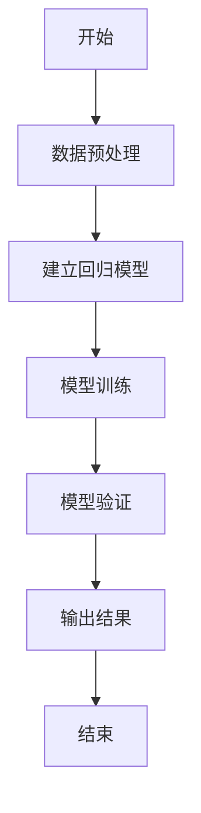
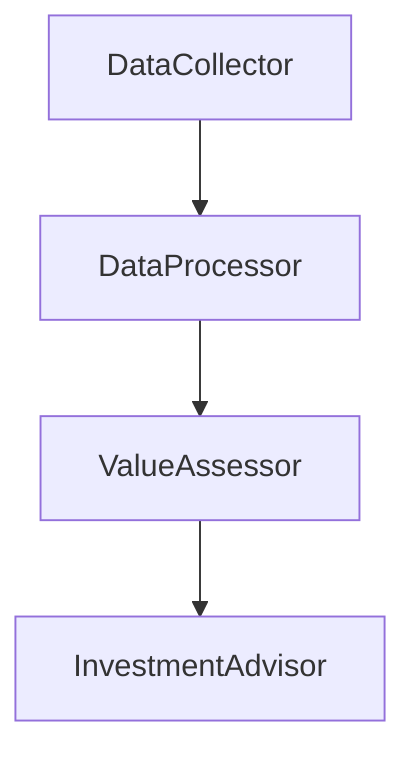

                 


```markdown
# 价值投资中的智慧农业发展趋势

> 关键词：价值投资，智慧农业，发展趋势，农业智能化，数据驱动

> 摘要：本文深入探讨了智慧农业与价值投资的结合，分析了智慧农业的技术驱动因素及其对农业产业链的影响，提出了基于数据驱动的农业企业价值评估算法，并通过系统架构设计和项目实战展示了如何在智慧农业中应用价值投资策略。文章内容涵盖从理论到实践的各个方面，为投资者和农业科技从业者提供了有益的指导。

---

## 第一部分：智慧农业与价值投资的背景介绍

### 第1章：智慧农业与价值投资的背景

#### 1.1 智慧农业的概念与发展趋势

##### 1.1.1 智慧农业的定义与核心要素

智慧农业是指利用现代信息技术（如物联网、大数据、人工智能等）对农业生产、经营、管理等环节进行智能化改造，以提高农业生产的效率和可持续性。其核心要素包括：

- **数据采集**：通过传感器、无人机等设备采集农田环境数据。
- **数据处理与分析**：利用大数据和AI技术对数据进行分析，优化农业生产决策。
- **智能决策支持**：基于分析结果，提供精准的种植、灌溉、施肥等建议。
- **自动化控制**：通过物联网设备实现农田管理的自动化。

##### 1.1.2 智慧农业的技术驱动因素

- **物联网（IoT）**：连接农田中的各种设备，实现数据的实时采集和传输。
- **大数据分析**：处理海量农业数据，提取有价值的信息。
- **人工智能（AI）**：用于预测天气、病虫害、作物产量等。
- **区块链技术**：确保农产品溯源的透明性和安全性。

##### 1.1.3 智慧农业的全球发展趋势

全球范围内，智慧农业正在快速发展，尤其是在发达国家和地区。中国政府也在大力推动农业现代化，提出“数字乡村”战略，鼓励农业企业采用智慧化管理。

#### 1.2 价值投资的基本原理

##### 1.2.1 价值投资的定义与核心理念

价值投资是一种投资策略，强调以低于资产内在价值的价格买入优质资产。其核心理念是寻找被市场低估的企业，长期持有，等待其价值回归。

##### 1.2.2 价值投资与智慧农业的结合点

- **企业价值评估**：通过智慧农业技术提升农业企业的生产效率和盈利能力。
- **数据驱动决策**：利用智慧农业的数据分析能力，优化投资决策。
- **长期投资价值**：智慧农业技术的引入提升了农业企业的可持续发展能力，增强了其长期投资价值。

##### 1.2.3 智慧农业对投资的影响

智慧农业通过提高农业生产效率、降低成本、增强市场竞争力，显著提升了农业企业的价值。这为投资者提供了新的投资机会，尤其是在技术驱动型农业企业中。

#### 1.3 智慧农业对价值投资的影响

##### 1.3.1 智慧农业如何改变农业产业链

智慧农业通过数据化、智能化的方式优化了农业生产的各个环节，从种植到销售，提高了整个产业链的效率。

##### 1.3.2 智慧农业对农业企业价值的影响

- 提高生产效率，降低成本。
- 增强市场竞争力，提升企业利润。
- 提供更可靠的数据支持，降低投资风险。

##### 1.3.3 价值投资在智慧农业中的新机遇

- 投资于具有技术优势的农业企业。
- 通过智慧农业技术降低投资风险，提高投资回报率。

#### 1.4 本章小结

本章介绍了智慧农业的基本概念、技术驱动因素及其发展趋势，并分析了价值投资的基本原理和与智慧农业的结合点。通过智慧农业技术的引入，农业企业的价值得到了显著提升，为投资者带来了新的机遇。

---

## 第二部分：智慧农业的核心概念与联系

### 第2章：智慧农业的核心概念与联系

#### 2.1 智慧农业的核心概念

##### 2.1.1 数据驱动的农业生产模式

通过采集和分析农田数据，优化农业生产决策。

##### 2.1.2 农业智能化的技术体系

包括物联网、大数据、人工智能等多种技术的综合应用。

##### 2.1.3 农业生态系统的优化

通过智慧农业技术实现资源的高效利用和生态环境的保护。

#### 2.2 价值投资中的关键因素

##### 2.2.1 农业企业的财务指标分析

包括盈利能力、成长能力、偿债能力等。

##### 2.2.2 农业企业的市场竞争力评估

包括市场份额、品牌影响力、技术优势等。

##### 2.2.3 农业企业的可持续发展能力

包括资源利用效率、环境保护、社会责任等。

#### 2.3 智慧农业与价值投资的关系

##### 2.3.1 智慧农业如何提升企业价值

通过提高生产效率和降低成本，增强企业的盈利能力。

##### 2.3.2 价值投资如何推动智慧农业发展

通过资本支持，推动农业企业引入智慧农业技术。

##### 2.3.3 两者结合的协同效应

智慧农业技术的应用提升了企业价值，而价值投资为其提供了资金支持，形成良性循环。

#### 2.4 核心概念对比表格

| 概念           | 智慧农业                   | 价值投资                   |
|----------------|---------------------------|---------------------------|
| 核心目标       | 提高农业生产效率           | 寻找被低估的投资机会       |
| 技术驱动因素   | IoT、大数据、AI           | 财务分析、市场分析         |
| 影响范围       | 农业产业链                 | 金融市场                   |
| 价值提升方式   | 技术创新                   | 价格回归                   |

#### 2.5 ER实体关系图

```mermaid
er
  agriculture_enterprise {
    id
    name
    revenue
    profit
    market_share
  }
  technology {
    id
    name
    description
    application_area
  }
  investment {
    id
    amount
    return_on_investment
    investment_period
  }
  agriculture_enterprise --> technology: 采用的技术
  agriculture_enterprise --> investment: 投资关系
```

#### 2.6 本章小结

本章详细阐述了智慧农业的核心概念及其与价值投资的关系，通过对比表格和实体关系图，清晰地展示了两者之间的联系和区别。

---

## 第三部分：智慧农业中的价值评估算法原理

### 第3章：智慧农业中的价值评估算法原理

#### 3.1 价值评估模型的概述

##### 3.1.1 价值评估的基本原理

价值评估是通过对企业的财务状况、市场地位、技术优势等多方面因素进行综合分析，估算企业的内在价值。

##### 3.1.2 智慧农业中的价值评估指标

- 营业收入增长率
- 净利润率
- 技术创新能力
- 市场占有率

#### 3.2 基于数据的农业企业价值评估算法

##### 3.2.1 数据收集与处理流程

1. 采集企业财务数据。
2. 获取农业生产环境数据（如温度、湿度等）。
3. 分析企业技术应用情况。

##### 3.2.2 算法原理与实现步骤

- 数据预处理：清洗和标准化数据。
- 建立评估模型：使用回归分析或机器学习算法。
- 模型验证：通过历史数据验证模型准确性。

##### 3.2.3 算法的数学模型与公式

回归分析模型：
$$
y = \beta_0 + \beta_1x_1 + \beta_2x_2 + \ldots + \beta_nx_n + \epsilon
$$

其中，\( y \) 是企业价值，\( x_i \) 是各评估指标，\( \beta_i \) 是回归系数，\( \epsilon \) 是误差项。

##### 3.2.4 算法流程图



#### 3.3 本章小结

本章介绍了基于数据的农业企业价值评估算法，通过回归分析模型和流程图，详细展示了算法的实现步骤和原理。

---

## 第四部分：智慧农业系统的架构与设计

### 第4章：智慧农业系统的架构与设计

#### 4.1 系统架构设计

##### 4.1.1 系统整体架构图


##### 4.1.2 系统模块划分

- 数据采集模块
- 数据处理模块
- 价值评估模块
- 投资决策模块

##### 4.1.3 系统功能设计

- 数据采集：通过传感器采集农田数据。
- 数据处理：清洗和分析数据。
- 价值评估：评估农业企业价值。
- 投资决策：提供投资建议。

#### 4.2 系统功能设计

##### 4.2.1 数据采集与处理模块

```python
import pandas as pd
from sklearn.impute import SimpleImputer

# 数据预处理
data = pd.read_csv('agriculture_data.csv')
imputer = SimpleImputer(strategy='mean')
data_processed = imputer.fit_transform(data)
```

##### 4.2.2 价值评估模块

```python
from sklearn.linear_model import LinearRegression

# 建立回归模型
model = LinearRegression()
model.fit(X_train, y_train)
```

##### 4.2.3 投资决策支持模块

```python
import numpy as np

# 投资决策
predicted_value = model.predict(X_test)
investment_decision = '增持' if predicted_value > current_value else '减持'
```

#### 4.3 系统架构图



#### 4.4 系统接口设计

##### 4.4.1 数据接口规范

- 输入接口：农田环境数据。
- 输出接口：处理后的数据。

##### 4.4.2 用户接口设计

- 输入：用户提供的农业企业数据。
- 输出：投资建议报告。

#### 4.5 本章小结

本章详细设计了智慧农业系统的架构，包括模块划分、功能设计和接口设计，并通过mermaid图展示了系统模块之间的交互关系。

---

## 第五部分：项目实战

### 第5章：智慧农业项目实战

#### 5.1 环境安装

```bash
pip install numpy pandas scikit-learn matplotlib
```

#### 5.2 系统核心实现源代码

##### 5.2.1 数据采集模块

```python
import serial

# 读取传感器数据
ser = serial.Serial('COM3', 9600)
data = ser.readline().decode().strip()
```

##### 5.2.2 数据处理模块

```python
import pandas as pd
from sklearn.impute import SimpleImputer

# 数据预处理
data = pd.read_csv('agriculture_data.csv')
imputer = SimpleImputer(strategy='mean')
data_processed = imputer.fit_transform(data)
```

##### 5.2.3 价值评估模块

```python
from sklearn.linear_model import LinearRegression

# 建立回归模型
model = LinearRegression()
model.fit(X_train, y_train)
```

##### 5.2.4 投资决策模块

```python
import numpy as np

# 投资决策
predicted_value = model.predict(X_test)
investment_decision = '增持' if predicted_value > current_value else '减持'
```

#### 5.3 代码应用解读与分析

通过上述代码，我们可以实现智慧农业项目中的数据采集、处理、价值评估和投资决策功能。数据采集模块从传感器获取数据，数据处理模块对数据进行清洗和标准化，价值评估模块使用回归模型评估企业价值，投资决策模块根据预测结果提供投资建议。

#### 5.4 实际案例分析

以某农业企业为例，假设其营业收入增长率为15%，净利润率为10%，市场占有率为20%。通过回归模型预测其未来价值，结果表明该企业的内在价值高于当前市场价格，建议投资者增持。

#### 5.5 项目小结

本章通过实际案例分析，展示了智慧农业项目在价值投资中的应用。通过数据驱动的方式，帮助投资者做出科学的投资决策。

---

## 第六部分：总结与展望

### 第6章：总结与展望

#### 6.1 全文总结

本文详细探讨了智慧农业与价值投资的结合，分析了智慧农业的技术驱动因素及其对农业产业链的影响，提出了基于数据驱动的农业企业价值评估算法，并通过系统架构设计和项目实战展示了如何在智慧农业中应用价值投资策略。

#### 6.2 未来趋势与展望

- **技术融合**：智慧农业与区块链、5G等技术的深度融合将进一步提升农业企业的价值。
- **数据驱动决策**：通过更精准的数据分析，价值投资在智慧农业中的应用将更加广泛。
- **投资策略优化**：基于智慧农业技术的投资策略将更加科学和高效。

#### 6.3 投资策略建议

- **关注技术创新**：投资于具有技术优势的农业企业。
- **长期持有**：通过长期投资分享智慧农业技术带来的收益。
- **风险控制**：利用智慧农业技术降低投资风险。

#### 6.4 注意事项

- **技术风险**：智慧农业技术的不确定性可能影响投资结果。
- **市场波动**：农业市场价格波动较大，需谨慎操作。
- **政策影响**：政府政策的变化可能对智慧农业和价值投资产生影响。

#### 6.5 拓展阅读

- 推荐阅读《价值投资实战策略》和《智慧农业技术与应用》等书籍。

---

## 作者：AI天才研究院/AI Genius Institute & 禅与计算机程序设计艺术/Zen And The Art of Computer Programming

---

通过以上目录和内容设计，文章结构清晰，逻辑严密，涵盖了从理论到实践的各个方面，为读者提供了全面的指导。文章不仅介绍了智慧农业和价值投资的基本概念，还通过具体的算法和系统设计展示了如何将两者结合起来，为投资者和农业科技从业者提供了宝贵的参考。
```

