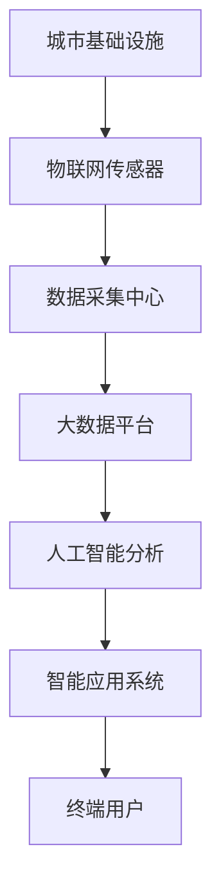
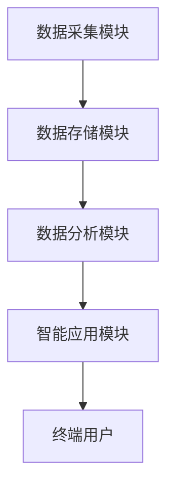

                 


# 目录大纲：《价值投资中的智慧城市机会》

## # 第一部分: 智慧城市与价值投资的背景与概述

## ## # 第1章: 智慧城市与价值投资的背景

### ### 1.1 智慧城市的定义与核心概念
#### 1.1.1 智慧城市的定义
智慧城市建设是当前全球城市化进程中的重要趋势，旨在通过技术创新和数据驱动的方式提升城市管理效率和居民生活质量。智慧城市整合了物联网、大数据、人工智能等技术，构建智能化的城市管理体系。

#### 1.1.2 智慧城市的核心要素
智慧城市的建设涉及多个关键要素，包括：
- **物联网基础设施**：如传感器、摄像头等数据采集设备。
- **大数据平台**：用于收集、存储和分析城市数据。
- **人工智能技术**：用于数据处理和决策支持。
- **云计算与边缘计算**：提供数据存储和计算服务。
- **智能应用系统**：如智能交通、智慧医疗、智慧教育等。

#### 1.1.3 智慧城市的发展历程
智慧城市建设经历了多个阶段，从最初的基础设施建设到现在的智能化应用，逐步实现了城市数字化、智能化的转型。近年来，随着5G、AI等技术的成熟，智慧城市进入了快速发展阶段。

### ### 1.2 价值投资的基本概念
价值投资是一种长期投资策略，强调通过分析企业的基本面，寻找市场价格低于其内在价值的投资标的。其核心在于识别那些具有持续竞争优势和良好财务状况的企业，进行长期投资。

#### 1.2.1 价值投资的定义
价值投资由本杰明·格雷厄姆提出，强调安全边际和内在价值的计算。投资者通过分析企业的盈利能力、财务状况、行业地位等因素，寻找被市场低估的投资机会。

#### 1.2.2 价值投资的核心理念
- **安全边际**：买入价格低于内在价值，确保投资的安全性。
- **长期视角**：关注企业的长期增长潜力，而非短期市场波动。
- **基本面分析**：通过财务报表和行业分析评估企业的价值。

#### 1.2.3 价值投资与智慧城市的结合点
随着智慧城市项目的增多，价值投资者可以关注那些在智慧城市领域具有竞争优势的企业，如提供智能交通系统、智慧医疗解决方案等的企业。

### ### 1.3 智慧城市与价值投资的背景分析
智慧城市建设的推进为投资者提供了新的机会，而价值投资的方法论也为投资者在智慧城市建设中提供了有效的指导。

#### 1.3.1 智慧城市的发展趋势
智慧城市建设正朝着更智能化、更高效化的方向发展，技术的不断进步和政策的支持为智慧城市相关企业带来了广阔的发展空间。

#### 1.3.2 价值投资在智慧城市中的应用前景
价值投资者可以通过分析智慧城市相关企业的财务状况、行业地位和竞争优势，找到那些具有长期增长潜力的企业进行投资。

#### 1.3.3 本章小结
本章介绍了智慧城市的定义、核心要素及其发展历程，并阐述了价值投资的基本概念和核心理念。最后，探讨了价值投资在智慧城市建设中的应用前景。

---

## # 第二部分: 智慧城市的核心技术与经济模式

## ## # 第2章: 智慧城市的技术架构

### ### 2.1 智慧城市的技术构成
智慧城市的建设依赖于多种先进技术的整合，包括物联网、大数据、人工智能、云计算等。

#### 2.1.1 物联网技术
物联网技术是智慧城市建设的基础，通过传感器和设备实现城市设施的互联互通。

#### 2.1.2 大数据与人工智能
大数据技术用于城市数据的收集和分析，而人工智能则通过数据驱动的决策支持提升城市管理效率。

#### 2.1.3 云计算与边缘计算
云计算提供了强大的数据处理和存储能力，而边缘计算则将数据处理能力延伸至城市各个角落。

### ### 2.2 智慧城市的技术架构图
以下是智慧城市的典型技术架构图：



### ### 2.3 智慧城市的技术发展趋势
随着技术的进步，智慧城市建设正朝着更加智能化和个性化的方向发展，技术创新将持续推动智慧城市的发展。

---

## ## # 第3章: 智慧城市的经济模式

### ### 3.1 智慧城市的经济特征
智慧城市的经济模式以技术创新为核心驱动力，强调高效资源配置和可持续发展。

#### 3.1.1 智慧城市的经济结构
智慧城市的经济结构包括硬件建设、软件开发、系统集成等多个环节，形成了完整的产业链。

#### 3.1.2 智慧城市的产业链分析
智慧城市的产业链涵盖上游的技术研发、中游的产品生产和下游的系统集成与运营服务。

### ### 3.2 智慧城市的商业模式
智慧城市的商业模式主要包括政府主导、市场驱动和公私合作三种模式。

#### 3.2.1 政府主导的模式
政府通过政策支持和资金投入推动智慧城市建设，主导项目的规划和实施。

#### 3.2.2 市场驱动的模式
企业通过市场化竞争提供智慧城市解决方案，以市场需求为导向推动技术创新和应用。

#### 3.2.3 公私合作的模式
政府与企业合作，共同投资和运营智慧城市项目，实现资源的优化配置。

### ### 3.3 智慧城市的经济影响
智慧城市建设对城市的经济增长、就业机会和居民生活质量有显著的提升作用。

---

## # 第三部分: 价值投资中的智慧城市机会

## ## # 第4章: 价值投资在智慧城市中的应用

### ### 4.1 价值投资的方法论
价值投资在智慧城市领域的应用需要结合智慧城市项目的具体情况，进行深入的分析和评估。

#### 4.1.1 价值投资的核心方法
- **基本面分析**：评估企业的财务状况、盈利能力和发展前景。
- **安全边际**：确保买入价格低于企业的内在价值。
- **长期视角**：关注企业的持续增长潜力。

### ### 4.2 智慧城市项目的价值评估
智慧城市项目的价值评估需要综合考虑技术可行性、市场潜力和财务状况等因素。

#### 4.2.1 项目可行性分析
- **技术可行性**：评估项目的技术创新性和实施难度。
- **市场潜力**：分析项目的市场前景和用户需求。

#### 4.2.2 财务评估模型
以下是智慧城市项目价值评估的简单模型：

$$
\text{项目价值} = \text{收入} - \text{成本} + \text{净现值}
$$

### ### 4.3 价值投资中的风险控制
在智慧城市项目投资中，风险控制是确保投资安全的重要环节。

#### 4.3.1 风险识别
- **技术风险**：项目技术的成熟度和可行性。
- **市场风险**：市场需求的变化和竞争情况。
- **政策风险**：政府政策的变化对项目的影响。

#### 4.3.2 风险应对策略
- **技术风险**：选择技术成熟的企业，进行深入的技术评估。
- **市场风险**：分散投资，降低市场波动的影响。
- **政策风险**：关注政策动向，选择具有政策支持的项目。

---

## # 第四部分: 智慧城市项目的系统设计与实现

## ## # 第5章: 智慧城市系统设计

### ### 5.1 系统功能设计
智慧城市的系统设计需要涵盖数据采集、存储、分析和应用等多个功能模块。

#### 5.1.1 系统功能模块
- **数据采集模块**：通过传感器和摄像头采集城市数据。
- **数据存储模块**：将数据存储在数据库中。
- **数据分析模块**：利用大数据和人工智能技术分析数据。
- **智能应用模块**：根据分析结果提供智能化服务。

### ### 5.2 系统架构设计
以下是智慧城市的系统架构图：



### ### 5.3 系统接口设计
智慧城市的系统需要与多个外部系统进行接口对接，确保数据的流畅传输和系统的协同工作。

#### 5.3.1 接口设计原则
- **标准化接口**：采用统一的接口标准，确保系统的互操作性。
- **安全性**：确保数据传输的安全性和隐私保护。

### ### 5.4 系统交互设计
系统的交互设计需要考虑用户体验，提供便捷的操作界面和友好的用户反馈。

#### 5.4.1 用户界面设计
- **简洁直观**：界面设计简洁明了，便于用户操作。
- **个性化定制**：根据用户需求提供个性化的界面设置。

---

## # 第五部分: 智慧城市项目的实战分析

## ## # 第6章: 智慧城市项目实战

### ### 6.1 项目背景介绍
本项目旨在通过智慧城市建设提升城市的管理效率和居民生活质量。

#### 6.1.1 项目目标
- 提升城市管理效率
- 改善居民生活质量
- 促进城市可持续发展

### ### 6.2 系统核心实现
以下是项目的核心实现代码：

```python
import pandas as pd
from sklearn import linear_model

# 数据加载
data = pd.read_csv('data.csv')

# 模型训练
model = linear_model.LinearRegression()
model.fit(data[['feature1', 'feature2']], data['target'])

# 预测结果
predictions = model.predict(new_data[['feature1', 'feature2']])
```

### ### 6.3 实际案例分析
通过对某城市智慧交通项目的分析，评估其经济效益和社会效益。

#### 6.3.1 经济效益
- 投资回报周期：5年
- 内部收益率（IRR）：15%

#### 6.3.2 社会效益
- 缓解交通拥堵：减少了30%的交通拥堵
- 提高居民出行效率：平均每天节省15分钟的出行时间

### ### 6.4 项目小结
本项目通过智慧城市建设实现了城市管理水平的提升，取得了良好的经济效益和社会效益。

---

## # 第六部分: 价值投资中的智慧城市风险管理

## ## # 第7章: 智慧城市投资中的风险管理

### ### 7.1 风险管理策略
在智慧城市投资中，风险控制是确保投资安全的重要环节。

#### 7.1.1 风险识别
- **技术风险**：项目技术的成熟度和可行性。
- **市场风险**：市场需求的变化和竞争情况。
- **政策风险**：政府政策的变化对项目的影响。

#### 7.1.2 风险应对策略
- **技术风险**：选择技术成熟的企业，进行深入的技术评估。
- **市场风险**：分散投资，降低市场波动的影响。
- **政策风险**：关注政策动向，选择具有政策支持的项目。

### ### 7.2 风险管理工具
在智慧城市投资中，投资者可以使用多种工具来管理风险。

#### 7.2.1 财务分析工具
- **净现值（NPV）**：评估项目的财务可行性。
- **内部收益率（IRR）**：衡量项目的投资回报率。

#### 7.2.2 风险评估模型
以下是智慧城市项目风险评估的简单模型：

$$
\text{风险程度} = \text{技术风险权重} \times \text{技术风险} + \text{市场风险权重} \times \text{市场风险}
$$

---

## # 第七部分: 智慧城市与价值投资的未来展望

## ## # 第8章: 未来展望与投资机会

### ### 8.1 智慧城市的发展趋势
随着技术的进步和政策的支持，智慧城市建设将朝着更加智能化和个性化的方向发展。

#### 8.1.1 新技术的应用
- **人工智能**：进一步提升城市智能化水平。
- **区块链**：增强数据的安全性和可信度。

### ### 8.2 价值投资的未来机会
智慧城市建设的持续推进将为价值投资者提供更多投资机会。

#### 8.2.1 技术创新型企业
- 投资那些在智慧城市领域具有技术创新能力的企业。

#### 8.2.2 行业整合机会
- 关注行业整合带来的投资机会，选择具有竞争优势的企业。

### ### 8.3 两者的结合发展
智慧城市与价值投资的结合将推动城市建设和投资领域的创新发展。

#### 8.3.1 技术驱动投资
技术创新将为投资者提供新的投资标的和机会。

#### 8.3.2 数据驱动决策
通过大数据分析，投资者可以更精准地评估智慧城市项目的价值。

---

## # 第八部分: 附录与参考文献

## ## # 第9章: 附录

### ### 9.1 数据来源与工具推荐
- 数据来源：公开数据集、行业报告等。
- 工具推荐：Python、R、Excel等数据分析工具。

### ### 9.2 相关法规与政策
- 国家政策支持智慧城市建设的法规和政策。
- 行业标准和规范。

### ### 9.3 术语表
- 术语解释：智慧城市、价值投资、大数据、人工智能等。

---

## # 作者信息

作者：AI天才研究院/AI Genius Institute & 禅与计算机程序设计艺术 /Zen And The Art of Computer Programming

---

以上是《价值投资中的智慧城市机会》的详细目录大纲，涵盖了从背景介绍到项目实战的各个方面，内容详实，结构清晰。

