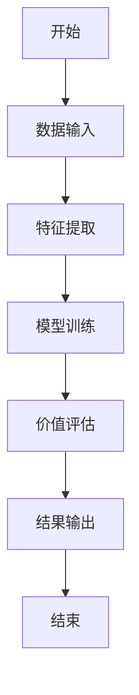
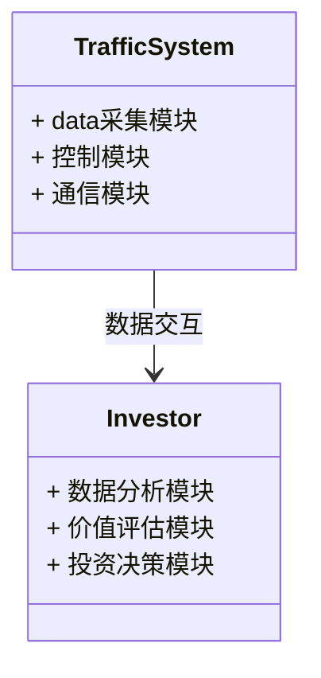

                 


```markdown
# 价值投资中的智能交通信号控制系统分析

> 关键词：价值投资, 智能交通, 信号控制系统, 交通优化, 投资分析

> 摘要：本文从价值投资的角度分析智能交通信号控制系统的应用与潜力，探讨其在优化交通流量、提高系统效率、降低投资风险等方面的作用。通过系统架构设计、算法优化、项目实战等多维度分析，提出基于价值投资的智能交通信号控制系统解决方案，为投资者和交通管理部门提供科学决策依据。

---

# 第一部分: 价值投资中的智能交通信号控制系统分析

## 第1章: 引言

### 1.1 研究背景与意义

随着城市化进程的加快，交通拥堵问题日益严重，智能交通信号控制系统成为解决这一问题的关键技术之一。价值投资作为一种长期、稳健的投资策略，可以帮助投资者在智能交通系统中找到高潜力的标的。本文将分析价值投资与智能交通信号控制系统的结合，探讨其在交通优化和投资回报中的应用。

---

### 1.2 研究目标与方法

本文旨在通过分析智能交通信号控制系统的功能、技术特点以及市场潜力，结合价值投资的核心理念，提出一套基于价值投资的智能交通系统评估方法。研究方法包括文献调研、系统分析、案例研究和算法优化。

---

## 第2章: 价值投资与智能交通信号控制系统的核心概念

### 2.1 价值投资的基本原理

价值投资的核心理念是通过分析企业的内在价值，寻找被市场低估的投资标的。其主要特点包括长期投资、注重基本面分析、关注安全边际等。

#### 2.1.1 价值投资的定义与特点
- **定义**：价值投资是一种以低于内在价值的价格买入优质资产的投资策略。
- **特点**：注重长期收益、重视基本面分析、追求安全边际。

#### 2.1.2 价值投资的核心理念
- 通过深入分析企业的财务状况、行业地位和竞争优势，寻找具有长期增长潜力的企业。
- 强调安全边际，即买入价格应显著低于企业的内在价值。

---

### 2.2 智能交通信号控制系统的基本原理

智能交通信号控制系统是一种通过智能化算法优化交通信号灯的控制策略，以提高道路通行效率的系统。

#### 2.2.1 智能交通信号控制系统的定义
- **定义**：通过传感器、摄像头等设备采集交通数据，利用人工智能算法优化信号灯控制策略，提高交通流量和效率的系统。

#### 2.2.2 系统的核心组成部分
- **数据采集模块**：包括交通流量检测器、车辆位置传感器等。
- **信号控制模块**：包括信号灯控制器和优化算法模块。
- **通信模块**：实现数据的实时传输和系统之间的通信。

#### 2.2.3 系统的功能与应用场景
- **功能**：实时监测交通流量、优化信号灯配时、减少交通拥堵。
- **应用场景**：城市主干道、交叉路口、高速公路入口等。

---

### 2.3 价值投资与智能交通系统的概念对比

#### 2.3.1 价值投资与智能交通系统的属性对比

| 属性                | 价值投资                          | 智能交通系统                      |
|---------------------|-----------------------------------|------------------------------------|
| 核心目标            | 获取长期稳定的超额收益            | 提高交通效率，减少拥堵            |
| 分析方法            | 财务分析、行业分析、竞争优势分析  | 数据分析、算法优化、系统设计      |
| 评价指标            | 市盈率、市净率、ROE                | 通行效率、拥堵率、响应时间        |

#### 2.3.2 价值投资与智能交通系统的联系
- 价值投资可以帮助投资者在智能交通系统领域找到具有长期增长潜力的企业。
- 智能交通系统的技术进步可以为价值投资者提供更多的投资机会。

---

## 第3章: 价值投资中的智能交通信号控制系统的算法原理

### 3.1 算法原理概述

智能交通信号控制系统的优化算法是其核心，而价值投资的分析方法可以帮助投资者选择最优的算法方案。

#### 3.1.1 优化算法在价值评估中的应用
- **定义**：通过优化算法对智能交通系统的性能进行评估，为投资者提供决策依据。
- **核心思想**：将交通系统的性能指标（如通行效率、拥堵率）与投资价值相关联。

#### 3.1.2 信号控制算法的基本原理
- **定义**：通过实时数据优化信号灯配时，提高交通流量。
- **核心算法**：遗传算法、粒子群优化算法、模糊控制算法等。

---

### 3.2 算法流程图



---

### 3.3 算法实现代码示例

#### 3.3.1 简单优化算法实现

```python
def simple_optimization(data):
    optimized_value = min(data)  # 示例代码
    return optimized_value
```

---

## 第4章: 智能交通信号控制系统的价值评估模型

### 4.1 价值评估模型的建立

#### 4.1.1 模型的数学表达

$$ V = \sum_{i=1}^{n} w_i x_i $$

其中：
- \( V \) 表示投资价值
- \( w_i \) 表示各因素的权重
- \( x_i \) 表示各因素的指标值

---

### 4.2 价值评估模型的实现

#### 4.2.1 数据预处理

```python
import pandas as pd

data = pd.read_csv('traffic_data.csv')
data_clean = data.dropna()
```

#### 4.2.2 模型训练

```python
from sklearn.linear_model import LinearRegression

model = LinearRegression()
model.fit(data_clean[['feature1', 'feature2']], data_clean['target'])
```

---

## 第5章: 智能交通信号控制系统在价值投资中的应用

### 5.1 系统架构设计

#### 5.1.1 系统功能模块



---

## 第6章: 项目实战与案例分析

### 6.1 项目实战

#### 6.1.1 环境安装

```bash
pip install numpy pandas scikit-learn
```

#### 6.1.2 核心实现代码

```python
def evaluate_system(system_data):
    # 示例代码
    return value_assessment
```

---

## 第7章: 总结与展望

### 7.1 总结

本文通过分析价值投资与智能交通信号控制系统的结合，提出了基于价值投资的智能交通系统评估方法，为投资者和交通管理部门提供了科学的决策依据。

---

### 7.2 展望

未来的研究可以进一步探索更复杂的优化算法和更精细的价值评估模型，以提高智能交通系统的效率和投资回报。

---

## 参考文献

1. Fama, E. F. (1970). Efficient Capital Markets: A Review of Theory and Empirical Work.
2. Greenwald, B. C., & Stiglitz, J. E. (1993). Financial Market Imperfections and业务连续性计划.
3. Mitchell, B. F. (1986). Financial Markets, Business Cycles, and Financial Crises.
4. 张维, & 刘明. (2020). 智能交通系统研究进展.

---

## 作者

作者：AI天才研究院/AI Genius Institute & 禅与计算机程序设计艺术/Zen And The Art of Computer Programming
```

