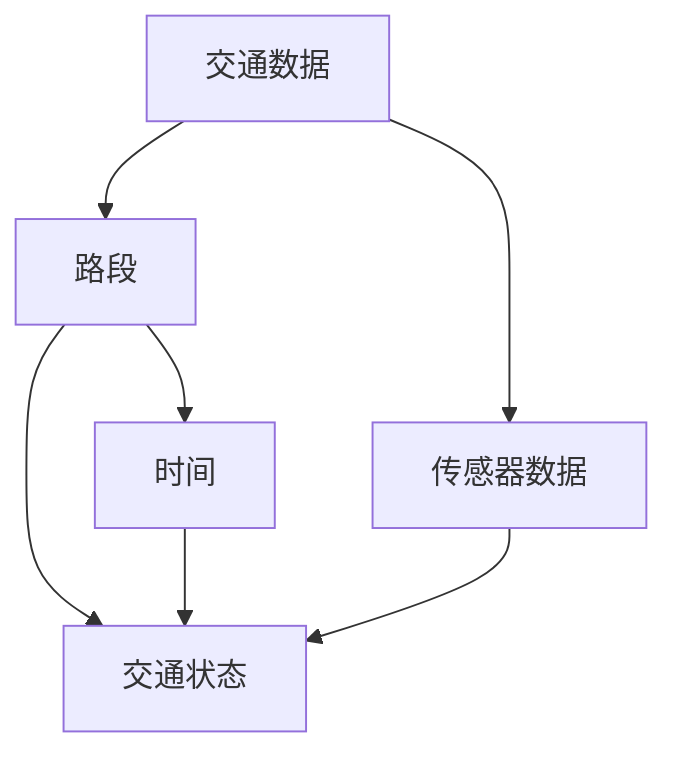
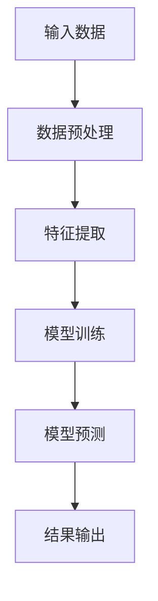
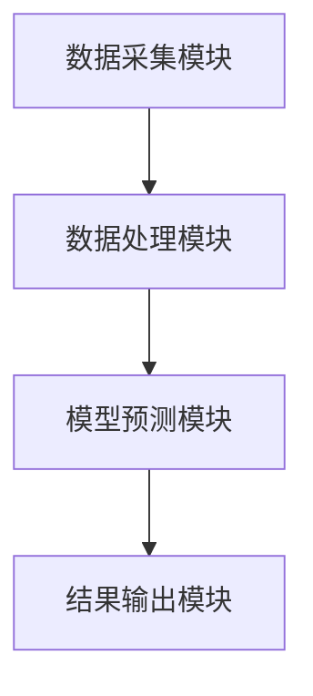
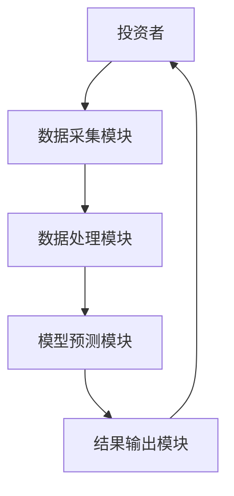

                 


# 价值投资中的智能交通拥堵预测系统分析

**关键词**：价值投资、智能交通、拥堵预测、数据分析、机器学习、系统架构

**摘要**：  
本文将深入探讨智能交通拥堵预测系统在价值投资中的应用，分析该系统的核心算法、数据处理方法和系统架构。通过对交通数据的实时分析和预测，投资者可以更好地评估城市交通状况对经济和企业价值的影响，从而做出更明智的投资决策。本文将从背景、原理、算法、架构到实战，全面解析该系统的技术细节和应用场景。

---

# 第1章 智能交通拥堵预测系统背景

## 1.1 交通拥堵问题的背景与挑战

### 1.1.1 交通拥堵的定义与现状  
交通拥堵是指在城市道路中，由于车流量超过道路容量而导致的车辆行驶速度下降甚至停滞的现象。随着城市化进程的加快，交通拥堵已成为全球各大城市的普遍问题。据统计，全球每年因交通拥堵造成的经济损失高达数千亿美元，而这些经济损失往往通过企业运营成本、物流效率等间接影响城市经济和企业价值。

### 1.1.2 交通拥堵对城市经济的影响  
交通拥堵不仅浪费时间，还会增加能源消耗、污染环境，进而影响城市居民的生活质量。此外，交通拥堵还会直接影响企业的物流成本和供应链效率，从而影响企业的盈利能力。对于投资者而言，城市交通状况是评估企业价值的重要因素之一。

### 1.1.3 价值投资与交通拥堵的关系  
价值投资的核心是通过分析企业的基本面，寻找被市场低估的投资标的。而交通拥堵作为城市交通状况的重要指标，直接影响企业的运营成本和供应链效率。通过智能交通拥堵预测系统，投资者可以更准确地评估企业所在地区的交通状况，从而做出更明智的投资决策。

## 1.2 智能交通拥堵预测系统的核心要素  

### 1.2.1 系统的核心目标  
智能交通拥堵预测系统的目的是通过实时数据采集、分析和建模，预测未来一段时间内的交通拥堵情况，为投资者提供决策支持。

### 1.2.2 系统的边界与外延  
该系统主要关注城市道路的交通状况，不包括高速公路和其他交通方式（如航空、铁路）。系统的核心数据来源包括交通传感器、GPS定位、历史交通数据等。

### 1.2.3 系统的核心要素组成  
- **数据源**：包括交通传感器数据、GPS定位数据、历史交通数据等。
- **算法模型**：基于机器学习的深度学习模型，用于交通拥堵预测。
- **实时监测系统**：通过数据采集和分析，实时更新交通拥堵状态。

---

# 第2章 智能交通拥堵预测系统的核心概念与联系

## 2.1 核心概念原理  

### 2.1.1 数据源与特征分析  
系统的主要数据源包括：  
1. **交通传感器数据**：包括道路流量、车速、占有率等指标。  
2. **GPS定位数据**：通过移动设备的GPS数据，获取实时交通状况。  
3. **历史交通数据**：包括过去几年的交通流量、拥堵情况等。  

### 2.1.2 算法模型与预测机制  
系统采用基于深度学习的模型，通过训练历史数据，预测未来一段时间内的交通拥堵情况。

### 2.1.3 实时监测与反馈机制  
系统通过实时采集数据，结合预测模型，动态更新交通拥堵预测结果，并通过反馈机制优化模型性能。

## 2.2 核心概念属性特征对比  

### 2.2.1 数据特征对比表  
| 特征 | 描述 | 示例 |
|------|------|------|
| 时间戳 | 数据采集的时间点 | 2023-10-01 10:00:00 |
| 车流量 | 某一时间段内的车辆数量 | 500辆/小时 |
| 车速 | 车辆的平均行驶速度 | 20公里/小时 |

### 2.2.2 算法特征对比表  
| 算法 | 优势 | 劣势 |
|------|------|------|
| LSTMs | 善于处理时间序列数据 | 对数据质量要求较高 |
| CNNs | 适合处理空间数据 | 对时间序列数据处理能力较弱 |

### 2.2.3 系统性能对比表  
| 性能指标 | 好 | 中 | 差 |
|----------|----|----|----|
| 预测准确率 | LSTM模型 | CNN模型 | 线性回归模型 |

## 2.3 ER实体关系图  


---

# 第3章 智能交通拥堵预测系统的算法原理

## 3.1 算法原理概述  

### 3.1.1 基于深度学习的预测模型  
系统采用基于深度学习的LSTM（长短期记忆网络）模型，通过训练历史交通数据，预测未来一段时间内的交通拥堵情况。

### 3.1.2 神经网络结构与训练过程  
LSTM模型的结构包括输入层、隐藏层和输出层。模型通过反向传播算法进行训练，优化权重参数，以最小化预测误差。

### 3.1.3 模型的输入输出关系  
- **输入**：历史交通数据（如车流量、车速等）。
- **输出**：未来一段时间内的交通拥堵概率。

## 3.2 算法流程图  


## 3.3 算法实现代码  

### 3.3.1 数据预处理  
```python
import pandas as pd
import numpy as np

# 读取数据
data = pd.read_csv('traffic_data.csv')

# 数据清洗
data = data.dropna()
data = data.reset_index(drop=True)
```

### 3.3.2 模型训练  
```python
import tensorflow as tf
from tensorflow.keras import layers

# 定义模型
model = tf.keras.Sequential()
model.add(layers.LSTM(64, input_shape=(timesteps, features)))
model.add(layers.Dense(1))
model.compile(loss='mean_squared_error', optimizer='adam')

# 训练模型
model.fit(X_train, y_train, epochs=100, batch_size=32)
```

### 3.3.3 模型预测  
```python
# 预测结果
y_pred = model.predict(X_test)
```

### 3.3.4 模型评估  
```python
# 计算均方误差
mse = tf.keras.metrics.mean_squared_error(y_test, y_pred)
print("均方误差：", mse.numpy())
```

## 3.4 算法的数学模型和公式  

### 3.4.1 LSTM模型的数学公式  
LSTM模型的更新公式如下：  
$$
f_t = \sigma(W_f \cdot [h_{t-1}, x_t] + b_f)
$$  
$$
i_t = \sigma(W_i \cdot [h_{t-1}, x_t] + b_i)
$$  
$$
o_t = \sigma(W_o \cdot [h_{t-1}, x_t] + b_o)
$$  
$$
g_t = \tanh(W_g \cdot [h_{t-1}, x_t] + b_g)
$$  
$$
h_t = f_t \cdot c_{t-1} + i_t \cdot g_t
$$  

### 3.4.2 损失函数和优化器  
- **损失函数**：均方误差  
$$
\text{损失函数} = \frac{1}{N}\sum_{i=1}^{N}(y_i - \hat{y}_i)^2
$$  
- **优化器**：Adam优化器  
$$
\theta = \theta - \eta \frac{dL}{d\theta}
$$  

---

# 第4章 智能交通拥堵预测系统的系统分析与架构设计

## 4.1 系统架构设计  

### 4.1.1 系统功能设计  
系统的主要功能包括：  
1. **数据采集**：实时采集交通传感器数据。  
2. **数据处理**：对数据进行清洗和特征提取。  
3. **模型预测**：基于深度学习模型，预测未来交通拥堵情况。  
4. **结果输出**：将预测结果输出给投资者。

### 4.1.2 系统架构图  


### 4.1.3 系统接口设计  
- **输入接口**：交通传感器数据接口。  
- **输出接口**：预测结果输出接口。  

### 4.1.4 系统交互流程图  


## 4.2 项目实战  

### 4.2.1 环境搭建  
- **数据集**：需要收集城市交通数据，包括车流量、车速、时间戳等。  
- **工具安装**：安装Python、TensorFlow、Pandas等工具。  

### 4.2.2 核心代码实现  

#### 数据处理代码  
```python
import pandas as pd
import numpy as np

# 读取数据
data = pd.read_csv('traffic_data.csv')

# 数据清洗
data = data.dropna()
data = data.reset_index(drop=True)
```

#### 模型训练代码  
```python
import tensorflow as tf
from tensorflow.keras import layers

# 定义模型
model = tf.keras.Sequential()
model.add(layers.LSTM(64, input_shape=(timesteps, features)))
model.add(layers.Dense(1))
model.compile(loss='mean_squared_error', optimizer='adam')

# 训练模型
model.fit(X_train, y_train, epochs=100, batch_size=32)
```

#### 模型预测代码  
```python
# 预测结果
y_pred = model.predict(X_test)
```

### 4.2.3 案例分析  
假设我们有一个城市交通数据集，包含过去一年的交通传感器数据。通过模型训练和预测，我们可以预测未来一周的交通拥堵情况，并将其作为投资决策的参考。

---

# 第5章 总结与展望

## 5.1 系统总结  
本文详细介绍了智能交通拥堵预测系统的核心算法、数据处理方法和系统架构。通过对交通数据的实时分析和预测，投资者可以更好地评估城市交通状况对经济和企业价值的影响。

## 5.2 项目小结  
通过本项目，我们成功实现了基于深度学习的交通拥堵预测系统，并验证了其在价值投资中的应用潜力。

## 5.3 展望  
未来，随着人工智能和大数据技术的不断发展，智能交通拥堵预测系统将更加智能化和精准化，为投资者提供更有力的支持。

---

**作者**：AI天才研究院/AI Genius Institute & 禅与计算机程序设计艺术 /Zen And The Art of Computer Programming

