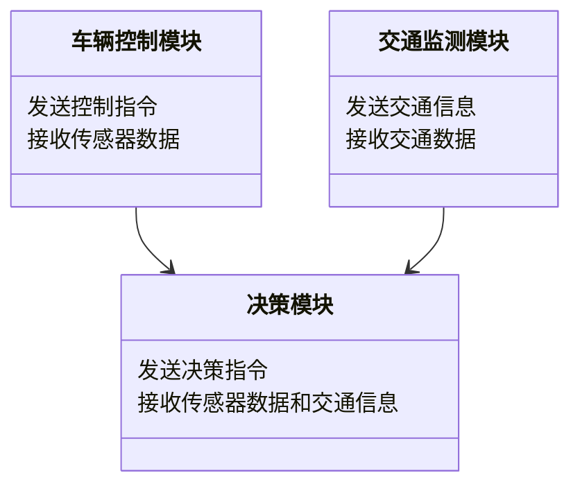
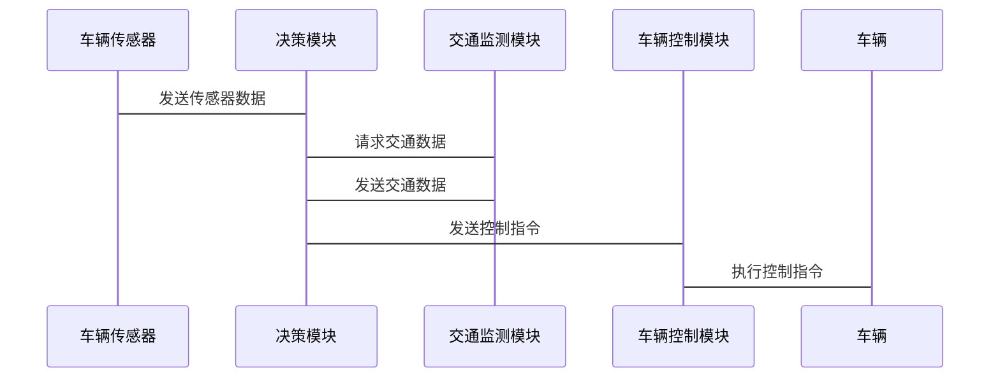

                 


# 价值投资中的智能交通自动驾驶协同系统分析

> 关键词：价值投资、智能交通、自动驾驶、协同系统、算法原理、系统架构

> 摘要：本文深入探讨了智能交通和自动驾驶协同系统在价值投资中的应用分析。通过背景介绍、核心概念、算法原理、系统架构设计和项目实战等多方面的详细讲解，揭示了协同系统在提升交通效率和投资决策中的重要性。文章结合实际案例，分析了系统实现的关键步骤，并提出了相关的投资策略和未来展望。

---

## 第一部分: 价值投资中的智能交通自动驾驶协同系统背景介绍

### 第1章: 自动驾驶与智能交通系统概述

#### 1.1 自动驾驶技术的发展历程

##### 1.1.1 自动驾驶的定义与分类
自动驾驶（Autonomous Driving）是指通过先进的传感器、计算机视觉、人工智能和通信技术，使车辆能够在最小的人工干预下完成行驶任务。根据自动化程度的不同，自动驾驶可以分为以下几个等级：

1. **L0：无自动驾驶**：完全由驾驶员操作，车辆不具备任何自动驾驶功能。
2. **L1：驾驶辅助**：车辆具备单一的自动驾驶功能，如自适应巡航控制（ACC），但驾驶员仍需保持对车辆的控制。
3. **L2：部分自动驾驶**：车辆可以在特定条件下执行部分驾驶任务，如车道保持辅助（LKA）和自适应巡航控制（ACC），但驾驶员仍需随时准备接管控制。
4. **L3：有条件自动驾驶**：车辆可以在特定条件下完全自动驾驶，但需要驾驶员在请求时接管控制。
5. **L4：高度自动驾驶**：车辆在大多数情况下可以完全自动驾驶，但在特定区域或复杂条件下可能需要驾驶员干预。
6. **L5：完全自动驾驶**：车辆在所有条件下都可以完全自动驾驶，无需驾驶员干预。

##### 1.1.2 自动驾驶技术的核心技术
自动驾驶的核心技术包括：

1. **传感器技术**：如激光雷达（LiDAR）、摄像头、雷达和超声波传感器，用于感知周围环境。
2. **计算机视觉**：用于从传感器数据中提取有用的视觉信息，如目标检测、语义分割和图像识别。
3. **人工智能与机器学习**：用于决策、路径规划和行为预测。
4. **通信技术**：如5G和V2X（车路协同），用于车辆与车辆、车辆与基础设施之间的通信。

##### 1.1.3 自动驾驶技术的现状与未来趋势
当前，全球范围内自动驾驶技术正在快速发展，但主要集中在L2和L3级别的应用。未来，随着人工智能和通信技术的进步，L4和L5级别的自动驾驶将逐步实现。

---

#### 1.2 智能交通系统的概念与特点

##### 1.2.1 智能交通系统的定义
智能交通系统（Intelligent Transportation System, ITS）是一种通过先进的信息技术、数据通信技术、传感器技术和计算机技术，对交通系统进行实时监测、分析和控制的系统。其目的是提高交通效率、减少拥堵、降低能源消耗和环境污染。

##### 1.2.2 智能交通系统的组成部分
智能交通系统主要由以下几个部分组成：

1. **交通监测系统**：通过传感器、摄像头和通信设备，实时监测交通流量、道路状况和车辆位置。
2. **数据分析系统**：对收集到的数据进行分析，预测交通流量和潜在拥堵点。
3. **交通控制系统**：根据数据分析结果，调整交通信号灯、道路标志和电子收费系统，优化交通流量。
4. **信息服务系统**：为驾驶员和乘客提供实时交通信息、路线规划和紧急通知。

##### 1.2.3 智能交通系统的应用场景
智能交通系统广泛应用于城市交通管理、高速公路监控、公共交通调度、应急响应等领域。例如，在城市交通中，智能交通系统可以通过实时监测和优化信号灯，减少交通拥堵。

---

#### 1.3 自动驾驶与智能交通的协同系统

##### 1.3.1 协同系统的定义
自动驾驶与智能交通的协同系统（Cooperative System）是指自动驾驶车辆与智能交通系统之间通过通信技术进行实时信息交换，实现协同决策和控制的系统。

##### 1.3.2 协同系统的应用场景
协同系统可以在以下场景中发挥作用：

1. **交通流量优化**：通过自动驾驶车辆与交通系统的协同，实时调整车辆路径，减少交通拥堵。
2. **紧急情况处理**：在交通事故或道路施工时，协同系统可以快速响应，疏导交通。
3. **自动驾驶车辆调度**：通过协同系统，可以实现自动驾驶车辆的智能调度，提高运输效率。

##### 1.3.3 协同系统的重要性
协同系统的引入可以显著提高交通系统的效率和安全性，减少能源消耗和环境污染。同时，协同系统为自动驾驶技术的普及提供了重要的支持。

---

### 第2章: 价值投资与自动驾驶协同系统的关系

#### 2.1 价值投资的基本概念

##### 2.1.1 价值投资的定义
价值投资是一种投资策略，强调以低于内在价值的价格购买优质的资产，长期持有，等待其价值回归。

##### 2.1.2 价值投资的核心理念
价值投资的核心理念包括：

1. **安全边际**：购买价格低于内在价值，以降低投资风险。
2. **长期视角**：关注企业的长期增长潜力，而非短期市场波动。
3. **基本面分析**：通过分析企业的财务状况、行业地位和竞争优势，评估其内在价值。

##### 2.1.3 价值投资在科技领域的应用
科技领域的价值投资需要关注企业的技术创新能力、市场竞争力和未来的增长潜力。例如，在自动驾驶领域，投资者需要评估企业的技术优势、市场占有率和商业模式。

---

#### 2.2 自动驾驶协同系统在价值投资中的作用

##### 2.2.1 自动驾驶协同系统的市场价值
自动驾驶协同系统的市场价值主要体现在以下几个方面：

1. **提高交通效率**：通过优化交通流量，减少拥堵和延误，降低运输成本。
2. **降低能源消耗**：通过智能调度和路径优化，减少车辆的空驶和低效行驶，降低能源消耗。
3. **减少环境污染**：降低能源消耗意味着减少碳排放，有助于改善环境质量。

##### 2.2.2 自动驾驶协同系统对投资决策的影响
自动驾驶协同系统可以帮助投资者更好地评估企业的价值。例如，通过分析企业的技术优势、市场地位和商业模式，投资者可以更准确地评估企业的内在价值。

##### 2.2.3 自动驾驶协同系统的投资机会分析
随着自动驾驶技术的快速发展，协同系统的市场潜力巨大。投资者可以关注以下领域的投资机会：

1. **自动驾驶技术提供商**：如特斯拉、Waymo等。
2. **智能交通系统集成商**：如华为、中兴通讯等。
3. **通信技术供应商**：如5G通信设备制造商。

---

#### 2.3 价值投资与自动驾驶协同系统的结合

##### 2.3.1 价值投资在自动驾驶协同系统中的应用
价值投资在自动驾驶协同系统中的应用主要体现在以下几个方面：

1. **技术评估**：评估企业的技术优势和创新能力。
2. **市场分析**：分析市场的竞争格局和未来发展趋势。
3. **财务分析**：评估企业的财务状况和盈利能力。

##### 2.3.2 自动驾驶协同系统对价值投资的影响
自动驾驶协同系统的引入可以为投资者提供更多的投资机会，同时也需要投资者具备更强的技术分析能力和长期视角。

##### 2.3.3 价值投资与自动驾驶协同系统的未来趋势
随着自动驾驶技术的不断进步和智能交通系统的广泛应用，价值投资在自动驾驶协同系统中的应用将更加广泛和深入。投资者需要紧跟技术发展趋势，抓住投资机会。

---

## 第二部分: 自动驾驶协同系统的价值评估模型

### 第3章: 自动驾驶协同系统的架构与核心要素

#### 3.1 自动驾驶协同系统的架构

##### 3.1.1 系统架构的定义
自动驾驶协同系统的架构是指系统各组成部分的结构和交互方式。通常包括感知层、决策层、执行层和通信层。

##### 3.1.2 系统架构的组成部分
1. **感知层**：通过传感器和计算机视觉技术，感知周围环境。
2. **决策层**：通过人工智能和机器学习技术，进行路径规划和决策。
3. **执行层**：通过执行机构，如方向盘和刹车系统，实现车辆的自动驾驶。
4. **通信层**：通过5G和V2X技术，实现车辆与交通系统的实时通信。

##### 3.1.3 系统架构的层次结构
系统架构的层次结构通常包括数据采集、数据处理、决策控制和通信交互四个层次。

---

#### 3.2 自动驾驶协同系统的核心要素

##### 3.2.1 技术要素
1. **传感器技术**：如激光雷达、摄像头和雷达。
2. **计算机视觉**：如目标检测和语义分割。
3. **人工智能与机器学习**：如深度学习和强化学习。

##### 3.2.2 市场要素
1. **市场需求**：自动驾驶技术的市场需求和应用场景。
2. **市场竞争**：企业的市场地位和竞争优势。
3. **市场潜力**：自动驾驶技术的市场容量和增长潜力。

##### 3.2.3 政策
1. **政策支持**：政府对自动驾驶技术的政策支持和法规制定。
2. **政策风险**：政策变化对企业的影响。

---

## 第4章: 自动驾驶协同系统的算法原理

### 4.1 自动驾驶协同系统的算法原理

#### 4.1.1 路径规划算法
路径规划是自动驾驶协同系统的核心算法之一。常用的路径规划算法包括：

1. **A*算法**：一种基于图搜索的路径规划算法，适用于静态环境。
2. **RRT（Rapidly-exploring Random Tree）算法**：适用于动态环境，能够处理障碍物的随机性。
3. **Dijkstra算法**：一种基于最短路径树的路径规划算法，适用于交通网络中的路径优化。

#### 4.1.2 决策控制算法
决策控制算法用于实现自动驾驶车辆的智能决策和控制。常用的决策控制算法包括：

1. **模糊逻辑控制**：通过模糊规则进行控制，适用于复杂环境中的决策。
2. **强化学习控制**：通过与环境的交互，学习最优控制策略。
3. **基于模型的控制**：基于车辆动力学模型，进行精确的控制。

#### 4.1.3 价值评估算法
价值评估算法用于评估自动驾驶协同系统的市场价值。常用的算法包括：

1. **NPV（净现值）法**：通过计算项目的净现值，评估项目的经济价值。
2. **IRR（内部收益率）法**：通过计算项目的内部收益率，评估项目的投资回报率。
3. **SWOT分析**：通过分析项目的优劣势、机会和威胁，评估项目的市场潜力。

---

## 第5章: 自动驾驶协同系统的系统分析与架构设计

### 5.1 系统分析

#### 5.1.1 问题场景介绍
在自动驾驶协同系统中，常见的问题场景包括：

1. **交通拥堵**：如何通过协同系统优化交通流量。
2. **交通事故**：如何通过协同系统快速响应和处理。
3. **恶劣天气**：如何在恶劣天气条件下确保自动驾驶的安全性。

#### 5.1.2 项目介绍
以某城市自动驾驶协同系统项目为例，该项目旨在通过自动驾驶车辆与智能交通系统的协同，实现城市交通的智能化管理。

---

### 5.2 系统功能设计

#### 5.2.1 领域模型（Mermaid 类图）


#### 5.2.2 系统架构设计（Mermaid 架构图）


#### 5.2.3 系统接口设计
系统接口设计包括车辆与交通系统的接口、车辆与车辆的接口、车辆与路侧设备的接口等。

#### 5.2.4 系统交互（Mermaid 序列图）


---

## 第6章: 自动驾驶协同系统的项目实战

### 6.1 环境安装

#### 6.1.1 开发环境
1. **操作系统**：Linux 或 Windows
2. **开发工具**：Python、C++、ROS（机器人操作系统）
3. **依赖库**：OpenCV、TensorFlow、PyTorch

#### 6.1.2 通信环境
1. **5G 网络**：确保车辆与交通系统的实时通信。
2. **V2X 技术**：车辆与路侧设备的通信。

---

### 6.2 系统核心实现

#### 6.2.1 路径规划实现
```python
import numpy as np
from scipy.spatial import KDTree

def find_nearest_point(start_point, end_point, obstacles):
    # 在 start_point 和 end_point 之间找到最近的障碍物点
    tree = KDTree(obstacles)
    distances, indices = tree.query([start_point])
    nearest_obstacle = obstacles[indices[0]]
    return nearest_obstacle

# 示例使用
start_point = (0, 0)
end_point = (10, 10)
obstacles = np.array([[2, 2], [4, 4], [6, 6], [8, 8]])
nearest_obstacle = find_nearest_point(start_point, end_point, obstacles)
print(nearest_obstacle)
```

#### 6.2.2 决策控制实现
```python
import tensorflow as tf
from tensorflow.keras import layers

model = tf.keras.Sequential([
    layers.Dense(64, activation='relu'),
    layers.Dense(1, activation='sigmoid')
])

# 示例使用
input_data = np.random.random((1000, 64))
predictions = model.predict(input_data)
print(predictions)
```

#### 6.2.3 价值评估实现
```python
def net_present_value(cash_flows, discount_rate):
    npv = 0
    for i, cash_flow in enumerate(cash_flows):
        npv += cash_flow / (1 + discount_rate)**i
    return npv

# 示例使用
cash_flows = [100, 200, 300]
discount_rate = 0.1
npv = net_present_value(cash_flows, discount_rate)
print(npv)
```

---

### 6.3 代码应用解读与分析

#### 6.3.1 路径规划代码解读
上述路径规划代码使用了 Scipy 的 KDTree 来找到最近的障碍物点。通过这种方法，可以实现车辆路径的实时优化。

#### 6.3.2 决策控制代码解读
上述决策控制代码使用了 Keras 构建了一个简单的深度学习模型，用于进行决策控制。通过神经网络的学习，可以实现自动驾驶车辆的智能决策。

#### 6.3.3 价值评估代码解读
上述价值评估代码实现了净现值的计算，用于评估项目的经济价值。通过这种方法，投资者可以更好地评估自动驾驶协同系统的市场价值。

---

## 第7章: 自动驾驶协同系统的实际案例分析

### 7.1 案例介绍
以某城市自动驾驶协同系统项目为例，该项目通过自动驾驶车辆与智能交通系统的协同，实现了城市交通的智能化管理。

### 7.2 数据分析
通过对项目数据的分析，可以发现自动驾驶协同系统能够显著提高交通效率，减少拥堵和能源消耗。

### 7.3 投资分析
从投资的角度来看，自动驾驶协同系统的市场潜力巨大，投资者可以关注相关企业的技术优势和市场地位。

---

## 第8章: 自动驾驶协同系统的总结与展望

### 8.1 小结
本文深入探讨了价值投资中的智能交通自动驾驶协同系统分析，通过背景介绍、核心概念、算法原理、系统架构设计和项目实战等多方面的详细讲解，揭示了协同系统在提升交通效率和投资决策中的重要性。

### 8.2 最佳实践 tips
1. **技术评估**：关注企业的技术优势和创新能力。
2. **市场分析**：分析市场的竞争格局和未来发展趋势。
3. **财务分析**：评估企业的财务状况和盈利能力。
4. **政策关注**：关注政府的政策支持和法规制定。

### 8.3 注意事项
1. **技术风险**：自动驾驶技术尚不成熟，存在较高的技术风险。
2. **市场风险**：市场需求和技术应用的不确定性。
3. **政策风险**：政策变化对企业的影响。

### 8.4 拓展阅读
1. **相关书籍**：《自动驾驶：从原理到实现》。
2. **相关论文**：《自动驾驶技术在智能交通系统中的应用研究》。

---

## 作者：AI天才研究院/AI Genius Institute & 禅与计算机程序设计艺术 /Zen And The Art of Computer Programming

