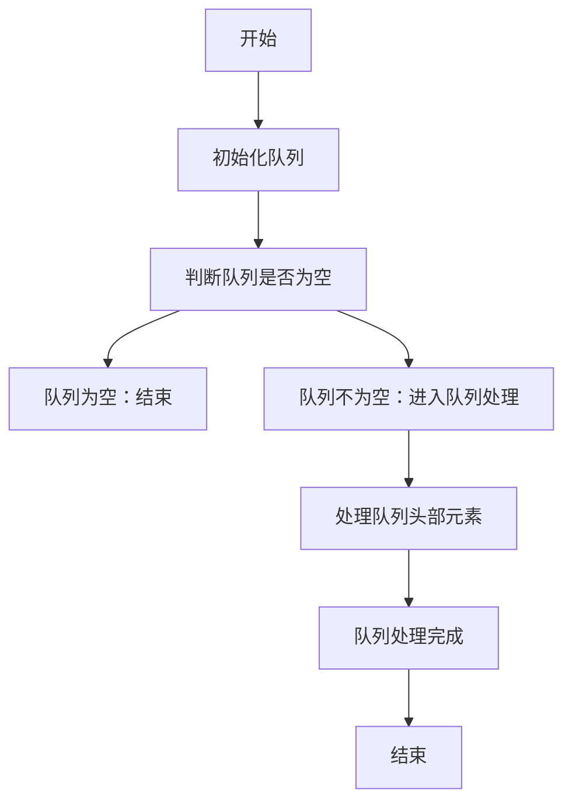
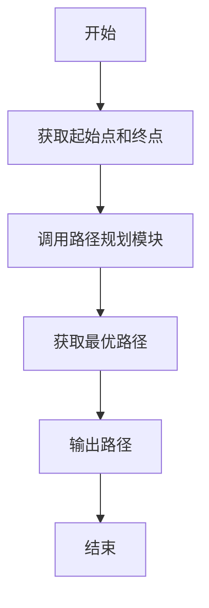
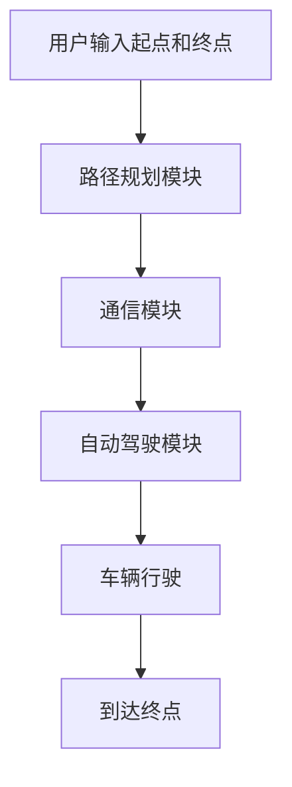
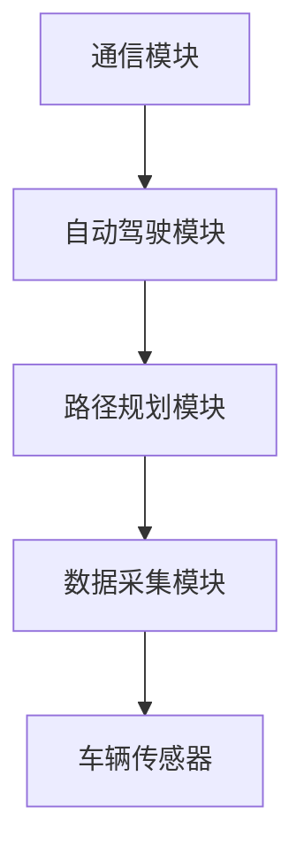

                 


# 价值投资中的智能交通车辆编队系统分析

---

## 关键词

- 价值投资
- 智能交通系统
- 车辆编队系统
- 交通优化
- 投资分析

---

## 摘要

本文深入分析了价值投资在智能交通车辆编队系统中的应用与潜力。通过结合智能交通系统的技术发展与价值投资的长期收益理念，探讨了车辆编队系统在交通优化、节能减排、提高道路利用率等方面的优势。文章从系统的组成、算法原理、架构设计、项目实战等多个维度，详细阐述了如何通过价值投资视角评估智能交通车辆编队系统的投资价值，并提供了实际案例分析和未来趋势展望。

---

## 第一章: 价值投资与智能交通车辆编队系统概述

### 1.1 价值投资的背景与核心理念

#### 1.1.1 价值投资的定义与核心理念
价值投资是一种以基本面分析为基础的投资策略，强调以低于资产内在价值的价格买入优质资产。其核心理念包括：
- **长期视角**：关注企业的长期盈利能力。
- **安全边际**：买入价格低于内在价值。
- **优质企业**：选择具有竞争优势的企业。

#### 1.1.2 价值投资与传统投资的区别
- **传统投资**：基于短期市场波动进行买卖。
- **价值投资**：基于企业长期价值进行投资，注重内在价值。

#### 1.1.3 价值投资在现代科技领域的应用
随着科技行业的快速发展，价值投资在科技领域的应用日益广泛。科技企业的长期成长潜力为价值投资者提供了丰富的投资标的。

### 1.2 智能交通车辆编队系统的定义与应用

#### 1.2.1 智能交通系统的定义
智能交通系统（Intelligent Transportation System, ITS）是通过先进的信息技术、数据通信技术、传感器技术和计算机技术，对交通系统进行实时监测、分析和优化的系统。

#### 1.2.2 车辆编队系统的概念与组成部分
车辆编队系统是一种通过车载通信和自动驾驶技术，实现多辆车辆协同行驶的系统。其组成部分包括：
- **通信模块**：实现车辆间的实时通信。
- **自动驾驶模块**：实现车辆的自动控制。
- **路径规划模块**：优化车辆行驶路径。

#### 1.2.3 智能交通车辆编队系统的应用场景
- **高速公路**：优化交通流量，减少拥堵。
- **城市交通**：提高道路利用率，降低交通延误。
- **物流运输**：降低运输成本，提高效率。

### 1.3 价值投资与智能交通车辆编队系统的结合

#### 1.3.1 智能交通车辆编队系统的投资价值
- **技术优势**：编队系统可显著提高交通效率。
- **市场潜力**：随着自动驾驶技术的发展，市场需求快速增长。

#### 1.3.2 价值投资在智能交通领域的优势
- **长期视角**：关注企业技术创新和市场拓展。
- **安全边际**：选择具有竞争优势的企业。

#### 1.3.3 智能交通车辆编队系统的发展前景
随着技术成熟和政策支持，智能交通车辆编队系统有望在未来几年内实现大规模应用。

---

## 第二章: 智能交通车辆编队系统的组成与价值评估模型

### 2.1 智能交通车辆编队系统的组成分析

#### 2.1.1 车辆通信模块
- **定义**：实现车辆间实时通信的技术。
- **作用**：确保车辆协同行驶的安全性和高效性。

#### 2.1.2 自动驾驶控制模块
- **定义**：实现车辆自动控制的系统。
- **作用**：确保车辆按照预定路径行驶。

#### 2.1.3 路径规划与优化模块
- **定义**：基于实时数据优化车辆行驶路径的系统。
- **作用**：减少交通拥堵，提高道路利用率。

#### 2.1.4 数据采集与处理模块
- **定义**：采集和处理交通数据的系统。
- **作用**：为路径规划和自动驾驶提供实时数据支持。

### 2.2 编队系统的功能模块对比

#### 2.2.1 功能模块的定义与作用
- **通信模块**：确保车辆间实时通信。
- **自动驾驶模块**：实现车辆自动控制。
- **路径规划模块**：优化车辆行驶路径。

#### 2.2.2 功能模块之间的关系
- **通信模块**：数据传输的基础。
- **自动驾驶模块**：数据处理的核心。
- **路径规划模块**：优化结果的输出。

#### 2.2.3 功能模块的优劣势对比

| 功能模块       | 优势                   | 劣势                   |
|----------------|------------------------|------------------------|
| 通信模块       | 实现实时数据传输       | 易受网络延迟影响       |
| 自动驾驶模块   | 提高行驶安全性         | 技术复杂度高           |
| 路径规划模块   | 优化行驶路径           | 需实时更新数据         |

### 2.3 编队系统的核心要素与属性

#### 2.3.1 核心要素的定义
- **通信延迟**：数据传输的延迟时间。
- **车辆间距**：车辆之间的安全距离。
- **路径优化**：行驶路径的优化程度。

#### 2.3.2 核心要素的属性对比

| 核心要素       | 低值属性       | 高值属性       |
|----------------|----------------|----------------|
| 通信延迟       | 高             | 低             |
| 车辆间距       | 短             | 长             |
| 路径优化       | 低             | 高             |

---

## 第三章: 智能交通车辆编队系统的算法原理

### 3.1 队列控制算法

#### 3.1.1 队列控制算法的定义
队列控制算法是一种用于优化车辆编队队列的算法，旨在减少交通拥堵，提高道路利用率。

#### 3.1.2 队列控制算法的实现流程



#### 3.1.3 队列控制算法的数学模型

$$
\text{队列长度} = \text{入队操作次数} - \text{出队操作次数}
$$

### 3.2 路径规划算法

#### 3.2.1 路径规划算法的定义
路径规划算法是一种用于优化车辆行驶路径的算法，旨在减少行驶距离，提高行驶效率。

#### 3.2.2 路径规划算法的实现流程



#### 3.2.3 路径规划算法的数学模型

$$
\text{总行驶距离} = \sum_{i=1}^{n} \text{路径段长度}_i
$$

---

## 第四章: 智能交通车辆编队系统的系统分析与架构设计

### 4.1 系统功能设计

#### 4.1.1 系统功能模块
- **通信模块**：实现车辆间的实时通信。
- **自动驾驶模块**：实现车辆的自动控制。
- **路径规划模块**：优化车辆行驶路径。

#### 4.1.2 系统功能流程图



### 4.2 系统架构设计

#### 4.2.1 系统架构图



---

## 第五章: 智能交通车辆编队系统的项目实战

### 5.1 环境安装

#### 5.1.1 安装Python环境
```bash
# 安装Python
sudo apt-get install python3 python3-pip
```

#### 5.1.2 安装依赖库
```bash
pip install numpy matplotlib
```

### 5.2 核心功能实现

#### 5.2.1 队列控制算法实现

```python
def queue_control(queue):
    while queue:
        element = queue.pop(0)
        print(f"处理元素：{element}")
```

#### 5.2.2 路径规划算法实现

```python
import numpy as np

def path_planning(start, end):
    path = []
    while start != end:
        next_point = find_next_point(start, end)
        path.append(next_point)
        start = next_point
    return path
```

---

## 第六章: 智能交通车辆编队系统的总结与展望

### 6.1 本章总结

- 本文深入分析了价值投资在智能交通车辆编队系统中的应用。
- 通过技术分析和案例研究，探讨了编队系统的投资价值。

### 6.2 未来展望

- **技术发展**：随着自动驾驶技术的成熟，编队系统将得到更广泛应用。
- **投资机会**：具有技术优势和市场潜力的企业将成为价值投资者的重点关注对象。

### 6.3 投资建议

- **长期视角**：关注企业的技术创新和市场拓展。
- **安全边际**：选择具有竞争优势的企业。

---

## 作者：AI天才研究院/AI Genius Institute & 禅与计算机程序设计艺术 /Zen And The Art of Computer Programming

---

以上是《价值投资中的智能交通车辆编队系统分析》的技术博客文章，涵盖背景介绍、核心概念、算法原理、系统架构、项目实战等多个方面，为读者提供了全面的技术分析和投资建议。

