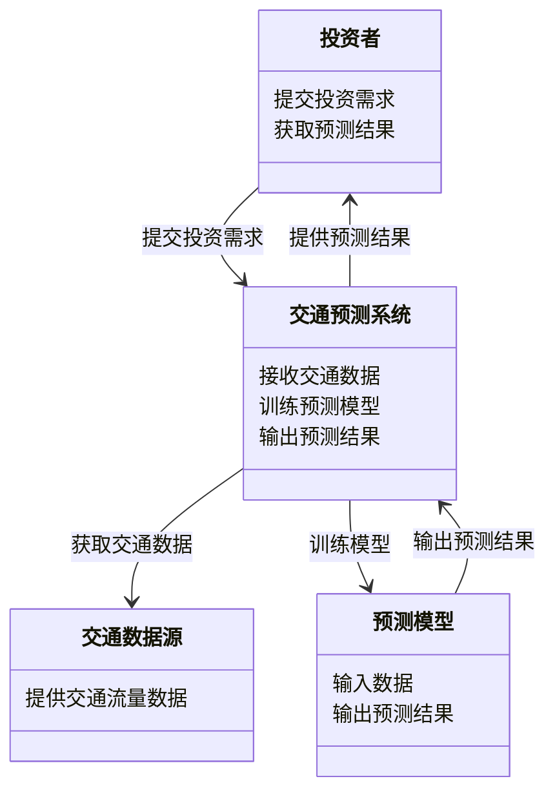

                 


# 价值投资中的智能交通预测系统分析

> 关键词：价值投资、智能交通预测系统、时间序列预测、机器学习、系统架构设计

> 摘要：本文深入探讨了价值投资与智能交通预测系统的结合，分析了两者的结合方式、核心算法原理、系统架构设计及实际应用案例。通过系统化的分析，为读者提供了从理论到实践的完整指南。

---

## 第一章: 价值投资与智能交通预测系统背景

### 1.1 问题背景与目标

#### 1.1.1 价值投资的基本概念
价值投资是一种投资策略，通过分析企业的基本面（如财务状况、行业地位、竞争优势等），寻找市场价格低于其内在价值的投资标的。其核心在于发现市场中的“低估”机会，实现长期稳定的收益。

#### 1.1.2 智能交通预测系统的定义
智能交通预测系统是利用大数据、人工智能和机器学习技术，对交通流量、拥堵情况、交通事故等进行预测和分析，以优化交通管理、提高道路使用效率的系统。

#### 1.1.3 两者的结合与应用目标
将智能交通预测系统应用于价值投资，旨在通过交通数据的预测，辅助投资者分析城市交通状况、区域经济发展潜力，进而评估相关企业的投资价值。

---

### 1.2 问题描述与解决方法

#### 1.2.1 价值投资中的数据需求
价值投资依赖于对企业基本面的分析，但传统的财务指标往往忽略了外部环境（如交通流量）对企业价值的影响。引入智能交通预测数据，可以更全面地评估企业的潜在价值。

#### 1.2.2 交通预测系统的核心问题
交通预测系统需要解决数据采集、模型选择和实时预测等问题。这些问题直接影响到交通预测的准确性和实时性，进而影响价值投资的决策效果。

#### 1.2.3 智能交通预测系统的解决方案
通过构建基于机器学习的时间序列预测模型，结合交通流量数据，实现对交通状况的精准预测，为价值投资提供可靠的数据支持。

---

### 1.3 系统的边界与外延

#### 1.3.1 系统的功能边界
智能交通预测系统仅负责交通数据的采集、处理和预测，不涉及具体的金融交易或投资决策。其输出结果为价值投资提供辅助支持。

#### 1.3.2 系统的外部接口
系统需要与交通数据源（如交通传感器、GPS数据）和价值投资系统（如企业估值模型）进行数据交互。

#### 1.3.3 系统的扩展性与灵活性
系统应支持多种数据源的接入、多种预测模型的部署，以及预测结果的多样化输出。

---

## 第二章: 智能交通预测系统的核心概念与联系

### 2.1 核心概念原理

#### 2.1.1 交通流预测的基本原理
交通流预测是基于历史数据，利用统计学或机器学习方法，预测未来一段时间内的交通流量。常用的方法包括时间序列分析（如ARIMA）和深度学习（如LSTM）。

#### 2.1.2 价值投资的数学模型
价值投资模型通常基于财务指标（如市盈率、市净率等）和行业分析，构建企业价值评估体系。智能交通预测数据的引入，丰富了模型的输入维度。

---

### 2.2 核心概念属性对比

| 属性         | 交通预测系统                     | 价值投资系统                   |
|--------------|----------------------------------|-------------------------------|
| 数据来源     | 交通传感器、历史数据             | 企业财务报表、行业数据         |
| 目标         | 预测交通流量、优化交通管理       | 评估企业价值、发现投资机会     |
| 方法         | 时间序列分析、机器学习           | 财务指标分析、行业趋势分析     |

---

### 2.3 ER实体关系图架构

```mermaid
er
  actor:投资者
  system:智能交通预测系统
  traffic_data:交通数据
  investment_data:投资数据
  prediction_model:预测模型
  result:预测结果
  actor --> system: 提供投资需求
  system --> traffic_data: 获取交通数据
  system --> investment_data: 获取投资数据
  system --> prediction_model: 训练预测模型
  prediction_model --> result: 输出预测结果
  system --> actor: 提供投资建议
```

---

## 第三章: 价值投资中的智能交通预测系统算法原理

### 3.1 算法原理概述

#### 3.1.1 时间序列预测的基本原理
时间序列预测是一种基于历史数据预测未来趋势的方法。常用的模型包括ARIMA（自回归积分滑动平均模型）和LSTM（长短期记忆网络）。

#### 3.1.2 机器学习在交通预测中的应用
机器学习算法（如XGBoost、随机森林）也被广泛应用于交通预测，尤其是在处理复杂非线性关系时表现优异。

---

### 3.2 算法实现与对比

#### 3.2.1 ARIMA模型
ARIMA模型通过捕捉数据的自相关性，预测未来的交通流量。其核心步骤包括模型参数的识别、估计和验证。

$$ ARIMA(p, d, q) $$
- $p$：自回归阶数
- $d$：差分阶数
- $q$：移动平均阶数

#### 3.2.2 LSTM模型
LSTM是一种特殊的RNN（循环神经网络），能够有效处理时间序列数据中的长期依赖关系。

$$ LSTM(t, h) = \text{tanh}(W_{h}h_{t-1} + W_{x}x_t + b) $$

---

## 第四章: 智能交通预测系统架构设计

### 4.1 系统功能设计

#### 4.1.1 领域模型


---

## 第五章: 项目实战与案例分析

### 5.1 环境安装与数据准备

#### 5.1.1 环境安装
安装必要的Python库（如Pandas、NumPy、Scikit-learn、Keras）。

```bash
pip install pandas numpy scikit-learn keras
```

#### 5.1.2 数据收集
从公开数据集（如Kaggle）获取交通流量数据。

---

### 5.2 核心代码实现

#### 5.2.1 ARIMA模型实现
```python
from statsmodels.tsa.arima_model import ARIMA
import pandas as pd

# 加载数据
data = pd.read_csv('traffic_data.csv')

# 训练模型
model = ARIMA(data, order=(5, 1, 0))
model_fit = model.fit()

# 预测结果
forecast = model_fit.forecast(steps=10)
print(forecast)
```

#### 5.2.2 LSTM模型实现
```python
from keras.models import Sequential
from keras.layers import LSTM, Dense

# 构建模型
model = Sequential()
model.add(LSTM(50, input_shape=(timesteps, features)))
model.add(Dense(1))
model.compile(loss='mean_squared_error', optimizer='adam')

# 训练模型
model.fit(X_train, y_train, epochs=50, batch_size=32)
```

---

## 第六章: 总结与展望

### 6.1 总结
本文详细分析了价值投资与智能交通预测系统的结合，从理论到实践，系统地阐述了算法原理、系统架构设计和项目实现。通过案例分析，验证了系统的可行性和有效性。

### 6.2 展望
未来的工作可以进一步优化预测模型，引入更多的数据源（如天气数据、节假日数据），提升预测精度。同时，可以探索将预测结果应用于更复杂的金融模型，实现更精准的价值投资。

---

## 作者信息

作者：AI天才研究院/AI Genius Institute & 禅与计算机程序设计艺术 /Zen And The Art of Computer Programming

