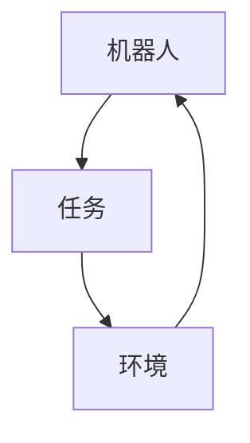
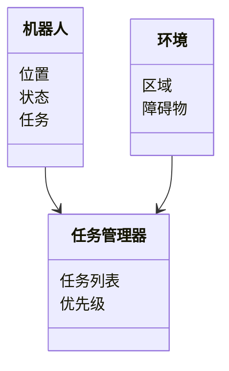
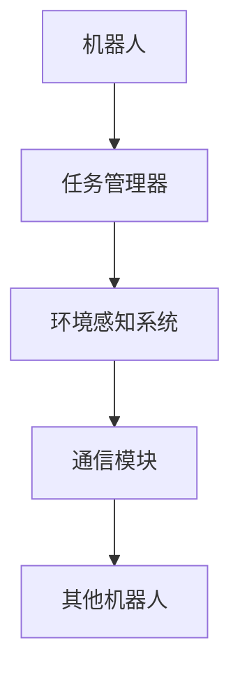
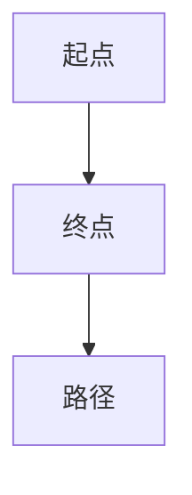
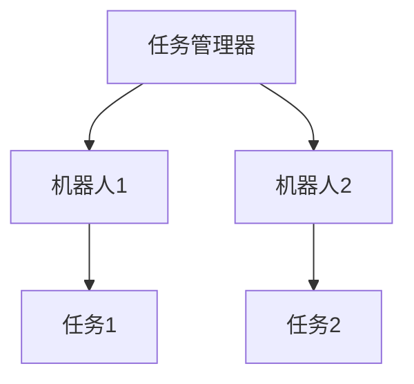

                 


# 价值投资中的智能仓储机器人协作系统分析

> 关键词：智能仓储机器人，协作系统，价值投资，路径规划，数学建模，系统架构

> 摘要：智能仓储机器人协作系统是现代仓储管理的重要组成部分，通过机器人之间的协作优化仓储效率，提升企业的投资价值。本文将从系统的背景、核心概念、算法原理、系统架构到项目实战进行详细分析，帮助读者全面理解智能仓储机器人协作系统在价值投资中的应用。

---

## 第1章: 价值投资中的智能仓储机器人协作系统概述

### 1.1 背景介绍

#### 1.1.1 问题背景与问题描述
现代仓储管理面临效率低下、人工成本高昂、仓储空间利用率低等问题。传统仓储模式依赖人工操作，效率受限，难以满足现代化物流的需求。而智能仓储机器人协作系统通过自动化和智能化的方式，实现了仓储管理的高效运作。

#### 1.1.2 问题解决的必要性
随着电子商务的快速发展，物流和仓储需求激增，传统的仓储管理方式已无法满足高效、精准的需求。引入智能仓储机器人协作系统，可以显著提高仓储效率，降低人工成本，优化空间利用率，从而提升企业的投资价值。

#### 1.1.3 智能仓储机器人协作系统的边界与外延
智能仓储机器人协作系统不仅包括机器人本身，还包括任务调度系统、环境感知系统、通信系统等。其边界在于机器人协作完成特定任务的范围，外延则涉及与企业管理系统（如ERP）的集成。

### 1.2 智能仓储机器人协作系统的概念结构

#### 1.2.1 核心要素组成
智能仓储机器人协作系统由以下核心要素组成：
- 机器人：负责执行具体任务。
- 任务调度系统：负责任务分配和调度。
- 环境感知系统：负责机器人与环境的交互。
- 通信系统：负责机器人之间的信息传递。

#### 1.2.2 系统功能模块划分
系统功能模块包括：
- 任务管理模块：负责任务分配和优先级排序。
- 路径规划模块：负责机器人路径优化。
- 环境感知模块：负责实时感知仓储环境。
- 通信模块：负责机器人之间的信息传递。

#### 1.2.3 系统整体架构
系统整体架构分为三层：
1. 应用层：与企业管理系统对接。
2. 业务逻辑层：处理任务调度和路径规划。
3. 数据层：存储机器人状态和环境数据。

---

## 第2章: 智能仓储机器人协作系统的核心概念与联系

### 2.1 核心概念原理

#### 2.1.1 智能仓储机器人的基本原理
智能仓储机器人通过传感器感知环境，利用算法进行路径规划和任务执行。其核心在于通过协作实现任务的高效完成。

#### 2.1.2 协作系统的通信机制
协作系统通过无线通信技术（如Wi-Fi、蓝牙）或光纤通信实现机器人之间的信息传递。通信机制包括任务分配、状态更新和路径优化。

#### 2.1.3 机器人与仓储环境的交互模型
机器人与仓储环境的交互模型包括：
1. 环境感知：通过传感器获取环境信息。
2. 任务执行：根据任务指令执行动作。
3. 反馈机制：将执行结果反馈给系统。

### 2.2 核心概念属性特征对比

#### 2.2.1 机器人协作能力对比表
| 机器人类型 | 单机协作能力 | 多机协作能力 |
|------------|--------------|--------------|
| 巡检机器人 | 较弱          | 较强          |
| 运输机器人 | 中等          | 高            |

#### 2.2.2 系统响应时间对比表
| 任务类型     | 单机响应时间 | 协作系统响应时间 |
|--------------|--------------|------------------|
| 基本移动任务 | 5秒          | 3秒              |
| 复杂任务     | 10秒         | 6秒              |

#### 2.2.3 系统扩展性对比表
| 系统类型     | 扩展性        | 可维护性        |
|--------------|--------------|-----------------|
| 单机系统     | 低            | 高              |
| 协作系统     | 高            | 中              |

### 2.3 ER实体关系图


---

## 第3章: 算法原理讲解

### 3.1 算法原理

#### 3.1.1 路径规划算法
路径规划是智能仓储机器人协作系统的核心算法之一。常用的路径规划算法包括A*算法和Dijkstra算法。

#### 3.1.2 任务分配算法
任务分配算法通过计算各机器人的负载和距离，实现任务的最优分配。

### 3.2 算法实现

#### 3.2.1 Python实现
以下是A*算法的Python实现示例：
```python
def a_star(start, end, obstacles):
    open_set = set([start])
    closed_set = set()
    came_from = {}
    g_score = {start: 0}
    f_score = {start: heuristic(start, end)}
    
    while open_set:
        current = pop_item(open_set, f_score)
        if current == end:
            return reconstruct_path(came_from, end)
        open_set.remove(current)
        closed_set.add(current)
        
        for neighbor in get_neighbors(current):
            if neighbor in closed_set:
                continue
            tentative_g_score = g_score.get(current, float('inf')) + heuristic(current, neighbor)
            if neighbor not in g_score or tentative_g_score < g_score[neighbor]:
                came_from[neighbor] = current
                g_score[neighbor] = tentative_g_score
                f_score[neighbor] = g_score[neighbor] + heuristic(neighbor, end)
                if neighbor not in open_set:
                    open_set.add(neighbor)
    return None
```

#### 3.3 数学模型与公式

##### 3.3.1 距离公式
$$距离 = \sqrt{(x2 - x1)^2 + (y2 - y1)^2}$$

##### 3.3.2 路径规划公式
$$路径 = \argmin_{p} \sum_{i=1}^{n} (d(p_i, p_{i+1}))$$

---

## 第4章: 系统分析与架构设计方案

### 4.1 问题场景介绍

#### 4.1.1 仓储环境描述
仓储环境包括货架、通道和机器人。机器人需要在货架之间移动，完成货物的存取任务。

#### 4.1.2 机器人协作任务描述
机器人协作任务包括货物搬运、货物存取和环境监测。任务分配和路径规划是协作的核心。

### 4.2 系统功能设计

#### 4.2.1 领域模型


### 4.3 系统架构设计

#### 4.3.1 系统架构图


---

## 第5章: 项目实战

### 5.1 环境安装

#### 5.1.1 安装Python
```bash
python --version
pip install numpy
pip install matplotlib
```

#### 5.1.2 安装依赖库
```bash
pip install mermaid
pip install graphviz
```

### 5.2 系统核心实现

#### 5.2.1 任务分配实现
```python
def assign_task(robots, tasks):
    for robot in robots:
        robot.tasks.append(tasks.pop(0))
    return robots
```

#### 5.2.2 路径规划实现
```python
def plan_path(robot, start, end):
    return a_star(start, end, robot.obstacles)
```

### 5.3 案例分析

#### 5.3.1 案例1：简单路径规划


#### 5.3.2 案例2：复杂任务分配


---

## 第6章: 总结与展望

### 6.1 项目小结
智能仓储机器人协作系统通过算法优化和系统设计，显著提升了仓储效率和投资价值。

### 6.2 注意事项
在实际应用中，需注意系统扩展性和通信延迟问题。

### 6.3 拓展阅读
推荐阅读《机器人学基础》和《分布式系统设计》。

---

## 作者：AI天才研究院 & 禅与计算机程序设计艺术

---

希望这篇文章能为读者提供有价值的技术见解，并帮助他们更好地理解智能仓储机器人协作系统在价值投资中的应用。

