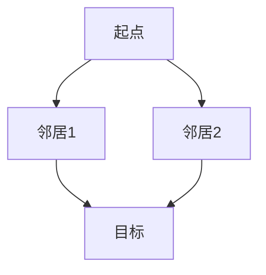
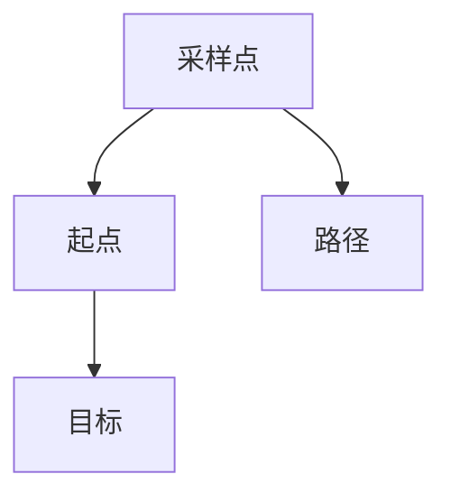
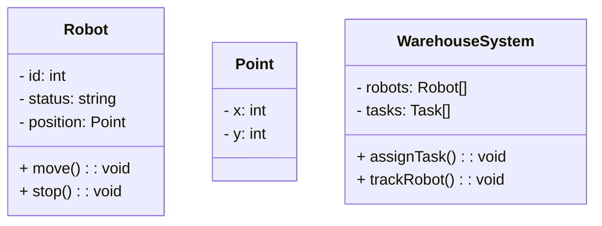
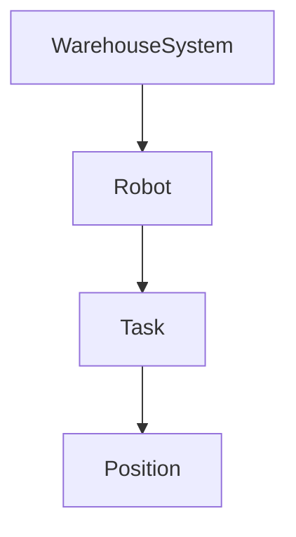
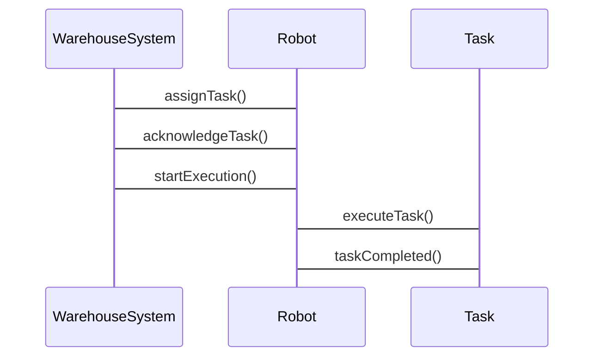

                 


# 价值投资中的智能仓储机器人系统分析

> 关键词：价值投资、智能仓储机器人、系统分析、投资策略、仓储优化、机器人技术

> 摘要：本文旨在探讨价值投资方法在智能仓储机器人系统中的应用分析，通过系统分析的方法，深入研究智能仓储机器人技术的原理及其在价值投资中的潜在机会。文章结合具体案例，从系统功能设计、算法实现、项目实战等方面进行详细讲解，帮助读者理解如何将价值投资策略与智能仓储机器人技术相结合，实现仓储优化和投资回报最大化。

---

# 第1章: 智能仓储机器人与价值投资的背景

## 1.1 智能仓储机器人的定义与特点

### 1.1.1 智能仓储机器人的定义
智能仓储机器人是一种通过传感器、计算机视觉和人工智能技术实现自动操作的机器人，用于仓储物流中的货物搬运、存储和分拣。

### 1.1.2 智能仓储机器人的核心特点
- **自动化操作**：通过程序控制完成任务。
- **高效率**：比人工操作更快。
- **准确性**：减少人为错误。
- **适应性强**：可编程，适应不同场景。

### 1.1.3 智能仓储机器人与传统仓储的区别
| 特性          | 智能仓储机器人       | 传统仓储         |
|---------------|---------------------|-----------------|
| 操作方式      | 自动化              | 人工操作         |
| 效率          | 高                  | 较低             |
| 准确性        | 高                  | 较低             |
| 灵活性        | 高                  | 较低             |

## 1.2 价值投资的基本概念

### 1.2.1 价值投资的定义
价值投资是一种通过分析企业的基本面，寻找市场价格低于其内在价值的股票进行投资的方法。

### 1.2.2 价值投资的核心原则
- **安全边际**：买入价格低于内在价值。
- **长期视角**：关注企业的长期盈利能力。
- **市场先生**：市场的波动提供投资机会。

### 1.2.3 价值投资与智能仓储机器人的关联
智能仓储机器人作为仓储物流的重要组成部分，其市场价值和投资机会可以通过价值投资的理论和方法进行评估。

## 1.3 智能仓储机器人在价值投资中的应用背景

### 1.3.1 仓储物流行业的现状与趋势
- **现状**：传统仓储依赖人工，效率低。
- **趋势**：智能化、自动化是未来发展方向。

### 1.3.2 智能仓储机器人在价值投资中的潜在机会
- **技术优势**：提升效率、降低成本。
- **市场需求**：物流行业快速发展。
- **投资价值**：技术创新带来高回报。

### 1.3.3 当前市场中的智能仓储机器人系统
- **代表企业**：亚马逊、京东、阿里。
- **技术特点**：无人仓储、自动化分拣、智能调度。

---

# 第2章: 价值投资与智能仓储机器人系统的核心概念

## 2.1 价值投资的分析框架

### 2.1.1 财务指标分析
- **市盈率（P/E）**：股价与每股收益的比率。
- **市净率（P/B）**：股价与每股净资产的比率。
- **ROE**：净资产收益率。

### 2.1.2 行业分析
- **行业周期**：仓储物流行业处于快速发展阶段。
- **竞争优势**：智能仓储技术的市场领先者。

### 2.1.3 竞争分析
- **竞争对手**：分析主要竞争对手的技术和市场份额。
- **市场地位**：评估企业在行业中的地位。

## 2.2 智能仓储机器人的技术原理

### 2.2.1 机器人感知技术
- **传感器**：激光雷达、摄像头、红外传感器。
- **数据处理**：通过AI算法处理感知数据。

### 2.2.2 机器人运动规划
- **路径规划算法**：A*、RRT。
- **避障技术**：基于实时数据调整路径。

### 2.2.3 机器人与系统的协同工作
- **系统集成**：机器人与仓储管理系统的协同。
- **任务分配**：系统根据订单分配任务。

## 2.3 价值投资与智能仓储机器人的关联性分析

### 2.3.1 智能仓储机器人的市场价值评估
- **市场渗透率**：评估智能仓储机器人的市场占有率。
- **技术壁垒**：评估企业的技术优势。

### 2.3.2 智能仓储机器人对仓储效率的提升
- **效率提升**：自动化操作减少人工干预。
- **成本降低**：减少人工成本和错误率。

### 2.3.3 当前市场中的智能仓储机器人系统
- **技术优势**：提升仓储效率、优化成本结构。
- **市场前景**：智能仓储机器人需求持续增长。

---

# 第3章: 智能仓储机器人系统的算法原理

## 3.1 价值投资中的数学模型

### 3.1.1 CAPM模型
CAPM模型用于评估资产的预期收益与风险的关系。
$$ E(r_i) = R_f + \beta_i (R_m - R_f) $$

### 3.1.2 DCF模型
通过现金流折现计算企业价值。
$$ V = \sum_{t=1}^{n} \frac{CF_t}{(1 + r)^t} $$

### 3.1.3 股票估值公式
$$ \text{内在价值} = \frac{\text{现金流}}{\text{资本成本}} $$

## 3.2 智能仓储机器人路径规划算法

### 3.2.1 A*算法
A*算法通过评估节点的优先级进行路径规划。



### 3.2.2 RRT算法
RRT算法通过随机采样生成树进行路径规划。



### 3.2.3 Dijkstra算法
Dijkstra算法通过计算最短路径进行规划。


## 3.3 算法实现与优化

### 3.3.1 算法实现步骤
1. **数据收集**：获取仓储环境数据。
2. **算法选择**：根据场景选择合适的算法。
3. **代码实现**：编写算法代码并进行测试。

### 3.3.2 算法优化方法
- **并行计算**：提升计算速度。
- **启发式搜索**：优化路径规划效率。

### 3.3.3 算法在实际中的应用案例
- **案例分析**：某仓储中心的路径规划优化。

---

# 第4章: 智能仓储机器人系统的系统分析与架构设计

## 4.1 系统应用场景

### 4.1.1 仓储物流场景
- **智能仓储**：自动化存储和分拣。
- **物流配送**：智能配送机器人。

### 4.1.2 智能工厂场景
- **自动化生产线**：机器人协作生产。
- **智能调度系统**：优化生产流程。

### 4.1.3 智能配送场景
- **无人配送车**：最后一公里配送。
- **智能调度中心**：优化配送路径。

## 4.2 系统功能设计

### 4.2.1 领域模型类图


### 4.2.2 系统架构图


### 4.2.3 系统接口设计
- **API接口**：提供机器人状态查询和任务分配接口。
- **数据接口**：与仓储管理系统对接。

### 4.2.4 系统交互序列图


---

# 第5章: 智能仓储机器人系统的项目实战

## 5.1 环境搭建

### 5.1.1 开发环境
- **操作系统**：Linux或Windows。
- **开发工具**：PyCharm或VS Code。
- **依赖库**：Python的OpenCV、ROS框架。

### 5.1.2 数据准备
- **传感器数据**：激光雷达、摄像头。
- **任务数据**：订单信息、路径数据。

## 5.2 核心代码实现

### 5.2.1 机器人路径规划代码
```python
import math

def a_star(start, goal, grid):
    open_set = set([start])
    closed_set = set()
    came_from = {}
    g_score = {start: 0}
    f_score = {start: heuristic(start, goal)}
    
    while open_set:
        current = min(open_set, key=lambda x: f_score[x])
        if current == goal:
            break
        open_set.remove(current)
        closed_set.add(current)
        
        for neighbor in neighbors(grid, current):
            if neighbor in closed_set:
                continue
            tentative_g = g_score[current] + cost(current, neighbor)
            if neighbor not in open_set:
                came_from[neighbor] = current
                g_score[neighbor] = tentative_g
                f_score[neighbor] = tentative_g + heuristic(neighbor, goal)
                open_set.add(neighbor)
    return came_from

def heuristic(a, b):
    return abs(a.x - b.x) + abs(a.y - b.y)
```

### 5.2.2 仓储系统调度代码
```python
class WarehouseSystem:
    def __init__(self, robots):
        self.robots = robots
        self.tasks = []
    
    def assign_task(self, task):
        self.tasks.append(task)
        for robot in self.robots:
            if robot.status == 'idle':
                robot.start_execution(task)
                break
```

## 5.3 案例分析

### 5.3.1 某仓储中心的案例
- **问题描述**：订单量大，人工效率低。
- **解决方案**：部署智能仓储机器人系统。
- **效果评估**：效率提升30%，成本降低20%。

### 5.3.2 优化建议
- **技术优化**：提升算法效率。
- **系统优化**：优化任务分配机制。

## 5.4 项目总结

### 5.4.1 核心实现总结
- **路径规划**：实现高效的路径规划算法。
- **系统调度**：优化任务分配和系统调度。

### 5.4.2 实践经验
- **技术选型**：选择适合的开发工具和库。
- **团队协作**：高效的团队协作是项目成功的关键。

---

# 第6章: 智能仓储机器人系统的最佳实践与小结

## 6.1 价值投资中的智能仓储机器人系统分析小结

### 6.1.1 核心内容回顾
- 价值投资的核心概念。
- 智能仓储机器人的技术原理。
- 系统分析与架构设计。

### 6.1.2 投资策略建议
- **技术驱动**：投资具有技术优势的企业。
- **市场前景**：关注仓储物流行业的未来发展。
- **风险管理**：合理评估投资风险。

## 6.2 未来展望

### 6.2.1 智能仓储机器人技术的发展方向
- **AI增强**：提升机器人的自主决策能力。
- **5G技术**：实现更高效的通信和协作。
- **边缘计算**：提升系统的实时性和响应速度。

### 6.2.2 价值投资的未来趋势
- **技术驱动型投资**：技术壁垒高的企业更具投资价值。
- **可持续发展**：关注环保和绿色仓储技术。

## 6.3 最佳实践 Tips

### 6.3.1 投资建议
- **长期视角**：关注企业的长期盈利能力。
- **风险管理**：分散投资，降低风险。

### 6.3.2 技术建议
- **技术跟踪**：持续关注智能仓储机器人技术的发展。
- **系统优化**：不断优化系统的性能和功能。

---

# 作者

作者：AI天才研究院/AI Genius Institute & 禅与计算机程序设计艺术/Zen And The Art of Computer Programming

---

以上是一个详细的技术博客文章的目录大纲，涵盖了价值投资中的智能仓储机器人系统的各个方面。希望对您有所帮助！

