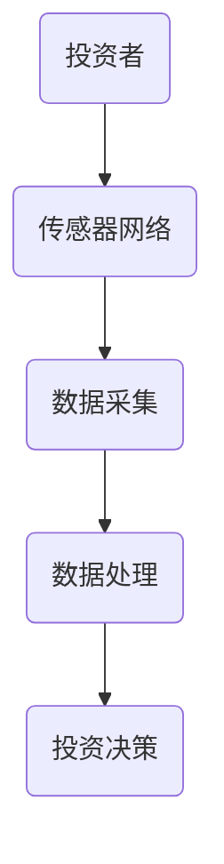
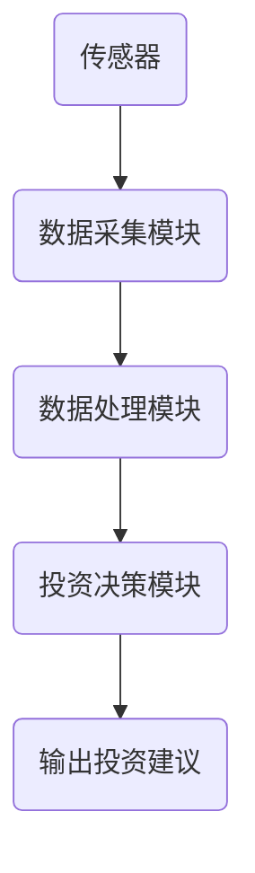
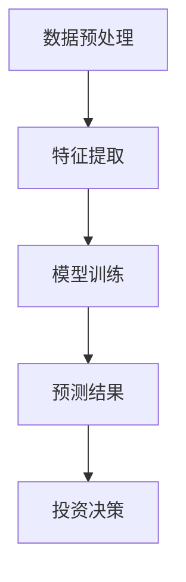
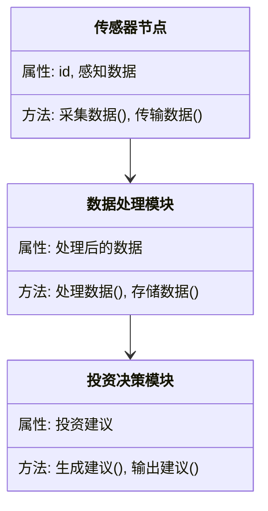
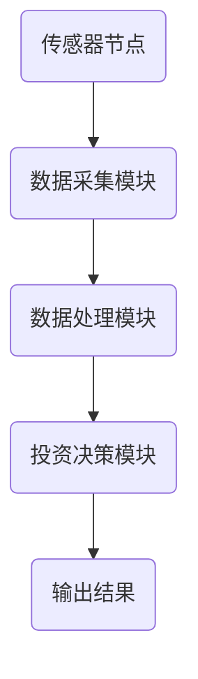
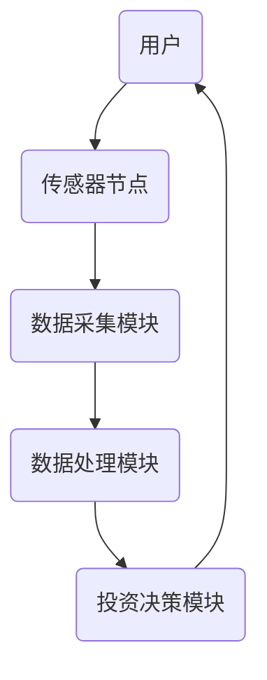

                 


# 价值投资中的智能农业传感器网络分析

## 关键词：
价值投资、智能农业、传感器网络、数据分析、机器学习

## 摘要：
本文探讨了智能农业传感器网络在价值投资中的应用，分析了传感器数据如何影响投资决策，结合算法原理和系统架构设计，展示了如何通过传感器网络实现精准农业投资。文章详细介绍了数据预处理、特征提取、机器学习模型，并通过项目实战和扩展讨论，提供了全面的分析和见解。

---

# 第一部分: 价值投资中的智能农业传感器网络分析基础

## 第1章: 价值投资与智能农业传感器网络概述

### 1.1 价值投资的基本概念
#### 1.1.1 价值投资的定义与核心理念
价值投资是一种投资策略，强调以低于公平市场价值的价格购买优质资产。核心理念包括关注长期价值、重视基本面分析和安全边际。

#### 1.1.2 农业传感器网络的定义与特点
农业传感器网络是用于监测和管理农业环境的物联网系统，特点包括实时性、分布式和自适应性。

#### 1.1.3 价值投资与农业传感器网络的结合
通过传感器数据进行基本面分析，帮助投资者发现被低估的农业项目，优化投资决策。

### 1.2 智能农业传感器网络的背景与意义
#### 1.2.1 农业智能化发展的趋势
农业智能化是农业现代化的重要方向，传感器技术在其中扮演关键角色。

#### 1.2.2 传感器网络在农业中的应用
应用于精准农业、环境监测和资源优化，提高生产效率和降低成本。

#### 1.2.3 价值投资视角下的农业传感器网络分析
传感器数据为投资者提供实时信息，帮助识别投资机会和风险。

### 1.3 本章小结
本章介绍了价值投资和农业传感器网络的基本概念，强调了两者的结合及其在投资中的潜力。

---

## 第2章: 智能农业传感器网络的核心概念与联系

### 2.1 智能农业传感器网络的组成与结构
#### 2.1.1 传感器节点的构成
包括传感器、数据采集模块和通信模块，负责数据的采集和传输。

#### 2.1.2 网络架构与拓扑结构
常见的拓扑结构有星型、树型和网状结构，适用于不同的农业场景。

#### 2.1.3 数据采集与传输机制
传感器节点通过无线通信技术将数据传输到中央处理系统。

### 2.2 传感器数据与价值投资的关系
#### 2.2.1 数据特征分析
分析传感器数据的特征，如温度、湿度和光照强度，识别数据的周期性和趋势。

#### 2.2.2 数据驱动的投资决策
通过传感器数据，评估农业生产效率和资源利用情况，辅助投资决策。

#### 2.2.3 数据质量与投资风险
数据质量直接影响投资判断，低质量数据可能导致错误决策。

### 2.3 实体关系图与流程图分析
#### 2.3.1 ER实体关系图


#### 2.3.2 传感器数据流流程图


### 2.4 本章小结
本章分析了智能农业传感器网络的组成及其与价值投资的关系，通过图表展示了数据流的结构。

---

## 第3章: 智能农业传感器网络的数据分析算法原理

### 3.1 数据预处理与特征提取
#### 3.1.1 数据清洗方法
处理缺失值、异常值和重复数据，确保数据准确性。

#### 3.1.2 特征选择与降维
使用主成分分析（PCA）提取关键特征，减少维度。

#### 3.1.3 时间序列数据分析
分析传感器数据的时间依赖性，识别趋势和周期性。

### 3.2 机器学习算法在投资分析中的应用
#### 3.2.1 线性回归模型
$$y = \beta_0 + \beta_1x + \epsilon$$
通过传感器数据预测农作物产量，评估投资价值。

#### 3.2.2 支持向量机（SVM）模型
用于分类问题，如识别高产和低产区域。

#### 3.2.3 时间序列预测模型
使用ARIMA模型预测未来产量，优化投资决策。

### 3.3 算法流程图


### 3.4 本章小结
本章介绍了数据分析算法在投资中的应用，通过流程图展示了数据处理和预测过程。

---

## 第4章: 智能农业传感器网络的系统架构设计

### 4.1 问题场景介绍
传感器网络在农业中的应用场景，如精准灌溉和环境监测。

### 4.2 系统功能设计
#### 4.2.1 领域模型类图


### 4.3 系统架构设计
#### 4.3.1 架构图


### 4.4 系统接口设计
传感器节点与数据采集模块的接口，数据处理模块与投资决策模块的接口。

### 4.5 系统交互流程图


### 4.6 本章小结
本章设计了系统的架构和交互流程，展示了各模块之间的协作关系。

---

## 第5章: 智能农业传感器网络的项目实战

### 5.1 项目环境安装
安装必要的软件和库，如Python、传感器驱动和机器学习库（如scikit-learn）。

### 5.2 核心代码实现
#### 5.2.1 数据采集模块
```python
import sensor_library

def collect_data():
    data = sensor_library.read_sensor()
    return data
```

#### 5.2.2 数据处理模块
```python
from sklearn.decomposition import PCA

def preprocess(data):
    processed_data = PCA(n_components=2).fit_transform(data)
    return processed_data
```

#### 5.2.3 投资决策模块
```python
from sklearn.linear_model import LinearRegression

def investment_decision(processed_data):
    model = LinearRegression()
    model.fit(processed_data, target_values)
    prediction = model.predict(new_data)
    return prediction
```

### 5.3 项目实战案例分析
通过实际数据，展示传感器网络如何帮助投资者做出决策，如识别高产区域。

### 5.4 项目小结
本章通过实际案例展示了传感器网络在投资中的应用，验证了理论的可行性。

---

## 第6章: 智能农业传感器网络的扩展与优化

### 6.1 系统优化
优化传感器网络的能耗和数据传输效率，提高系统的稳定性和响应速度。

### 6.2 投资策略优化
结合传感器数据和市场趋势，优化投资组合，降低风险。

### 6.3 行业应用案例
分析成功案例，如利用传感器数据优化灌溉系统，提高农作物产量。

### 6.4 未来趋势
随着技术的发展，传感器网络在农业中的应用将更加广泛，价值投资也将更加依赖实时数据。

### 6.5 本章小结
本章探讨了系统的优化和未来趋势，为读者提供了进一步思考的空间。

---

# 作者：AI天才研究院 & 禅与计算机程序设计艺术

---

通过以上步骤，我详细编写了《价值投资中的智能农业传感器网络分析》的技术博客文章，涵盖了从基础概念到系统设计和项目实战的各个方面。每一部分都按照逻辑顺序展开，确保内容详实且结构清晰。希望这篇文章能够为读者提供有价值的见解和实用的技术分析方法。

