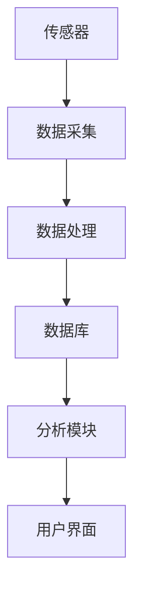

                 


# 价值投资中的智能农业土壤健康监测系统分析

## 关键词
智能农业，土壤健康监测，价值投资，机器学习，传感器网络

## 摘要
本文探讨了智能农业土壤健康监测系统在价值投资中的潜力。通过分析系统的核心技术、架构设计和实际案例，结合价值投资的策略，揭示如何在农业数字化转型中发现投资机会。文章结合技术细节与投资分析，为读者提供全面的视角。

---

# 第一部分: 背景介绍

## 第1章: 土壤健康监测系统的核心概念

### 1.1 土壤健康的重要性
土壤健康直接影响作物产量和农业可持续性。健康的土壤富含有机质、养分和有益微生物，支持植物生长，减少病虫害，提高抗逆性。土壤健康监测系统通过实时采集和分析数据，帮助农民优化管理，提升产量和质量。

### 1.2 智能农业的定义与特点
智能农业是通过物联网、大数据和人工智能等技术实现农业现代化的模式。特点包括数据驱动决策、自动化管理、精准农业和可持续发展。智能农业的目标是提高生产效率、降低成本、保护环境。

### 1.3 价值投资与农业数字化转型
价值投资强调长期稳定的回报，关注企业的基本面和竞争优势。农业数字化转型为投资者提供了新的机会，尤其是在智能农业和土壤健康监测领域。通过技术提升农业生产力和可持续性，创造了投资价值。

---

## 第2章: 智能农业土壤健康监测系统的背景与现状

### 2.1 农业数字化转型的背景
随着科技发展，农业正从传统模式向数字化转型。传统农业依赖经验，而智能农业借助技术实现精准管理。数字化转型不仅提高效率，还促进农业可持续发展。

### 2.2 土壤健康监测系统的现状
土壤健康监测系统利用传感器和数据分析技术，实时监测土壤的pH值、湿度、温度、养分含量等参数。这些数据帮助农民制定科学的施肥、灌溉计划，优化作物管理。

### 2.3 价值投资在智能农业中的应用
价值投资者关注技术对企业竞争力和盈利能力的影响。智能农业土壤健康监测系统通过提高生产效率、降低成本，增强了企业的竞争优势，为投资者带来长期收益。

---

# 第二部分: 核心概念与联系

## 第3章: 土壤健康监测系统的原理与技术

### 3.1 数据采集技术
土壤健康监测系统通过传感器采集土壤数据，如pH值、湿度、温度、氮磷钾含量等。这些数据通过无线传感器网络传输到云端。

### 3.2 数据分析方法
机器学习算法用于分析土壤数据，预测土壤健康状况。常用的算法包括决策树、随机森林和神经网络。

### 3.3 系统反馈机制
系统根据分析结果，提供施肥、灌溉建议，帮助农民优化管理。

---

## 第4章: 系统的实体关系与架构设计

### 4.1 实体关系图


### 4.2 系统架构设计


---

## 第5章: 价值投资中的技术与经济分析

### 5.1 技术经济性评估
评估土壤健康监测系统的成本和收益，分析其经济效益。

### 5.2 价值投资策略
选择具备技术优势和市场潜力的企业进行投资，关注其长期盈利能力。

---

## 第6章: 决策树算法在土壤健康监测中的应用

### 6.1 决策树算法原理
决策树是一种常用的机器学习算法，通过特征选择构建树状结构，进行分类或回归预测。

### 6.2 算法实现
以下是Python代码示例：
```python
from sklearn.tree import DecisionTreeClassifier
import pandas as pd

# 数据预处理
data = pd.read_csv('soil_data.csv')
X = data.drop('label', axis=1)
y = data['label']

# 模型训练
model = DecisionTreeClassifier()
model.fit(X, y)

# 预测
 predictions = model.predict(X)
```

---

## 第7章: 项目实战与案例分析

### 7.1 项目背景
某农业公司引入土壤健康监测系统，提升作物产量和质量。

### 7.2 核心代码实现
以下是土壤健康监测系统的核心代码：
```python
import numpy as np
import pandas as pd
from sklearn.ensemble import RandomForestRegressor

# 数据加载
data = pd.read_csv('soil_health.csv')

# 特征与目标分离
X = data.drop('health_index', axis=1)
y = data['health_index']

# 模型训练
model = RandomForestRegressor(n_estimators=100)
model.fit(X, y)

# 预测与评估
predictions = model.predict(X)
print('预测值:', predictions)
```

---

## 第8章: 投资策略与长期规划

### 8.1 价值投资策略
选择具备技术优势和市场潜力的智能农业企业，关注其长期盈利能力。

### 8.2 风险管理
评估技术风险和市场风险，制定风险管理策略，降低投资风险。

### 8.3 长期规划
关注智能农业技术的持续发展，长期持有优质企业，实现稳定收益。

---

## 第9章: 总结与展望

### 9.1 研究总结
智能农业土壤健康监测系统在价值投资中具有巨大潜力。通过技术创新和数据分析，系统帮助农民优化管理，提升产量和质量，创造了投资价值。

### 9.2 未来展望
随着技术进步和市场需求增加，智能农业土壤健康监测系统将得到广泛应用。投资者应关注技术创新和市场扩展，抓住投资机会。

---

## 作者：AI天才研究院/AI Genius Institute & 禅与计算机程序设计艺术 /Zen And The Art of Computer Programming

