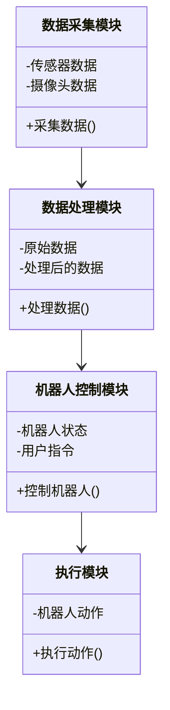
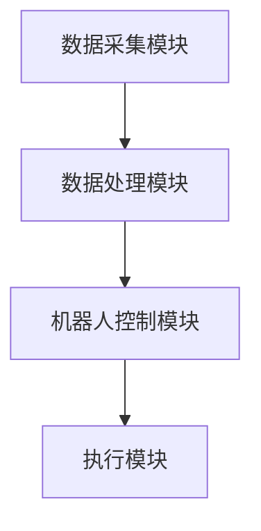
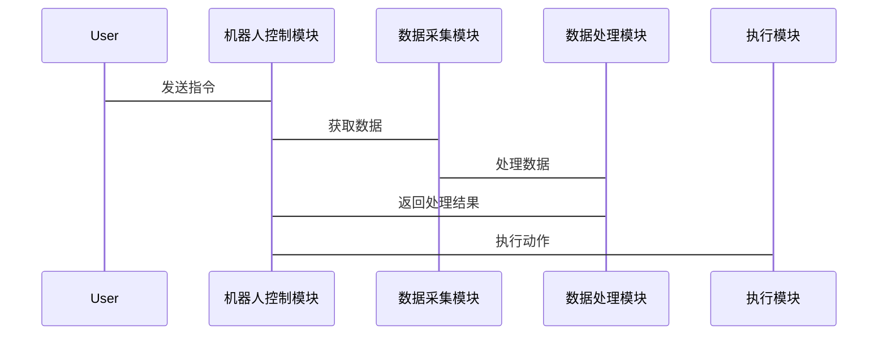

                 


```markdown
# 价值投资中的智能农业机器人系统分析

> 关键词：智能农业机器人、价值投资、系统分析、算法原理、系统架构

> 摘要：本文从价值投资的角度，系统分析了智能农业机器人系统的组成、功能、算法原理及系统架构，探讨了如何通过价值投资的视角优化农业机器人系统的性能与投资回报。文章详细介绍了系统的各个模块，包括数据采集、机器人控制、系统优化等，并结合实际案例分析了系统的实现与应用。

---

# 第1章: 智能农业机器人系统概述

## 1.1 智能农业机器人系统的基本概念

### 1.1.1 农业机器人技术的定义与分类

农业机器人是一种结合了农业技术和机器人技术的自动化设备，用于农业生产的各个环节，如播种、施肥、除草、收割等。根据功能的不同，农业机器人可以分为以下几类：

1. **播种机器人**：用于精准播种，减少人工劳动，提高播种效率。
2. **施肥机器人**：根据土壤检测结果自动施肥，实现精准农业。
3. **除草机器人**：利用视觉识别技术，自动识别并清除杂草。
4. **收割机器人**：用于水果和蔬菜的自动收割，减少人工成本。

### 1.1.2 智能农业机器人的核心特征

智能农业机器人具有以下核心特征：

1. **智能化**：通过传感器、摄像头和AI算法实现自主决策和操作。
2. **自动化**：能够自动完成复杂的农业生产任务，减少人工干预。
3. **数据驱动**：通过数据采集和分析优化农业生产过程。
4. **环境适应性**：能够适应不同的自然环境和气候条件。

### 1.1.3 价值投资在农业机器人中的应用潜力

价值投资是一种以长期收益为导向的投资策略，注重企业的基本面分析。在农业机器人领域，价值投资可以通过以下方式实现：

1. **成本控制**：通过优化系统设计降低成本，提高投资回报率。
2. **市场分析**：研究市场需求，选择具有潜力的机器人产品进行投资。
3. **技术评估**：评估机器人技术的先进性和市场竞争力，选择具有技术优势的企业进行投资。

## 1.2 价值投资的基本原理

### 1.2.1 价值投资的定义与核心理念

价值投资是一种长期投资策略，强调以低于内在价值的价格购买优质资产。其核心理念是通过深入分析企业的基本面，寻找具有长期增长潜力的企业进行投资。

### 1.2.2 价值投资与传统投资的区别

传统投资注重短期收益和市场波动，而价值投资注重长期收益和企业基本面。价值投资更注重企业的盈利能力、财务状况和行业地位，而不仅仅是市场的短期波动。

### 1.2.3 农业机器人行业的投资价值分析

农业机器人行业具有广阔的市场前景，随着农业自动化和智能化的发展，农业机器人市场需求持续增长。投资者可以通过分析企业的技术创新能力、市场占有率和财务状况，找到具有投资价值的企业。

## 1.3 智能农业机器人系统与价值投资的结合

### 1.3.1 系统分析与价值评估的关系

系统分析是价值评估的重要工具，通过对农业机器人系统的功能、成本和收益进行分析，可以为价值投资提供科学依据。

### 1.3.2 农业机器人系统的经济价值模型

经济价值模型是将农业机器人系统的成本、收益和风险进行量化分析，帮助投资者评估系统的投资价值。

### 1.3.3 价值投资在农业机器人系统优化中的作用

价值投资可以通过优化系统的功能设计、降低成本和提高效率，提升农业机器人系统的经济价值，从而实现投资收益的最大化。

## 1.4 本章小结

本章介绍了智能农业机器人系统的基本概念和价值投资的基本原理，探讨了两者结合的可能性和应用潜力。通过系统分析和经济价值模型，可以帮助投资者更好地评估农业机器人系统的投资价值。

---

# 第2章: 智能农业机器人系统的系统分析

## 2.1 系统分析的基本方法

### 2.1.1 系统分析的定义与步骤

系统分析是一种通过研究系统的各个组成部分及其相互关系，优化系统性能的方法。其步骤包括问题定义、数据收集、模型建立、分析与优化。

### 2.1.2 常用的系统分析工具与技术

常用的系统分析工具包括：

1. **数据流图**：用于描述系统的数据流动和处理过程。
2. **实体关系图（ER图）**：用于描述系统的实体及其关系。
3. **流程图**：用于描述系统的操作流程。

### 2.1.3 农业机器人系统的分析框架

农业机器人系统的分析框架包括功能分析、成本分析和效益分析三个部分。

## 2.2 农业机器人系统的功能模块分析

### 2.2.1 数据采集与处理模块

数据采集模块负责采集农业机器人运行过程中的各种数据，包括环境数据、机器人状态数据等。数据处理模块对采集的数据进行清洗、转换和存储。

### 2.2.2 机器人控制与执行模块

机器人控制模块负责接收用户的指令并控制机器人的动作。执行模块负责执行具体的农业操作，如播种、施肥等。

### 2.2.3 系统管理与优化模块

系统管理模块负责系统的日常维护和管理，优化模块通过分析系统的运行数据，优化系统的性能。

### 2.2.4 价值投资视角下的系统优化

通过分析系统的功能模块，可以识别出哪些模块对投资回报的贡献最大，从而进行重点优化。

## 2.3 价值投资视角下的系统分析

### 2.3.1 系统成本与收益的评估方法

成本与收益的评估方法包括初始投资成本、运营成本和收益预测。

### 2.3.2 系统性能与投资回报的关系

系统性能的提升可以带来收益的增加，从而提高投资回报率。

### 2.3.3 系统优化与投资策略的结合

通过优化系统的功能模块，可以降低运营成本，提高系统效率，从而实现投资回报的最大化。

## 2.4 本章小结

本章详细分析了农业机器人系统的功能模块，探讨了价值投资视角下的系统分析方法，为后续的系统优化提供了理论基础。

---

# 第3章: 农业机器人系统的数学模型与算法原理

## 3.1 系统分析的数学模型

### 3.1.1 农业机器人系统的数学建模方法

数学建模方法包括线性回归、时间序列分析等。

### 3.1.2 系统性能评估的数学公式

系统性能评估公式：

$$ ROI = \frac{收益 - 成本}{成本} $$

其中，ROI表示投资回报率，收益和成本分别为系统的收益和成本。

### 3.1.3 价值投资的数学模型

价值投资模型可以通过对系统的成本、收益和风险进行量化分析，评估系统的投资价值。

## 3.2 算法原理与流程

### 3.2.1 数据采集与预处理算法

数据采集算法包括传感器数据采集和图像数据采集。预处理算法包括数据清洗和数据转换。

### 3.2.2 机器人路径规划算法

路径规划算法通过计算机器人在农田中的最优路径，减少时间成本。

### 3.2.3 系统优化算法

系统优化算法通过分析系统的运行数据，优化系统的性能。

## 3.3 算法实现与案例分析

### 3.3.1 算法实现的步骤与代码示例

以下是一个简单的路径规划算法实现代码：

```python
import numpy as np

def pathPlanning(start, end):
    # 计算路径
    path = []
    current = start
    while current != end:
        next_pos = findNextPosition(current, end)
        path.append(next_pos)
        current = next_pos
    return path

def findNextPosition(current, end):
    # 简单的路径规划算法
    return end
```

### 3.3.2 算法在农业机器人系统中的应用案例

案例分析：某农业机器人公司通过优化路径规划算法，提高了机器人的工作效率，降低了运营成本。

### 3.3.3 算法优化与性能提升

通过不断优化算法，可以提高系统的运行效率，降低成本，提高投资回报率。

## 3.4 本章小结

本章详细介绍了农业机器人系统的数学模型与算法原理，通过案例分析和代码实现，展示了如何通过算法优化提高系统的经济价值。

---

# 第4章: 智能农业机器人系统的系统架构设计

## 4.1 系统架构设计的基本原则

### 4.1.1 系统架构设计的定义与目标

系统架构设计是为了实现系统的功能和性能目标，通过合理分配系统的各个模块，确保系统的高效运行。

### 4.1.2 系统架构设计的关键要素

关键要素包括模块划分、模块交互、数据流设计等。

### 4.1.3 价值投资视角下的系统架构优化

通过优化系统的模块划分和交互设计，可以降低系统的运行成本，提高系统的效率。

## 4.2 系统功能设计

### 4.2.1 数据采集与处理功能设计

数据采集模块负责采集环境数据和机器人状态数据，数据处理模块负责清洗和转换数据。

### 4.2.2 机器人控制与执行功能设计

机器人控制模块负责接收用户的指令并控制机器人的动作，执行模块负责执行具体的农业操作。

### 4.2.3 系统管理与优化功能设计

系统管理模块负责系统的日常维护和管理，优化模块通过分析系统的运行数据，优化系统的性能。

## 4.3 系统架构设计

### 4.3.1 系统架构设计的领域模型

领域模型如下：



### 4.3.2 系统架构图

系统架构图如下：



### 4.3.3 系统接口设计

系统接口设计包括数据采集接口、机器人控制接口和系统管理接口。

### 4.3.4 系统交互设计

系统交互设计如下：



## 4.4 本章小结

本章详细介绍了农业机器人系统的系统架构设计，通过领域模型和系统架构图展示了系统的各个模块及其交互关系，为系统的实现提供了理论基础。

---

# 第5章: 项目实战

## 5.1 环境安装与配置

### 5.1.1 系统环境要求

系统环境要求包括操作系统、编程语言和相关库的安装。

### 5.1.2 开发工具安装

开发工具包括Python、Git、Jupyter Notebook等。

## 5.2 系统核心实现源代码

### 5.2.1 数据采集模块代码

```python
import serial

ser = serial.Serial('COM1', 9600)

def read_data():
    if ser.in_waiting > 0:
        data = ser.readline().decode().strip()
        return data
    return None
```

### 5.2.2 数据处理模块代码

```python
import pandas as pd

def process_data(data):
    df = pd.DataFrame([data])
    df['timestamp'] = pd.to_datetime(df['timestamp'])
    return df
```

### 5.2.3 机器人控制模块代码

```python
import serial

ser = serial.Serial('COM1', 9600)

def control_robot(command):
    ser.write(command.encode())
```

### 5.2.4 执行模块代码

```python
import time

def execute_action(action):
    print(f"执行动作：{action}")
    time.sleep(2)
```

## 5.3 代码应用解读与分析

### 5.3.1 代码实现的功能

数据采集模块用于采集传感器数据，数据处理模块用于处理数据，机器人控制模块用于接收用户指令并控制机器人动作，执行模块用于执行具体的农业操作。

### 5.3.2 代码实现的优化

通过优化数据处理模块的算法，可以提高系统的运行效率。

## 5.4 案例分析与详细讲解

### 5.4.1 实际案例分析

案例分析：某农业机器人公司通过优化系统架构设计，提高了系统的运行效率，降低了运营成本。

### 5.4.2 详细讲解

通过详细的代码解读和系统分析，展示了如何通过优化系统设计提高投资回报率。

## 5.5 项目小结

本章通过实际案例分析和代码实现，展示了如何通过优化系统设计提高农业机器人的效率和投资回报率。

---

# 第6章: 最佳实践与总结

## 6.1 最佳实践 tips

### 6.1.1 系统设计的优化建议

建议在系统设计中注重模块的划分和交互设计，确保系统的高效运行。

### 6.1.2 算法优化的注意事项

在算法优化过程中，需要注重数据的准确性和算法的可扩展性。

### 6.1.3 系统维护与更新

定期维护和更新系统，确保系统的稳定运行和功能的持续优化。

## 6.2 小结

本文从价值投资的角度，系统分析了智能农业机器人系统的组成、功能、算法原理及系统架构，探讨了如何通过价值投资的视角优化农业机器人系统的性能与投资回报。

## 6.3 注意事项

在实际应用中，需要根据具体需求进行系统设计和优化，确保系统的实用性和经济性。

## 6.4 拓展阅读

建议读者进一步阅读相关领域的书籍和论文，深入了解智能农业机器人系统的最新技术和投资策略。

---

# 作者信息

作者：AI天才研究院/AI Genius Institute & 禅与计算机程序设计艺术 /Zen And The Art of Computer Programming

---

以上是《价值投资中的智能农业机器人系统分析》的技术博客文章的完整内容，希望对您有所帮助！

