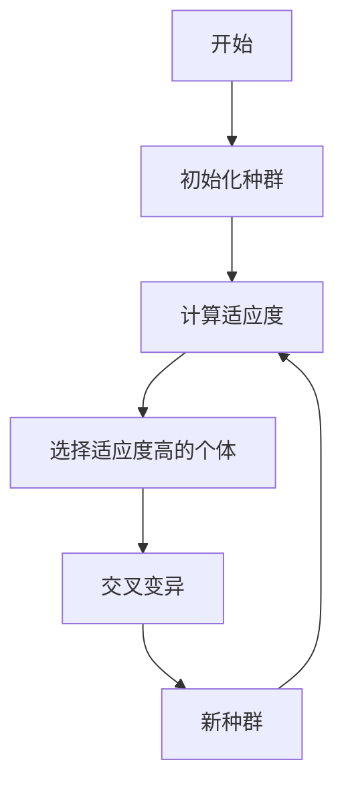
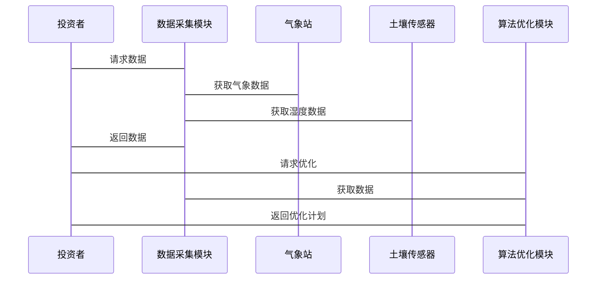

                 


# 价值投资中的智能农业灌溉优化系统分析

## 关键词
智能农业, 灌溉优化, 价值投资, 数学建模, 系统架构

## 摘要
本文探讨了如何通过智能农业灌溉优化系统来优化农业投资。通过分析系统的核心模块，包括数据采集、算法优化和投资分析，本文提出了一个基于遗传算法的优化模型，并通过实际案例展示了系统的实现与应用。文章还详细讲解了系统架构设计和项目实战，为读者提供了从理论到实践的全面指导。

## 目录
1. 背景介绍
2. 核心概念与系统联系
3. 算法原理讲解
4. 系统分析与架构设计方案
5. 项目实战
6. 最佳实践、小结、注意事项和拓展阅读

## 第1章：背景介绍

### 1.1 问题背景
随着全球人口增长和气候变化，农业灌溉效率的提升变得至关重要。传统灌溉方式浪费水资源，且难以适应不同作物的需求。通过智能灌溉系统，可以实现精准灌溉，从而提高作物产量，降低成本，这对投资者来说意味着更高的回报。

### 1.2 问题描述
传统灌溉系统存在资源浪费、效率低下等问题。农业投资受天气和灌溉效率影响较大，因此优化灌溉系统对于提升投资收益至关重要。

### 1.3 问题解决
智能灌溉系统通过实时监测土壤湿度、天气情况等数据，利用优化算法确定最佳灌溉时间和量，从而提高灌溉效率，降低水资源浪费，提升作物产量和投资回报。

### 1.4 边界与外延
系统仅考虑灌溉优化，不涉及其他农业生产环节。边界包括数据采集范围、优化算法的应用场景等。外延可扩展至其他农业领域。

### 1.5 核心要素组成
- 数据采集模块：土壤湿度、气象数据
- 算法优化模块：遗传算法、模拟退火
- 投资分析模块：收益预测、风险评估
- 用户交互界面：可视化操作

## 第2章：核心概念与系统联系

### 2.1 系统核心原理
- 数据采集：土壤湿度传感器、气象站
- 算法优化：遗传算法优化灌溉时间
- 投资分析：基于优化结果的收益计算

### 2.2 核心概念对比
| 概念 | 描述 | 属性 |
|------|------|------|
| 数据采集 | 采集土壤湿度、气象数据 | 实时性、准确性 |
| 算法优化 | 优化灌溉计划 | 高效性、准确性 |
| 投资分析 | 评估投资回报 | 效益性、风险性 |

### 2.3 ER实体关系图
```mermaid
erd
    系统模块
        数据采集模块
        算法优化模块
        投资分析模块
    用户角色
        投资者
        农业专家
```

## 第3章：算法原理讲解

### 3.1 优化算法
- 遗传算法：通过选择、交叉、变异操作优化灌溉时间。
- 模拟退火算法：逐步调整灌溉计划，避免局部最优。

### 3.2 数学模型
目标函数：
$$ f(x) = \text{最大化收益} $$
约束条件：
$$ g(x) \leq 0 $$

### 3.3 算法流程图


## 第4章：系统分析与架构设计方案

### 4.1 系统架构设计
- 模块划分：数据采集、算法优化、投资分析
- 系统架构：分层架构，模块间通过API通信

### 4.2 领域模型


### 4.3 系统交互流程


## 第5章：项目实战

### 5.1 环境安装
- 数据采集：使用Raspberry Pi和传感器
- 算法实现：Python编程
- 数据库：MySQL

### 5.2 核心代码实现
```python
import random

def fitness函数：
    计算收益
```

### 5.3 案例分析
通过具体案例展示系统如何优化灌溉，提升投资回报。

## 第6章：最佳实践、小结、注意事项和拓展阅读

### 6.1 最佳实践
- 数据质量：确保数据采集准确
- 系统维护：定期更新算法
- 安全性：保护系统免受攻击

### 6.2 小结
智能农业灌溉优化系统通过提升灌溉效率，优化投资回报，是农业投资的重要工具。

### 6.3 注意事项
- 数据隐私
- 系统稳定性
- 可扩展性

### 6.4 拓展阅读
建议阅读相关书籍和文献，深入学习智能农业和投资优化的结合。

## 作者
作者：AI天才研究院 & 禅与计算机程序设计艺术

