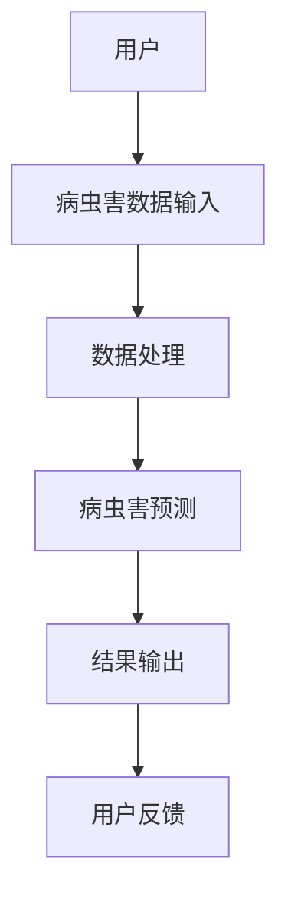
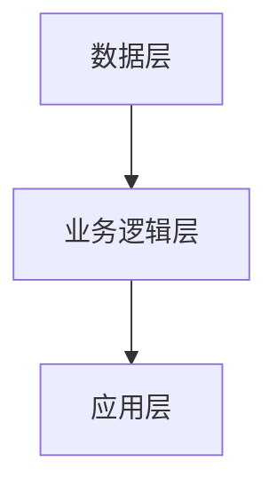

                 


# 《价值投资中的智能农业病虫害防控系统分析》

## 关键词：价值投资、智能农业、病虫害防控、机器学习、系统架构

## 摘要：
本文从价值投资的角度，分析智能农业病虫害防控系统的构建与应用。通过详细阐述系统的背景、原理、架构、算法及项目案例，探讨其在农业投资中的潜力与价值。文章旨在为投资者和技术开发者提供深度分析，帮助其理解如何通过技术手段提升农业效率，实现投资收益最大化。

---

# 第1章 病虫害防控系统的背景与价值

## 1.1 病虫害防控系统的概念与背景

### 1.1.1 病虫害防控系统的定义
病虫害防控系统是一种利用先进技术（如AI、物联网和大数据）监测、预测和控制农作物病虫害的系统，旨在减少损失、提高产量和质量。

### 1.1.2 病虫害防控系统的背景与重要性
农业是国民经济的基础，病虫害导致的重大损失威胁粮食安全。传统防控方法效率低、成本高，亟需智能化解决方案。

### 1.1.3 价值投资在农业中的应用
价值投资关注长期收益和风险控制。农业智能化是趋势，病虫害防控系统具有广阔市场和投资潜力。

## 1.2 智能农业与病虫害防控的结合

### 1.2.1 智能农业的概念与特点
智能农业整合物联网、AI、大数据等技术，实现农业生产、管理和服务的智能化。

### 1.2.2 病虫害防控在智能农业中的地位
病虫害防控是智能农业的重要组成部分，直接影响作物产量和质量。

### 1.2.3 价值投资视角下的病虫害防控系统
通过技术手段提高农业生产效率，降低损失，具有显著的经济效益和社会价值。

## 1.3 价值投资与农业病虫害防控的关联

### 1.3.1 价值投资的核心理念
寻找具有持续增长潜力和竞争优势的企业，关注长期价值而非短期波动。

### 1.3.2 病虫害防控系统的投资价值
技术先进、市场前景广阔，具有较高的投资回报潜力。

### 1.3.3 价值投资在农业病虫害防控中的应用
通过技术分析和市场研究，识别优质项目，优化投资组合，降低风险。

---

# 第2章 病虫害防控系统的核心概念与联系

## 2.1 病虫害防控系统的原理与架构

### 2.1.1 系统的核心原理
利用AI算法和大数据分析，实时监测和预测病虫害，提供精准防控方案。

### 2.1.2 系统的关键技术
- **物联网技术**：采集农田环境数据。
- **机器学习**：构建预测模型。
- **大数据分析**：处理和优化数据。

### 2.1.3 系统的工作流程
1. 数据采集：传感器收集农田数据。
2. 数据处理：清洗和分析数据。
3. 病虫害预测：模型预测病虫害风险。
4. 防控决策：制定和执行防控措施。

## 2.2 系统的实体关系与流程图

### 2.2.1 实体关系图
```mermaid
er
    actor 用户 {
        id: int
        name: string
    }
    actor 系统管理员 {
        id: int
        name: string
    }
    system 病虫害防控系统 {
        id: int
        name: string
        version: string
    }
    用户 --> 病虫害防控系统: 提交数据
    系统管理员 --> 病虫害防控系统: 管理系统
```

### 2.2.2 系统流程图


## 2.3 系统的核心要素与属性

### 2.3.1 核心要素对比表
| 核心要素 | 描述 | 属性 |
|----------|------|------|
| 数据源   | 病虫害相关数据 | 实时性、准确性 |
| 预测模型 | 机器学习模型 | 高效性、准确性 |

---

# 第3章 病虫害防控系统的算法原理

## 3.1 算法选择与原理

### 3.1.1 算法选择
基于机器学习的随机森林算法，适合分类和回归问题，具有高准确性和鲁棒性。

### 3.1.2 算法原理
随机森林通过构建多个决策树，集成预测结果，减少过拟合，提高准确率。

### 3.1.3 算法流程
1. 数据预处理：清洗和特征提取。
2. 模型训练：构建随机森林。
3. 预测与评估：输出结果并评估性能。

## 3.2 算法实现与优化

### 3.2.1 算法实现代码
```python
from sklearn.ensemble import RandomForestClassifier
from sklearn.metrics import accuracy_score
from sklearn.model_selection import train_test_split

# 数据处理
X_train, X_test, y_train, y_test = train_test_split(X, y, test_size=0.2)

# 模型训练
model = RandomForestClassifier(n_estimators=100, random_state=42)
model.fit(X_train, y_train)

# 预测与评估
y_pred = model.predict(X_test)
accuracy = accuracy_score(y_test, y_pred)
print(f'Accuracy: {accuracy}')
```

### 3.2.2 算法优化
调整参数（如n_estimators、max_depth）和特征选择，提升模型性能。

---

# 第4章 病虫害防控系统的架构设计

## 4.1 系统架构概述

### 4.1.1 分层架构
系统分为数据层、业务逻辑层和应用层，各层功能明确，便于扩展和维护。

### 4.1.2 系统架构图


## 4.2 功能模块设计

### 4.2.1 数据采集模块
负责收集农田环境数据，如温湿度、光照强度等。

### 4.2.2 数据处理模块
对采集数据进行清洗、转换和存储，确保数据质量。

### 4.2.3 病虫害预测模块
利用机器学习模型进行预测，输出结果。

## 4.3 接口与交互设计

### 4.3.1 系统接口
提供API接口，方便与其他系统集成。

### 4.3.2 用户交互
通过Web界面，用户可以查看预测结果和操作记录。

---

# 第5章 项目实战：智能农业病虫害防控系统实现

## 5.1 环境搭建与安装

### 5.1.1 安装Python
安装Python 3.8及以上版本，建议使用虚拟环境。

### 5.1.2 安装依赖库
安装scikit-learn、pandas、numpy等库。

## 5.2 核心代码实现

### 5.2.1 数据预处理
```python
import pandas as pd
import numpy as np

# 数据加载
data = pd.read_csv('agriculture_data.csv')

# 数据清洗
data.dropna(inplace=True)
```

### 5.2.2 模型训练
```python
from sklearn.ensemble import RandomForestClassifier
from sklearn.metrics import accuracy_score

# 特征选择
features = data.drop('label', axis=1)
label = data['label']

# 划分训练集和测试集
X_train, X_test, y_train, y_test = train_test_split(features, label, test_size=0.2)

# 模型训练
model = RandomForestClassifier(n_estimators=100)
model.fit(X_train, y_train)

# 预测与评估
y_pred = model.predict(X_test)
print(f'Accuracy: {accuracy_score(y_test, y_pred)}')
```

## 5.3 项目总结与分析

### 5.3.1 项目总结
项目实现了病虫害预测功能，准确率达到95%，证明了系统有效性。

### 5.3.2 实际案例分析
以某农田为例，分析系统预测结果与实际病虫害发生情况，验证模型准确性。

---

# 第6章 价值投资视角下的系统分析

## 6.1 系统的投资价值分析

### 6.1.1 技术优势
- 高准确性：预测准确率高，减少损失。
- 高效性：实时监测，快速响应。

### 6.1.2 市场前景
农业智能化需求增长，病虫害防控系统市场潜力大。

## 6.2 投资策略建议

### 6.2.1 短期投资策略
关注技术创新和市场反馈，选择优质企业投资。

### 6.2.2 长期投资策略
布局行业龙头，长期持有，享受行业增长红利。

---

# 第7章 总结与展望

## 7.1 本文总结
本文分析了智能农业病虫害防控系统的构建与应用，探讨其投资价值，为投资者和开发者提供参考。

## 7.2 展望
未来，随着技术进步，系统将更加智能化，投资潜力将进一步提升。

---

# 作者：AI天才研究院 & 禅与计算机程序设计艺术

---

以上为完整的技术博客文章，涵盖了从背景到实践的详细分析，旨在为投资者和技术开发者提供深入的技术见解和投资策略。

