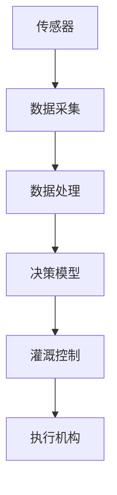
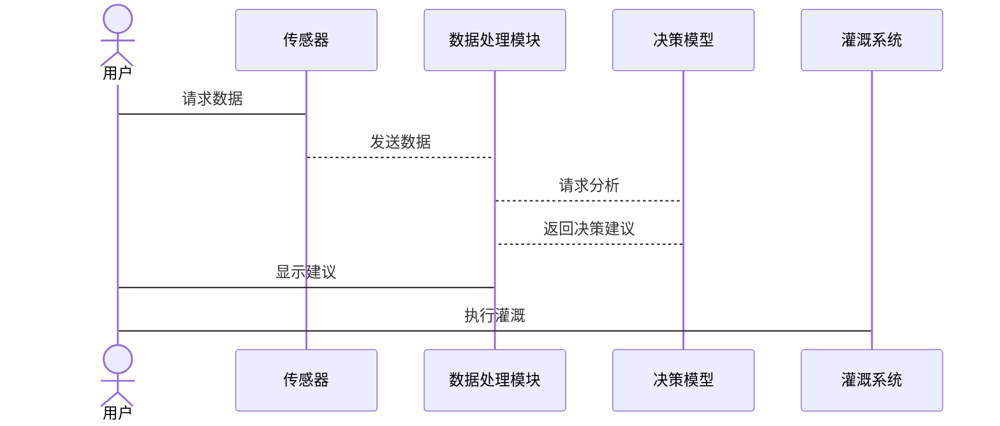

                 


# 价值投资中的智能农业精准灌溉系统分析

> **关键词**: 智能农业、精准灌溉、价值投资、数据分析、算法优化

> **摘要**: 本文探讨了智能农业中的精准灌溉系统在价值投资中的应用，分析了系统的构成、算法原理及优化策略。通过结合数学模型和实际案例，文章详细阐述了如何利用精准灌溉技术提升农业投资的经济效益和社会效益。

---

# 第1章 精准灌溉系统概述

## 1.1 精准灌溉的背景与意义

### 1.1.1 农业灌溉的历史演变

传统灌溉方式依赖人工操作，效率低且浪费水资源。随着科技的发展，智能灌溉系统逐渐取代传统模式，利用传感器、物联网和大数据分析实现精准灌溉，大幅提高水资源利用效率。

### 1.1.2 精准灌溉的定义与特点

精准灌溉系统通过实时监测土壤湿度、气象数据和作物生长状态，自动调整灌溉量，确保作物在最佳条件下生长。其特点是高效、节水、智能化和数据驱动。

### 1.1.3 精准灌溉在现代农业中的作用

精准灌溉不仅节约水资源，还能提高作物产量和质量，降低生产成本。同时，它为农业投资提供了科学依据，帮助投资者做出更明智的决策。

---

## 1.2 价值投资与农业精准灌溉的结合

### 1.2.1 价值投资的基本概念

价值投资是一种投资策略，通过分析资产的内在价值，寻找被市场低估的投资机会。在农业领域，精准灌溉技术的应用为投资者提供了新的价值评估维度。

### 1.2.2 农业精准灌溉系统的投资价值

精准灌溉系统通过提高产量和节约成本，增加了农业项目的盈利能力。投资者可以通过分析系统的投资回报率、成本效益等指标，评估其商业价值。

### 1.2.3 精准灌溉系统的经济效益与社会效益

经济效益体现在节约水资源、降低生产成本和提高产量；社会效益则包括可持续发展和环境保护。

---

# 第2章 精准灌溉系统的核心要素

## 2.1 农作物生长监测

### 2.1.1 精准灌溉系统的工作原理

系统通过传感器实时监测土壤湿度、气象数据和作物生长状态，利用数据分析模型预测作物需求，自动调整灌溉策略。

### 2.1.2 数据采集与传输

传感器采集数据后，通过物联网技术传输到云端，进行数据处理和分析。

### 2.1.3 数据分析与决策支持

利用机器学习算法分析数据，生成灌溉决策建议，帮助农民优化灌溉策略。

---

## 2.2 灌溉决策模型

### 2.2.1 决策模型的构建

基于历史数据和实时监测，构建数学模型预测作物需水量。

### 2.2.2 模型优化与验证

通过实验验证模型的准确性和可靠性，不断优化算法参数。

### 2.2.3 系统优化算法

遗传算法用于优化灌溉策略，确保系统在不同条件下达到最佳性能。

---

# 第3章 精准灌溉系统的算法原理

## 3.1 支持向量机在作物生长监测中的应用

### 3.1.1 支持向量机的基本原理

支持向量机是一种监督学习算法，用于分类和回归分析。在作物生长监测中，可以用来预测作物的生长阶段和健康状况。

### 3.1.2 作物生长监测的特征提取

从传感器数据中提取土壤湿度、温度、光照等特征，作为模型输入。

### 3.1.3 基于支持向量机的分类算法

通过训练支持向量机模型，分类作物的健康状态，帮助农民及时采取措施。

---

## 3.2 决策树在灌溉决策中的应用

### 3.2.1 决策树的基本原理

决策树是一种树状结构，用于分类和回归问题。在灌溉决策中，可以用来判断是否需要灌溉及灌溉量。

### 3.2.2 灌溉决策的特征选择

选择土壤湿度、气象数据和作物生长阶段作为决策树的特征。

### 3.2.3 基于决策树的决策模型

构建决策树模型，根据实时数据生成灌溉决策。

---

## 3.3 精准灌溉系统的优化算法

### 3.3.1 遗传算法的基本原理

遗传算法模拟自然选择过程，用于优化灌溉策略。

### 3.3.2 灌溉系统优化的数学模型

建立数学模型，描述灌溉量与作物产量的关系。

### 3.3.3 基于遗传算法的优化策略

通过遗传算法优化灌溉计划，最大化产量和节约水资源。

---

# 第4章 精准灌溉系统的数学模型与公式

## 4.1 作物生长监测的数学模型

### 4.1.1 作物生长曲线模型

作物生长可以表示为时间函数，公式为：

$$
y(t) = A \cdot e^{-kt}
$$

其中，$A$ 是初始值，$k$ 是衰减系数，$t$ 是时间。

### 4.1.2 基于水分的作物生长模型

水分对作物生长的影响可以用以下公式表示：

$$
G = a \cdot W + b \cdot T
$$

其中，$G$ 是作物生长量，$W$ 是土壤含水量，$T$ 是温度，$a$ 和 $b$ 是系数。

---

## 4.2 灌溉系统的优化算法

### 4.2.1 遗传算法的优化步骤

1. 初始化种群
2. 计算适应度
3. 选择和交叉
4. 变异和评估
5. 重复步骤直到收敛

### 4.2.2 灌溉量与产量的关系模型

灌溉量 $I$ 和产量 $P$ 的关系可以表示为：

$$
P = f(I) = aI + bI^2
$$

其中，$a$ 和 $b$ 是常数。

---

# 第5章 精准灌溉系统的系统架构设计

## 5.1 系统功能设计

### 5.1.1 传感器采集模块

负责采集土壤湿度、温度、光照等数据。

### 5.1.2 数据处理模块

对采集的数据进行清洗和预处理，生成可供决策的特征。

### 5.1.3 决策支持模块

基于数学模型和算法生成灌溉决策建议。

---

## 5.2 系统架构图



---

## 5.3 系统接口设计

### 5.3.1 数据接口

传感器数据通过API接口传输到数据处理模块。

### 5.3.2 用户界面

提供友好的用户界面，显示实时数据和决策建议。

---

## 5.4 系统交互流程



---

# 第6章 项目实战

## 6.1 环境安装

安装必要的软件和硬件，如传感器、数据采集卡、Python开发环境等。

## 6.2 核心代码实现

### 6.2.1 数据采集代码

```python
import serial

ser = serial.Serial('COM3', 9600)
while True:
    data = ser.readline().decode()
    print(data)
```

### 6.2.2 数据分析代码

```python
import numpy as np
from sklearn import svm

X = np.array([[20, 70], [22, 65], [18, 80], [25, 75]])
y = np.array([0, 0, 1, 1])

model = svm.SVC()
model.fit(X, y)
```

## 6.3 实际案例分析

通过具体案例分析，展示精准灌溉系统如何帮助农民提高产量和节约成本。

---

# 第7章 总结与展望

## 7.1 小结

精准灌溉系统结合了先进的技术手段，为农业投资提供了科学依据，具有广阔的市场前景。

## 7.2 注意事项

在实际应用中，需注意数据的准确性和系统的稳定性。

## 7.3 未来展望

未来，随着人工智能和物联网技术的进一步发展，精准灌溉系统将更加智能化和高效。

---

**作者：AI天才研究院 & 禅与计算机程序设计艺术**

