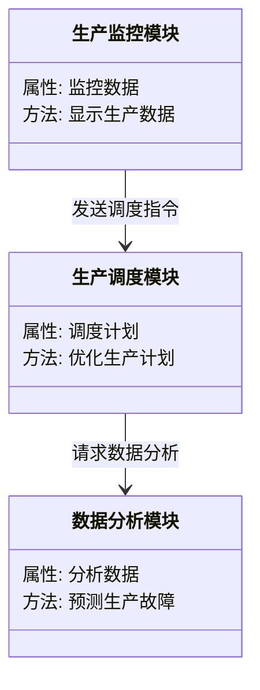
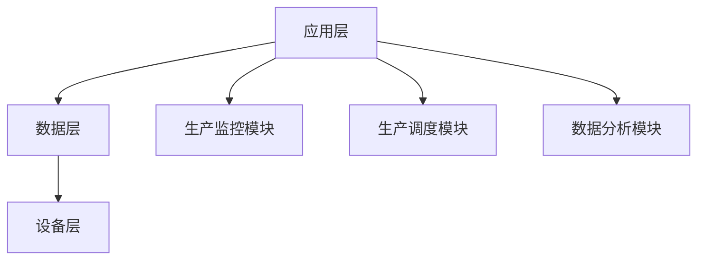
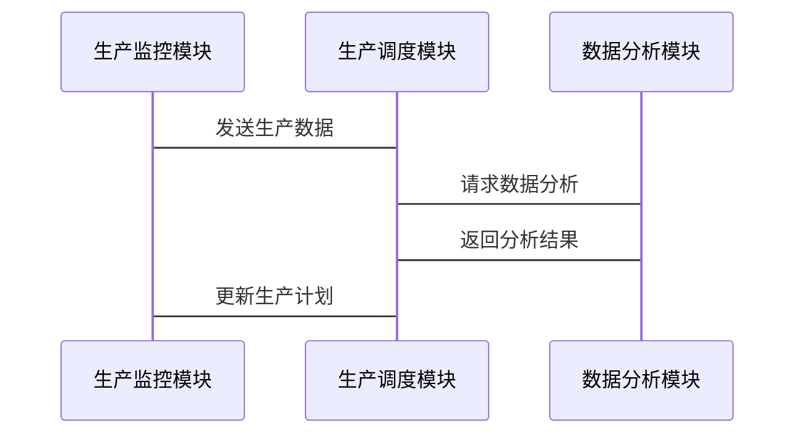

                 


# 《价值投资中的智能制造柔性生产线分析》

---

## 关键词：
智能制造、柔性生产线、价值投资、生产效率、成本优化、投资回报率、数字化转型

---

## 摘要：
智能制造是当前制造业发展的主要方向，而柔性生产线作为智能制造的核心组成部分，能够通过灵活的生产方式满足多样化的市场需求，从而为企业创造更大的价值。本文从价值投资的角度出发，系统分析智能制造柔性生产线的核心要素、数学模型、系统架构及实际应用案例，探讨如何通过柔性生产线的优化设计和高效管理，实现生产效率和投资回报率的最大化。文章结合理论分析和实际案例，为投资者和企业管理者提供科学的决策依据。

---

# 第一部分：智能制造柔性生产线的背景与概念

## 第1章：制造业智能化转型与价值投资概述

### 1.1 制造业智能化转型的背景
#### 1.1.1 工业革命与制造业的演进
- 第一次工业革命：机械化生产
- 第二次工业革命：流水线生产
- 第三次工业革命：自动化生产
- 第四次工业革命：智能化生产

#### 1.1.2 智能制造的定义与特点
- 定义：通过物联网、大数据、人工智能等技术实现生产过程的智能化和自动化。
- 特点：智能化、数字化、网络化、个性化、绿色化。

#### 1.1.3 价值投资在制造业中的应用
- 价值投资的核心理念：寻找具有持续竞争优势和良好发展前景的企业。
- 制造业投资的关键因素：生产效率、成本控制、技术创新能力。

### 1.2 柔性生产线的概念与优势
#### 1.2.1 柔性生产线的定义
- 柔性生产线：能够根据市场需求快速调整生产计划和工艺参数的生产线。

#### 1.2.2 柔性生产线的核心特征
- 灵活性：能够快速适应市场需求变化。
- 效率性：在多种生产任务中保持高效率。
- 可扩展性：能够根据需求快速扩展生产能力。

#### 1.2.3 柔性生产线在智能制造中的地位
- 柔性生产线是智能制造的重要组成部分。
- 通过柔性生产线，企业能够实现个性化定制和高效生产。

### 1.3 制造业与价值投资的结合
#### 1.3.1 制造业投资的基本逻辑
- 行业分析：选择朝阳行业。
- 企业分析：评估企业的竞争优势。
- 财务分析：分析企业的财务健康状况。

#### 1.3.2 智能制造对投资价值的影响
- 提高生产效率，降低成本。
- 提升产品品质，增强市场竞争力。
- 增强企业的灵活性和应变能力。

#### 1.3.3 柔性生产线对投资决策的意义
- 柔性生产线能够快速响应市场需求，提高企业的市场占有率。
- 柔性生产线的高效运作能够降低生产成本，提高企业的盈利能力。

### 1.4 本章小结
- 介绍了制造业智能化转型的背景和发展趋势。
- 阐述了柔性生产线的定义、特点及其在智能制造中的地位。
- 分析了制造业与价值投资的结合，强调了柔性生产线对投资决策的重要意义。

---

## 第2章：智能制造柔性生产线的核心要素分析

### 2.1 柔性生产线的系统架构
#### 2.1.1 生产设备的智能化
- 智能传感器：实时监测设备运行状态。
- 智能控制单元：实现设备的智能化控制。

#### 2.1.2 生产流程的数字化
- 数字化设计：通过CAD、CAM等技术实现产品的数字化设计。
- 数字化生产：通过MES（制造执行系统）实现生产过程的数字化管理。

#### 2.1.3 信息系统的集成化
- ERP系统：实现企业资源的全面集成。
- 数据分析系统：通过大数据分析优化生产过程。

### 2.2 柔性生产线的关键技术
#### 2.2.1 工业物联网（IIoT）
- IIoT的定义：通过物联网技术实现工业设备的互联互通。
- IIoT的应用：实时监控设备状态，优化生产流程。

#### 2.2.2 自动化控制技术
- 自动化控制技术的定义：通过自动化设备实现生产过程的自动化控制。
- 自动化控制技术的应用：提高生产效率，降低人为错误。

#### 2.2.3 数据分析与预测
- 数据分析技术：通过机器学习、统计分析等技术对生产数据进行分析。
- 数据预测的应用：预测生产故障，优化生产计划。

### 2.3 柔性生产线的成本与效率分析
#### 2.3.1 成本结构分析
- 固定成本：设备折旧、厂房租金等。
- 变动成本：原材料、人工成本等。

#### 2.3.2 效率提升的量化指标
- 生产效率：单位时间内生产的合格产品数量。
- 设备利用率：设备实际运行时间占总计划运行时间的比率。

#### 2.3.3 投资回报率的计算方法
- 投资回报率（ROI）：（净利润 / 初始投资）× 100%。

### 2.4 本章小结
- 分析了柔性生产线的系统架构，包括生产设备的智能化、生产流程的数字化和信息系统的集成化。
- 阐述了柔性生产线的关键技术，包括工业物联网、自动化控制技术和数据分析与预测。
- 讨论了柔性生产线的成本与效率分析，提出了量化指标和投资回报率的计算方法。

---

## 第3章：柔性生产线的数学模型与价值评估

### 3.1 柔性生产线的数学模型构建
#### 3.1.1 生产效率模型
- 定义：生产效率 = 实际产量 / 计划产量 × 100%。

#### 3.1.2 成本优化模型
- 定义：总成本 = 固定成本 + 变动成本 × 产量。

#### 3.1.3 投资回报率模型
- 定义：ROI = 净利润 / 初始投资 × 100%。

### 3.2 数学模型的详细分析
#### 3.2.1 生产效率模型的公式推导
$$ \text{生产效率} = \frac{\text{实际产量}}{\text{计划产量}} \times 100\% $$

#### 3.2.2 成本优化模型的公式推导
$$ \text{总成本} = \text{固定成本} + \text{变动成本} \times \text{产量} $$

#### 3.2.3 投资回报率模型的公式推导
$$ \text{ROI} = \frac{\text{净利润}}{\text{初始投资}} \times 100\% $$

### 3.3 案例分析与模型应用
#### 3.3.1 某制造企业的柔性生产线改造案例
- 案例背景：某制造企业通过柔性生产线改造提高了生产效率和降低了成本。
- 模型应用：通过生产效率模型和成本优化模型分析改造后的效果。

#### 3.3.2 模型在投资决策中的应用
- 通过投资回报率模型评估柔性生产线的投资价值。

### 3.4 本章小结
- 构建了柔性生产线的数学模型，包括生产效率模型、成本优化模型和投资回报率模型。
- 通过案例分析验证了模型的应用价值，为投资决策提供了科学依据。

---

## 第4章：柔性生产线的系统架构与设计

### 4.1 系统架构设计
#### 4.1.1 系统功能模块划分
- 生产监控模块：实时监控生产线的运行状态。
- 生产调度模块：优化生产计划和资源分配。
- 数据分析模块：分析生产数据，预测生产故障。

#### 4.1.2 系统架构的层次结构
- 应用层：生产监控、生产调度、数据分析。
- 数据层：生产数据的采集、存储和管理。
- 设备层：生产设备的智能化控制。

#### 4.1.3 系统架构的可扩展性
- 系统架构设计考虑了未来的扩展需求。

### 4.2 系统功能设计
#### 4.2.1 生产监控功能
- 实时监控设备运行状态。
- 显示生产数据和图表。

#### 4.2.2 生产调度功能
- 优化生产计划。
- 资源分配和调度。

#### 4.2.3 数据分析功能
- 数据采集与存储。
- 数据分析与预测。

### 4.3 系统架构的类图设计


### 4.4 系统架构的架构图设计


### 4.5 系统接口设计
- 接口1：生产监控模块与生产调度模块之间的接口。
- 接口2：生产调度模块与数据分析模块之间的接口。

### 4.6 系统交互的序列图设计


### 4.7 本章小结
- 设计了柔性生产线的系统架构，包括应用层、数据层和设备层。
- 绘制了系统的类图和架构图，展示了各模块之间的关系和交互。
- 分析了系统的接口设计和交互流程。

---

## 第5章：项目实战与最佳实践

### 5.1 环境配置
- 操作系统：Windows 10 或更高版本。
- 开发工具：Visual Studio、PyCharm等。
- 数据库：MySQL、PostgreSQL等。
- 依赖库：Python的pandas、numpy、scikit-learn等。

### 5.2 核心实现源代码
#### 5.2.1 生产效率计算
```python
import pandas as pd

def calculate_productivity(actual_output, planned_output):
    return (actual_output / planned_output) * 100
```

#### 5.2.2 成本优化模型
```python
def calculate_total_cost(fixed_cost, variable_cost, quantity):
    return fixed_cost + variable_cost * quantity
```

#### 5.2.3 投资回报率计算
```python
def calculate_ro

