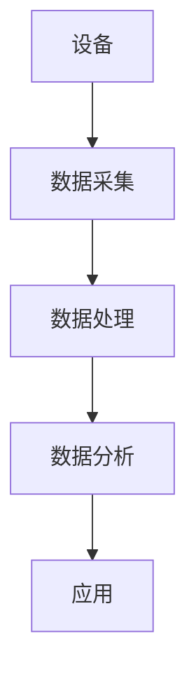

                 


# 价值投资中的智能制造趋势分析

## 关键词：智能制造，价值投资，工业互联网，大数据分析，人工智能

## 摘要：智能制造作为工业4.0的核心，正深刻改变着制造业的生产方式和商业模式。本文从价值投资的角度，分析智能制造的趋势，探讨其核心技术、行业应用和投资机会，为投资者提供参考。通过详细的技术分析、案例研究和系统架构设计，帮助读者理解智能制造的内在逻辑和未来发展方向。

---

## 第一部分: 智能制造与价值投资的背景与概念

### 第1章: 智能制造的背景与定义

#### 1.1 智能制造的定义与核心概念

**1.1.1 智能制造的定义**

智能制造（Smart Manufacturing）是通过物联网、大数据、人工智能等技术，实现从设计、生产到销售的全生命周期智能化管理的制造模式。其核心在于将传统的制造业与现代信息技术深度融合，提升生产效率、降低成本并优化资源利用。

**1.1.2 智能制造的核心技术**

智能制造涉及多项关键技术，包括：

- **物联网（IoT）**：实现设备、产品和系统的实时连接与数据交换。
- **大数据分析（Big Data Analytics）**：从海量数据中提取有价值的信息，支持决策。
- **人工智能（AI）**：用于预测、优化和自动化操作。
- **工业互联网（IIoT）**：将制造业与互联网结合，实现工业设备的互联与数据共享。
- **数字孪生（Digital Twin）**：通过虚拟模型模拟物理设备的运行状态，进行实时监控和优化。

**1.1.3 智能制造与传统制造的区别**

| **方面** | **传统制造** | **智能制造** |
|----------|--------------|--------------|
| 生产模式 | 批量生产，固定流程 | 灵活生产，个性化定制 |
| 数据利用 | 数据记录，事后分析 | 实时数据，智能决策 |
| 设备连接 | 单机运行，孤岛式 | 设备互联，数据共享 |
| 人员角色 | 以操作为主 | 数据分析师、AI工程师参与 |

#### 1.2 价值投资的基本原理

**1.2.1 价值投资的定义**

价值投资是一种投资策略，强调以低于内在价值的价格买入优质资产，长期持有，等待其价值回归。核心理念是寻找被市场低估的企业，通过分析企业的基本面（财务状况、行业地位、盈利能力等）来评估其长期价值。

**1.2.2 价值投资的核心理念**

- **安全边际**：买入价格低于内在价值，确保有足够的安全空间。
- **长期视角**：关注企业的长期竞争优势，而非短期市场波动。
- **基本面分析**：通过财务报表、行业趋势等分析企业的价值。

**1.2.3 价值投资与智能制造的结合**

智能制造的兴起为价值投资提供了新的机会。投资者可以通过分析智能制造企业的技术创新能力、市场地位、财务表现等，寻找具有持续竞争优势的企业进行投资。

---

### 第2章: 智能制造的发展现状与趋势

#### 2.1 全球智能制造的发展现状

**2.1.1 智能制造的全球发展趋势**

近年来，全球制造业正加速向智能化转型。根据麦肯锡的报告，到2025年，全球智能制造市场的规模将超过5000亿美元，年均复合增长率预计超过10%。

**2.1.2 主要国家的智能制造发展情况**

- **中国**：政府推动“工业4.0”战略，大力支持智能制造技术的研发和应用。
- **美国**：以工业互联网为代表，GE、通用电气等企业在工业互联网领域处于领先地位。
- **德国**：提出“工业4.0”概念，注重智能化制造系统的研发。
- **日本**：在机器人和自动化领域具有领先地位，如丰田、松下等企业的智能制造应用。

#### 2.2 智能制造的关键技术与应用

**2.2.1 工业互联网**

工业互联网通过连接设备、系统和数据，实现制造过程的智能化和数字化。其主要应用包括设备监控、预测性维护和供应链优化。

**2.2.2 大数据分析**

大数据分析在智能制造中的应用广泛，包括生产过程优化、质量控制和市场预测。例如，通过分析生产数据，企业可以实时监控设备状态，预测可能的故障并进行预防性维护。

**2.2.3 人工智能在制造中的应用**

人工智能技术在智能制造中的应用包括：

- **质量控制**：通过计算机视觉技术检测产品缺陷。
- **生产优化**：利用机器学习算法优化生产流程。
- **需求预测**：基于历史销售数据预测未来需求。

---

### 第3章: 价值投资中的智能制造分析框架

#### 3.1 智能制造企业的估值方法

**3.1.1 市盈率法**

市盈率（P/E ratio）是企业市值与净利润的比值。公式为：

$$ P/E = \frac{Market\ Value}{Net\ Earnings} $$

**3.1.2 市净率法**

市净率（P/B ratio）是企业市值与净资产的比值。公式为：

$$ P/B = \frac{Market\ Value}{Book\ Value} $$

**3.1.3 现金流折现法**

现金流折现法（DCF）通过将未来现金流折现到现值来评估企业价值。公式为：

$$ V = \sum_{t=1}^{n} \frac{CF_t}{(1 + r)^t} $$

其中，$CF_t$ 是第 $t$ 年的现金流，$r$ 是折现率。

#### 3.2 智能制造行业的竞争格局分析

**3.2.1 行业集中度分析**

行业集中度（CR）是衡量市场垄断程度的指标，常用CR4（前四家企业市场份额之和）来衡量。CR4越高，市场集中度越高。

**3.2.2 主要竞争对手分析**

通过分析竞争对手的市场份额、技术水平和竞争优势，评估企业的竞争地位。例如，GE在工业互联网领域具有领先地位，西门子在数字化工厂方面具有优势。

**3.2.3 行业壁垒分析**

智能制造行业的进入壁垒较高，主要体现在技术壁垒、资金壁垒和人才壁垒。

#### 3.3 智能制造企业的财务指标分析

**3.3.1 营业收入与增长率**

营业收入是企业销售收入的主要来源，增长率反映了企业的业务扩展能力。

**3.3.2 净利润与利润率**

净利润是企业的最终利润，利润率（Net Margin）是净利润与营业收入的比值，反映了企业的盈利能力。

**3.3.3 研发投入与创新能力**

智能制造企业的研发投入比例较高，创新能力是其核心竞争力。

---

## 第二部分: 智能制造技术的深度分析

### 第4章: 工业互联网与智能制造

#### 4.1 工业互联网的定义与特点

**4.1.1 工业互联网的定义**

工业互联网（Industrial Internet）是将制造业与互联网技术结合，通过设备互联和数据共享，实现制造过程的智能化和数字化。

**4.1.2 工业互联网的核心特点**

- **实时性**：数据实时采集和传输。
- **互联性**：设备、系统和数据的无缝连接。
- **智能化**：通过数据分析实现预测性和预防性维护。

#### 4.2 工业互联网的关键技术

**4.2.1 物联网技术**

物联网（IoT）通过传感器和通信技术，实现设备的实时监控和数据采集。

**4.2.2 大数据分析技术**

大数据分析技术用于处理和分析海量数据，提取有价值的信息。

**4.2.3 人工智能技术**

人工智能技术用于数据分析、预测和优化。

---

### 第5章: 大数据分析在智能制造中的应用

#### 5.1 大数据分析的基本原理

**5.1.1 数据采集**

通过传感器、数据库等渠道采集数据。

**5.1.2 数据处理**

对采集到的数据进行清洗、转换和存储。

**5.1.3 数据分析**

通过统计分析、机器学习等方法，提取数据中的价值。

#### 5.2 大数据分析在智能制造中的具体应用

**5.2.1 生产过程优化**

通过分析生产数据，优化生产流程，降低成本。

**5.2.2 质量控制**

通过数据分析，实时监控产品质量，减少缺陷率。

**5.2.3 市场预测**

通过分析市场数据，预测未来市场需求，优化库存管理。

---

## 第三部分: 智能制造的投资策略与案例分析

### 第6章: 智能制造企业的投资策略

#### 6.1 投资策略的核心要素

**6.1.1 行业分析**

分析智能制造行业的市场规模、增长潜力和竞争格局。

**6.1.2 企业基本面分析**

评估企业的财务状况、盈利能力和发展潜力。

**6.1.3 技术创新能力**

关注企业的研发投入和技术专利情况。

#### 6.2 投资组合的构建

**6.2.1 分散投资**

通过投资不同领域的智能制造企业，降低风险。

**6.2.2 重点投资**

集中投资具有核心竞争优势的企业。

---

### 第7章: 智能制造的案例分析

#### 7.1 案例1：GE的工业互联网

GE通过Predix平台实现设备的实时监控和预测性维护，显著降低了设备故障率和维护成本。

#### 7.2 案例2：西门子的数字化工厂

西门子通过数字孪生技术实现生产过程的虚拟模拟，优化了生产流程，提高了生产效率。

---

## 第四部分: 智能制造系统的架构与设计

### 第8章: 系统架构设计

#### 8.1 系统功能设计

**8.1.1 数据采集模块**

通过传感器采集设备数据。

**8.1.2 数据分析模块**

对数据进行处理和分析。

**8.1.3 应用模块**

实现生产优化、质量控制等功能。

#### 8.2 系统架构图



---

## 第五部分: 项目实战与总结

### 第9章: 项目实战

#### 9.1 环境安装

安装必要的软件和工具，如Python、Jupyter Notebook、MongoDB等。

#### 9.2 核心实现代码

```python
import pandas as pd
from sklearn.linear_model import LinearRegression

# 数据加载
data = pd.read_csv('production_data.csv')

# 模型训练
model = LinearRegression()
model.fit(data[['temperature', 'pressure']], data['output'])

# 预测
predicted_output = model.predict([[25, 10]])
print(predicted_output)
```

#### 9.3 案例分析

分析某智能制造企业的实际运营数据，预测未来产量并优化生产流程。

---

## 第十章: 总结与展望

### 10.1 总结

智能制造作为未来制造业的核心，其技术进步和商业模式创新为价值投资提供了丰富的机会。通过深入分析智能制造企业的技术、财务和市场表现，投资者可以找到具有长期竞争优势的企业进行投资。

### 10.2 展望

随着技术的不断进步和应用的深入，智能制造将继续推动制造业的转型升级，价值投资也将更加注重企业的技术创新能力和市场竞争力。

---

## 作者：AI天才研究院/AI Genius Institute & 禅与计算机程序设计艺术 /Zen And The Art of Computer Programming

---

**本文通过系统地分析智能制造的核心技术、行业应用和投资策略，为投资者提供了价值投资的参考。从技术角度分析了工业互联网、大数据分析和人工智能的应用，从投资角度探讨了企业的估值方法和竞争格局，为读者提供了全面的视角。**

---

**END**

