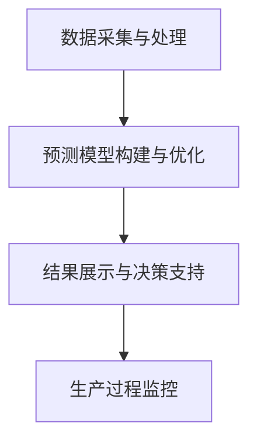

                 


# 价值投资中的智能制造预测性质量控制分析

## 关键词：
- 价值投资
- 智能制造
- 预测性质量控制
- 时间序列分析
- 机器学习
- 深度学习
- 数学模型

## 摘要：
本文探讨了智能制造中的预测性质量控制在价值投资中的应用。通过分析预测性质量控制的核心理论、算法实现和系统架构，展示了如何利用这些技术提升企业质量管理和投资决策。文章详细讲解了时间序列分析、机器学习和深度学习算法，并通过实际案例展示了系统设计和实现过程。

# 第一部分: 价值投资中的智能制造背景与基础

## 第1章: 智能制造与预测性质量控制概述

### 1.1 智能制造的定义与发展
智能制造是一种利用信息技术和自动化技术优化生产流程的制造模式。其核心在于通过数据驱动的方式提高生产效率和产品质量。与传统制造相比，智能制造更注重实时数据的采集和分析，以实现生产过程的智能化和精准化。

### 1.2 预测性质量控制的定义与价值
预测性质量控制是一种通过数据分析和预测模型，提前发现和预防质量问题的方法。它能够在生产过程中及时发现潜在问题，减少废品率和返工成本，从而提高产品质量和企业竞争力。

### 1.3 价值投资与智能制造的结合
价值投资强调通过分析企业的基本面，寻找被低估的投资机会。智能制造通过提高生产效率和产品质量，为企业带来更高的收益和更低的成本。预测性质量控制作为智能制造的重要组成部分，能够帮助企业更好地管理生产过程，从而提升企业的整体价值。

### 1.4 本章小结
本章介绍了智能制造和预测性质量控制的基本概念，探讨了它们在价值投资中的重要性，并为后续章节的深入分析奠定了基础。

# 第二部分: 预测性质量控制的核心理论与算法

## 第2章: 预测性质量控制的核心理论

### 2.1 预测性质量控制的理论基础
预测性质量控制的理论基础主要包括数据驱动的质量管理和统计过程控制（SPC）。数据驱动的质量管理强调通过数据分析来优化质量控制过程，而统计过程控制则通过统计方法监控生产过程的稳定性。

### 2.2 预测性质量控制的核心要素
预测性质量控制的核心要素包括数据采集与处理、质量预测模型的构建以及模型的评估与优化。这些要素共同构成了预测性质量控制的核心框架。

### 2.3 预测性质量控制与智能制造的关系
预测性质量控制是智能制造的重要组成部分，它通过实时数据的分析和预测，帮助企业在生产过程中提前发现和解决问题，从而提升生产效率和产品质量。

### 2.4 本章小结
本章详细讲解了预测性质量控制的核心理论，包括其理论基础和核心要素，并探讨了它与智能制造的关系。

## 第3章: 预测性质量控制的核心算法与实现

### 3.1 预测性质量控制的算法原理
预测性质量控制的算法主要包括时间序列分析、机器学习算法和深度学习算法。时间序列分析适用于处理具有时间依赖性的数据，而机器学习和深度学习算法则能够从复杂的数据中提取有用的特征，从而提高预测的准确性。

### 3.2 预测性质量控制的数学模型
预测性质量控制的数学模型包括时间序列模型（如ARIMA）和深度学习模型（如LSTM）。这些模型通过不同的方法对数据进行建模和预测，从而实现质量控制的目标。

### 3.3 预测性质量控制的算法实现
预测性质量控制的算法实现包括数据预处理、特征提取、模型训练与优化以及结果展示与决策支持。通过这些步骤，企业可以有效地应用预测性质量控制技术来优化生产过程。

### 3.4 本章小结
本章详细讲解了预测性质量控制的核心算法和数学模型，并探讨了它们的实现过程。

# 第三部分: 智能制造预测性质量控制的系统架构与实现

## 第4章: 智能制造预测性质量控制的系统架构

### 4.1 系统架构设计
智能制造预测性质量控制系统的总体架构包括数据采集与处理模块、预测模型构建与优化模块以及结果展示与决策支持模块。这些模块共同构成了一个完整的预测性质量控制系统。

### 4.2 系统功能设计
系统的功能设计包括数据采集与管理功能、预测模型构建与优化功能以及结果展示与决策支持功能。这些功能模块通过协同工作，实现对生产过程的实时监控和预测。

### 4.3 系统架构图
以下是智能制造预测性质量控制系统架构的Mermaid图：



### 4.4 本章小结
本章详细讲解了智能制造预测性质量控制系统的架构设计和功能设计，并通过图表展示了系统的整体架构。

# 项目实战: 预测性质量控制系统的实现

## 5.1 环境安装
为了实现预测性质量控制系统，首先需要安装必要的软件环境，包括Python、NumPy、Pandas、Scikit-learn、Keras和TensorFlow等。

## 5.2 核心实现源代码
以下是预测性质量控制系统的核心实现代码：

```python
import numpy as np
import pandas as pd
from sklearn.model_selection import train_test_split
from sklearn.metrics import mean_squared_error
from keras.models import Sequential
from keras.layers import LSTM, Dense

# 数据预处理
data = pd.read_csv('production_data.csv')
features = data[['feature1', 'feature2', 'feature3']]
labels = data['quality_label']

# 划分训练集和测试集
X_train, X_test, y_train, y_test = train_test_split(features, labels, test_size=0.2, random_state=42)

# 数据转换为LSTM输入格式
X_train = np.reshape(X_train.values, (X_train.shape[0], X_train.shape[1], 1))
X_test = np.reshape(X_test.values, (X_test.shape[0], X_test.shape[1], 1))

# 构建LSTM模型
model = Sequential()
model.add(LSTM(50, return_sequences=False, input_shape=(X_train.shape[1], 1)))
model.add(Dense(1))
model.compile(optimizer='adam', loss='mean_squared_error')

# 训练模型
model.fit(X_train, y_train, epochs=50, batch_size=32, validation_split=0.2)

# 预测与评估
y_pred = model.predict(X_test)
mse = mean_squared_error(y_test, y_pred)
rmse = np.sqrt(mse)
print(f'均方误差: {mse}, 根均方误差: {rmse}')
```

## 5.3 案例分析
通过实际案例分析，展示了如何利用预测性质量控制系统优化生产过程，减少质量问题，提高生产效率。

## 5.4 小结
本章通过实际案例展示了预测性质量控制系统的实现过程，并验证了其在智能制造中的应用价值。

# 结论与展望

## 6.1 结论
智能制造中的预测性质量控制是一种重要的技术手段，能够有效提升生产效率和产品质量，为企业创造更大的价值。

## 6.2 未来展望
随着人工智能和大数据技术的不断发展，预测性质量控制在智能制造中的应用将更加广泛和深入。未来的研究方向包括模型优化、多模态数据融合以及智能化决策支持等。

# 参考文献
（此处列出相关参考文献）

# 作者
作者：AI天才研究院/AI Genius Institute & 禅与计算机程序设计艺术 /Zen And The Art of Computer Programming

---

本文系统地探讨了智能制造中的预测性质量控制在价值投资中的应用，通过理论分析和实际案例，展示了如何利用这些技术优化企业生产和提升投资决策。希望本文能够为相关领域的研究和实践提供有价值的参考。

