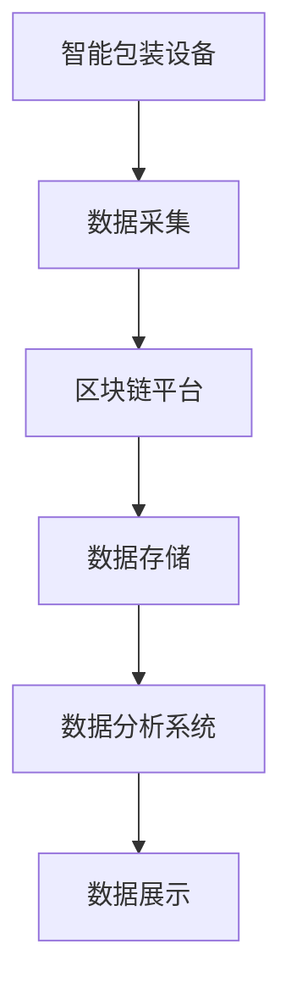
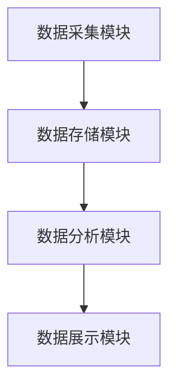
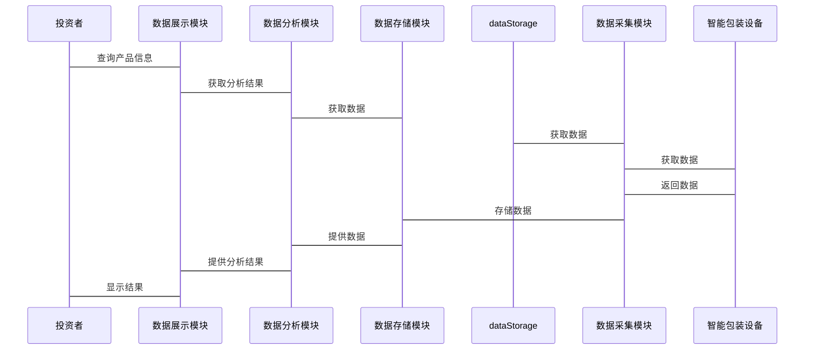

                 


# 价值投资中的智能包装与溯源系统分析

## 关键词：价值投资、智能包装、溯源系统、区块链、物联网、数据分析

## 摘要：
智能包装与溯源系统在价值投资中的应用，通过先进技术手段实现产品信息的透明化和可追溯性，从而提升投资决策的准确性和效率。本文深入分析了智能包装与溯源系统的原理、算法、架构设计及实际应用案例，揭示了其在价值投资中的重要价值。

---

# 第一部分: 价值投资中的智能包装与溯源系统背景介绍

## 第1章: 问题背景与问题描述

### 1.1 问题背景
#### 1.1.1 价值投资的基本概念
价值投资是一种投资策略，通过分析企业的内在价值，选择被市场低估的股票进行投资。其核心在于识别高质量的企业，长期持有，获得稳定的收益。

#### 1.1.2 智能包装与溯源系统的概念
智能包装是指通过嵌入传感器、RFID标签等技术，赋予包装智能化功能，如实时监测产品状态、记录物流信息等。溯源系统则通过区块链、物联网等技术，实现产品从生产到消费者的全程追踪。

#### 1.1.3 价值投资中的包装与溯源问题
在价值投资中，信息不对称是一个主要问题。投资者需要依赖企业的信息披露，而这些信息的真实性和透明度直接影响投资决策。传统的包装和溯源系统难以提供足够的信息支持，导致投资者难以准确评估企业的价值。

### 1.2 问题描述
#### 1.2.1 包装与溯源系统在价值投资中的重要性
通过智能包装和溯源系统，投资者可以实时获取产品的生产、运输、销售等信息，从而更准确地评估企业的运营能力和财务状况。

#### 1.2.2 当前包装与溯源系统的痛点
- 信息不透明：传统包装和溯源系统无法提供实时、详细的产品信息。
- 成本高昂：建立一个可靠的溯源系统需要大量的技术和资金投入。
- 数据孤岛：不同企业、不同系统之间的数据难以共享，导致信息碎片化。

#### 1.2.3 智能包装与溯源系统的必要性
通过智能化技术，可以实现产品信息的实时采集和传输，构建一个透明、可信的供应链体系，从而提升投资者对企业的信任度和信心。

### 1.3 问题解决
#### 1.3.1 智能包装与溯源系统的解决方案
采用区块链、物联网等技术，构建一个去中心化的溯源系统，确保数据的真实性和不可篡改性。

#### 1.3.2 价值投资中的应用场景
在价值投资中，投资者可以通过智能包装和溯源系统，实时监控企业的生产、库存、销售等数据，评估企业的运营能力和财务状况，从而做出更明智的投资决策。

#### 1.3.3 系统实现的关键技术
- 区块链技术：用于记录和验证数据的真实性。
- 物联网技术：用于实时采集和传输数据。
- 大数据分析技术：用于分析数据，提取有价值的信息。

### 1.4 边界与外延
#### 1.4.1 智能包装与溯源系统的边界
- 数据采集范围：仅限于产品相关的数据。
- 系统功能：仅提供数据采集、存储和查询功能。

#### 1.4.2 价值投资中的系统外延
- 投资决策：基于系统提供的数据，进行投资分析。
- 风险控制：通过系统提供的实时数据，识别和规避投资风险。

#### 1.4.3 系统与其他模块的接口
- 与企业管理系统对接：提供产品信息。
- 与投资管理系统对接：提供投资建议。

### 1.5 概念结构与核心要素
#### 1.5.1 系统核心要素组成
- 智能包装设备：如RFID标签、传感器等。
- 区块链平台：用于数据存储和验证。
- 数据分析系统：用于数据处理和展示。

#### 1.5.2 要素之间的关系
- 智能包装设备采集数据，通过区块链平台存储，最后通过数据分析系统进行展示和分析。

#### 1.5.3 核心概念的结构图


---

# 第二部分: 智能包装与溯源系统的核心概念与联系

## 第2章: 核心概念与原理

### 2.1 智能包装的核心原理
#### 2.1.1 智能包装的定义与特点
智能包装是指通过嵌入智能传感器、RFID标签等技术，实现包装的智能化功能，如实时监测产品状态、记录物流信息等。

#### 2.1.2 智能包装的关键技术
- 传感器技术：用于监测产品的温度、湿度等环境参数。
- RFID技术：用于标识产品，实现自动识别。
- 无线通信技术：用于数据的实时传输。

#### 2.1.3 智能包装的功能与应用场景
- 数据采集：采集产品的生产、运输、销售等信息。
- 数据存储：将采集到的数据存储在区块链平台上。
- 数据分析：对数据进行分析，提取有价值的信息。

### 2.2 溯源系统的原理
#### 2.2.1 溯源系统的定义与特点
溯源系统是指通过技术手段，实现产品从生产到消费者的全程追踪和溯源。

#### 2.2.2 溯源系统的实现技术
- 区块链技术：用于数据的存储和验证。
- 物联网技术：用于数据的采集和传输。
- 数据分析技术：用于数据的处理和展示。

#### 2.2.3 溯源系统的核心功能
- 数据采集：通过传感器、RFID标签等设备，采集产品的相关信息。
- 数据存储：将数据存储在区块链平台上，确保数据的真实性和不可篡改性。
- 数据查询：通过查询接口，获取产品的溯源信息。

### 2.3 智能包装与溯源系统的联系
#### 2.3.1 智能包装与溯源系统的协同工作
智能包装设备采集数据，通过区块链平台存储，最后通过数据分析系统进行展示和分析。

#### 2.3.2 系统集成与数据流分析
- 数据流：智能包装设备 --> 数据采集 --> 区块链平台 --> 数据存储 --> 数据分析系统 --> 数据展示。
- 数据接口：系统各模块之间的数据交互接口。

#### 2.3.3 核心概念的ER实体关系图
```mermaid
erDiagram
    product {
        serial_number : string
        production_date : date
        expiration_date : date
        status : string
        location : string
    }
    package {
        id : integer
        product_id : integer
        package_type : string
        manufacturer : string
        production_date : date
    }
    blockchain {
        block_number : integer
        transaction_hash : string
        timestamp : datetime
        data : binary
    }
    sensor {
        sensor_id : integer
        data_type : string
        value : decimal
        timestamp : datetime
    }
```

---

## 第3章: 核心概念的属性对比分析

### 3.1 智能包装与溯源系统的属性对比
| 属性 | 智能包装 | 溯源系统 |
|------|----------|----------|
| 定义 | 包含智能设备的包装技术 | 用于产品溯源的技术 |
| 关键技术 | 传感器、RFID、无线通信 | 区块链、物联网、数据分析 |
| 功能 | 数据采集、传输 | 数据存储、查询 |
| 应用场景 | 产品监测、物流管理 | 产品溯源、供应链管理 |
| 价值 | 提高效率、降低成本 | 提高透明度、增强信任 |

### 3.2 智能包装与溯源系统的联系
智能包装提供数据采集功能，溯源系统提供数据存储和查询功能，两者结合实现产品的全程追踪和溯源。

---

## 第4章: 智能包装与溯源系统的原理分析

### 4.1 智能包装的原理
智能包装通过嵌入传感器、RFID标签等设备，实时采集产品的相关信息，如温度、湿度、位置等，并通过无线通信技术将数据传输到区块链平台。

### 4.2 溯源系统的原理
溯源系统通过区块链技术，将采集到的数据存储在区块链上，确保数据的真实性和不可篡改性。投资者可以通过查询接口，获取产品的溯源信息。

### 4.3 智能包装与溯源系统的协同工作
智能包装设备采集数据，通过区块链平台存储，最后通过数据分析系统进行展示和分析，帮助投资者做出更明智的投资决策。

---

## 第5章: 智能包装与溯源系统的流程分析

### 5.1 智能包装的流程
1. 数据采集：智能包装设备采集产品的相关信息。
2. 数据传输：通过无线通信技术将数据传输到区块链平台。
3. 数据存储：区块链平台将数据存储在区块链上，确保数据的真实性和不可篡改性。

### 5.2 溯源系统的流程
1. 数据查询：投资者通过查询接口，获取产品的溯源信息。
2. 数据分析：通过数据分析系统，对数据进行分析和处理，提取有价值的信息。
3. 数据展示：通过数据可视化工具，展示分析结果，帮助投资者做出投资决策。

---

## 第6章: 智能包装与溯源系统的优劣势分析

### 6.1 智能包装的优势
- 提高效率：通过智能化技术，实现数据的实时采集和传输。
- 降低成本：通过自动化操作，减少人工干预，降低成本。
- 增强信任：通过区块链技术，确保数据的真实性和不可篡改性，增强投资者的信任。

### 6.2 智能包装的劣势
- 技术复杂：需要采用多种先进技术，如传感器、RFID、区块链等，技术实现较为复杂。
- 成本高昂：建立一个智能包装和溯源系统需要大量的技术和资金投入。
- 数据隐私：数据的存储和传输需要考虑隐私保护，防止数据泄露和滥用。

### 6.3 溯源系统的优势
- 提高透明度：通过区块链技术，实现产品的全程追踪和溯源，提高供应链的透明度。
- 增强信任：通过区块链技术，确保数据的真实性和不可篡改性，增强投资者的信任。
- 风险控制：通过实时监控，识别和规避投资风险。

### 6.4 溯源系统的劣势
- 技术实现复杂：需要采用区块链、物联网等先进技术，实现较为复杂。
- 数据隐私：数据的存储和传输需要考虑隐私保护，防止数据泄露和滥用。
- 成本高昂：建立一个可靠的溯源系统需要大量的技术和资金投入。

---

## 第7章: 智能包装与溯源系统的数学模型与公式

### 7.1 区块链技术的数学模型
区块链是一种分布式账本技术，通过密码学算法确保数据的安全性和不可篡改性。其数学模型包括哈希函数、椭圆曲线加密等。

### 7.2 数据分析技术的数学模型
数据分析技术通过统计学方法，对数据进行分析和处理，提取有价值的信息。常用的数学模型包括回归分析、聚类分析等。

### 7.3 传感器技术的数学模型
传感器技术通过物理传感器，采集产品的相关信息，如温度、湿度等。其数学模型包括传感器信号处理、数据滤波等。

### 7.4 智能包装与溯源系统的数学公式
- 哈希函数：用于数据的加密和验证。
  $$ H(message) = hash $$
- 椭圆曲线加密：用于数据的签名和验证。
  $$ y^2 = x^3 + ax + b $$
- 回归分析：用于数据分析。
  $$ y = a + bx + e $$

---

## 第8章: 智能包装与溯源系统的算法实现

### 8.1 区块链算法实现
通过Python代码实现一个简单的区块链系统，包括区块的创建、数据的存储和验证。

```python
class Block:
    def __init__(self, index, timestamp, data, previous_hash):
        self.index = index
        self.timestamp = timestamp
        self.data = data
        self.previous_hash = previous_hash
        self.hash = self.compute_hash()

    def compute_hash(self):
        import hashlib
        return hashlib.sha256(str(self.index) + str(self.timestamp) + str(self.data) + str(self.previous_hash)).hexdigest()
```

### 8.2 数据分析算法实现
通过Python代码实现对数据的分析和处理，提取有价值的信息。

```python
import pandas as pd

data = pd.read_csv('data.csv')
summary = data.describe()
print(summary)
```

### 8.3 传感器数据采集算法实现
通过Python代码实现传感器数据的采集和传输。

```python
import serial

ser = serial.Serial('COM3', 9600)
data = ser.readline().decode()
print(data)
```

---

## 第9章: 智能包装与溯源系统的系统架构设计

### 9.1 系统功能设计
- 数据采集模块：通过智能包装设备采集产品的相关信息。
- 数据存储模块：将数据存储在区块链平台上，确保数据的真实性和不可篡改性。
- 数据分析模块：对数据进行分析和处理，提取有价值的信息。
- 数据展示模块：通过数据可视化工具，展示分析结果。

### 9.2 系统架构设计


### 9.3 系统接口设计
- 数据采集接口：智能包装设备与数据采集模块之间的接口。
- 数据存储接口：数据采集模块与数据存储模块之间的接口。
- 数据分析接口：数据存储模块与数据分析模块之间的接口。
- 数据展示接口：数据分析模块与数据展示模块之间的接口。

### 9.4 系统交互设计


---

## 第10章: 智能包装与溯源系统的项目实战

### 10.1 环境安装
- 安装Python和必要的库：如pandas、numpy、matplotlib、mermaid、hashlib等。
- 安装区块链开发框架：如Hyperledger Fabric、Ethereum等。

### 10.2 核心代码实现
```python
# 区块链实现
class Block:
    def __init__(self, index, timestamp, data, previous_hash):
        self.index = index
        self.timestamp = timestamp
        self.data = data
        self.previous_hash = previous_hash
        self.hash = self.compute_hash()

    def compute_hash(self):
        import hashlib
        return hashlib.sha256(str(self.index) + str(self.timestamp) + str(self.data) + str(self.previous_hash)).hexdigest()

# 数据分析实现
import pandas as pd

def analyze_data(data):
    df = pd.DataFrame(data)
    summary = df.describe()
    return summary

# 传感器数据采集实现
import serial

def read_sensor():
    ser = serial.Serial('COM3', 9600)
    data = ser.readline().decode()
    ser.close()
    return data
```

### 10.3 代码应用解读与分析
- 区块链实现：通过定义一个Block类，实现区块链的基本功能，包括区块的创建、数据的存储和验证。
- 数据分析实现：通过使用pandas库，对数据进行分析和处理，提取有价值的信息。
- 传感器数据采集实现：通过使用serial库，实现传感器数据的采集和传输。

### 10.4 实际案例分析
通过一个实际案例，展示智能包装与溯源系统的实际应用。例如，一个食品企业的案例，展示如何通过智能包装和溯源系统，实现食品的全程追踪和溯源。

### 10.5 项目小结
通过本项目的实现，我们可以看到智能包装与溯源系统在价值投资中的重要性。通过智能化技术，可以实现产品的全程追踪和溯源，提升供应链的透明度和信任度，从而帮助投资者做出更明智的投资决策。

---

## 第11章: 最佳实践、小结、注意事项、拓展阅读

### 11.1 最佳实践
- 选择合适的技术：根据具体需求，选择合适的技术实现智能包装和溯源系统。
- 数据隐私保护：在数据的存储和传输过程中，注意数据隐私保护，防止数据泄露和滥用。
- 系统维护：定期维护和更新系统，确保系统的稳定性和安全性。

### 11.2 小结
通过本文的分析和实现，我们可以看到智能包装与溯源系统在价值投资中的重要性。通过智能化技术，可以实现产品的全程追踪和溯源，提升供应链的透明度和信任度，从而帮助投资者做出更明智的投资决策。

### 11.3 注意事项
- 数据隐私：在数据的存储和传输过程中，注意数据隐私保护，防止数据泄露和滥用。
- 系统安全性：确保系统的安全性，防止数据被篡改和攻击。
- 技术实现复杂性：智能包装和溯源系统的实现较为复杂，需要选择合适的技术和工具。

### 11.4 拓展阅读
- 区块链技术：进一步学习区块链技术，了解其原理和实现方法。
- 物联网技术：进一步学习物联网技术，了解其原理和实现方法。
- 大数据分析技术：进一步学习大数据分析技术，了解其原理和实现方法。

---

## 作者信息

作者：AI天才研究院/AI Genius Institute & 禅与计算机程序设计艺术/Zen And The Art of Computer Programming

---

