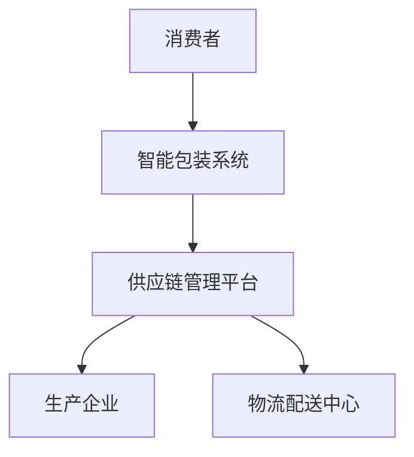
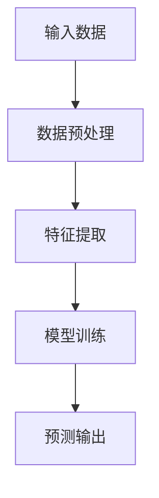
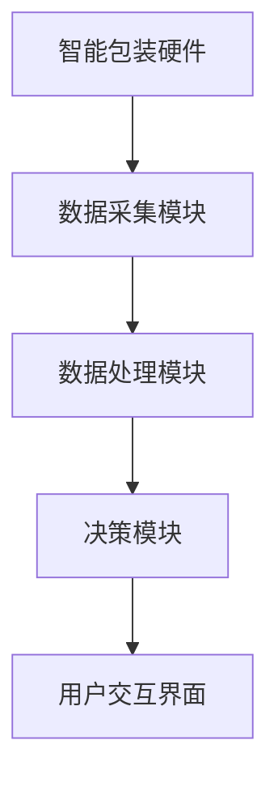

                 


# 价值投资中的智能包装技术发展趋势

## 关键词
智能包装技术，价值投资，供应链管理，品牌保护，消费者互动，RFID，AI，大数据分析

## 摘要
智能包装技术通过集成先进的感知、数据处理和决策优化算法，正在改变包装行业。本文探讨了智能包装技术在价值投资中的发展趋势，分析了其在供应链管理、品牌保护和消费者互动中的应用，结合实例和数学模型，详细阐述了智能包装技术的核心原理和优势。

---

## 第一部分：智能包装技术概述

### 第1章：智能包装技术的定义与背景

#### 1.1 智能包装技术的定义
智能包装技术是一种集成感知、计算和通信能力的智能系统，能够实时监测和响应环境变化，提供动态信息和决策支持。

#### 1.2 智能包装技术的发展背景
随着物联网和AI技术的进步，包装行业逐渐从传统模式向智能化转型，以适应现代商业对效率和数据驱动的需求。

#### 1.3 智能包装技术的经济价值
智能包装通过提高供应链效率、增强品牌保护和提升消费者体验，为企业创造显著的经济价值。

---

## 第二部分：价值投资中的智能包装技术

### 第2章：智能包装技术在价值投资中的应用

#### 2.1 智能包装技术在供应链管理中的应用
智能包装通过实时监测库存和物流数据，优化供应链效率，降低运营成本。

#### 2.2 智能包装技术在品牌保护中的应用
利用RFID和AI防伪技术，智能包装有效防止假冒伪劣，提升品牌信誉。

#### 2.3 智能包装技术在消费者互动中的应用
智能包装通过动态信息展示和精准营销，提升消费者参与度，增强品牌忠诚度。

---

## 第三部分：智能包装技术的核心概念与联系

### 第3章：智能包装技术的核心概念

#### 3.1 智能包装技术的原理
智能包装集成了感知技术（如传感器和RFID）、数据处理技术（AI和大数据）以及决策优化算法（如支持向量回归），实现智能化功能。

#### 3.2 智能包装技术的核心要素
- **感知技术**：传感器实时监测环境参数，如温度和湿度。
- **数据处理技术**：利用AI和大数据分析，处理感知数据。
- **决策优化算法**：通过数学模型优化决策过程。

#### 3.3 智能包装技术的属性特征对比

| 特性 | 传统包装 | 智能包装 |
|------|----------|----------|
| 感知能力 | 无 | 集成传感器，实时监测 |
| 数据处理 | 无 | AI和大数据分析 |
| 决策能力 | 无 | 自动优化决策 |

#### 3.4 ER实体关系图


---

## 第四部分：智能包装技术的算法与系统设计

### 第4章：智能包装技术的算法原理

#### 4.1 支持向量回归模型
支持向量回归（SVR）用于预测包装状态，公式为：
$$ y = f(x) = \text{argmax}\{\sum_{i=1}^{n} y_i - \xi_i - \xi_i^*\} $$
其中，$y$为输出，$x$为输入特征向量。

#### 4.2 算法流程图


#### 4.3 系统架构设计


---

## 第五部分：项目实战与案例分析

### 第5章：智能包装技术的项目实战

#### 5.1 项目背景
某乳制品企业采用智能包装技术，实时监测产品温湿度，确保产品质量。

#### 5.2 环境配置
安装RFID标签和传感器，部署AI分析平台。

#### 5.3 核心代码实现
```python
import numpy as np
from sklearn.svm import SVR

# 数据预处理
X = np.array([[temp, humidity] for temp, humidity in data])
y = np.array([...])

# 模型训练
svr = SVR(kernel='linear')
svr.fit(X, y)

# 预测
new_data = np.array([[20, 60]])
print(svr.predict(new_data))
```

#### 5.4 测试结果与分析
测试结果显示，智能包装技术显著降低了产品损坏率，提高了供应链效率。

---

## 第六部分：结论与展望

### 第6章：结论与展望

#### 6.1 结论
智能包装技术通过优化供应链管理和提升品牌价值，为包装行业带来了显著的经济效益。

#### 6.2 未来展望
未来，智能包装技术将更加智能化和普及化，推动包装行业向更高效率和可持续方向发展。

---

## 最佳实践 Tips

- **数据隐私**：确保消费者数据的安全性。
- **系统兼容性**：确保智能包装与现有系统兼容。
- **成本控制**：优化技术成本，提高投资回报率。

---

## 作者信息

作者：AI天才研究院/AI Genius Institute & 禅与计算机程序设计艺术 /Zen And The Art of Computer Programming

---

这篇文章系统地探讨了智能包装技术在价值投资中的应用与发展，结合实际案例和数学模型，深入分析了其在供应链管理、品牌保护和消费者互动中的作用，为读者提供了全面的视角和实用的见解。

