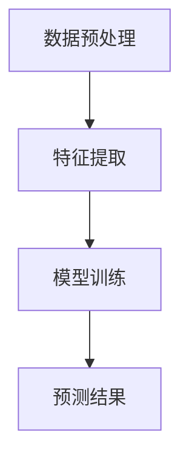
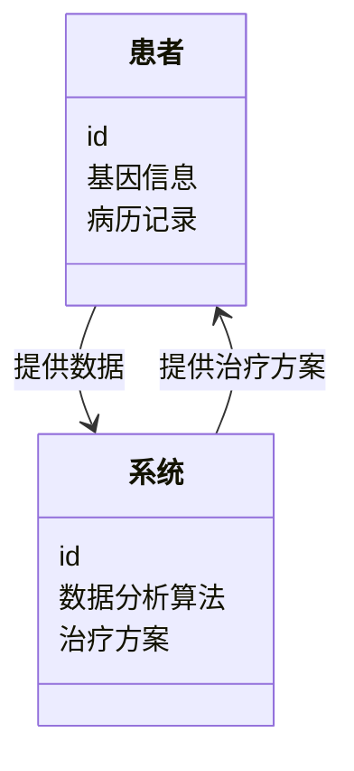
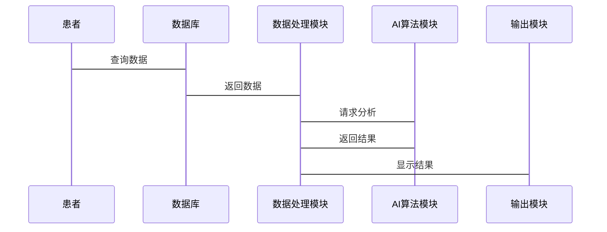

                 


# 价值投资中的智能化精准癌症治疗系统分析

> 关键词：价值投资，精准治疗，智能化，癌症治疗，系统分析，医疗数据分析

> 摘要：本文从价值投资的视角分析智能化精准癌症治疗系统，探讨其核心概念、算法原理、系统架构及实际应用。通过数学模型和案例分析，揭示其在医疗领域的投资价值与技术创新。

---

## 第一部分: 价值投资中的智能化精准癌症治疗系统背景与概念

### 第1章: 价值投资的基本概念与分析框架

#### 1.1 价值投资的定义与核心理念

##### 1.1.1 价值投资的起源与发展

价值投资是一种以基本面分析为基础的投资策略，起源于20世纪初。本杰明·格雷厄姆和戴维·多德是这一理念的奠基者。价值投资的核心在于寻找市场价格低于其内在价值的证券，通过长期持有实现收益。

##### 1.1.2 价值投资的核心理念与原则

- **安全边际**：买入价格低于内在价值，确保安全空间。
- **长期持有**：价值投资强调长期持有优质资产。
- **价值回归**：市场价格趋向于其内在价值。

##### 1.1.3 价值投资在不同领域的应用

价值投资不仅适用于传统金融领域，还可扩展至医疗、科技等领域。在医疗领域，价值投资关注具有长期增长潜力的企业，评估其商业模式、市场地位和财务表现。

#### 1.2 精准癌症治疗的背景与现状

##### 1.2.1 癌症治疗的历史演变

癌症治疗经历了从传统化疗到靶向治疗的转变。随着基因组学和大数据技术的发展，精准治疗成为可能。

##### 1.2.2 精准治疗的定义与特点

精准治疗基于患者个体特征，制定个性化治疗方案。其特点是：个性化、分子水平、疗效显著、副作用小。

##### 1.2.3 精准治疗在现代医学中的地位

精准治疗被视为现代医学的重要发展方向，其在提高治疗效果和降低副作用方面具有显著优势。

### 第2章: 价值投资与精准治疗的结合

#### 2.1 价值投资在医疗领域的应用

##### 2.1.1 医疗领域的投资逻辑

医疗领域投资关注技术创新、市场潜力和商业模式。精准治疗因技术壁垒高、市场潜力大，成为价值投资者的青睐对象。

##### 2.1.2 精准治疗企业的估值方法

通过DCF模型评估企业价值，考虑其研发投入、技术壁垒和市场前景。估值时需关注企业的财务健康和管理团队。

##### 2.1.3 价值投资与医疗创新的关系

价值投资支持具有创新性和成长性的医疗企业，推动行业技术进步，实现双赢。

#### 2.2 精准治疗系统的智能化分析

##### 2.2.1 系统分析的定义与目标

智能化分析通过大数据和AI技术，优化诊断和治疗方案，提高精准度和效率。

##### 2.2.2 智能化分析的核心技术

- 大数据处理：整合和分析海量医疗数据。
- 机器学习：预测疾病进展和治疗效果。
- 自然语言处理：分析医学文献和病历。

##### 2.2.3 价值投资与系统分析的结合点

价值投资者通过分析技术可行性、市场潜力和商业模式，评估精准治疗系统的投资价值。

### 第3章: 智能化精准癌症治疗系统的核心概念与联系

#### 3.1 核心概念原理

##### 3.1.1 价值投资的分析框架

- **内在价值**：企业的实际价值，基于财务指标和市场地位。
- **安全边际**：买入价格与内在价值的差距，确保投资安全。

##### 3.1.2 精准治疗的系统结构

- **数据采集**：收集患者的基因、生活方式等信息。
- **数据分析**：利用AI技术分析数据，制定个性化治疗方案。
- **治疗实施**：根据分析结果，实施精准治疗。

##### 3.1.3 两者的关联与协同

价值投资为企业提供资金支持，精准治疗系统提供技术支撑，两者协同推动医疗创新。

#### 3.2 核心概念属性对比

##### 3.2.1 价值投资与精准治疗的对比分析

| 特性 | 价值投资 | 精准治疗 |
|------|-----------|----------|
| 目标 | 获取超额收益 | 提高治疗效果 |
| 方法 | 基本面分析 | 技术驱动 |
| 风险 | 市场波动 | 技术不确定性 |

##### 3.2.2 实体关系图

```mermaid
erDiagram
    class 患者 {
        id
        基因信息
        病历记录
    }
    class 系统 {
        id
        数据分析算法
        治疗方案
    }
    患者 --> 系统 : 提供数据
    系统 --> 患者 : 提供治疗方案
```

---

## 第二部分: 精准治疗系统的算法原理与数学模型

### 第4章: 精准治疗系统的算法原理与数学模型

#### 4.1 医疗数据分析的算法原理

##### 4.1.1 机器学习在医疗数据分析中的应用

- **监督学习**：预测疾病风险。
- **无监督学习**：发现患者群体特征。
- **深度学习**：分析医学影像。

##### 4.1.2 深度学习在精准治疗中的作用

深度学习通过处理复杂数据，如医学影像和基因组数据，辅助诊断和治疗方案制定。

##### 4.1.3 算法原理的 Mermaid 流程图



#### 4.2 数学模型与公式

##### 4.2.1 多因素回归模型

用于评估多个因素对患者生存率的影响：

$$ \text{Survival} = \beta_0 + \beta_1 \times \text{基因表达} + \beta_2 \times \text{年龄} + \epsilon $$

##### 4.2.2 精准治疗的评分系统

通过加权评分模型，评估患者对某种治疗方案的响应概率：

$$ \text{Score} = \sum (\text{权重}_i \times \text{特征}_i) $$

---

## 第三部分: 智能化精准治疗系统的系统分析与架构设计

### 第5章: 智能化精准治疗系统的系统分析与架构设计

#### 5.1 问题场景介绍

##### 5.1.1 癌症治疗中的数据收集与处理

精准治疗系统需要整合患者的基因、生活方式和病史等数据。

#### 5.2 系统功能设计

##### 5.2.1 领域模型 Mermaid 类图



#### 5.3 系统架构设计

##### 5.3.1 系统架构 Mermaid 图


#### 5.4 系统接口设计

##### 5.4.1 系统交互 Mermaid 序列图



---

## 第四部分: 项目实战

### 第6章: 项目实战

#### 6.1 环境安装

- **工具**：Python、TensorFlow、Pandas
- **数据集**：公开医疗数据集

#### 6.2 系统核心实现源代码

##### 6.2.1 数据预处理

```python
import pandas as pd

# 读取数据
data = pd.read_csv('data.csv')

# 删除缺失值
data.dropna(inplace=True)
```

##### 6.2.2 特征选择与模型训练

```python
from sklearn.linear_model import LogisticRegression
from sklearn.model_selection import train_test_split

# 划分训练集和测试集
X_train, X_test, y_train, y_test = train_test_split(data.drop('label', axis=1), data['label'], test_size=0.2)

# 训练模型
model = LogisticRegression()
model.fit(X_train, y_train)
```

##### 6.2.3 模型评估

```python
from sklearn.metrics import accuracy_score

# 预测结果
y_pred = model.predict(X_test)

# 计算准确率
print(accuracy_score(y_test, y_pred))
```

#### 6.3 案例分析与详细解读

通过具体案例，分析系统的实际应用效果和投资价值。例如，评估某精准治疗企业的财务表现和技术优势。

---

## 第五部分: 最佳实践

### 第7章: 最佳实践

#### 7.1 小结

智能化精准治疗系统的开发和应用，需要结合价值投资的分析方法，注重技术创新和市场潜力的结合。

#### 7.2 注意事项

- 数据隐私保护
- 技术可行性评估
- 风险管理

#### 7.3 拓展阅读

推荐相关书籍和文献，帮助读者深入理解价值投资和精准治疗的结合。

---

## 作者：AI天才研究院/AI Genius Institute & 禅与计算机程序设计艺术 /Zen And The Art of Computer Programming

