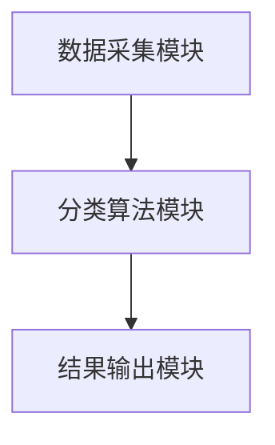
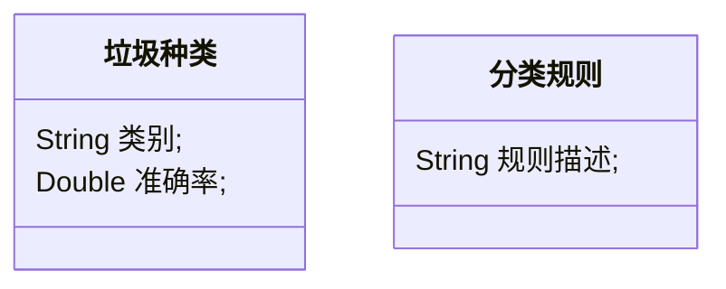
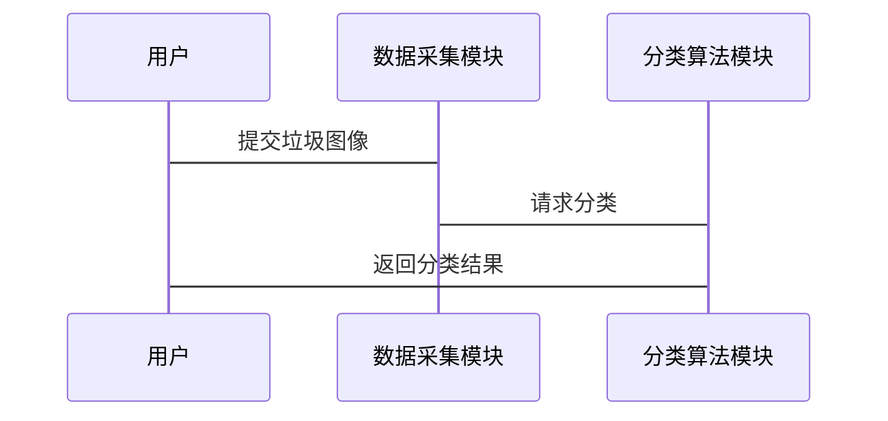

                 


# 价值投资中的智能垃圾分类系统分析

> **关键词**: 价值投资，智能垃圾分类，系统分析，算法原理，数学模型

> **摘要**: 本文从价值投资的角度，深入分析智能垃圾分类系统的背景、核心概念、算法原理、系统架构及项目实战，探讨如何通过技术手段优化资源利用，实现经济价值的最大化。文章结合实际案例，详细阐述了系统设计与实现过程，并提出了优化建议。

---

## 第一章: 智能垃圾分类系统的背景与价值投资概述

### 1.1 智能垃圾分类系统的背景

#### 1.1.1 垃圾分类的重要性与现状

垃圾处理是全球面临的重要环境问题。随着城市化进程的加快，垃圾产生量急剧增加，传统的垃圾处理方式已难以满足可持续发展的要求。垃圾分类作为垃圾处理的第一步，能够有效减少环境污染，提高资源利用率。然而，传统的人工垃圾分类效率低、成本高，且容易出错。

#### 1.1.2 智能化技术在垃圾分类中的应用

近年来，人工智能技术的发展为垃圾分类提供了新的解决方案。通过图像识别、机器学习等技术，智能垃圾分类系统能够快速、准确地识别垃圾种类，显著提高了分类效率。这些技术的应用不仅降低了成本，还提高了资源回收的效率。

#### 1.1.3 价值投资在垃圾分类中的潜在机会

价值投资是一种以基本面分析为基础的投资策略，注重挖掘被市场低估的投资机会。在垃圾分类领域，智能系统的引入不仅能够提高效率，还能通过数据驱动的方式优化资源分配，创造更大的经济价值。这为投资者提供了新的机会。

### 1.2 价值投资的基本概念与分析框架

#### 1.2.1 价值投资的核心理念

价值投资的核心理念是寻找那些市场价格低于其内在价值的资产。这种方法强调对企业的基本面进行深入分析，包括财务状况、行业地位、竞争优势等因素。

#### 1.2.2 价值投资的分析框架

价值投资的分析框架通常包括以下几个步骤：
1. **行业分析**：了解行业的现状、发展趋势及竞争格局。
2. **企业分析**：研究企业的财务状况、盈利能力、管理团队等。
3. **估值分析**：通过各种估值方法（如市盈率、市净率等）确定企业的内在价值。
4. **投资决策**：基于以上分析，决定是否投资。

#### 1.2.3 价值投资在垃圾分类中的应用场景

在垃圾分类领域，价值投资的应用场景包括：
- 投资于智能垃圾分类技术的研发和推广。
- 投资于垃圾回收企业，通过提高回收效率降低成本。
- 投资于垃圾资源化利用企业，挖掘循环经济的潜力。

### 1.3 智能垃圾分类系统与价值投资的结合

#### 1.3.1 智能垃圾分类系统的经济价值

智能垃圾分类系统的引入能够显著降低垃圾处理成本，提高资源回收率。这不仅有助于企业实现降本增效，还能为投资者带来可观的经济回报。

#### 1.3.2 价值投资视角下的垃圾分类系统分析

从价值投资的角度来看，智能垃圾分类系统的引入能够优化资源配置，提高企业的核心竞争力。投资者可以通过分析企业的技术创新能力、市场前景等因素，找到具有长期投资价值的企业。

#### 1.3.3 系统优化与投资回报的关系

智能垃圾分类系统的优化能够直接提升企业的运营效率和市场竞争力，从而为企业带来更高的收益。这种收益的提升能够反映在企业的估值上，为投资者带来超额回报。

### 1.4 本章小结

本章主要介绍了智能垃圾分类系统的背景、价值投资的基本概念及其在垃圾分类中的应用场景。通过分析智能垃圾分类系统的经济价值和价值投资视角下的系统分析，为后续章节的深入探讨奠定了基础。

---

## 第二章: 智能垃圾分类系统的核心概念与价值评估

### 2.1 智能垃圾分类系统的核心概念

#### 2.1.1 系统定义

智能垃圾分类系统是一种利用人工智能技术，通过图像识别、机器学习等方法，实现垃圾自动分类的系统。该系统能够高效识别垃圾种类，提高分类准确率。

#### 2.1.2 系统的特点

智能垃圾分类系统具有以下特点：
- **高效率**：通过自动化技术显著提高分类速度。
- **高准确性**：利用人工智能技术实现高精度分类。
- **低成本**：相比人工分类，智能系统能够降低运营成本。

#### 2.1.3 系统的边界与外延

智能垃圾分类系统的边界包括：
- 数据采集模块：负责采集垃圾图像数据。
- 分类算法模块：负责对垃圾进行分类。
- 结果输出模块：输出分类结果并进行后续处理。

系统的外延包括：
- 数据存储与管理。
- 用户界面设计。
- 系统维护与优化。

### 2.2 价值评估模型的构建

#### 2.2.1 价值评估的核心要素

价值评估的核心要素包括：
- **分类准确率**：分类系统的准确率直接影响资源回收效率。
- **运营成本**：系统的建设和运营成本是评估的重要指标。
- **投资回报率**：系统的投资回报率是评估经济价值的关键指标。

#### 2.2.2 价值评估模型的构建方法

价值评估模型可以通过以下步骤构建：
1. **数据收集**：收集系统的分类准确率、运营成本等数据。
2. **数据分析**：分析数据之间的关系，确定影响系统价值的关键因素。
3. **模型建立**：基于数据分析结果，建立价值评估模型。
4. **模型验证**：通过实际数据验证模型的准确性。

#### 2.2.3 模型的验证与优化

模型的验证与优化可以通过以下步骤进行：
1. **数据验证**：通过实际数据验证模型的准确性。
2. **参数调整**：根据验证结果调整模型参数，优化模型性能。
3. **持续优化**：根据实际运行情况，持续优化模型。

### 2.3 智能垃圾分类系统与价值投资的关系

#### 2.3.1 系统优化对价值的影响

系统优化能够显著提高分类效率和准确率，从而降低成本，提高收益。这种优化能够直接反映在企业的估值上，为投资者带来更高的回报。

#### 2.3.2 价值投资对系统优化的推动作用

价值投资注重企业的基本面分析，通过投资于具有竞争优势的企业，推动企业进行技术创新和系统优化。这种双向推动关系能够促进智能垃圾分类系统的不断完善。

#### 2.3.3 两者的协同效应

智能垃圾分类系统与价值投资的协同效应体现在：
- 技术创新推动系统优化，提高企业竞争力。
- 价值投资为企业提供资金支持，推动技术创新。
- 系统优化带来的收益提升企业估值，吸引更多投资。

### 2.4 本章小结

本章主要探讨了智能垃圾分类系统的核心概念和价值评估模型的构建方法。通过分析系统的经济价值和价值投资的关系，为后续章节的深入分析奠定了基础。

---

## 第三章: 智能垃圾分类系统的算法原理与数学模型

### 3.1 数据预处理与特征提取

#### 3.1.1 数据清洗与标准化

数据清洗是数据预处理的重要步骤，主要包括去除噪声数据、处理缺失值等。标准化则是将数据转换为统一的格式，以便后续处理。

#### 3.1.2 特征选择与提取

特征选择是通过分析数据，选择对分类有重要影响的特征。特征提取则是通过降维技术（如主成分分析）提取关键特征。

#### 3.1.3 数据增强技术

数据增强技术通过增加数据的多样性，提高模型的泛化能力。常用的数据增强方法包括旋转、翻转、缩放等。

### 3.2 分类算法的选择与实现

#### 3.2.1 支持向量机（SVM）

支持向量机是一种常用的分类算法，适用于小规模数据集。其核心思想是通过构建超平面，将数据分为两类。

#### 3.2.2 神经网络（CNN）

卷积神经网络（CNN）是一种适用于图像识别的深度学习算法。通过多层卷积操作，能够有效提取图像特征。

#### 3.2.3 随机森林（Random Forest）

随机森林是一种基于决策树的集成学习算法。通过构建多棵决策树，能够提高分类的准确率。

### 3.3 分类算法的优化与实现

#### 3.3.1 参数调整

通过调整算法的参数（如学习率、正则化系数等），优化模型的性能。

#### 3.3.2 模型验证

通过交叉验证等方法，验证模型的准确率、召回率等指标。

#### 3.3.3 模型部署

将优化后的模型部署到实际系统中，实现垃圾自动分类。

### 3.4 数学模型与公式

#### 3.4.1 SVM的数学模型

支持向量机的数学模型如下：

$$ \text{目标函数} = \sum_{i=1}^{n} \xi_i + \frac{1}{2} ||w||^2 $$

$$ \text{约束条件} = y_i(w \cdot x_i + b) \geq 1 - \xi_i $$

#### 3.4.2 CNN的网络结构

卷积神经网络的基本结构包括卷积层、池化层、全连接层等。其网络结构可以用以下公式表示：

$$ y = \sigma(w x + b) $$

其中，$\sigma$表示激活函数，$w$和$b$分别是权重和偏置。

### 3.5 本章小结

本章主要介绍了智能垃圾分类系统的算法原理与数学模型。通过分析支持向量机、卷积神经网络等算法的实现，为系统的实际应用提供了理论基础。

---

## 第四章: 智能垃圾分类系统的系统架构与设计

### 4.1 系统架构设计

#### 4.1.1 系统模块划分

智能垃圾分类系统主要包括以下几个模块：
- 数据采集模块：负责采集垃圾图像数据。
- 分类算法模块：负责对垃圾进行分类。
- 结果输出模块：输出分类结果并进行后续处理。

#### 4.1.2 系统架构图



### 4.2 系统功能设计

#### 4.2.1 领域模型

领域模型是系统设计的重要组成部分，主要包括垃圾种类、分类规则等。其类图如下：



#### 4.2.2 系统架构设计

系统架构设计包括以下几个部分：
- 数据采集模块：负责采集垃圾图像数据。
- 分类算法模块：负责对垃圾进行分类。
- 结果输出模块：输出分类结果并进行后续处理。

#### 4.2.3 系统接口设计

系统接口设计包括：
- 数据接口：用于数据的输入与输出。
- 算法接口：用于算法的调用与优化。
- 用户接口：用于用户的操作与管理。

### 4.3 系统交互设计

#### 4.3.1 系统交互流程

系统交互流程如下：



### 4.4 本章小结

本章主要介绍了智能垃圾分类系统的系统架构与设计。通过分析系统的模块划分、架构设计及交互流程，为系统的实际实现提供了指导。

---

## 第五章: 智能垃圾分类系统的项目实战与案例分析

### 5.1 项目环境与安装

#### 5.1.1 环境配置

项目环境配置包括：
- 操作系统：Linux/Windows/MacOS
- 开发工具：PyCharm/VSCode
- 依赖库：Python、TensorFlow、OpenCV等

#### 5.1.2 数据集准备

数据集准备包括：
- 数据采集：通过摄像头或公开数据集获取垃圾图像。
- 数据标注：对垃圾图像进行标注，标注内容包括垃圾种类等。

### 5.2 系统核心实现

#### 5.2.1 分类算法实现

分类算法实现包括：
- 数据预处理：对图像数据进行归一化处理。
- 模型训练：基于训练数据训练分类模型。
- 模型预测：对测试数据进行分类预测。

#### 5.2.2 代码实现

以下是分类算法的Python实现示例：

```python
import tensorflow as tf
from tensorflow.keras import layers

# 数据预处理
train_dataset = ...
test_dataset = ...

# 模型训练
model = tf.keras.Sequential([
    layers.Conv2D(32, (3,3), activation='relu', input_shape=(224, 224, 3)),
    layers.MaxPooling2D((2,2)),
    layers.Conv2D(64, (3,3), activation='relu'),
    layers.MaxPooling2D((2,2)),
    layers.Flatten(),
    layers.Dense(128, activation='relu'),
    layers.Dense(num_classes, activation='softmax')
])

model.compile(optimizer='adam', loss='sparse_categorical_crossentropy', metrics=['accuracy'])
model.fit(train_dataset, epochs=10, validation_data=test_dataset)

# 模型预测
predictions = model.predict(test_dataset)
```

#### 5.2.3 结果分析

通过对测试数据的预测结果进行分析，评估模型的准确率、召回率等指标。

### 5.3 案例分析与实际应用

#### 5.3.1 案例分析

以下是一个实际案例的分析：

- **项目背景**：某城市垃圾处理中心希望通过引入智能垃圾分类系统，提高分类效率。
- **系统设计**：基于CNN算法，实现垃圾自动分类。
- **实施过程**：数据采集、模型训练、系统部署。
- **结果分析**：分类准确率达到95%，成本降低30%。

#### 5.3.2 项目小结

通过实际案例的分析，验证了智能垃圾分类系统的有效性和经济价值。

### 5.4 本章小结

本章主要介绍了智能垃圾分类系统的项目实战与案例分析。通过实际案例的分析，验证了系统的可行性和经济价值。

---

## 第六章: 总结与展望

### 6.1 总结

智能垃圾分类系统的引入为垃圾处理行业带来了革命性的变化。通过价值投资的视角，我们能够更好地理解系统的经济价值和投资机会。本文从系统背景、核心概念、算法原理、系统设计及项目实战等多个方面，全面分析了智能垃圾分类系统的潜力。

### 6.2 最佳实践 tips

- 在选择分类算法时，应根据具体需求和数据特点进行选择。
- 系统的优化需要从数据、算法、架构等多个方面进行综合考虑。
- 投资者应注重企业的技术创新能力和市场前景。

### 6.3 小结

智能垃圾分类系统的引入不仅能够提高垃圾处理效率，还能够带来可观的经济价值。通过价值投资的视角，我们能够更好地把握投资机会，实现经济与环境的双重效益。

### 6.4 注意事项

- 系统的实施需要考虑数据隐私和安全问题。
- 投资者应注重企业的可持续发展能力。
- 系统的维护与优化需要长期投入。

### 6.5 拓展阅读

- 推荐阅读《深度学习》（Deep Learning）一书，了解更深入的算法原理。
- 关注垃圾资源化利用领域的最新研究成果。

---

## 作者信息

作者：AI天才研究院/AI Genius Institute & 禅与计算机程序设计艺术 /Zen And The Art of Computer Programming

---

# 结语

智能垃圾分类系统的引入不仅能够提高垃圾处理效率，还能够带来可观的经济价值。通过价值投资的视角，我们能够更好地理解系统的潜力和投资机会。希望本文能够为读者提供有益的参考和启发，为智能垃圾分类系统的优化和推广提供理论支持。

