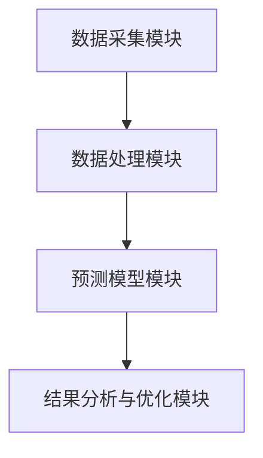
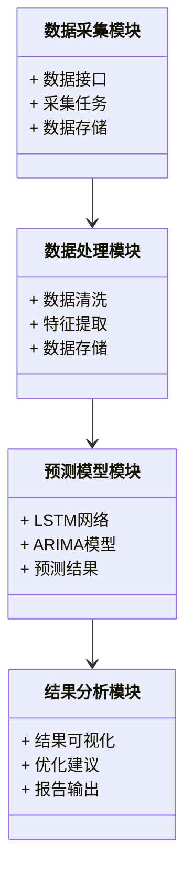
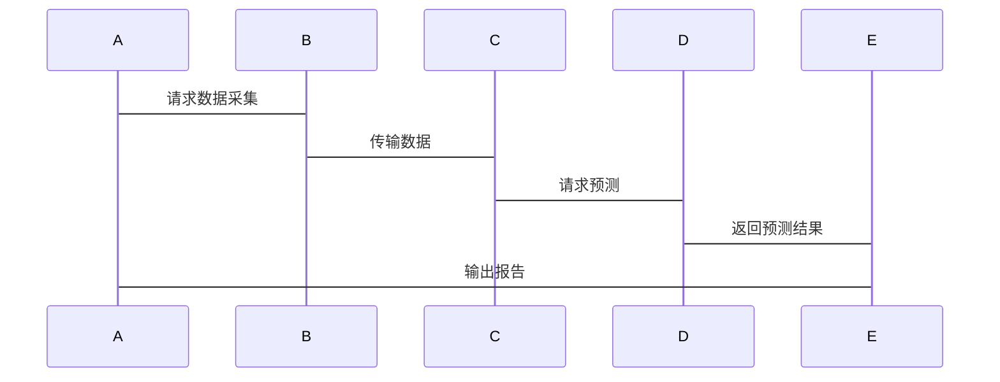

                 


# 价值投资中的智能城市交通流量预测系统分析

## 关键词：智能城市，交通流量预测，价值投资，深度学习，时间序列分析

## 摘要：  
本文分析了在智能城市背景下，如何通过交通流量预测系统进行价值投资。文章从背景介绍、核心概念、算法原理、系统架构、项目实战等多个方面展开，详细探讨了交通流量预测在价值投资中的应用潜力。通过分析不同算法模型的优势与不足，结合实际案例，本文提出了基于深度学习的时间序列分析方法，并结合系统架构设计和项目实战，为读者提供了全面的技术指导。

---

# 第一章: 智慧城市与交通流量预测概述

## 1.1 智慧城市背景下的交通问题

### 1.1.1 智慧城市的定义与特征  
智慧城市建设的核心目标是通过信息技术优化城市资源的分配和利用。交通系统作为城市运行的核心模块之一，其效率直接影响城市的经济活力和居民生活质量。智慧城市的交通系统具备数据驱动、实时反馈和智能化决策的特点。

### 1.1.2 交通流量预测的必要性  
随着城市化进程的加快，交通流量呈现非线性波动，传统的经验式管理难以应对复杂的交通场景。通过智能技术实现交通流量的精准预测，可以有效缓解交通拥堵、降低能源消耗，同时提升城市经济效率。

### 1.1.3 价值投资在智能交通中的应用潜力  
价值投资的核心理念是通过分析系统运行的内在规律，挖掘其长期增长潜力。在智能交通领域，通过预测交通流量的变化趋势，投资者可以更精准地评估城市交通系统的价值，从而做出更科学的投资决策。

---

## 1.2 价值投资与智能交通的结合

### 1.2.1 价值投资的基本概念  
价值投资是一种长期投资策略，强调通过分析企业的内在价值，寻找市场价格低于内在价值的投资机会。在智能交通领域，价值投资的逻辑可以延伸到对交通系统效率和经济价值的评估。

### 1.2.2 智能交通系统在价值投资中的作用  
智能交通系统通过实时数据采集和分析，能够为投资者提供动态的交通运行状况。通过预测交通流量的变化，投资者可以更准确地评估城市交通系统的运营效率和未来的增长潜力。

### 1.2.3 交通流量预测对投资决策的影响  
交通流量预测为价值投资提供了重要的数据支持。通过对历史数据和未来趋势的分析，投资者可以识别交通系统的瓶颈和优化空间，从而做出更明智的投资决策。

---

## 1.3 本章小结

### 1.3.1 智慧城市交通流量预测的核心目标  
本章主要介绍了智慧城市建设的背景，以及交通流量预测在智慧城市建设中的重要性。

### 1.3.2 价值投资与智能交通的结合点  
通过分析，我们得出交通流量预测是连接智能交通系统和价值投资的重要桥梁。

### 1.3.3 本书的研究框架与内容概述  
本书将从技术原理、算法实现、系统架构等多个方面，详细探讨智能城市交通流量预测系统的构建与优化。

---

# 第二章: 交通流量预测的背景与问题分析

## 2.1 交通流量预测的背景

### 2.1.1 城市化进程加速带来的交通压力  
随着城市人口的增加和汽车保有量的上升，交通拥堵问题日益严重。传统交通管理手段难以应对复杂的交通场景。

### 2.1.2 智能交通系统的兴起  
智能交通系统的出现为交通管理提供了新的思路。通过大数据和人工智能技术，可以实现交通流量的实时监测和预测。

### 2.1.3 交通流量预测的技术演变  
从简单的统计分析到复杂的深度学习模型，交通流量预测技术经历了多次迭代和优化。

---

## 2.2 交通流量预测的核心问题

### 2.2.1 流量波动性与不确定性  
交通流量受到多种因素的影响，如天气、节假日、交通事故等，具有较强的随机性和波动性。

### 2.2.2 数据获取与处理的挑战  
交通流量预测需要依赖大量的实时数据，数据的准确性和完整性直接影响预测结果。

### 2.2.3 模型选择与优化的难点  
不同场景下的交通流量具有不同的特征，选择合适的模型并进行参数优化是预测系统的关键。

---

## 2.3 价值投资视角下的交通流量预测

### 2.3.1 交通流量与经济活动的关系  
交通流量的变化直接影响城市的经济活力。通过预测交通流量的变化趋势，可以评估城市经济的潜在增长空间。

### 2.3.2 通过流量预测优化投资决策  
投资者可以通过交通流量预测数据，评估交通系统的运营效率和未来的投资价值。

### 2.3.3 流量预测在价值评估中的应用  
交通流量预测为价值投资提供了重要的数据支持，帮助投资者识别投资机会和风险。

---

## 2.4 本章小结

### 2.4.1 交通流量预测的核心问题总结  
本章重点分析了交通流量预测的背景、核心问题以及在价值投资中的应用潜力。

### 2.4.2 价值投资视角下的预测目标  
通过交通流量预测，投资者可以更精准地评估城市交通系统的经济价值。

### 2.4.3 本书后续章节的逻辑框架  
后续章节将从技术实现和系统设计的角度，详细探讨智能城市交通流量预测系统的构建与优化。

---

# 第三章: 智能城市交通流量预测系统的核心概念

## 3.1 系统构成与核心要素

### 3.1.1 数据采集模块  
通过交通传感器、摄像头等设备采集实时交通数据。

### 3.1.2 数据处理模块  
对采集到的数据进行清洗、标准化和特征提取。

### 3.1.3 预测模型模块  
基于机器学习和深度学习算法，构建交通流量预测模型。

### 3.1.4 结果分析与优化模块  
对预测结果进行分析和优化，输出最终的预测报告。

---

## 3.2 核心概念的联系与对比

### 3.2.1 数据类型对比表  
| 数据类型 | 描述 | 示例 |
|----------|------|------|
| 时间序列数据 | 表示交通流量随时间的变化 | 每小时的车流量数据 |
| 空间数据 | 表示交通流量的空间分布 | 不同路段的流量数据 |

### 3.2.2 模型算法对比表  
| 模型名称 | 描述 | 适用场景 | 优缺点 |
|----------|------|----------|--------|
| LSTM | 长短期记忆网络 | 时间序列预测 | 能够捕捉长期依赖关系 |
| ARIMA | 自回归积分滑动平均模型 | 时间序列预测 | 适用于线性变化的数据 |

### 3.2.3 系统模块之间的关系图  


---

## 3.3 本章小结

### 3.3.1 系统构成与核心要素总结  
本章详细介绍了智能城市交通流量预测系统的构成和核心要素。

### 3.3.2 数据与模型的关系分析  
通过对比数据类型和模型算法，我们得出不同场景下选择合适模型的重要性。

### 3.3.3 本书后续章节的逻辑框架  
后续章节将从算法实现和系统架构的角度，详细探讨系统的构建与优化。

---

# 第四章: 交通流量预测的算法原理

## 4.1 常用算法介绍

### 4.1.1 LSTM算法

#### 4.1.1.1 LSTM算法的原理  
LSTM（长短期记忆网络）是一种特殊的循环神经网络，通过引入记忆单元和遗忘门，能够有效捕捉时间序列数据中的长期依赖关系。

#### 4.1.1.2 LSTM算法的数学模型  
LSTM的结构包括输入门、遗忘门和输出门。其数学公式如下：

$$
f_{\text{forget}}(x_t) = \sigma(W_f x_t + U_f h_{t-1} + b_f)
$$

$$
f_{\text{input}}(x_t) = \sigma(W_i x_t + U_i h_{t-1} + b_i)
$$

$$
g(x_t) = \tanh(W_g x_t + U_g h_{t-1} + b_g)
$$

$$
h_t = f_{\text{forget}}(x_t) \cdot h_{t-1} + f_{\text{input}}(x_t) \cdot g(x_t)
$$

$$
o_t = \sigma(W_o x_t + U_o h_t + b_o)
$$

$$
h_t' = o_t \cdot h_t
$$

#### 4.1.1.3 LSTM算法的实现代码  
```python
import numpy as np
from tensorflow.keras.layers import LSTM, Dense, Dropout
from tensorflow.keras.models import Sequential

model = Sequential()
model.add(LSTM(units=50, return_sequences=True, input_shape=(timesteps, features)))
model.add(Dropout(0.2))
model.add(LSTM(units=50, return_sequences=False))
model.add(Dense(1))
model.compile(optimizer='adam', loss='mean_squared_error')
```

### 4.1.2 ARIMA算法

#### 4.1.2.1 ARIMA算法的原理  
ARIMA（自回归积分滑动平均模型）是一种适合时间序列预测的经典算法。它通过自回归和滑动平均的组合，能够捕捉数据的线性变化趋势。

#### 4.1.2.2 ARIMA算法的数学模型  
ARIMA模型的数学公式如下：

$$
y_t = \phi_1 y_{t-1} + \phi_2 y_{t-2} + \dots + \phi_p y_{t-p} + \theta_1 \epsilon_{t-1} + \theta_2 \epsilon_{t-2} + \dots + \theta_q \epsilon_{t-q} + \epsilon_t
$$

#### 4.1.2.3 ARIMA算法的实现代码  
```python
from statsmodels.tsa.arima_model import ARIMA

model = ARIMA(endog, order=(p, d, q))
model_fit = model.fit()
forecast = model_fit.forecast(steps=5)
```

---

## 4.2 算法选择与优化

### 4.2.1 算法选择的原则  
根据数据的特性选择合适的算法。例如，LSTM适用于非线性变化的数据，而ARIMA适用于线性变化的数据。

### 4.2.2 算法优化的技巧  
通过数据预处理、超参数调优和模型融合等方法，可以进一步提升算法的预测精度。

---

## 4.3 本章小结

### 4.3.1 算法原理总结  
本章详细介绍了LSTM和ARIMA两种常用的交通流量预测算法，并给出了它们的数学模型和实现代码。

### 4.3.2 算法选择与优化的策略  
通过对比不同算法的优缺点，我们得出在实际应用中需要根据数据特性选择合适的算法，并通过优化手段提升预测精度。

### 4.3.3 本书后续章节的逻辑框架  
后续章节将从系统架构和项目实战的角度，详细探讨智能城市交通流量预测系统的构建与优化。

---

# 第五章: 智能城市交通流量预测系统架构设计

## 5.1 系统功能设计

### 5.1.1 数据采集模块  
通过传感器、摄像头等设备采集实时交通数据。

### 5.1.2 数据处理模块  
对采集到的数据进行清洗、标准化和特征提取。

### 5.1.3 预测模型模块  
基于机器学习和深度学习算法，构建交通流量预测模型。

### 5.1.4 结果分析与优化模块  
对预测结果进行分析和优化，输出最终的预测报告。

---

## 5.2 系统架构设计

### 5.2.1 领域模型类图  


### 5.2.2 系统架构图  


### 5.2.3 系统交互序列图  


---

## 5.3 本章小结

### 5.3.1 系统功能设计总结  
本章详细介绍了智能城市交通流量预测系统的功能设计和架构设计。

### 5.3.2 系统模块之间的关系分析  
通过类图和序列图，我们清晰地展示了系统各模块之间的交互关系。

### 5.3.3 本书后续章节的逻辑框架  
后续章节将从项目实战的角度，详细探讨系统的实现与优化。

---

# 第六章: 项目实战——智能城市交通流量预测系统实现

## 6.1 环境安装与配置

### 6.1.1 Python环境搭建  
安装Python 3.8及以上版本，并安装必要的库，如TensorFlow、Keras、statsmodels等。

### 6.1.2 数据集准备  
收集交通流量数据，可以使用公开数据集或模拟数据。

---

## 6.2 系统核心实现

### 6.2.1 数据预处理  
```python
import pandas as pd
import numpy as np

data = pd.read_csv('traffic_data.csv')
data = data.dropna()
data = data[数据处理模块]
```

### 6.2.2 模型训练与预测  
```python
from tensorflow.keras.models import Sequential
from tensorflow.keras.layers import LSTM, Dense, Dropout
from statsmodels.tsa.arima_model import ARIMA

# LSTM模型训练
model = Sequential()
model.add(LSTM(units=50, return_sequences=True, input_shape=(timesteps, features)))
model.add(Dropout(0.2))
model.add(LSTM(units=50, return_sequences=False))
model.add(Dense(1))
model.compile(optimizer='adam', loss='mean_squared_error')
model.fit(X_train, y_train, epochs=50, batch_size=32)

# ARIMA模型训练
model_arima = ARIMA(endog, order=(p, d, q))
model_arima_fit = model_arima.fit()

# 预测结果
lstm_predictions = model.predict(X_test)
arima_predictions = model_arima_fit.forecast(steps=len(y_test))
```

### 6.2.3 结果分析与可视化  
```python
import matplotlib.pyplot as plt

plt.plot(y_test, label='实际值')
plt.plot(lstm_predictions, label='LSTM预测值')
plt.plot(arima_predictions, label='ARIMA预测值')
plt.legend()
plt.show()
```

---

## 6.3 案例分析与详细解读

### 6.3.1 案例背景介绍  
以某城市主要路段的交通流量预测为例，数据集包含过去5年的交通流量数据。

### 6.3.2 模型选择与优化  
通过对比LSTM和ARIMA模型的预测结果，选择预测精度更高的模型进行优化。

### 6.3.3 预测结果分析  
通过对预测结果的分析，识别交通流量的高峰时段和低谷时段，为交通管理提供优化建议。

---

## 6.4 本章小结

### 6.4.1 项目实现总结  
本章详细介绍了智能城市交通流量预测系统的实现过程，包括环境搭建、数据预处理、模型训练与预测。

### 6.4.2 案例分析与结果解读  
通过实际案例分析，我们得出不同算法的优缺点，并提出了优化建议。

### 6.4.3 本书后续章节的逻辑框架  
后续章节将从总结与展望的角度，详细探讨系统的优化与未来发展。

---

# 第七章: 总结与展望

## 7.1 总结

### 7.1.1 核心技术总结  
本章总结了智能城市交通流量预测系统的核心技术，包括数据处理、算法选择和系统架构设计。

### 7.1.2 价值投资视角下的系统优化建议  
通过交通流量预测优化投资决策，提升城市交通系统的经济价值。

---

## 7.2 展望

### 7.2.1 技术发展的未来方向  
随着人工智能和大数据技术的不断发展，交通流量预测系统将更加智能化和精准化。

### 7.2.2 价值投资与智能交通的结合  
未来，价值投资与智能交通的结合将更加紧密，通过预测交通流量的变化趋势，投资者可以更精准地评估城市交通系统的价值。

---

# 作者：AI天才研究院 & 禅与计算机程序设计艺术

