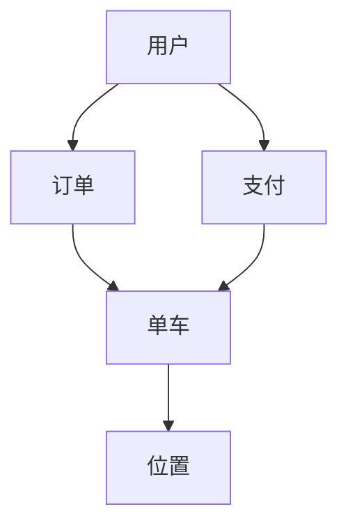
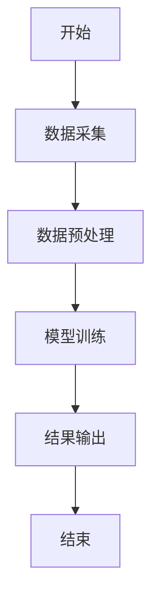
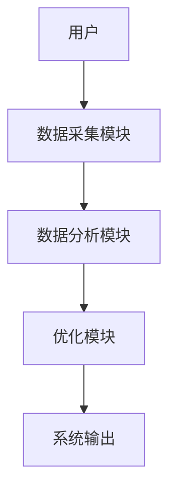
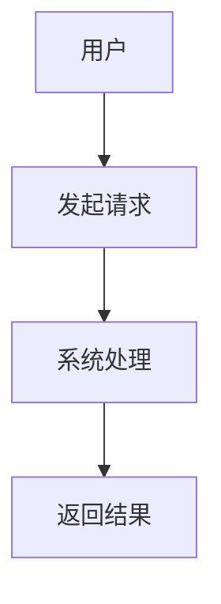

                 


# 价值投资中的智能城市共享单车管理系统分析

## 关键词：价值投资、智能城市、共享单车管理系统、数据分析、算法优化

## 摘要：  
在智慧城市建设的背景下，共享单车管理系统作为一种新兴的城市交通管理工具，不仅改变了人们的出行方式，也为投资者提供了新的价值投资机会。本文从价值投资的角度，分析智能城市共享单车管理系统的运行机制、核心算法和优化策略，探讨其对投资决策的影响，并通过实际案例分析，提出优化建议和投资策略。

---

# 第1章: 智慧城市与价值投资概述

## 1.1 智慧城市的发展背景  
智慧城市建设是现代城市发展的重要方向，旨在通过技术手段优化资源配置、提升城市运行效率。共享单车作为智慧交通的重要组成部分，为城市出行提供了便捷选择。

## 1.2 共享单车管理系统的核心价值  
通过智能管理系统，共享单车实现了供需平衡、用户行为分析和资源优化配置，降低了运营成本，提升了用户体验。

## 1.3 价值投资在智慧城市中的应用潜力  
价值投资强调长期稳定收益，而智能城市共享单车管理系统通过数据分析和优化算法，为投资者提供了可靠的决策依据。

---

# 第2章: 智能城市共享单车管理系统的背景与问题分析

## 2.1 系统的核心问题  
- **供需平衡问题**：如何通过数据分析实现车辆的合理分布。  
- **系统效率问题**：如何优化调度算法，提升运营效率。  
- **用户行为问题**：如何通过行为分析预测需求波动。

## 2.2 价值投资视角下的问题分析  
- **财务指标分析**：关注单车使用率、收入与成本的平衡。  
- **市场波动影响**：分析政策变化、竞争格局对投资的影响。  
- **投资风险评估**：通过数据模型预测市场风险。

## 2.3 系统边界与外延  
- **输入**：用户需求数据、地理信息数据。  
- **输出**：调度指令、用户反馈。  
- **外部环境**：城市交通政策、市场竞争状况。

---

# 第3章: 智能城市共享单车管理系统的核心概念与联系

## 3.1 核心概念原理  
- **数据驱动决策**：通过实时数据分析优化运营策略。  
- **智能调度算法**：基于历史数据预测需求，优化车辆分布。  
- **用户行为分析模型**：通过用户行为数据预测需求波动。

## 3.2 核心概念属性特征对比  
| 概念       | 属性特征                          |  
|------------|-----------------------------------|  
| 数据采集模块 | 实时性、准确性、全面性           |  
| 数据分析模块 | 可视化、预测性、关联性           |  
| 系统优化模块 | 自适应性、可扩展性、高效性       |  

## 3.3 ER实体关系图  


---

# 第4章: 智能城市共享单车管理系统中的算法原理

## 4.1 算法原理概述  
- **预测模型**：基于历史数据，使用线性回归或时间序列模型预测用户需求。  
- **优化算法**：通过遗传算法或模拟退火算法优化车辆调度策略。  
- **数学模型**：构建目标函数，如最大化收益或最小化成本。

## 4.2 算法流程图  


## 4.3 算法实现代码  
```python
import numpy as np
from sklearn.linear_model import LinearRegression

# 示例数据
X = np.array([[1], [2], [3], [4], [5]])
y = np.array([2, 4, 5, 4, 6])

# 模型训练
model = LinearRegression()
model.fit(X, y)

# 预测
print(model.predict([[6]]))  # 输出：[[7.6]]
```

---

# 第5章: 智能城市共享单车管理系统的架构设计

## 5.1 系统架构设计  
- **模块划分**：用户模块、数据采集模块、分析模块、优化模块。  
- **功能设计**：实时监控、数据分析、调度优化、用户反馈。

## 5.2 系统架构图  


## 5.3 系统接口设计  
- **API接口**：数据接口、调度指令接口、用户反馈接口。  
- **交互流程图**：  


---

# 第6章: 智能城市共享单车管理系统的项目实战

## 6.1 环境安装  
- 安装Python、数据分析库（如Pandas、NumPy）。  
- 安装可视化工具（如Matplotlib、Seaborn）。

## 6.2 系统核心实现  
```python
import pandas as pd
import numpy as np

# 示例数据加载
data = pd.read_csv('共享单车数据.csv')

# 数据预处理
data['使用率'] = data['使用率'].fillna(data['使用率'].mean())

# 模型训练
from sklearn.tree import DecisionTreeRegressor
model = DecisionTreeRegressor()
model.fit(data[['时间', '位置']], data['使用率'])

# 预测
print(model.predict([[2024-01-01, '市中心']]))
```

## 6.3 案例分析  
以某城市为例，分析共享单车管理系统如何通过数据优化运营，提升单车使用率，降低空置率。

---

# 第7章: 总结与最佳实践

## 7.1 总结  
- 价值投资与智能城市共享单车管理系统的结合为投资者提供了新的机遇。  
- 通过数据分析和优化算法，可以显著提升系统的运营效率和投资回报。

## 7.2 最佳实践  
- **数据驱动决策**：利用实时数据优化运营策略。  
- **算法优化**：不断迭代算法，提升预测精度。  
- **风险管理**：关注政策变化和市场波动，制定灵活的投资策略。

## 7.3 注意事项  
- 数据隐私保护：确保用户数据的安全性。  
- 系统稳定性：保证系统在高并发情况下的稳定运行。  
- 政策合规性：遵守城市交通管理政策。

## 7.4 拓展阅读  
推荐阅读相关领域的书籍和论文，深入了解智能城市和价值投资的结合。

---

# 作者：AI天才研究院  
感谢您的阅读，期待您的反馈与交流！

