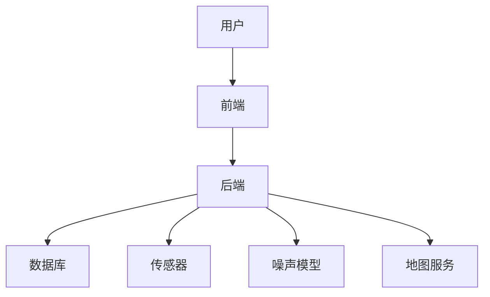
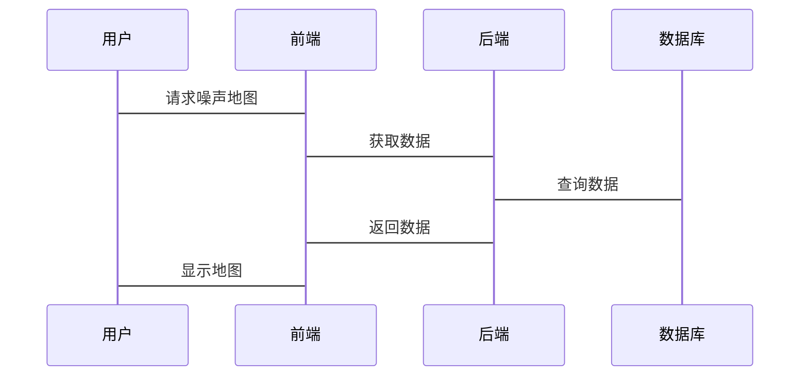

                 


# 价值投资中的智能城市噪声地图绘制系统分析

## 关键词：价值投资、智能城市、噪声地图、系统分析、投资决策、算法原理、城市规划

## 摘要：
本文将深入探讨价值投资与智能城市噪声地图绘制系统的结合，分析其在投资决策中的应用潜力。通过系统的背景介绍、核心概念分析、算法原理、系统架构设计、项目实战和最佳实践，本文旨在为投资者提供基于噪声地图的科学决策方法，助力智能城市规划与投资优化。

---

# 第一部分: 价值投资与智能城市噪声地图绘制系统概述

# 第1章: 价值投资与智能城市噪声地图绘制系统的背景

## 1.1 价值投资的定义与核心理念

### 1.1.1 价值投资的基本概念
- 价值投资是一种以内在价值为导向的投资策略，强调以低于内在价值的价格购买优质资产。
- 核心理念：寻找市场低估的资产，长期持有，获得超额收益。

### 1.1.2 价值投资的核心理念
- 质量：选择财务健康、管理优秀的企业。
- 价格：以合理或低于内在价值的价格买入。
- 时间：长期持有，避免短期波动影响。

### 1.1.3 价值投资在智能城市中的应用潜力
- 智能城市涉及多个领域，如交通、能源、环境等，为价值投资提供了新的标的。
- 噪声污染治理是智能城市中的一个重要环节，可以通过噪声地图绘制系统进行分析。

## 1.2 智能城市噪声地图绘制系统的背景

### 1.2.1 城市噪声污染的现状
- 城市化进程加速，交通、工业噪声问题日益严重。
- 噪声污染对居民健康、工作环境和城市价值的影响显著。

### 1.2.2 智能城市的概念与特征
- 智能城市：利用信息技术优化城市资源配置，提高居民生活质量。
- 特征：数字化、网络化、智能化、协同化。

### 1.2.3 噪声地图绘制系统在智能城市中的作用
- 帮助城市规划者和投资者了解噪声分布，制定治理策略。
- 为价值投资提供数据支持，优化投资决策。

## 1.3 价值投资与噪声地图绘制系统的结合

### 1.3.1 价值投资在噪声污染治理中的应用
- 通过噪声地图分析，识别噪声污染严重的区域，评估治理潜力。
- 判断噪声治理项目的投资价值，寻找具有竞争优势的企业。

### 1.3.2 噪声地图绘制系统如何支持投资决策
- 提供噪声数据，帮助投资者评估项目潜在风险和收益。
- 通过噪声分布分析，优化投资区域选择。

### 1.3.3 价值投资视角下的噪声地图绘制系统的独特优势
- 提供科学的数据支持，降低投资风险。
- 通过动态分析，捕捉市场机会。

## 1.4 本章小结
本章介绍了价值投资的核心理念，探讨了智能城市噪声地图绘制系统的背景，分析了两者结合的潜力和优势。

---

# 第二部分: 智能城市噪声地图绘制系统的核心概念与价值分析

# 第2章: 噪声地图绘制系统的原理与价值投资分析

## 2.1 噪声地图绘制系统的原理

### 2.1.1 噪声数据采集与处理
- 数据采集：使用传感器收集噪声数据，记录时间和位置信息。
- 数据处理：去除噪声数据中的干扰，进行标准化处理。

### 2.1.2 噪声传播模型的建立
- 基于声学原理，建立噪声传播模型，考虑地形、建筑、气象等因素。
- 通过数学模型计算噪声在不同区域的分布。

### 2.1.3 噪声地图的生成与可视化
- 使用GIS技术，将噪声数据转化为地图，直观展示噪声分布。
- 结合颜色编码，便于分析和决策。

## 2.2 价值投资视角下的噪声地图分析

### 2.2.1 噪声污染对城市价值的影响
- 噬声污染影响房地产价值，降低居住舒适度。
- 严重噪声污染区域可能影响企业运营成本和员工效率。

### 2.2.2 噪声地图在投资决策中的应用
- 通过噪声地图，评估投资项目所在区域的噪声风险。
- 识别噪声治理潜力大的区域，寻找投资机会。

### 2.2.3 通过噪声地图优化投资策略的可能性
- 结合噪声数据，制定差异化的投资策略。
- 优先投资噪声治理效果显著的项目，提升投资收益。

## 2.3 噪声地图绘制系统的价值评估框架

### 2.3.1 价值评估的基本概念
- 价值评估：通过数据和模型，评估资产或项目的实际价值。
- 投资价值：综合考虑噪声污染治理效果和投资回报。

### 2.3.2 基于噪声地图的价值评估指标
- 噪声污染程度：地图显示的噪声等级。
- 治理成本：不同区域的治理投入。
- 投资回报率：治理后的经济收益。

### 2.3.3 价值评估框架的构建与应用
- 构建综合评估模型，结合噪声地图数据和经济指标。
- 应用模型进行案例分析，验证框架的有效性。

## 2.4 本章小结
本章分析了噪声地图绘制系统的原理，探讨了其在价值投资中的应用，构建了价值评估框架。

---

# 第三部分: 噪声地图绘制系统的算法原理与数学模型

# 第3章: 噪声传播模型与算法实现

## 3.1 噪声传播的基本原理

### 3.1.1 噪声传播的基本规律
- 声波传播：声波在介质中传播，受距离、障碍物等因素影响。
- 噪声衰减：随距离增加，噪声强度减弱。

### 3.1.2 噪声传播的影响因素
- 地形：地形起伏影响声波传播路径。
- 建筑物：建筑高度、密度影响噪声反射和吸收。
- 气象条件：风速、温度影响声波传播速度和方向。

### 3.1.3 噪声传播模型的选择与优化
- 常用模型：如A-weighted sound level、交通噪声模型。
- 根据实际场景优化模型参数，提高准确性。

## 3.2 噪声地图绘制的算法实现

### 3.2.1 数据采集与预处理
- 数据采集：传感器采集噪声数据，记录时间、位置。
- 数据清洗：去除异常值，标准化处理。

### 3.2.2 噪声传播模型的建立与求解
- 建立数学模型，描述噪声传播过程。
- 使用数值方法求解模型，计算各区域噪声值。

### 3.2.3 噪声地图的生成与可视化
- 使用GIS工具，将计算结果转化为地图。
- 结合颜色编码，直观展示噪声分布。

## 3.3 基于价值投资的噪声地图优化算法

### 3.3.1 优化算法的基本原理
- 目标函数：最大化投资回报率，最小化治理成本。
- 约束条件：噪声等级限制，投资预算。

### 3.3.2 算法实现的步骤与流程
1. 数据收集：获取噪声数据和区域信息。
2. 建立模型：构建噪声传播模型。
3. 计算噪声地图：生成各区域噪声等级。
4. 优化算法：调整参数，找到最优投资方案。

### 3.3.3 算法优化与效果评估
- 使用遗传算法或模拟退火优化。
- 评估算法效率和结果准确性。

## 3.4 本章小结
本章详细介绍了噪声传播模型和绘制算法，探讨了优化算法的应用。

---

# 第四部分: 智能城市噪声地图绘制系统的系统分析与架构设计

# 第4章: 系统功能设计与架构实现

## 4.1 系统功能设计

### 4.1.1 数据采集模块
- 传感器采集噪声数据，实时传输到服务器。

### 4.1.2 噪声传播模型模块
- 输入数据，建立模型，计算噪声分布。

### 4.1.3 噪声地图生成模块
- 根据计算结果，生成噪声地图。

### 4.1.4 投资价值评估模块
- 结合噪声地图，评估投资价值。

## 4.2 系统架构设计

### 4.2.1 系统架构图


### 4.2.2 接口设计
- 前端接口：向后端发送请求，获取噪声地图数据。
- 后端接口：接收数据，处理请求，返回结果。

### 4.2.3 交互设计


## 4.3 本章小结
本章详细设计了系统的功能模块和架构，为后续实现奠定了基础。

---

# 第五部分: 项目实战与案例分析

# 第5章: 项目实战与案例分析

## 5.1 环境安装

### 5.1.1 开发环境
- 操作系统：Linux或Windows。
- 开发工具：Python、Jupyter Notebook。
- 数据库：MySQL或PostgreSQL。

### 5.1.2 传感器安装
- 安装噪声传感器，连接到物联网平台。

## 5.2 系统核心实现源代码

### 5.2.1 数据采集代码
```python
import serial
import time

ser = serial.Serial('COM3', 9600)

while True:
    data = ser.readline().decode().strip()
    print(f"Time: {time.time()}, Noise: {data}")
```

### 5.2.2 噪声传播模型代码
```python
import numpy as np

def noise_model(distance, source_noise):
    return source_noise * np.exp(-distance/10)

distance = np.linspace(0, 100, 100)
noise_level = noise_model(distance, 80)
```

### 5.2.3 噪声地图生成代码
```python
import folium

map = folium.Map(location=[40.7128, -74.0064], zoom_start=12)
folium.TileLayer('OpenStreetMap').add_to(map)
map.save('noise_map.html')
```

## 5.3 案例分析与代码解读

### 5.3.1 案例分析
- 案例背景：某城市主干道噪声污染问题。
- 数据分析：绘制噪声地图，识别高噪声区域。
- 投资决策：建议投资噪声治理项目，预期收益高。

### 5.3.2 代码解读
- 数据采集代码：实时采集噪声数据。
- 噪声模型代码：计算噪声在不同距离的分布。
- 地图生成代码：展示噪声分布，辅助决策。

## 5.4 本章小结
本章通过实际项目，展示了噪声地图绘制系统的实现过程和应用效果。

---

# 第六部分: 最佳实践与小结

# 第6章: 最佳实践与小结

## 6.1 最佳实践 tips

### 6.1.1 数据采集
- 确保数据准确性，选择合适的传感器。
- 定期校准设备，保证数据质量。

### 6.1.2 算法优化
- 根据实际场景调整模型参数，提高精度。
- 使用更高效的算法，优化计算效率。

### 6.1.3 系统设计
- 模块化设计，便于维护和扩展。
- 保证系统安全性，防止数据泄露。

## 6.2 小结
本文系统分析了价值投资与智能城市噪声地图绘制系统的结合，通过理论分析、算法实现和案例研究，展示了其在投资决策中的应用价值。

## 6.3 注意事项

### 6.3.1 数据隐私
- 注意保护用户数据隐私，遵守相关法律法规。

### 6.3.2 系统维护
- 定期更新系统，修复漏洞，保证稳定运行。

### 6.3.3 模型优化
- 根据新数据不断优化模型，提高预测精度。

## 6.4 拓展阅读

### 6.4.1 智能城市相关书籍
- 《智能城市的建设与管理》
- 《价值投资实战指南》

### 6.4.2 技术资料
- 噪声污染治理技术
- 数据可视化工具使用

---

# 作者：AI天才研究院 & 禅与计算机程序设计艺术

---

通过以上目录大纲，您可以根据需要进一步扩展每个章节的内容，添加详细的代码解释、图表说明和实际案例分析，以完成一篇完整且有深度的技术博客文章。

