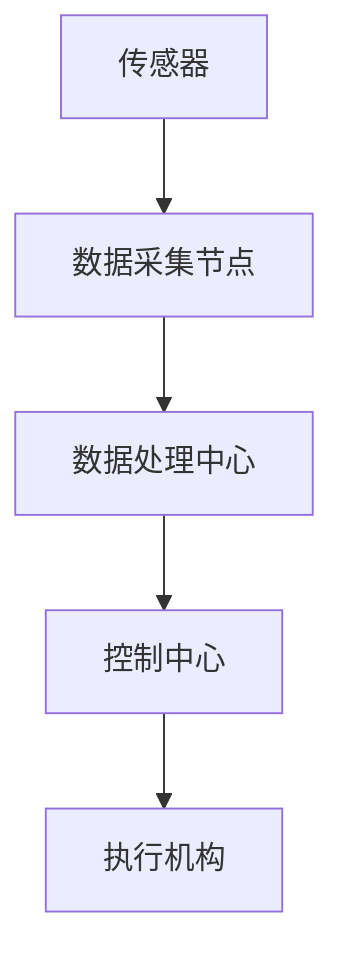
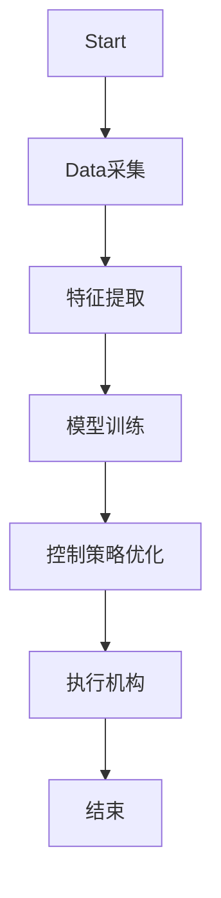

                 


```markdown
# 价值投资中的智能城市噪声污染控制系统分析

> 关键词：智能城市、噪声污染、价值投资、控制系统、算法原理

> 摘要：本文探讨了在智能城市背景下，噪声污染控制系统的价值投资分析。通过背景介绍、核心概念、算法原理、系统架构和项目实战等部分，系统性地分析了智能城市噪声污染控制系统的构建与优化，旨在为相关领域的投资者和技术开发者提供理论支持和实践指导。

---

# 第一部分: 价值投资中的智能城市噪声污染控制背景

## 第1章: 智慧城市建设与噪声污染治理

### 1.1 问题背景
- **城市化进程加速**：随着城市人口的增加，交通、工业和建筑活动导致噪声污染加剧。
- **噪声污染的健康影响**：长期暴露于高噪声环境中可能导致听力损失、睡眠障碍和心血管疾病。
- **价值投资的驱动**：通过投资智能控制系统，降低噪声污染，提升城市环境质量，具有显著的社会价值和投资回报潜力。

### 1.2 问题描述
- **城市噪声的主要来源**：交通噪声、工业噪声、建筑施工噪声和社会生活噪声。
- **现有治理措施的局限性**：传统被动隔音措施效果有限，缺乏智能化和动态调整能力。

### 1.3 系统目标与价值
- **系统目标**：实现城市噪声的实时监测、智能分析和主动控制。
- **投资价值**：通过降低噪声污染，提升居民生活质量，间接提升房地产价值，吸引人才流入，促进城市发展。

---

# 第二部分: 智能城市噪声污染控制系统的原理与设计

## 第2章: 核心概念与系统架构

### 2.1 核心概念
- **智能传感器**：用于实时采集环境噪声数据。
- **数据采集与处理**：通过多种传感器节点采集噪声数据，并进行预处理和特征提取。
- **智能分析与控制**：基于算法分析噪声特征，优化控制策略，实现主动降噪。

### 2.2 实体关系图


### 2.3 功能模块划分
- **传感器网络**：负责噪声数据的采集。
- **数据处理中心**：对噪声数据进行清洗、特征提取和分析。
- **控制中心**：根据分析结果，制定和执行降噪策略。
- **执行机构**：如隔音屏障、降噪设备等，用于实际降噪。

---

## 第3章: 算法原理与数学模型

### 3.1 数据特征提取
- **傅里叶变换**：用于分析噪声的频域特征。
$$ X(f) = \sum_{n=-\infty}^{\infty} x[n] e^{-j2\pi fn} $$

### 3.2 噪声预测与控制
- **机器学习模型**：如支持向量机（SVM）和神经网络，用于预测噪声水平和优化控制策略。
- **优化算法**：如遗传算法，用于寻找最优降噪方案。

### 3.3 控制算法流程


### 3.4 数学模型
- **噪声传播模型**：考虑声波在不同介质中的传播特性。
$$ y = A \sin(2\pi f t + \phi) $$
- **降噪目标函数**：定义降噪系统的优化目标。
$$ J = \sum_{i=1}^{n} (x_i - x_{i}^*)^2 $$

---

## 第4章: 系统分析与架构设计

### 4.1 功能设计
- **实时监测**：传感器网络实时采集噪声数据。
- **智能分析**：数据处理中心进行分析和预测。
- **主动控制**：控制中心制定和执行降噪策略。

### 4.2 系统架构图


### 4.3 接口设计
- **数据接口**：传感器与数据采集节点之间的通信接口。
- **控制接口**：控制中心与执行机构之间的控制接口。

---

## 第5章: 项目实战与案例分析

### 5.1 环境安装与数据采集
- **传感器安装**：在试点区域安装噪声传感器，采集实时数据。
- **数据存储**：使用数据库存储噪声数据，便于后续分析。

### 5.2 核心实现
- **数据处理**：编写Python脚本，实现数据清洗和特征提取。
```python
import numpy as np
from scipy.fft import fft

data = np.array([采集到的噪声数据])
 fft_result = fft(data)
```

### 5.3 案例分析
- **案例场景**：某试点区域的噪声监测与控制。
- **数据分析**：通过机器学习模型预测噪声水平，优化降噪策略。
- **结果展示**：展示降噪后的效果，验证系统的有效性。

---

## 第6章: 最佳实践与注意事项

### 6.1 最佳实践
- **数据质量管理**：确保数据的准确性和完整性。
- **系统维护**：定期检查传感器和执行机构，确保系统稳定运行。
- **模型优化**：根据实际数据反馈，持续优化预测模型和控制策略。

### 6.2 注意事项
- **数据隐私**：注意保护采集的噪声数据，避免泄露用户隐私。
- **系统兼容性**：确保系统与现有城市基础设施的兼容性。
- **成本控制**：在保证系统性能的前提下，合理控制建设和维护成本。

---

## 作者简介

作者：AI天才研究院/AI Genius Institute & 禅与计算机程序设计艺术 /Zen And The Art of Computer Programming

---

通过以上内容，我们系统性地分析了智能城市噪声污染控制系统的构建与优化，探讨了其在价值投资中的潜力和应用。希望本文能为相关领域的投资者和技术开发者提供有价值的参考和启发。
```

