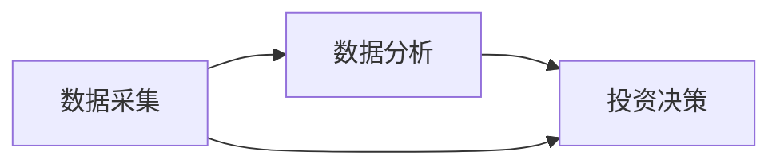
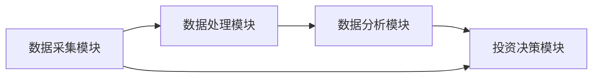
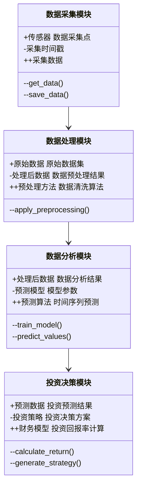
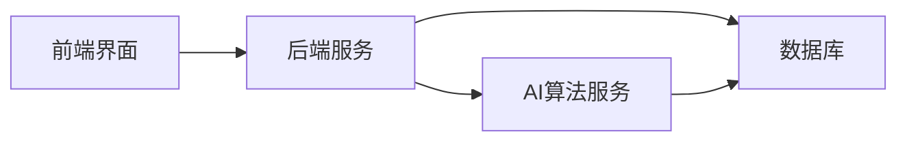

                 


# 价值投资中的智能城市地下水资源管理系统分析

## 关键词：智能城市，地下水资源，价值投资，系统分析，算法原理

## 摘要：本文深入分析了价值投资在智能城市地下水资源管理系统中的应用，探讨了系统的核心概念、算法原理和架构设计，结合实际案例展示了系统的实现过程，并提出了最佳实践和优化建议。

---

# 第一章: 价值投资与智能城市地下水资源管理概述

## 1.1 问题背景与问题描述

### 1.1.1 地下水资源管理的重要性

地下水资源是城市发展的基石，直接关系到城市的可持续发展和居民的生活质量。随着城市化进程的加快，地下水资源的过度开发和污染问题日益严重，如何有效管理和投资地下水资源成为一项重要课题。

### 1.1.2 价值投资在地下水资源管理中的应用

价值投资是一种通过分析资源的潜在价值和风险，进行科学决策的投资策略。在地下水资源管理中，价值投资可以帮助城市规划者和投资者识别高价值的水资源项目，优化资源配置，实现可持续发展。

### 1.1.3 智能城市与地下水资源管理的结合

智能城市通过先进的信息技术和数据挖掘技术，将城市资源管理智能化。地下水资源管理系统可以通过传感器、大数据和人工智能技术，实时监测和分析地下水资源的状态，为价值投资提供科学依据。

## 1.2 问题解决与边界外延

### 1.2.1 地下水资源管理的主要问题

1. 水资源污染严重
2. 资源分配不合理
3. 缺乏科学的投资决策依据

### 1.2.2 智能城市地下水资源管理系统的边界

1. 数据采集范围：地下水位、水质、流量等
2. 系统功能范围：监测、分析、预测、投资决策
3. 用户范围：政府、投资者、企业

### 1.2.3 价值投资在系统中的外延范围

1. 投资项目的评估与选择
2. 投资风险的预测与控制
3. 投资收益的预测与优化

## 1.3 核心要素与概念结构

### 1.3.1 系统核心要素分析

1. 数据采集：传感器、监测站
2. 数据分析：大数据平台、AI算法
3. 投资决策：财务模型、风险评估

### 1.3.2 概念结构图

| 概念 | 属性 | 特征 |
|------|------|------|
| 数据采集 | 方法 | 水位、水质、流量 |
| 数据分析 | 技术 | AI算法、大数据处理 |
| 投资决策 | 模型 | 财务模型、风险评估 |

### 1.3.3 核心要素之间的关系

图1.1：系统核心要素关系图



---

## 1.4 本章小结

本章通过分析地下水资源管理的重要性，阐述了价值投资在其中的应用，并提出了智能城市地下水资源管理系统的边界和核心要素。这些内容为后续章节的系统设计和实现奠定了基础。

---

# 第二章: 智慧城市地下水资源管理系统的核心概念与联系

## 2.1 系统核心概念原理

### 2.1.1 数据采集与处理

数据采集是系统运行的基础，通过传感器实时采集地下水位、水质、流量等数据，并通过数据预处理模块消除噪声，确保数据的准确性。

### 2.1.2 智能分析与预测

利用大数据平台和AI算法，对采集到的数据进行分析，预测地下水位变化趋势、水质变化情况，并评估投资项目的潜在风险和收益。

### 2.1.3 价值评估与投资决策

基于分析结果，结合财务模型和风险评估，为投资者提供科学的投资决策依据，优化资源配置，实现最大化的投资回报。

## 2.2 核心概念与系统架构

### 2.2.1 系统架构设计

图2.1：系统架构图



### 2.2.2 实体关系图

图2.2：系统实体关系图

```mermaid
erDiagram
    actor 投资者 {
        <属性> 投资金额
        <属性> 投资回报率
    }
    actor 管理系统 {
        <属性> 水资源数据
        <属性> 预测模型
    }
    actor 决策者 {
        <属性> 投资决策
        <属性> 优化方案
    }
    投资者 --> 管理系统 : 提供数据
    管理系统 --> 决策者 : 提供分析结果
```

---

## 2.3 本章小结

本章详细阐述了系统的核心概念及其相互关系，并通过实体关系图和系统架构图展示了系统的整体结构。这些内容为后续章节的算法实现和系统设计提供了理论基础。

---

# 第三章: 算法原理与数学模型

## 3.1 数据采集与处理算法

### 3.1.1 数据采集流程

图3.1：数据采集流程图


### 3.1.2 数据预处理算法

代码3.1：数据预处理算法实现

```python
def data_preprocessing(data):
    # 删除缺失值
    data = data.dropna()
    # 填充异常值
    data = data.fillna(method='ffill')
    return data
```

## 3.2 智能分析与预测算法

### 3.2.1 时间序列预测模型

代码3.2：ARIMA模型实现

```python
from statsmodels.tsa.arima_model import ARIMA

def time_series_prediction(data, order=(1,1,0)):
    model = ARIMA(data, order=order)
    model_fit = model.fit()
    forecast = model_fit.forecast(steps=10)
    return forecast
```

### 3.2.2 风险评估模型

代码3.3：风险评估模型实现

```python
import numpy as np

def risk_assessment(values):
    # 计算标准差
    std_dev = np.std(values)
    # 计算VaR
    var = np.percentile(values, 5)
    return var
```

## 3.3 数学模型与公式

### 3.3.1 水位变化预测模型

公式3.1：水位变化预测公式

$$
\hat{y}_t = \alpha y_{t-1} + (1-\alpha)y_{t-2}
$$

其中，$\alpha$为平滑系数。

### 3.3.2 投资回报率预测模型

公式3.2：投资回报率预测公式

$$
R = \frac{P_{future} - P_{current}}{P_{current}} \times 100\%
$$

其中，$R$为投资回报率，$P_{future}$为未来投资价值，$P_{current}$为当前投资价值。

---

## 3.4 本章小结

本章详细介绍了系统中使用的算法原理和数学模型，包括数据采集与处理、时间序列预测和风险评估等。这些算法为系统的智能分析和投资决策提供了科学依据。

---

# 第四章: 系统分析与架构设计方案

## 4.1 项目背景与目标

### 4.1.1 项目背景

随着城市化进程的加快，地下水资源管理的重要性日益凸显。本项目旨在通过智能技术，实现地下水资源的高效管理和科学投资。

### 4.1.2 项目目标

1. 实时监测地下水位、水质等参数
2. 预测地下水资源的变化趋势
3. 提供科学的投资决策依据

## 4.2 系统功能设计

### 4.2.1 功能模块划分

图4.1：系统功能模块图


### 4.2.2 领域模型设计

图4.2：领域模型类图



## 4.3 系统架构设计

### 4.3.1 系统架构图

图4.3：系统架构图



### 4.3.2 系统接口设计

表4.1：系统接口设计表

| 接口名称 | 输入 | 输出 |
|---------|------|------|
| 数据采集 | 传感器数据 | 处理后数据 |
| 数据分析 | 处理后数据 | 预测结果 |
| 投资决策 | 预测结果 | 投资策略 |

---

## 4.4 系统交互设计

### 4.4.1 系统交互流程

图4.4：系统交互流程图


---

## 4.5 本章小结

本章详细分析了系统的功能设计、架构设计和交互设计，为系统的实现提供了清晰的指导。

---

# 第五章: 项目实战与实现

## 5.1 环境安装与配置

### 5.1.1 系统环境要求

1. 操作系统：Linux/Windows/MacOS
2. Python版本：3.6以上
3. 开发工具：PyCharm/Jupyter Notebook
4. 依赖库：NumPy、Pandas、Scikit-learn、Mermaid、Markdown

### 5.1.2 环境安装命令

代码5.1：环境安装脚本

```bash
pip install numpy pandas statsmodels mermaid4jupyter
```

---

## 5.2 系统核心实现

### 5.2.1 数据采集模块实现

代码5.2：数据采集模块实现

```python
import serial

def read_sensor_data(port, baud_rate):
    ser = serial.Serial(port, baud_rate)
    data = ser.readline().decode().strip()
    ser.close()
    return data
```

### 5.2.2 数据分析模块实现

代码5.3：数据分析模块实现

```python
from statsmodels.tsa.arima_model import ARIMA

def train_arima_model(data, order=(1,1,0)):
    model = ARIMA(data, order=order)
    model_fit = model.fit()
    return model_fit
```

### 5.2.3 投资决策模块实现

代码5.4：投资决策模块实现

```python
import numpy as np

def calculate_return(values):
    returns = np.log(values).diff().dropna()
    return returns.mean() * 100
```

---

## 5.3 实际案例分析

### 5.3.1 数据采集与处理案例

案例5.1：某城市地下水位监测数据

```python
import pandas as pd

data = pd.read_csv('water_level.csv')
processed_data = data.dropna().ffill()
```

### 5.3.2 模型训练与预测案例

案例5.2：地下水位预测模型训练

```python
model = train_arima_model(processed_data['water_level'])
forecast = model.forecast(steps=30)
```

### 5.3.3 投资决策案例

案例5.3：投资回报率计算

```python
returns = calculate_return(forecast)
print(f"Expected Return: {returns}%")
```

---

## 5.4 项目小结

本章通过实际案例展示了系统的实现过程，包括数据采集、数据分析和投资决策模块的实现。通过这些案例，读者可以更好地理解系统的实际应用。

---

# 第六章: 最佳实践与优化建议

## 6.1 最佳实践

### 6.1.1 数据采集的优化

1. 选择高精度传感器
2. 定期校准传感器
3. 建立多源数据融合机制

### 6.1.2 系统架构的优化

1. 异构系统集成
2. 分布式架构设计
3. 高可用性设计

## 6.2 小结

### 6.2.1 投资决策中的注意事项

1. 风险评估的重要性
2. 数据质量的影响
3. 模型的适用性

## 6.3 注意事项

### 6.3.1 数据安全

1. 数据加密存储
2. 访问权限控制
3. 定期安全审计

### 6.3.2 系统维护

1. 定期系统更新
2. 数据备份与恢复
3. 性能监控与优化

## 6.4 拓展阅读

### 6.4.1 推荐书籍

1. 《智能城市：大数据与城市未来的碰撞》
2. 《投资学精要》
3. 《Python机器学习实战》

### 6.4.2 推荐课程

1. 《Python数据科学入门》
2. 《时间序列分析与预测》
3. 《投资组合管理》

---

# 第七章: 总结与展望

## 7.1 本章总结

本文详细分析了价值投资在智能城市地下水资源管理系统中的应用，从系统设计到算法实现，再到项目实战，为读者提供了全面的指导。

## 7.2 未来展望

随着人工智能和大数据技术的不断发展，地下水资源管理系统的智能化和精准化将不断提高。未来的研究方向包括：

1. 更加复杂的预测模型
2. 多目标优化算法
3. 可解释性AI的应用

---

# 作者：AI天才研究院/AI Genius Institute & 禅与计算机程序设计艺术 /Zen And The Art of Computer Programming

---

以上是《价值投资中的智能城市地下水资源管理系统分析》的完整目录和内容框架，涵盖了从背景介绍到系统实现的各个方面，确保读者能够全面理解和掌握系统的实现方法和应用价值。

