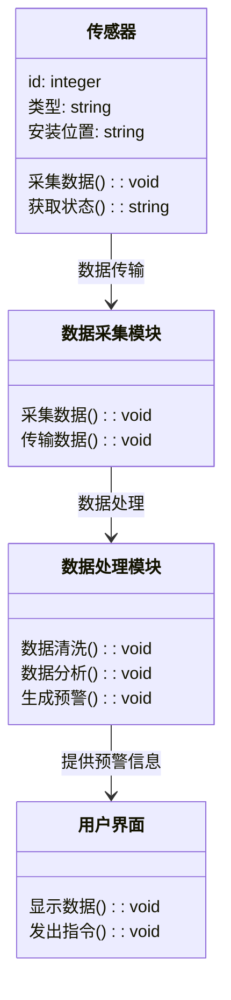
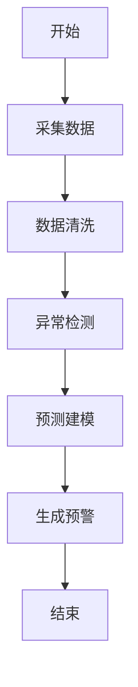
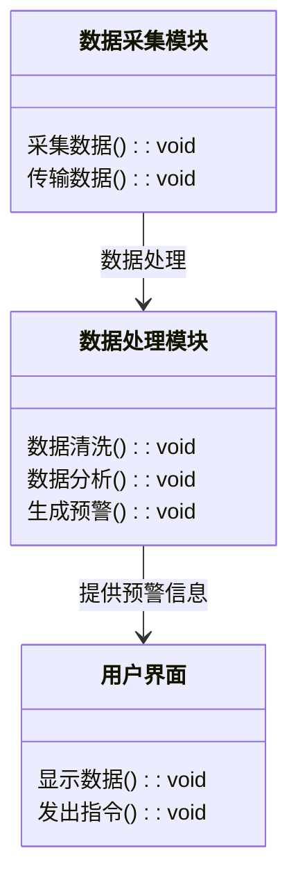
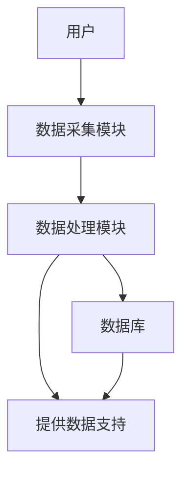
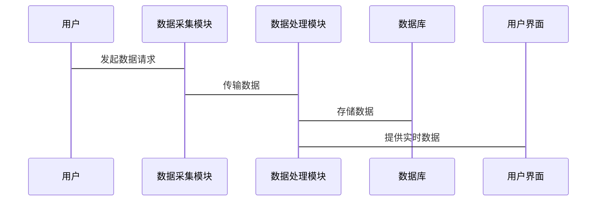

                 


# 价值投资中的智能城市地下管网监测系统分析

## 关键词：智能城市，地下管网监测，价值投资，系统架构，算法原理

## 摘要：  
智能城市地下管网监测系统是智慧城市建设的重要组成部分，通过对地下管网的实时监测和数据分析，可以有效降低管网维护成本，提高城市运行效率，为城市价值提升提供数据支持。本文从背景、核心概念、算法原理、系统架构到实际应用，全面分析智能城市地下管网监测系统的价值和实现路径。

---

# 第一部分：智能城市地下管网监测系统背景与价值分析

## 第1章：问题背景与描述

### 1.1 当前城市地下管网的主要问题  
城市地下管网是城市运行的“生命线”，包括供水、供电、供气、通信等基础设施。然而，随着城市化进程的加快，地下管网面临以下问题：  
1. **老化严重**：部分管网建设时间久远，材料老化，容易发生泄漏或断裂。  
2. **维护困难**：地下管网分布复杂，传统人工巡检效率低，且难以覆盖所有区域。  
3. **数据孤岛**：不同部门管理的管网数据分散，缺乏统一的监测平台。  
4. **安全隐患**：管网故障可能导致道路坍塌、爆炸等重大事故。  

### 1.2 管网监测的必要性与价值  
智能城市地下管网监测系统通过实时采集、传输和分析管网数据，可以实现以下价值：  
1. **预防性维护**：通过传感器实时监测管网状态，及时发现潜在问题，避免事故的发生。  
2. **降低维护成本**：通过数据驱动的决策，优化维护计划，减少不必要的维护支出。  
3. **提升城市价值**：管网的高效管理可以减少停水、停电等突发事件，提升城市运行效率和居民生活质量。  

### 1.3 问题解决的边界与外延  
智能城市地下管网监测系统的边界包括传感器、数据采集模块、数据处理模块和用户界面。外延则涉及与城市管理系统（如交通、能源管理）的集成。  

### 1.4 核心概念与组成  
智能城市地下管网监测系统由以下核心部分组成：  
1. **传感器**：部署在管网关键位置，实时采集压力、流量、温度等数据。  
2. **数据采集模块**：负责将传感器数据传输到云端或本地存储。  
3. **数据处理模块**：对数据进行清洗、分析和建模，提供实时监控和预警功能。  
4. **用户界面**：供管理人员查看数据和操作系统。  

---

## 第2章：核心概念与联系

### 2.1 实体关系图  
```mermaid
er
    entity 管网数据 {
        id
        数据类型
        数据来源
        时间戳
    }
    entity 传感器 {
        id
        类型
        安装位置
        状态
    }
    entity 监测系统 {
        id
        功能模块
        接口
        用户
    }
    管网数据 --> 传感器: 数据采集自
    管网数据 --> 监测系统: 数据传输至
    监测系统 --> 用户: 提供数据可视化和预警
```

### 2.2 领域模型类图  


---

## 第3章：算法原理与实现

### 3.1 数据采集与传输  
传感器通过有线或无线方式采集数据，并通过网络传输到数据处理模块。  

### 3.2 数据处理算法  
数据处理模块的核心算法包括：  
1. **数据清洗**：去除噪声数据，填补缺失值。  
2. **异常检测**：使用统计方法或机器学习算法（如Isolation Forest）识别异常数据点。  
3. **预测模型**：基于历史数据，建立时间序列模型（如ARIMA）预测未来管网状态。  

### 3.3 算法流程图  


### 3.4 代码实现  
以下是一个简单的异常检测算法示例：  

```python
import numpy as np
from sklearn.ensemble import IsolationForest

# 示例数据
data = np.array([1, 2, 3, 4, 5, 6, 7, 8, 9, 10, 100, 11, 12, 13, 14, 15])

# 训练模型
model = IsolationForest(contamination=0.05)
model.fit(data.reshape(-1, 1))

# 预测异常点
outliers = model.predict(data.reshape(-1, 1))
print(outliers)
```

### 3.5 数学模型与公式  
异常检测模型的数学公式：  
$$ y_i = \hat{y}_i + \epsilon $$
其中，$\hat{y}_i$是预测值，$\epsilon$是误差项，用于检测异常。  

---

## 第4章：系统分析与架构设计

### 4.1 项目背景与目标  
本项目旨在通过智能监测系统，实现城市地下管网的实时监控和预防性维护，降低运营成本，提高城市安全性。  

### 4.2 系统功能设计  


### 4.3 系统架构设计  


### 4.4 系统接口与交互  


---

## 第5章：项目实战与案例分析

### 5.1 环境安装  
1. 安装Python、Jupyter Notebook、Pandas、NumPy等工具。  
2. 部署传感器和数据采集模块。  

### 5.2 核心代码实现  

```python
import pandas as pd
import numpy as np
import matplotlib.pyplot as plt

# 数据采集与处理
data = pd.read_csv('管网数据.csv')
data['时间戳'] = pd.to_datetime(data['时间戳'])
data.set_index('时间戳', inplace=True)

# 数据可视化
data['压力'].plot()
plt.title('管网压力变化趋势')
plt.xlabel('时间')
plt.ylabel('压力值')
plt.show()
```

### 5.3 实际案例分析  
以某城市供水管网为例，通过系统监测发现某区域压力异常，及时进行抢修，避免了可能的管道破裂事故。  

---

## 第6章：最佳实践与注意事项

### 6.1 小结  
智能城市地下管网监测系统通过实时数据采集、分析和预警，为城市管网的维护和价值提升提供了有力支持。  

### 6.2 注意事项  
1. 数据隐私与安全：确保管网数据不被滥用。  
2. 系统稳定性：选择可靠的传感器和网络设备。  
3. 模型优化：根据实际情况调整预测模型参数。  

### 6.3 未来展望  
随着人工智能和物联网技术的进一步发展，未来的智能城市地下管网监测系统将更加智能化和自动化，实现自主决策和自我修复。  

---

## 作者：AI天才研究院 & 禅与计算机程序设计艺术

---

希望这篇文章能够为读者提供清晰的思路和实用的技术分析，帮助理解智能城市地下管网监测系统的价值与实现路径。

