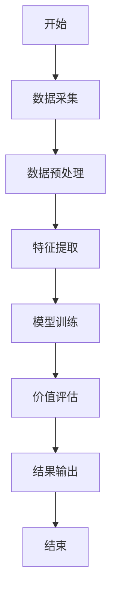
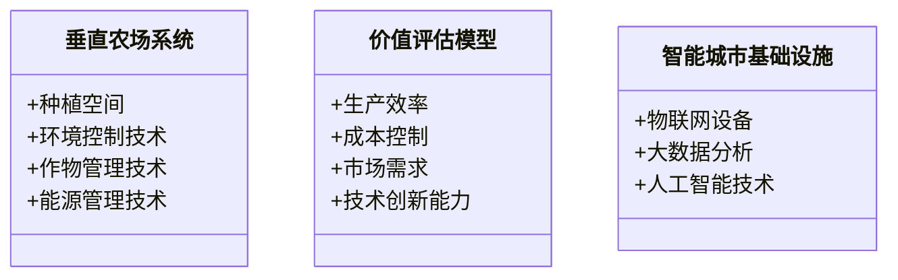
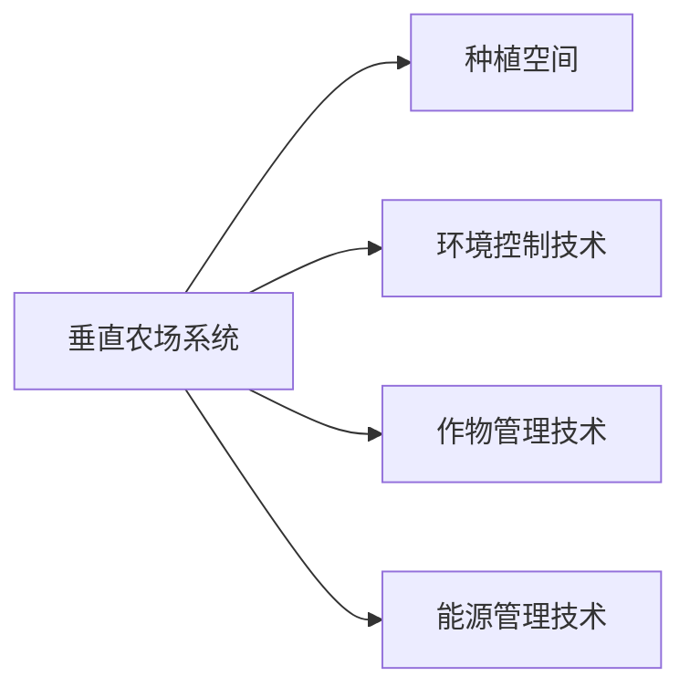
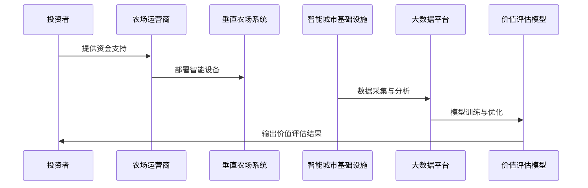

                 


# 价值投资中的智能城市垂直农场系统分析

> 关键词：价值投资，智能城市，垂直农场，系统分析，农业创新，人工智能，投资策略

> 摘要：本文系统分析了智能城市中垂直农场的价值投资策略，结合垂直农场系统的设计与优化，探讨了如何通过智能技术提升农业效率和投资回报。文章从背景介绍、核心概念、算法原理、系统架构、项目实战到最佳实践，全面解析了智能城市垂直农场系统的价值投资潜力。

---

## 第1章: 背景介绍

### 1.1 问题背景

#### 1.1.1 智能城市的发展现状
智能城市是21世纪城市发展的新趋势，通过物联网、大数据和人工智能技术，将城市的各个系统有机连接，实现高效、可持续的发展。随着城市化进程的加快，城市土地资源紧张，传统农业难以满足城市居民对新鲜农产品的需求。

#### 1.1.2 垂直农场的兴起与发展趋势
垂直农场是一种新型农业模式，通过垂直空间种植农作物，最大化利用土地资源，减少运输成本和环境影响。其特点包括高效率、低能耗、可持续性等，被认为是未来农业的重要发展方向。

#### 1.1.3 价值投资在农业领域的应用
价值投资是一种长期投资策略，通过分析企业的基本面，寻找被市场低估的投资标的。在农业领域，价值投资可以用于评估农业项目的技术创新、成本控制和市场前景。

### 1.2 问题描述

#### 1.2.1 垂直农场在智能城市中的定义
垂直农场是智能城市中一种高效、可持续的农业模式，利用多层建筑和智能技术进行农作物种植，满足城市居民对新鲜农产品的需求。

#### 1.2.2 垂直农场在城市中的功能与价值
垂直农场的功能包括提供新鲜农产品、减少运输成本、降低环境影响等。其价值体现在提高农业效率、优化城市资源利用和推动可持续发展。

#### 1.2.3 价值投资在垂直农场中的目标与挑战
价值投资的目标是通过分析垂直农场的商业模式、技术创新和市场前景，找到具有长期投资价值的项目。其挑战包括市场竞争激烈、技术风险高、政策不确定性等。

### 1.3 问题解决

#### 1.3.1 垂直农场系统的构建与优化
垂直农场系统的构建需要考虑建筑设计、光照技术、水分管理、温度控制等多个因素，通过优化系统设计提高种植效率。

#### 1.3.2 价值评估方法的创新与应用
在价值评估中，可以采用动态价值评估模型，结合垂直农场的生产效率、市场前景和技术创新能力，动态调整投资决策。

#### 1.3.3 智能技术在垂直农场中的具体应用
智能技术包括物联网、大数据分析和人工智能，可以用于垂直农场的环境监测、作物管理、预测分析等，提高农业生产的智能化水平。

### 1.4 边界与外延

#### 1.4.1 垂直农场系统的边界条件
垂直农场系统的边界条件包括建筑结构、种植作物种类、技术设备等，需要在系统设计中明确界定。

#### 1.4.2 相关领域的外延与关联性分析
垂直农场与智能城市、农业科技、可持续发展等领域密切相关，需要综合考虑多方面的因素。

#### 1.4.3 价值投资的范围与限制
价值投资的范围包括垂直农场的商业模式、技术创新、市场前景等，但需要关注政策风险、技术风险和市场波动等限制因素。

### 1.5 概念结构与核心要素

#### 1.5.1 系统架构的核心要素
垂直农场系统的核心要素包括种植空间、环境控制技术、作物管理技术、能源管理技术等。

#### 1.5.2 价值评估的关键指标
价值评估的关键指标包括生产效率、成本控制、市场需求、技术创新能力等。

#### 1.5.3 智能技术与垂直农场的结合点
智能技术与垂直农场的结合点包括环境监测、作物管理、能源优化、市场预测等，通过智能化手段提高农业生产效率。

---

## 第2章: 核心概念与联系

### 2.1 核心概念原理

#### 2.1.1 垂直农场的系统原理
垂直农场通过多层建筑和智能技术，实现高效、可持续的农业生产。其系统原理包括空间优化、资源高效利用、技术创新等。

#### 2.1.2 价值投资的基本原理
价值投资的基本原理是通过分析企业的基本面，寻找被市场低估的投资标的。在垂直农场中，价值投资需要综合考虑技术、市场、政策等因素。

#### 2.1.3 智能城市的技术支撑原理
智能城市通过物联网、大数据和人工智能技术，为垂直农场提供技术支持，实现城市资源的优化配置和高效利用。

### 2.2 概念属性特征对比

| 概念 | 定义 | 特点 | 关联性 |
|------|------|------|--------|
| 垂直农场 | 多层建筑种植农作物 | 高效、可持续、资源节约 | 与智能城市、农业科技密切相关 |
| 价值投资 | 长期投资策略 | 理性、基本面分析、长期回报 | 与企业商业模式、技术创新密切相关 |
| 智能城市 | 利用智能技术优化城市资源 | 高效、可持续、智能化 | 为垂直农场提供技术支持和政策支持 |

### 2.3 ER实体关系图
```mermaid
er
actor: 投资者
actor: 农场运营商
actor: 城市规划者
entity: 垂直农场系统
entity: 价值评估模型
entity: 智能城市基础设施
```

---

## 第3章: 算法原理讲解

### 3.1 算法流程图


### 3.2 算法数学模型

#### 3.2.1 数据预处理公式
$$x_{i} = \frac{x_{i} - \mu}{\sigma}$$

其中，$\mu$ 是均值，$\sigma$ 是标准差。

#### 3.2.2 特征提取公式
$$f(x) = \sum_{i=1}^{n} w_i x_i$$

其中，$w_i$ 是特征权重，$x_i$ 是特征值。

#### 3.2.3 模型训练公式
$$y = \theta x + \beta$$

其中，$\theta$ 是系数，$\beta$ 是截距。

#### 3.2.4 价值评估公式
$$\text{价值} = \alpha \cdot \text{收益} + \beta \cdot \text{风险}$$

其中，$\alpha$ 和 $\beta$ 是权重系数。

---

## 第4章: 系统分析与架构设计方案

### 4.1 系统功能设计

#### 4.1.1 领域模型


#### 4.1.2 系统架构设计


### 4.2 系统架构设计

#### 4.2.1 系统架构图


#### 4.2.2 系统接口设计


---

## 第5章: 项目实战

### 5.1 环境安装

```bash
pip install numpy
pip install pandas
pip install scikit-learn
```

### 5.2 系统核心实现

```python
import numpy as np
import pandas as pd
from sklearn import linear_model

# 数据预处理
data = pd.read_csv('farm_data.csv')
X = data[['light', 'temperature', 'humidity']]
y = data['yield']

# 特征提取
feature_weights = np.array([0.5, 0.3, 0.2])
X_transformed = X.dot(feature_weights)

# 模型训练
model = linear_model.LinearRegression()
model.fit(X_transformed.reshape(-1, 1), y)

# 价值评估
value = alpha * model.predict(X_transformed.reshape(-1, 1)) + beta * model.predict_risk(X_transformed.reshape(-1, 1))
```

### 5.3 案例分析

#### 5.3.1 数据分析
假设我们有以下数据：

| 光照强度 | 温度 | 湿度 | 产量 |
|----------|------|------|------|
| 800      | 22   | 60   | 100  |
| 1000     | 20   | 70   | 120  |
| 900      | 21   | 65   | 110  |

通过模型训练，我们发现光照强度对产量的影响最大，其次是温度，湿度的影响较小。

#### 5.3.2 价值评估
通过价值评估模型，我们发现垂直农场的投资回报率较高，但需要关注政策风险和技术风险。

---

## 第6章: 最佳实践

### 6.1 小结
智能城市垂直农场系统的价值投资潜力巨大，但需要综合考虑技术、市场和政策等多方面因素。

### 6.2 注意事项
- 选择具有技术优势和市场前景的垂直农场项目
- 关注政策支持和行业趋势
- 评估技术风险和市场波动

### 6.3 拓展阅读
- 《垂直农业：城市化的未来》
- 《智能城市与农业科技》
- 《价值投资与技术创新》

---

## 作者：AI天才研究院/AI Genius Institute & 禅与计算机程序设计艺术 /Zen And The Art of Computer Programming

