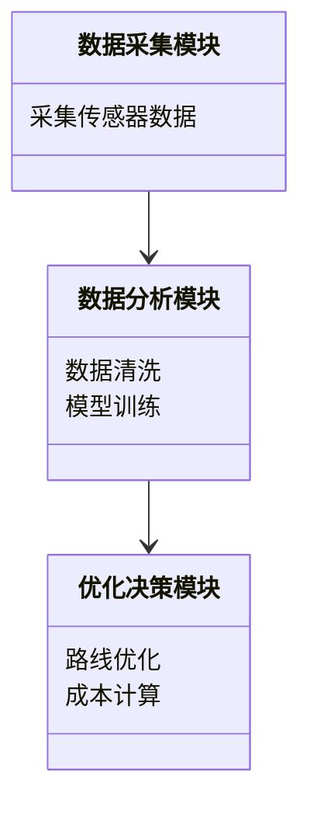
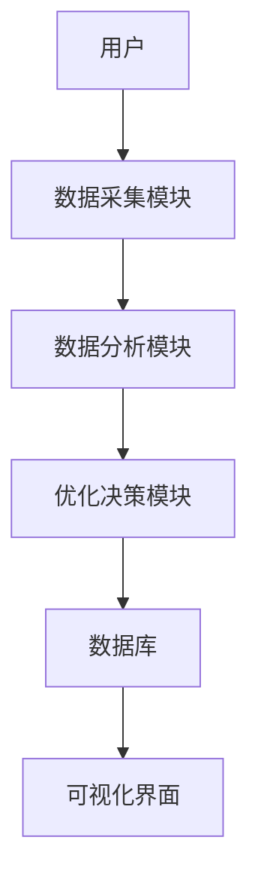

                 


# 价值投资中的智能城市废物管理系统分析

> 关键词：智能城市，废物管理，价值投资，数据分析，算法优化，系统架构

> 摘要：本文分析了智能城市废物管理系统在价值投资中的应用，探讨了系统的组成部分、算法原理、系统架构设计、项目实战以及最佳实践。通过结合价值投资的分析框架，本文详细阐述了如何利用智能废物管理系统优化投资决策。

---

## 第1章：价值投资与智能城市废物管理系统的背景

### 1.1 价值投资的基本概念

#### 1.1.1 价值投资的定义与核心理念
价值投资是一种以基本面分析为核心的长期投资策略，强调以低于内在价值的价格买入优质资产。其核心理念包括：
- 识别具有长期竞争优势的企业。
- 关注企业的财务健康状况和盈利能力。
- 耐心持有，避免短期市场波动的干扰。

#### 1.1.2 价值投资在现代经济中的应用
价值投资广泛应用于股票、房地产、基础设施等领域。在智慧城市背景下，废物管理系统的智能化改造为价值投资者提供了新的投资机会，尤其是在环保产业和智慧城市领域。

#### 1.1.3 智慧城市建设的背景与目标
智慧城市建设旨在通过技术创新提升城市运营效率，改善居民生活质量。废物管理作为城市管理的重要组成部分，其智能化改造是智慧城市建设的重要环节。

### 1.2 智能城市废物管理系统的定义与特点

#### 1.2.1 智能城市废物管理系统的定义
智能城市废物管理系统是一种利用物联网、大数据和人工智能技术，对城市废物的产生、运输和处理进行智能化管理的系统。其目标是提高废物管理效率，降低成本，减少环境影响。

#### 1.2.2 系统的核心功能与优势
- **数据采集**：通过传感器和物联网设备实时采集废物产生量、运输路线、处理设备状态等数据。
- **数据分析**：利用大数据技术对采集的数据进行分析，预测废物产生趋势，优化运输和处理计划。
- **智能调度**：通过算法优化垃圾车的运输路线，提高运输效率，降低运营成本。
- **决策支持**：为城市管理者提供优化建议，帮助制定更科学的废物管理政策。

#### 1.2.3 智能废物管理系统的社会与经济价值
- **社会价值**：改善城市环境，提升居民生活质量。
- **经济价值**：降低运营成本，提高资源利用效率，创造新的经济增长点。

### 1.3 价值投资与智能废物管理系统的结合

#### 1.3.1 价值投资在废物管理领域的潜力
随着环保政策的加强和智能技术的普及，废物管理行业将迎来新一轮发展机遇。投资者可以通过分析废物管理企业的技术创新能力、市场占有率和财务状况，寻找具有投资价值的企业。

#### 1.3.2 智能废物管理系统对投资决策的影响
智能废物管理系统能够提高废物管理企业的运营效率，降低成本，增强企业的盈利能力。投资者可以通过分析企业的技术优势和市场前景，评估其投资价值。

#### 1.3.3 未来发展趋势与投资机会
随着智慧城市建设的推进，智能废物管理系统将得到更广泛应用。投资者可以关注相关技术服务商、设备制造商和运营企业的投资机会。

---

## 第2章：智能城市废物管理系统的组成部分与核心要素

### 2.1 数据采集与处理模块

#### 2.1.1 数据采集技术与设备
智能废物管理系统通过部署在垃圾桶、垃圾车和处理厂的传感器，实时采集废物量、地理位置和设备状态等数据。

#### 2.1.2 数据清洗与预处理方法
- **数据清洗**：去除异常值和重复数据。
- **数据标准化**：统一数据格式，方便后续分析。

#### 2.1.3 数据存储与管理方案
采用分布式数据库（如MongoDB）和大数据平台（如Hadoop）存储和管理海量数据。

### 2.2 数据分析与预测模型

#### 2.2.1 数据分析方法与工具
- **数据分析方法**：统计分析、机器学习、时间序列分析。
- **工具**：Python（Pandas、NumPy）、R、TensorFlow、Scikit-learn。

#### 2.2.2 废物管理需求预测模型
通过历史数据训练机器学习模型，预测未来废物产生量和处理需求。

#### 2.2.3 模型优化与评估指标
- **模型优化**：使用交叉验证和超参数调优提高模型性能。
- **评估指标**：均方误差（MSE）、R²值、准确率。

### 2.3 优化与决策支持系统

#### 2.3.1 废物管理优化算法
- **算法选择**：遗传算法、模拟退火、蚁群算法。
- **数学模型**：建立目标函数和约束条件，优化垃圾车路线和处理厂布局。

#### 2.3.2 决策支持系统的功能设计
- **可视化界面**：展示实时数据和优化结果。
- **决策建议**：提供最优运输路线和处理方案。

#### 2.3.3 系统的可扩展性与灵活性
系统设计应具备模块化结构，支持未来功能扩展和新技术集成。

---

## 第3章：价值投资中的废物管理企业分析框架

### 3.1 背景介绍

#### 3.1.1 核心概念术语说明
- **价值投资**：基于基本面分析的投资策略。
- **智能废物管理系统**：利用先进技术优化废物管理的系统。

#### 3.1.2 问题背景
随着城市化进程加快，废物产生量急剧增加，传统废物管理模式已难以应对。

#### 3.1.3 问题描述
- 废物处理成本高。
- 资源浪费严重。
- 环境污染问题突出。

#### 3.1.4 问题解决
通过智能化改造，提高废物管理效率，降低成本。

#### 3.1.5 系统的边界与外延
- **边界**：仅关注废物管理系统的内部运行。
- **外延**：与城市交通、能源管理等其他系统联动。

#### 3.1.6 概念结构与核心要素组成
- 核心要素：数据采集、分析、优化。
- 关键流程：数据采集→分析→优化→决策支持。

### 3.2 核心概念与联系

#### 3.2.1 核心概念原理
- 数据采集：获取实时数据。
- 数据分析：预测需求和优化方案。
- 优化决策：降低运营成本，提高效率。

#### 3.2.2 概念属性特征对比表格

| 概念       | 属性             | 特征                       |
|------------|------------------|---------------------------|
| 数据采集   | 技术             | 物联网传感器               |
| 数据分析   | 方法             | 机器学习、统计分析         |
| 优化决策   | 目标             | 最小化成本，最大化效率     |

#### 3.2.3 ER实体关系图架构

```mermaid
er
    entity 节点 {
        id
        name
    }
    entity 边 {
        id
        source
        target
    }
    relationship 关联关系 {
        节点 --> 边
    }
```

---

## 第4章：智能城市废物管理系统的算法原理

### 4.1 数据分析与预测模型

#### 4.1.1 机器学习算法选择
- **算法选择**：随机森林、支持向量机（SVM）。
- **数学模型**：随机森林的特征重要性分析。

#### 4.1.2 废物需求预测的数学模型

$$
y = a \cdot x + b \cdot z + \epsilon
$$

其中：
- $y$ 是预测的废物量。
- $x$ 和 $z$ 是影响废物量的因素。
- $\epsilon$ 是误差项。

#### 4.1.3 模型实现与优化

```python
import pandas as pd
from sklearn.ensemble import RandomForestRegressor

# 数据加载
data = pd.read_csv('waste_data.csv')

# 特征和目标变量
X = data[['feature1', 'feature2']]
y = data['target']

# 模型训练
model = RandomForestRegressor()
model.fit(X, y)

# 模型预测
预测值 = model.predict(X)
```

---

## 第5章：系统分析与架构设计方案

### 5.1 项目介绍

#### 5.1.1 项目背景
本项目旨在开发一个智能废物管理系统，优化城市废物管理效率。

### 5.2 系统功能设计

#### 5.2.1 领域模型类图



### 5.3 系统架构设计

#### 5.3.1 系统架构图



---

## 第6章：项目实战

### 6.1 环境安装

#### 6.1.1 Python环境配置
安装Python、Jupyter Notebook、Pandas、Scikit-learn。

### 6.2 系统核心实现

#### 6.2.1 数据采集模块实现

```python
import serial

# 连接传感器
ser = serial.Serial('COM3', 9600)
data = ser.readline().decode().strip()
print(data)
```

#### 6.2.2 数据分析模块实现

```python
import pandas as pd
from sklearn.linear_model import LinearRegression

# 数据加载
data = pd.read_csv('waste_data.csv')

# 模型训练
model = LinearRegression()
model.fit(data[['x']], data['y'])

# 模型预测
预测值 = model.predict(data[['x']])
```

---

## 第7章：优化与展望

### 7.1 系统优化方向

#### 7.1.1 技术优化
- 引入更先进的算法，如深度学习。
- 提高系统的实时性和响应速度。

#### 7.1.2 业务优化
- 扩展系统的功能，增加更多数据源。
- 优化决策支持模块，提供更精准的预测和建议。

### 7.2 总结

智能城市废物管理系统在价值投资中的应用前景广阔。通过技术创新和数据分析，投资者可以更好地识别具有投资价值的企业，推动行业的发展。

### 7.3 未来展望

随着人工智能和大数据技术的不断进步，智能废物管理系统将更加智能化、高效化，为投资者创造更多价值。

---

## 小结

本文详细分析了智能城市废物管理系统在价值投资中的应用，探讨了系统的组成部分、算法原理、系统架构设计、项目实战以及最佳实践。通过结合价值投资的分析框架，本文为投资者提供了新的视角和工具，帮助他们更好地识别投资机会，优化投资决策。

---

## 注意事项

- 本文中的代码示例仅供参考，实际应用中需根据具体需求进行调整。
- 数据分析部分需结合实际业务需求，确保模型的准确性和实用性。

---

## 拓展阅读

- 《智能城市与大数据分析》
- 《价值投资实战案例分析》
- 《机器学习在废物管理中的应用》

---

## 作者

作者：AI天才研究院/AI Genius Institute & 禅与计算机程序设计艺术 /Zen And The Art of Computer Programming

