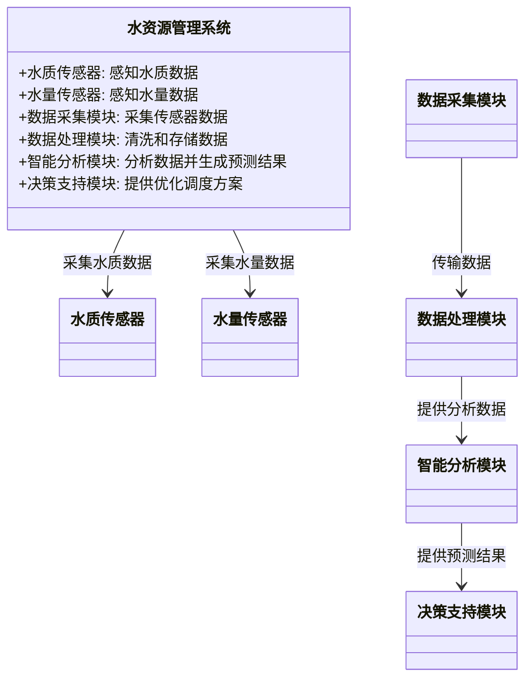
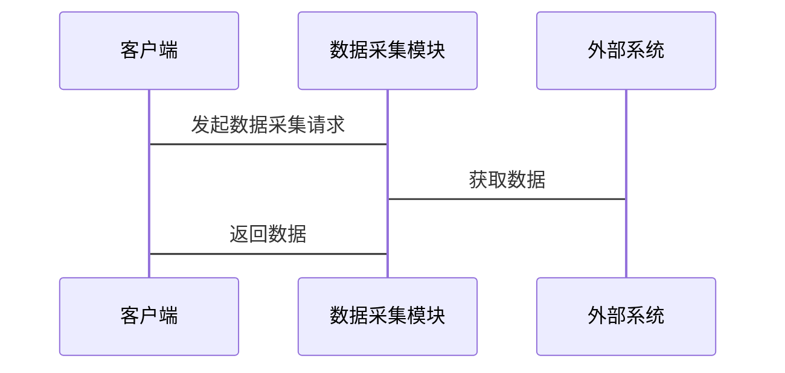

                 


# 价值投资中的智能城市水资源管理系统分析

> 关键词：智能城市，水资源管理，价值投资，数学模型，系统架构，算法原理

> 摘要：本文深入分析了智能城市水资源管理系统在价值投资中的应用潜力，从系统背景、核心概念、算法原理、系统架构、项目实战等多个维度进行详细阐述。文章结合理论与实践，通过数学模型、系统设计和实际案例分析，揭示了智慧水资源管理系统在优化水资源管理、提升投资回报率方面的巨大价值。本文旨在为投资者和相关技术从业者提供深入的技术洞察和实践指导。

---

## 第1章: 智慧城市水资源管理系统的背景与价值

### 1.1 智慧城市水资源管理系统的背景

#### 1.1.1 水资源管理的重要性
水资源是人类生存和发展的基础，是城市发展的重要支撑。随着城市化进程的加快，水资源短缺问题日益突出，如何高效管理水资源成为智慧城市建设中的关键问题。

#### 1.1.2 智慧城市发展的必然趋势
智慧城市建设是全球城市发展的趋势，通过智能化技术优化资源配置、提升城市运行效率。水资源管理作为智慧城市的重要组成部分，需要借助智能化技术实现高效管理。

#### 1.1.3 价值投资视角下的水资源管理
在价值投资中，水资源管理系统的优化不仅能够提高城市水资源利用效率，还能通过技术创新和模式创新带来经济效益。智慧水资源管理系统具有广阔的投资前景。

### 1.2 智慧城市水资源管理系统的定义与特点

#### 1.2.1 系统定义
智慧城市水资源管理系统是一种基于物联网、大数据和人工智能技术的智能化管理系统，用于实时监测、分析和优化城市水资源的分配与使用。

#### 1.2.2 系统的核心特点
- **实时监测**：通过传感器和物联网技术，实时采集水质、水量、水位等数据。
- **智能分析**：利用大数据分析和人工智能算法，对数据进行深度分析，预测水资源需求和潜在问题。
- **优化调度**：基于分析结果，优化水资源的分配和调度，提高水资源利用效率。
- **可视化与决策支持**：通过可视化界面，为决策者提供直观的决策支持。

#### 1.2.3 与传统水资源管理的区别
- **数据采集**：传统管理依赖人工监测，智慧系统通过物联网实现自动化采集。
- **数据分析**：传统管理基于经验判断，智慧系统利用大数据和AI进行精准分析。
- **调度优化**：传统管理效率低，智慧系统实现智能化调度。

### 1.3 价值投资与水资源管理的结合

#### 1.3.1 价值投资的基本概念
价值投资是一种长期投资策略，通过分析企业的基本面，寻找具有持续增长潜力和合理估值的企业进行投资。

#### 1.3.2 水资源管理领域的投资机会
智慧水资源管理系统是智慧城市的重要组成部分，随着技术的进步和政策的支持，该领域具有广阔的投资空间。

#### 1.3.3 智慧城市水资源管理系统的投资价值
- **技术创新**：智慧系统通过技术创新提升水资源管理效率，降低运营成本。
- **市场需求**：随着城市化加剧，水资源管理需求持续增长。
- **政策支持**：政府对智慧城市建设的政策支持为相关企业提供了发展契机。

## 1.4 本章小结
本章介绍了智慧城市水资源管理系统的背景、定义、特点以及其在价值投资中的潜力。通过分析，我们可以看到智慧水资源管理系统在技术、市场和政策等多方面的优势，为后续分析奠定了基础。

---

## 第2章: 智慧城市水资源管理系统的构成与功能

### 2.1 系统构成

#### 2.1.1 数据采集模块
数据采集模块通过传感器和物联网设备，实时采集城市水资源的监测数据，包括水质、水量、水位等。

#### 2.1.2 数据处理模块
数据处理模块对采集到的数据进行清洗、存储和初步分析，为后续的智能分析提供基础数据支持。

#### 2.1.3 智能分析模块
智能分析模块利用大数据分析和人工智能算法，对数据进行深度挖掘，预测水资源需求和潜在问题。

#### 2.1.4 决策支持模块
决策支持模块基于分析结果，为决策者提供优化的水资源调度方案和决策建议。

### 2.2 系统功能

#### 2.2.1 实时监测功能
通过传感器和物联网技术，实现对城市水资源的实时监测，确保数据的及时性和准确性。

#### 2.2.2 数据分析与预测功能
利用机器学习算法，对历史数据进行分析，预测未来水资源的需求和可能的短缺情况。

#### 2.2.3 智能调度功能
基于预测结果和实时数据，优化水资源的分配和调度，确保水资源的高效利用。

#### 2.2.4 报告生成与可视化功能
通过可视化界面，生成直观的报告和图表，帮助决策者快速理解数据和分析结果。

### 2.3 系统边界与外延

#### 2.3.1 系统边界定义
系统边界是指智慧水资源管理系统与其他系统的接口和交互范围。通常包括数据采集层、数据处理层、智能分析层和决策支持层。

#### 2.3.2 系统的外部接口
系统需要与城市供水系统、污水处理系统、气象系统等外部系统进行数据交互。

#### 2.3.3 系统的扩展性与可维护性
智慧水资源管理系统需要具备良好的扩展性和可维护性，以适应未来城市发展的需求和技术的进步。

### 2.4 本章小结
本章详细介绍了智慧城市水资源管理系统的构成和功能，分析了系统的边界和外延。通过理解系统的各个组成部分和功能，我们可以更好地进行后续的系统设计和优化。

---

## 第3章: 智慧城市水资源管理系统的数学模型与算法

### 3.1 系统优化模型

#### 3.1.1 线性规划模型
线性规划模型是一种常见的优化模型，适用于目标函数和约束条件均为线性的情况。例如，水资源调度问题可以使用线性规划模型进行优化。

$$
\text{目标函数：} \quad \text{min} \quad \sum_{i=1}^{n} c_i x_i
$$

$$
\text{约束条件：} \quad \sum_{i=1}^{n} a_{ij} x_i \leq b_j, \quad j=1,2,\dots,m
$$

其中，$x_i$ 表示第 $i$ 种水资源的分配量，$c_i$ 表示分配的成本，$a_{ij}$ 和 $b_j$ 表示约束条件的系数和常数项。

#### 3.1.2 动态规划模型
动态规划模型适用于多阶段决策问题，例如水资源的长期调度和规划。

$$
\text{状态转移方程：} \quad s_{t+1} = f(s_t, u_t)
$$

$$
\text{目标函数：} \quad \text{max} \quad \sum_{t=1}^{T} g(s_t, u_t)
$$

其中，$s_t$ 表示第 $t$ 阶段的状态，$u_t$ 表示第 $t$ 阶段的决策变量。

#### 3.1.3 非线性优化模型
非线性优化模型适用于目标函数或约束条件为非线性的情况，例如水资源的非线性调度问题。

$$
\text{目标函数：} \quad \text{min} \quad f(x)
$$

$$
\text{约束条件：} \quad g(x) \leq 0
$$

### 3.2 数据分析算法

#### 3.2.1 时间序列预测算法
时间序列预测算法用于预测未来水资源的需求和供应情况。常用的时间序列算法包括ARIMA和LSTM。

##### 3.2.1.1 ARIMA模型
ARIMA模型是一种经典的时序分析模型，适用于线性时间序列数据的预测。

$$
\text{模型公式：} \quad y_t = \phi_1 y_{t-1} + \phi_2 y_{t-2} + \dots + \epsilon_t
$$

##### 3.2.1.2 LSTM模型
LSTM模型是一种基于循环神经网络的深度学习模型，适用于非线性时间序列数据的预测。

### 3.3 本章小结
本章介绍了智慧城市水资源管理系统中常用的数学模型和数据分析算法，包括线性规划模型、动态规划模型、非线性优化模型、ARIMA模型和LSTM模型。这些模型和算法为系统的优化和预测提供了理论基础。

---

## 第4章: 智慧城市水资源管理系统的系统分析与架构设计

### 4.1 项目背景
智慧水资源管理系统旨在通过智能化技术优化城市水资源的管理，提升水资源利用效率，降低运营成本。

### 4.2 系统功能设计

#### 4.2.1 领域模型类图
以下是智慧水资源管理系统的领域模型类图：



### 4.3 系统架构设计

#### 4.3.1 系统架构图
以下是智慧水资源管理系统的架构图：

```mermaid
architecturalDiagram

    客户端 --> 中间件: 传输请求
    中间件 --> 数据库: 存储数据
    中间件 --> 分析引擎: 处理数据
    分析引擎 --> 数据采集模块: 获取实时数据
```

### 4.4 系统接口设计

#### 4.4.1 接口设计
系统需要与外部系统（如供水系统、气象系统）进行数据交互，以下是接口设计：



### 4.5 本章小结
本章通过系统分析和架构设计，明确了智慧水资源管理系统的功能模块和系统架构。通过领域模型类图和系统架构图，展示了系统的整体结构和各部分之间的关系。

---

## 第5章: 智慧城市水资源管理系统的项目实战

### 5.1 环境安装

#### 5.1.1 安装Python
```bash
# 安装Python
sudo apt-get install python3
```

#### 5.1.2 安装相关库
```bash
pip install numpy pandas scikit-learn
```

### 5.2 系统核心实现

#### 5.2.1 数据采集模块
```python
import numpy as np
import pandas as pd

# 数据采集模块
def collect_data():
    # 模拟传感器数据
    data = np.random.rand(100, 2)
    df = pd.DataFrame(data, columns=['水质', '水量'])
    return df
```

#### 5.2.2 数据处理模块
```python
from sklearn.preprocessing import StandardScaler

def preprocess_data(data):
    scaler = StandardScaler()
    data_scaled = scaler.fit_transform(data)
    return data_scaled
```

#### 5.2.3 智能分析模块
```python
from sklearn.linear_model import LinearRegression

def analyze_data(data):
    model = LinearRegression()
    model.fit(data)
    return model
```

### 5.3 代码应用解读与分析
通过上述代码，我们可以实现智慧水资源管理系统的数据采集、处理和分析功能。数据采集模块模拟传感器数据，数据处理模块对数据进行标准化处理，智能分析模块利用线性回归模型进行预测。

### 5.4 实际案例分析
以某城市为例，分析智慧水资源管理系统的实际应用情况，包括数据采集、处理、分析和决策支持的全过程。

### 5.5 项目小结
本章通过项目实战，展示了智慧水资源管理系统的实现过程，包括环境安装、核心代码实现和实际案例分析。通过实践，我们可以更好地理解系统的实现细节。

---

## 第6章: 智慧城市水资源管理系统的最佳实践

### 6.1 小结
智慧水资源管理系统在价值投资中的潜力巨大，通过技术创新和模式创新，可以实现高效管理水资源和提升投资回报率。

### 6.2 注意事项
在投资和建设智慧水资源管理系统时，需要注意技术可行性、数据安全性和系统的可扩展性。

### 6.3 拓展阅读
推荐相关书籍和论文，帮助读者深入理解智慧水资源管理系统的技术和应用。

---

## 作者
作者：AI天才研究院/AI Genius Institute  
作者：禅与计算机程序设计艺术/Zen And The Art of Computer Programming

