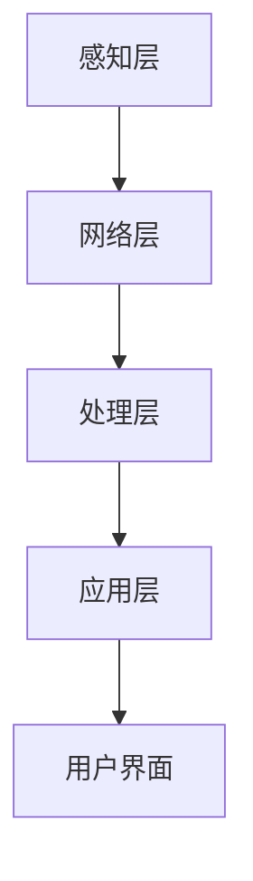
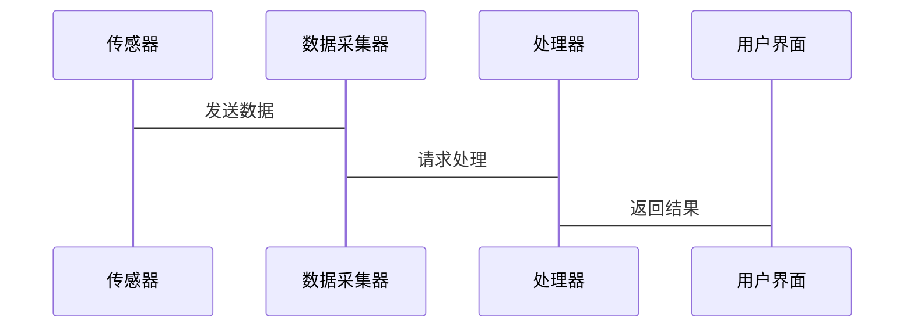

                 


# 《价值投资中的智能城市空气净化系统分析》

---

## 关键词：
- 价值投资
- 智能城市
- 空气净化系统
- 系统架构
- 数学模型
- 算法实现

---

## 摘要：
本书深入分析了智能城市中空气净化系统的价值投资策略，结合系统的组成、架构设计、数学模型和算法实现，为投资者提供了科学的决策依据。通过实际案例和最佳实践，帮助读者掌握如何在智能城市中选择和优化空气净化系统，实现长期的投资收益最大化。

---

# 第一部分：引言

## 第1章：价值投资与智能城市空气净化系统概述

### 1.1 价值投资的基本概念
#### 1.1.1 价值投资的定义与核心理念
- 价值投资是一种长期投资策略，强调购买被市场低估的资产。
- 核心理念包括安全边际、内在价值和市场先生。

#### 1.1.2 智能城市空气净化系统的背景与意义
- 智慧城市的发展离不开环境质量的保障。
- 空气净化系统是智慧城市建设的重要组成部分。

#### 1.1.3 价值投资与智能城市空气净化系统的结合
- 通过价值投资策略，选择具有长期收益潜力的空气净化系统。

### 1.2 本书的目的与结构
- 本书旨在帮助投资者理解智能城市空气净化系统的价值投资机会。
- 结构清晰，涵盖理论基础、系统分析、项目实战等部分。

---

# 第二部分：价值投资的理论基础

## 第2章：价值投资的理论基础

### 2.1 价值投资的核心思想
#### 2.1.1 购买廉价的资产
- 强调购买价格低于内在价值的资产。
- 通过安全边际降低投资风险。

#### 2.1.2 长期持有优质资产
- 选择具有竞争优势和持续盈利能力的企业。
- 长期持有以实现复利效应。

#### 2.1.3 避免短期市场波动
- 不受市场短期波动影响，坚持长期投资。
- 通过分散投资降低风险。

### 2.2 智慧城市的定义与特征
#### 2.2.1 智慧城市的定义
- 利用信息技术优化城市资源，提高居民生活质量。
- 包括智能交通、智能能源、智能环保等多个方面。

#### 2.2.2 智慧城市的特征
- 数字化、网络化、智能化。
- 高效、环保、可持续。

### 2.3 空气净化系统的技术发展
#### 2.3.1 空气净化技术的演进
- 从简单过滤到智能控制的演变。
- 新技术如物联网、人工智能的应用。

#### 2.3.2 智能空气净化系统的特点
- 实时监测、智能控制、远程管理。
- 高效节能、绿色环保。

#### 2.3.3 智能空气净化系统的优势
- 提高空气质量，保障居民健康。
- 节能减排，符合可持续发展战略。

---

# 第三部分：智能城市空气净化系统的核心分析

## 第3章：智能城市空气净化系统的组成与功能

### 3.1 系统的组成部分
#### 3.1.1 感知层
- 传感器：监测空气质量参数（PM2.5、温度、湿度等）。
- 数据采集模块：将传感器数据传输到处理层。

#### 3.1.2 网络层
- 通信模块：通过无线网络传输数据。
- 数据传输协议：如MQTT、HTTP等。

#### 3.1.3 处理层
- 数据处理模块：分析传感器数据，生成控制指令。
- 算法实现：空气质量预测、系统优化控制。

#### 3.1.4 应用层
- 用户界面：展示空气质量数据，接收用户指令。
- 应用程序：实现人机交互，控制空气净化设备。

### 3.2 系统的功能模块
#### 3.2.1 数据采集模块
- 传感器节点：部署在城市各区域，实时监测空气质量。
- 数据采集器：整合传感器数据，发送到处理层。

#### 3.2.2 数据分析模块
- 数据预处理：清洗、归一化处理。
- 数据分析：使用机器学习算法预测空气质量。

#### 3.2.3 控制执行模块
- 控制策略：根据预测结果，调整空气净化设备的运行状态。
- 设备执行：驱动空气净化设备工作。

#### 3.2.4 用户界面模块
- Web界面：展示实时数据，提供用户操作界面。
- 移动端应用：方便用户随时随地查看和控制。

### 3.3 系统的核心算法
#### 3.3.1 空气质量预测算法
- 时间序列分析：基于历史数据预测未来空气质量。
- 机器学习算法：如LSTM、ARIMA。

#### 3.3.2 系统优化控制算法
- 状态反馈控制：根据实时数据调整系统参数。
- 分层控制：分层优化，提高系统效率。

#### 3.3.3 数据融合算法
- 多源数据融合：整合传感器、气象数据，提高预测准确性。
- 融合方法：加权融合、证据推理。

---

## 第4章：空气质量预测算法的数学模型与实现

### 4.1 空气质量预测模型
#### 4.1.1 LSTM模型
- 长短期记忆网络，适合时间序列预测。
- 模型结构：输入层、遗忘门、记忆单元、输出门。

#### 4.1.2 ARIMA模型
- 平稳时间序列模型，适合线性趋势预测。
- 模型步骤：数据检查、参数估计、模型检验。

#### 4.1.3 XGBoost模型
- 强力的回归模型，适合非线性预测。
- 参数调优：学习率、树的深度、正则化参数。

### 4.2 算法实现
#### 4.2.1 数据预处理
- 数据清洗：处理缺失值、异常值。
- 数据归一化：标准化、归一化处理。

#### 4.2.2 模型训练
- 训练数据集划分：训练集、验证集、测试集。
- 模型训练：使用训练数据拟合模型参数。

#### 4.2.3 模型评估
- 评估指标：均方误差（MSE）、平均绝对误差（MAE）、R平方值。
- 模型优化：调整超参数，提高预测精度。

### 4.3 算法的数学推导
#### 4.3.1 LSTM模型的数学公式
- 遗忘门：$f_t = \sigma(w_f x_t + u_f h_{t-1})$
- 记忆单元：$i_t = \sigma(w_i x_t + u_i h_{t-1})$
- 输出门：$o_t = \sigma(w_o x_t + u_o h_{t-1})$
- 单元状态：$c_t = f_t c_{t-1} + i_t tanh(w_c x_t + u_c h_{t-1})$
- 输出：$h_t = o_t tanh(c_t)$

#### 4.3.2 ARIMA模型的数学公式
- 差分方程：$y_t - \phi y_{t-1} = \theta \epsilon_t + \epsilon_t$
- 模型参数：阶数p、d、q。

#### 4.3.3 XGBoost模型的数学公式
- 损失函数：$L = \sum_{i=1}^n [y_i - \hat{y}_i]^2$
- 正则化：$L_{reg} = \lambda \sum_{i=1}^n | \alpha_i |$

---

## 第5章：系统的架构设计与实现

### 5.1 系统架构设计
#### 5.1.1 分层架构设计
- 感知层、网络层、处理层、应用层的分层结构。
- 每层的功能模块和交互接口。

#### 5.1.2 模块化设计
- 各模块独立开发，便于维护和扩展。
- 模块之间的接口清晰，便于集成。

#### 5.1.3 可扩展性设计
- 系统架构支持新增模块和功能扩展。
- 灵活的接口设计，适应未来技术发展。

### 5.2 系统实现的技术细节
#### 5.2.1 系统功能设计
- 数据采集：传感器数据的实时采集和传输。
- 数据分析：空气质量预测和系统优化。
- 用户界面：直观展示数据，方便用户操作。

#### 5.2.2 系统架构图


#### 5.2.3 系统接口设计
- 数据接口：传感器数据接口、数据库接口。
- 网络接口：HTTP接口、MQTT协议。
- 用户接口：Web API、移动端API。

#### 5.2.4 系统交互流程


---

## 第6章：项目实战

### 6.1 环境安装
#### 6.1.1 系统环境
- 操作系统：Linux/Windows/MacOS。
- 开发工具：Python、Jupyter Notebook、IDE。
- 数据库：MySQL、MongoDB。
- 网络框架：Flask/Django。

#### 6.1.2 依赖安装
- Python库：pandas、numpy、scikit-learn、xgboost、keras。
- 传感器驱动：安装传感器驱动程序。
- 网络库：安装网络通信库（如paho-mqtt）。

### 6.2 系统核心实现
#### 6.2.1 数据采集模块实现
- 传感器数据采集：读取传感器数据并存储。
- 数据采集器代码：
```python
import serial

ser = serial.Serial('COM3', 9600)
data = ser.readline().decode().strip()
print(data)
```

#### 6.2.2 数据分析模块实现
- 空气质量预测算法实现：
```python
import numpy as np
from sklearn.metrics import mean_squared_error

def predict_quality(X_train, y_train, X_test):
    model = XGBoostRegressor(n_estimators=100, learning_rate=0.1)
    model.fit(X_train, y_train)
    y_pred = model.predict(X_test)
    return y_pred, mean_squared_error(y_test, y_pred)
```

#### 6.2.3 用户界面实现
- Web界面设计：使用Flask框架搭建Web应用。
- 用户界面代码：
```python
from flask import Flask, render_template, request

app = Flask(__name__)

@app.route('/')
def home():
    return render_template('index.html')

if __name__ == '__main__':
    app.run(debug=True)
```

### 6.3 案例分析与解读
#### 6.3.1 案例背景
- 假设在某城市部署智能空气净化系统，监测PM2.5、温度、湿度等数据。
- 使用价值投资策略选择具有长期收益的空气净化设备。

#### 6.3.2 数据分析
- 数据来源：传感器数据、气象数据、历史空气质量数据。
- 数据清洗与预处理：去除异常值、填充缺失值、归一化处理。

#### 6.3.3 模型训练与评估
- 训练模型：使用LSTM、ARIMA、XGBoost等算法进行预测。
- 模型评估：计算MSE、MAE、R平方值，选择最优模型。

#### 6.3.4 投资决策
- 根据模型预测结果，选择具有长期收益潜力的空气净化设备。
- 考虑设备的初始成本、运行成本、维护成本和市场前景。

### 6.4 最佳实践 tips
#### 6.4.1 系统选择
- 选择具有高效净化能力、低能耗、易于维护的设备。
- 关注设备的长期运行成本和维护成本。

#### 6.4.2 数据分析
- 确保数据的准确性和完整性。
- 使用多种算法进行预测，选择最优模型。

#### 6.4.3 投资策略
- 根据模型预测结果，制定投资策略。
- 定期评估系统运行效果和投资收益。

#### 6.4.4 风险管理
- 设立止损点，避免重大损失。
- 多元化投资，分散风险。

---

## 第7章：总结与展望

### 7.1 本书总结
- 本书详细讲解了价值投资在智能城市空气净化系统中的应用。
- 提供了系统的组成、架构设计、数学模型和算法实现的详细内容。
- 通过实际案例和最佳实践，帮助读者掌握智能城市空气净化系统的价值投资策略。

### 7.2 未来展望
- 随着人工智能和大数据技术的发展，智能城市空气净化系统将更加智能化、网络化。
- 价值投资策略将更加多样化，投资者需要不断学习和适应新的技术发展。

---

## 作者：AI天才研究院/AI Genius Institute & 禅与计算机程序设计艺术 /Zen And The Art of Computer Programming

---

**以上是《价值投资中的智能城市空气净化系统分析》的完整目录和内容大纲，希望对您有所帮助！**

