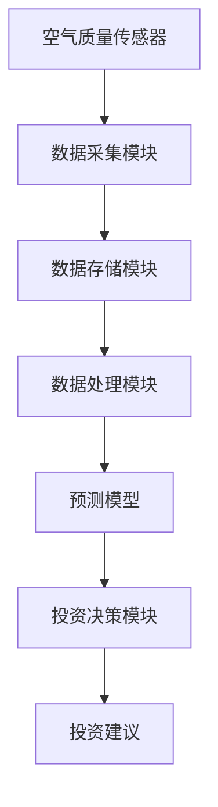
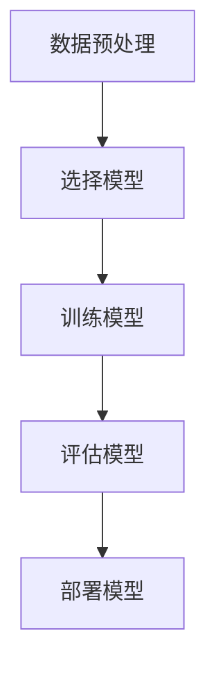
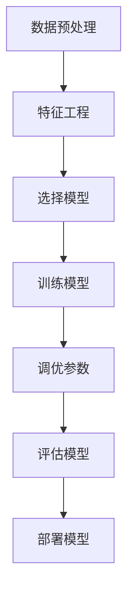
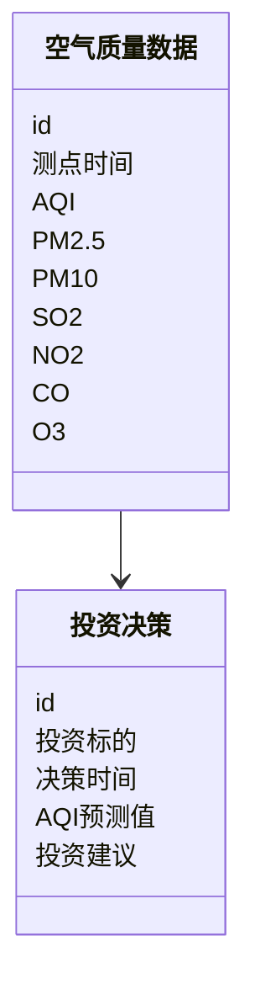
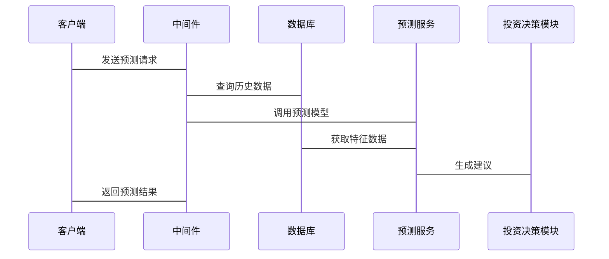

                 


# 价值投资中的智能城市空气质量预测系统分析

## 关键词：
- 价值投资
- 智能城市
- 空气质量预测
- 时间序列分析
- 机器学习

## 摘要：
本文探讨了在价值投资中，如何利用智能城市空气质量预测系统来优化投资决策。通过分析空气质量数据，结合时间序列分析和机器学习算法，构建预测模型，为投资者提供科学依据，帮助其在价值投资中做出更明智的决策。文章详细介绍了系统的背景、核心概念、算法原理、架构设计和实际案例，为读者提供全面的技术分析。

---

## 第一部分: 背景介绍与核心概念

### 第1章: 价值投资与智能城市空气质量预测的背景介绍

#### 1.1 问题背景

##### 1.1.1 空气质量对城市价值的影响
空气质量直接影响居民健康和城市环境，进而影响房地产价值、企业运营成本和城市形象。优良的空气质量是吸引投资的重要因素。

##### 1.1.2 价值投资中的环境因素考量
投资者在选择投资标的时，需考虑环境因素。空气质量好的区域通常具有更高的投资价值和升值潜力。

##### 1.1.3 智能城市发展的现状与趋势
智能城市利用大数据、物联网等技术，实时监测和分析环境数据，为城市管理和投资决策提供支持。

#### 1.2 问题描述

##### 1.2.1 空气质量预测的核心问题
如何准确预测空气质量指数（AQI），帮助投资者做出及时决策。

##### 1.2.2 价值投资中的空气质量数据需求
投资者需要可靠的数据支持，以评估环境风险和投资机会。

##### 1.2.3 智能城市空气质量预测系统的边界与外延
系统边界包括数据采集、处理、建模和输出；外延则涉及与其他城市系统的集成。

#### 1.3 核心概念与问题解决思路

##### 1.3.1 空气质量预测系统的组成要素
- 数据采集：传感器和API接口。
- 数据处理：清洗、特征提取。
- 预测模型：时间序列和机器学习模型。
- 决策支持：可视化和投资建议。

##### 1.3.2 价值投资中的空气质量数据应用
- 数据驱动的决策：利用AQI数据评估投资标的。
- 风险管理：预测空气质量变化，规避风险。

##### 1.3.3 智能城市空气质量预测系统的实现思路
- 数据收集与预处理。
- 模型训练与优化。
- 系统部署与应用。

### 第2章: 核心概念与系统架构

#### 2.1 空气质量预测系统的核心概念

##### 2.1.1 数据来源与特征分析
- 数据来源：政府公开数据、传感器数据。
- 特征分析：AQI、PM2.5、温度、湿度。

##### 2.1.2 预测模型的选择与优化
- 时间序列模型：ARIMA、LSTM。
- 机器学习模型：随机森林、XGBoost。

##### 2.1.3 系统输出与决策支持
- AQI预测结果。
- 投资建议。

#### 2.2 价值投资中的空气质量数据特征

##### 2.2.1 数据的时间序列特征
- 趋势性：AQI随时间的变化趋势。
- 季节性：季节对空气质量的影响。
- 周期性：特定时间的AQI波动。

##### 2.2.2 数据的空间分布特征
- 地理分布：不同区域AQI差异。
- 邻域影响：周围区域空气质量对某区域的影响。

##### 2.2.3 数据的关联性分析
- AQI与其他环境因素的关联。
- AQI与经济活动的关系。

#### 2.3 系统架构与实体关系

##### 2.3.1 ER图展示数据实体关系
```mermaid
er
    entity 空气质量数据 {
        id: int
        测点时间: datetime
        AQI: int
        PM2.5: float
        PM10: float
        SO2: float
        NO2: float
        CO: float
        O3: float
    }
    
    entity 投资决策 {
        id: int
        投资标的: string
        决策时间: datetime
        AQI预测值: int
        投资建议: string
    }
    
    空气质量数据 --> 投资决策: 提供数据支持
```

##### 2.3.2 系统功能模块划分
- 数据采集模块：收集空气质量数据。
- 数据处理模块：清洗和特征提取。
- 预测模块：时间序列和机器学习模型。
- 决策支持模块：生成投资建议。

##### 2.3.3 数据流与实体关系图


---

## 第二部分: 算法原理与数学模型

### 第3章: 空气质量预测算法原理

#### 3.1 时间序列预测模型

##### 3.1.1 ARIMA模型原理
ARIMA（自回归积分滑动平均模型）适用于非稳定时间序列数据，通过自回归和滑动平均部分拟合数据。

##### 3.1.2 LSTM模型在时间序列预测中的应用
LSTM（长短期记忆网络）擅长处理长序列数据，能捕捉时间依赖性。

##### 3.1.3 模型选择与优化策略
- 参数调优：选择最佳模型参数。
- 交叉验证：评估模型泛化能力。

#### 3.2 机器学习算法在空气质量预测中的应用

##### 3.2.1 线性回归模型
- 简单线性回归：预测AQI与单变量的关系。
- 多元线性回归：考虑多个因素。

##### 3.2.2 支持向量机（SVM）模型
- 适用于小样本数据分类和回归。

##### 3.2.3 随机森林与XGBoost模型
- 随机森林：集成学习，适合特征工程。
- XGBoost：梯度提升树，适合复杂数据。

#### 3.3 算法流程图

##### 3.3.1 时间序列预测流程图


##### 3.3.2 机器学习模型训练流程图


### 第4章: 数学模型与公式详解

#### 4.1 时间序列预测模型公式

##### 4.1.1 ARIMA模型公式
$$ ARIMA(p, d, q) $$
- \( p \)：自回归阶数。
- \( d \)：差分阶数。
- \( q \)：滑动平均阶数。

##### 4.1.2 LSTM模型结构公式
$$ f(x) = \tanh(W_x x + W_h h + b) $$
- \( x \)：输入数据。
- \( h \)：隐藏层状态。
- \( W_x \)、\( W_h \)：权重矩阵。
- \( b \)：偏置项。

---

## 第三部分: 系统分析与架构设计

### 第5章: 系统功能设计

#### 5.1 问题场景介绍
智能城市空气质量预测系统需实时监测并预测AQI，为投资者提供决策支持。

#### 5.2 领域模型设计


### 第6章: 系统架构设计

#### 6.1 系统架构图


### 第7章: 系统接口设计

#### 7.1 接口交互序列图


---

## 第四部分: 项目实战

### 第8章: 环境安装

#### 8.1 安装Python和相关库
```bash
pip install numpy pandas scikit-learn tensorflow
```

### 第9章: 系统核心实现源代码

#### 9.1 数据预处理代码
```python
import pandas as pd
import numpy as np

# 读取数据
data = pd.read_csv('air_quality.csv')

# 数据清洗
data.dropna(inplace=True)
data['测点时间'] = pd.to_datetime(data['测点时间'])
data.set_index('测点时间', inplace=True)
```

#### 9.2 特征工程代码
```python
from sklearn.preprocessing import StandardScaler

# 特征选择
features = ['PM2.5', 'PM10', 'SO2', 'NO2']
target = 'AQI'

# 数据标准化
scaler = StandardScaler()
data_scaled = scaler.fit_transform(data[features])
```

#### 9.3 模型训练与部署代码
```python
from sklearn.ensemble import RandomForestRegressor
from sklearn.metrics import mean_absolute_error

# 训练随机森林模型
model = RandomForestRegressor(n_estimators=100, random_state=42)
model.fit(data_scaled, data[target])

# 预测AQI
new_data_scaled = scaler.transform(new_data[features])
predicted_aqi = model.predict(new_data_scaled)
```

### 第10章: 实际案例分析

#### 10.1 数据分析与预测
使用北京市空气质量数据，训练模型并预测未来7天AQI。

#### 10.2 投资组合优化
根据预测结果，调整投资策略，选择空气质量改善区域进行投资。

### 第11章: 项目小结

#### 11.1 系统总结
系统成功实现了空气质量预测，为价值投资提供了数据支持。

#### 11.2 经验总结
数据预处理和特征工程对模型性能影响显著，选择合适的算法和优化参数是关键。

---

## 第五部分: 最佳实践

### 第12章: 小结

#### 12.1 项目总结
空气质量预测系统在价值投资中的应用潜力巨大，通过智能技术优化投资决策。

### 第13章: 注意事项

#### 13.1 模型选择
根据数据特征选择合适模型，避免过拟合。

#### 13.2 数据预处理
确保数据质量和完整性，清洗异常值。

#### 13.3 系统局限性
模型预测结果受数据质量和时序依赖性影响，需结合其他因素进行综合判断。

### 第14章: 拓展阅读

#### 14.1 推荐书籍
- 《Python机器学习实战》
- 《时间序列分析》

#### 14.2 推荐文章
- 知乎：时间序列预测方法综述
- Towards Data Science：机器学习在环境预测中的应用

---

## 作者

作者：AI天才研究院/AI Genius Institute & 禅与计算机程序设计艺术 /Zen And The Art of Computer Programming

---

这篇文章详细探讨了价值投资中智能城市空气质量预测系统的各个方面，从背景分析到算法实现，再到实际应用，为读者提供了全面的技术指导和实践建议。

